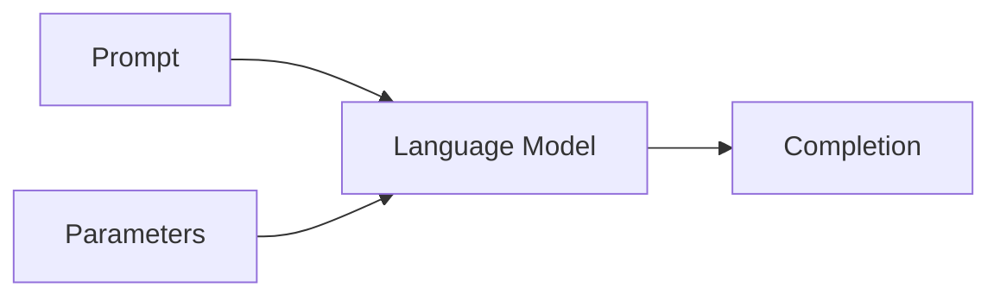

# 大语言模型应用指南：向模型发起请求的参数

作者：禅与计算机程序设计艺术

## 1.背景介绍
### 1.1 大语言模型的兴起
近年来,随着深度学习技术的快速发展,以Transformer为代表的大语言模型(Large Language Model,LLM)在自然语言处理(Natural Language Processing,NLP)领域取得了突破性进展。从GPT、BERT到GPT-3,LLM展现出了强大的语言理解和生成能力,为NLP领域带来了革命性的变革。

### 1.2 大语言模型的应用场景
LLM凭借其出色的性能,在机器翻译、对话系统、文本摘要、问答系统、知识图谱等诸多NLP任务中得到了广泛应用。特别是随着GPT-3等超大规模语言模型的出现,LLM已经具备了通用的语言理解和生成能力,可以应用于更加广泛的场景,如内容创作、代码生成、数据增强等。

### 1.3 向大语言模型发起请求的重要性
为了充分发挥LLM的能力,我们需要学会如何与这些模型进行交互,即向模型发起请求并获得所需的输出。这其中涉及到请求参数的设置,它直接影响到模型生成内容的质量和风格。因此,深入理解LLM的请求参数对于有效利用这一强大工具至关重要。

## 2.核心概念与联系
### 2.1 Prompt 
Prompt是指输入给LLM的文本序列,通常包含任务指令和上下文信息。设计优质的Prompt可以引导模型生成我们期望的输出。Prompt的设计是LLM应用中的关键一环。

### 2.2 Completion
Completion是指LLM根据输入的Prompt生成的文本序列。我们希望Completion能够准确、连贯、满足特定需求。Completion的质量很大程度上取决于Prompt的设计。

### 2.3 参数
向LLM发起请求时,除了Prompt以外,还可以通过设置一系列参数来控制模型的行为,例如生成内容的随机性、生成长度等。合理的参数配置可以帮助我们获得理想的Completion。

### 2.4 概念之间的关系
Prompt作为模型的输入,通过参数控制模型的行为,最终生成Completion作为输出。三者环环相扣,共同决定了LLM应用的效果。下图展示了它们之间的关系:



## 3.核心算法原理与具体操作步骤
### 3.1 基于Transformer的语言模型
当前主流的LLM都是基于Transformer架构。Transformer通过自注意力机制和前馈神经网络,实现了对文本序列的并行编码和解码。其中最核心的部分是自注意力层,它可以捕捉文本中的长距离依赖关系。

### 3.2 生成式预训练
LLM通常采用生成式预训练的方式进行训练,即以自回归的方式预测下一个token。这使得模型学会了根据上下文生成连贯的文本。代表性的预训练模型有GPT系列。

### 3.3 微调
为了适应特定任务,我们可以在预训练的LLM基础上进行微调。微调时,我们将任务相关的数据输入模型,并对模型参数进行少量更新,使其更好地适应任务需求。微调可以显著提升LLM在下游任务上的表现。

### 3.4 推理
模型训练完成后,我们可以将Prompt输入模型,并设置推理参数,让模型生成Completion。推理过程通常使用Beam Search等策略,以提升生成内容的质量。

具体操作步骤如下:
1. 准备好训练好的LLM和任务相关数据
2. 设计合适的Prompt,引导模型生成期望的内容
3. 选择合适的推理参数,如温度、Beam Search的大小等
4. 将Prompt输入模型,获得生成的Completion
5. 评估Completion的质量,必要时调整Prompt和参数
6. 将LLM集成到应用系统中,实现端到端的功能

## 4.数学模型和公式详细讲解举例说明
### 4.1 Transformer的数学原理
Transformer的核心是自注意力机制和前馈神经网络。对于输入序列$X=(x_1,\ldots,x_n)$,自注意力层首先计算查询向量$Q$、键向量$K$和值向量$V$:

$$
\begin{aligned}
Q &= XW^Q \\
K &= XW^K \\
V &= XW^V
\end{aligned}
$$

其中$W^Q,W^K,W^V$是可学习的参数矩阵。然后计算注意力权重:

$$
A = \text{softmax}(\frac{QK^T}{\sqrt{d_k}})
$$

其中$d_k$是键向量的维度。最后,注意力输出为:

$$
\text{Attention}(Q,K,V) = AV
$$

自注意力层的输出经过前馈神经网络和残差连接,得到最终的输出。

### 4.2 生成式预训练的目标函数
生成式预训练通常以最大化似然概率为目标。对于文本序列$X=(x_1,\ldots,x_T)$,模型的目标是最大化下式:

$$
\max_\theta \log p_\theta(X) = \max_\theta \sum_{t=1}^T \log p_\theta(x_t|x_{<t})
$$

其中$\theta$是模型参数,$x_{<t}$表示$t$时刻之前的所有token。这个目标函数可以通过标准的交叉熵损失和随机梯度下降来优化。

### 4.3 推理时的Beam Search策略
Beam Search是一种启发式搜索算法,可以在推理时生成质量更高的序列。设Beam Search的大小为$k$,每一步都保留前$k$个得分最高的候选序列。假设当前时刻的候选序列为$S_t$,下一时刻的候选序列为:

$$
S_{t+1} = \text{top-k}(\{s+x|s\in S_t, x\in V\})
$$

其中$V$是词表,$\text{top-k}$函数选择得分最高的$k$个序列。重复这一过程,直到达到终止条件(如生成了指定长度的序列),即可得到最终的Completion。

## 5.项目实践：代码实例和详细解释说明
下面我们以PyTorch为例,演示如何使用Hugging Face的Transformers库来微调和推理GPT-2模型。

### 5.1 加载预训练模型和分词器

```python
from transformers import GPT2LMHeadModel, GPT2Tokenizer

model = GPT2LMHeadModel.from_pretrained('gpt2')
tokenizer = GPT2Tokenizer.from_pretrained('gpt2')
```

这里我们加载了预训练的GPT-2模型和对应的分词器。

### 5.2 微调

```python
from transformers import TextDataset, DataCollatorForLanguageModeling
from transformers import Trainer, TrainingArguments

train_path = 'path/to/train/data'
train_dataset = TextDataset(tokenizer=tokenizer, file_path=train_path, block_size=128)

data_collator = DataCollatorForLanguageModeling(tokenizer=tokenizer, mlm=False)

training_args = TrainingArguments(
    output_dir='./results',
    num_train_epochs=3,
    per_device_train_batch_size=4,
    save_steps=10_000,
    save_total_limit=2,
)

trainer = Trainer(
    model=model,
    args=training_args,
    data_collator=data_collator,
    train_dataset=train_dataset,
)

trainer.train()
```

这段代码展示了如何使用Trainer API对GPT-2进行微调。我们首先创建了TextDataset和DataCollator,然后设置TrainingArguments,最后构建Trainer并调用train()方法开始微调。

### 5.3 推理

```python
prompt = "The quick brown fox"
input_ids = tokenizer.encode(prompt, return_tensors='pt')

output = model.generate(input_ids, 
                        max_length=50, 
                        num_beams=5,
                        no_repeat_ngram_size=2,
                        early_stopping=True)

print(tokenizer.decode(output[0], skip_special_tokens=True))
```

这段代码展示了如何使用微调后的模型进行推理。我们首先将Prompt编码为模型可接受的输入,然后调用generate()方法生成Completion。这里我们设置了max_length、num_beams等参数来控制生成过程。最后,我们将生成的结果解码并打印出来。

## 6.实际应用场景
LLM可以应用于各种场景,下面列举几个典型的例子:

### 6.1 智能写作助手
LLM可以根据用户输入的主题、关键词等Prompt,自动生成文章、新闻、广告文案等。这大大提高了内容创作的效率和质量。

### 6.2 客服聊天机器人
LLM可以用于构建智能客服系统。通过设计合适的Prompt,如"你是一名客服,请用专业和友善的语气回答用户的问题",我们可以让LLM扮演客服的角色,自动回复用户的各种咨询。

### 6.3 代码生成
LLM在代码生成方面展现出了惊人的能力。给定自然语言描述的功能需求,LLM可以自动生成对应的代码实现。这为程序员提供了智能的编程助手。

### 6.4 知识问答
LLM可以用于构建通用的知识问答系统。我们可以将海量的文本数据输入LLM进行预训练,然后根据用户的问题生成准确的答案。这为人们获取知识提供了便捷的渠道。

## 7.工具和资源推荐
### 7.1 开源模型
- [GPT-2](https://github.com/openai/gpt-2)
- [GPT-3](https://github.com/openai/gpt-3)
- [BERT](https://github.com/google-research/bert)
- [RoBERTa](https://github.com/pytorch/fairseq/tree/master/examples/roberta)
- [XLNet](https://github.com/zihangdai/xlnet)

### 7.2 工具库
- [Hugging Face Transformers](https://github.com/huggingface/transformers)
- [OpenAI API](https://beta.openai.com/)
- [Keras](https://keras.io/)
- [PyTorch](https://pytorch.org/)
- [TensorFlow](https://www.tensorflow.org/)

### 7.3 数据集
- [Wikipedia](https://dumps.wikimedia.org/)
- [Common Crawl](https://commoncrawl.org/)
- [WebText](https://github.com/jcpeterson/openwebtext)
- [BookCorpus](https://github.com/soskek/bookcorpus)

## 8.总结：未来发展趋势与挑战
### 8.1 模型的进一步扩大
随着计算力的提升和数据的积累,LLM的规模还将进一步扩大。更大的模型意味着更强的语言理解和生成能力,这将促进LLM在更广泛的领域得到应用。

### 8.2 few-shot和zero-shot学习
如何让LLM在少量或零样本的情况下快速适应新任务,是一个重要的研究方向。few-shot和zero-shot学习的进展将大大提升LLM的泛化能力和实用价值。

### 8.3 知识的引入
尽管LLM展示了强大的语言能力,但其知识获取和存储的机制还有待探索。如何将结构化的知识有效地注入LLM,是一个值得关注的问题。知识增强的LLM有望成为更加智能和可解释的模型。

### 8.4 多模态学习
将LLM扩展到多模态场景,如图文、视频等,是一个充满机遇的方向。多模态LLM可以实现更加自然和丰富的人机交互。

### 8.5 安全与伦理
LLM强大的生成能力也带来了潜在的安全和伦理风险,如生成虚假信息、侵犯隐私等。如何确保LLM的安全性和合乎伦理,是我们必须正视的挑战。

## 9.附录：常见问题与解答
### 9.1 如何选择LLM的规模?
LLM的规模需要根据任务需求和计算资源来权衡。更大的模型通常有更好的性能,但也需要更多的计算资源。对于一般的应用,可以考虑使用GPT-2、BERT等中等规模的模型。对于高要求的任务,可以使用GPT-3等超大模型。

### 9.2 Prompt设计有哪些技巧?
- 明确任务目标,提供必要的背景信息
- 