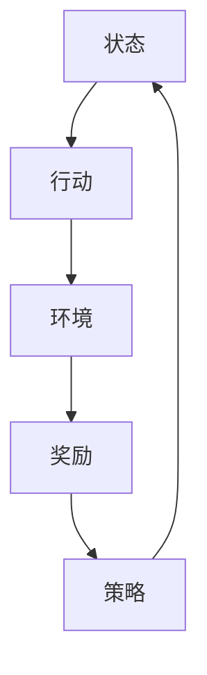

## 1.背景介绍

强化学习（Reinforcement Learning，简称RL）是人工智能的一个重要分支，它主要是通过智能体与环境的交互来学习最优的决策策略。然而，强化学习的学习效率和资源管理策略是一个值得深入研究的问题。本文将对此进行详细的探讨。

## 2.核心概念与联系

强化学习的核心概念包括状态（state）、行动（action）、奖励（reward）、策略（policy）等。其中，状态描述了环境的信息，行动是智能体对环境的操作，奖励是智能体行动的反馈，策略则是智能体选择行动的规则。这些概念之间的联系可以通过以下的Mermaid流程图进行展示：



## 3.核心算法原理具体操作步骤

强化学习的核心算法包括值迭代（Value Iteration）、策略迭代（Policy Iteration）、Q学习（Q-Learning）、Sarsa等。这些算法的原理和操作步骤如下：

### 3.1 值迭代

值迭代是一种动态规划方法，其基本思想是通过迭代更新状态值函数，直到达到稳定状态。其操作步骤如下：

1. 初始化状态值函数；
2. 对每个状态，计算在所有可能行动下的期望回报，并更新状态值函数；
3. 重复第二步，直到状态值函数收敛。

### 3.2 策略迭代

策略迭代也是一种动态规划方法，其基本思想是通过迭代更新策略和状态值函数，直到策略稳定。其操作步骤如下：

1. 初始化策略和状态值函数；
2. 根据当前策略，更新状态值函数；
3. 根据新的状态值函数，更新策略；
4. 重复第二步和第三步，直到策略稳定。

### 3.3 Q学习

Q学习是一种脱模型（model-free）方法，其基本思想是通过迭代更新Q值函数，直到达到最优Q值函数。其操作步骤如下：

1. 初始化Q值函数；
2. 根据当前Q值函数和策略，选择行动并获得奖励；
3. 根据奖励和下一状态的最大Q值，更新Q值函数；
4. 重复第二步和第三步，直到Q值函数收敛。

### 3.4 Sarsa

Sarsa也是一种脱模型方法，与Q学习类似，但更新Q值函数时使用的是实际执行的下一行动的Q值，而不是最大Q值。其操作步骤如下：

1. 初始化Q值函数；
2. 根据当前Q值函数和策略，选择行动并获得奖励；
3. 根据奖励和下一状态的实际行动的Q值，更新Q值函数；
4. 重复第二步和第三步，直到Q值函数收敛。

## 4.数学模型和公式详细讲解举例说明

在强化学习中，我们主要使用贝尔曼方程（Bellman equation）来描述状态值函数和Q值函数的更新过程。下面我们来详细讲解这些数学模型和公式。

### 4.1 状态值函数的贝尔曼方程

对于策略$\pi$，状态$s$的状态值函数$V^\pi(s)$可以表示为在$s$状态下，按照$\pi$策略行动的期望回报。其贝尔曼方程如下：

$$
V^\pi(s) = \sum_a \pi(a|s) \sum_{s',r} p(s',r|s,a) [r + \gamma V^\pi(s')]
$$

其中，$a$是行动，$s'$是下一状态，$r$是奖励，$p(s',r|s,a)$是状态转移概率，$\gamma$是折扣因子。

### 4.2 Q值函数的贝尔曼方程

对于策略$\pi$，状态-行动对$(s,a)$的Q值函数$Q^\pi(s,a)$可以表示为在$s$状态下，执行$a$行动后，按照$\pi$策略行动的期望回报。其贝尔曼方程如下：

$$
Q^\pi(s,a) = \sum_{s',r} p(s',r|s,a) [r + \gamma \sum_{a'} \pi(a'|s') Q^\pi(s',a')]
$$

其中，$a'$是下一行动，其他符号的含义同上。

## 4.项目实践：代码实例和详细解释说明

下面我们来看一个使用Q学习解决冰湖（FrozenLake）问题的代码实例。冰湖问题是一个标准的强化学习问题，智能体需要在一个有洞的冰湖上找到出口。

首先，我们需要导入必要的库，并初始化环境：

```python
import numpy as np
import gym

env = gym.make('FrozenLake-v0')
```

然后，我们初始化Q值函数，并设置学习参数：

```python
Q = np.zeros([env.observation_space.n, env.action_space.n])
lr = 0.8
gamma = 0.95
num_episodes = 2000
```

接下来，我们开始学习过程：

```python
for i in range(num_episodes):
    s = env.reset()
    d = False
    j = 0
    while j < 99:
        j += 1
        a = np.argmax(Q[s,:] + np.random.randn(1, env.action_space.n) * (1.0 / (i + 1)))
        s1, r, d, _ = env.step(a)
        Q[s,a] = Q[s,a] + lr * (r + gamma * np.max(Q[s1,:]) - Q[s,a])
        s = s1
        if d == True:
            break
```

在这个代码中，我们首先获取当前状态，并选择一个行动。然后，我们执行这个行动，并获取下一状态、奖励和是否结束。接着，我们根据奖励和下一状态的最大Q值，更新当前的Q值。最后，我们将当前状态设置为下一状态，如果结束，则开始下一回合。

## 5.实际应用场景

强化学习在许多实际应用场景中都有广泛的应用，例如：

### 5.1 游戏

强化学习在游戏中的应用是最为人所知的。例如，DeepMind的AlphaGo就是使用强化学习打败了世界围棋冠军。

### 5.2 自动驾驶

在自动驾驶中，强化学习可以用来学习如何驾驶汽车。通过与环境的交互，自动驾驶系统可以学习到在各种情况下的最优驾驶策略。

### 5.3 机器人

在机器人领域，强化学习可以用来训练机器人完成各种任务，例如搬运、打扫、烹饪等。

## 6.工具和资源推荐

在强化学习的学习和研究中，以下工具和资源可能会对你有所帮助：

### 6.1 OpenAI Gym

OpenAI Gym是一个用于开发和比较强化学习算法的工具包，它提供了许多预定义的环境，可以直接用来训练和测试强化学习算法。

### 6.2 TensorFlow和PyTorch

TensorFlow和PyTorch是两个非常流行的深度学习框架，它们都提供了强化学习相关的库和工具。

### 6.3 强化学习专业书籍

《强化学习》（作者：Richard S. Sutton和Andrew G. Barto）是一本强化学习的经典教材，详细介绍了强化学习的基本概念和算法。

## 7.总结：未来发展趋势与挑战

强化学习作为人工智能的一个重要分支，有着广阔的应用前景。然而，强化学习的学习效率和资源管理策略还有许多待解决的问题。例如，如何提高学习效率、如何有效管理资源、如何处理大规模问题、如何处理部分可观察问题等。这些问题的解决将为强化学习的发展开辟新的可能。

## 8.附录：常见问题与解答

Q: 强化学习和监督学习有什么区别？

A: 强化学习和监督学习的主要区别在于，强化学习是通过与环境的交互来学习最优策略，而监督学习则是通过已知的输入-输出对来学习映射关系。

Q: 强化学习的学习效率是如何衡量的？

A: 强化学习的学习效率通常通过学习时间、收敛速度、策略质量等指标来衡量。

Q: 如何提高强化学习的学习效率？

A: 提高强化学习的学习效率的方法有很多，例如使用更高效的算法、优化学习参数、使用更好的功能表示、使用更大的计算资源等。