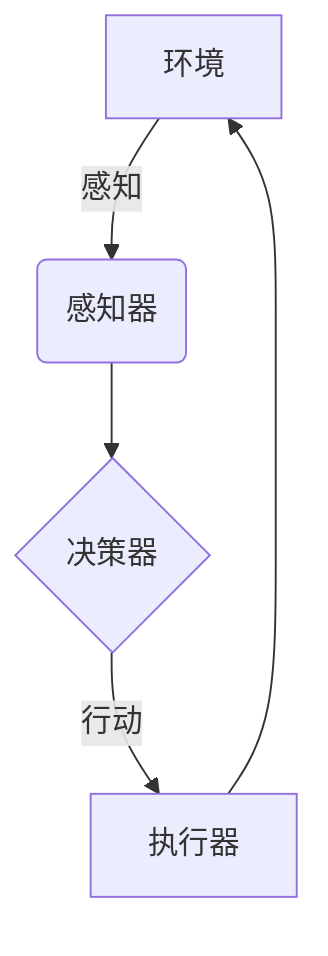

# AI人工智能 Agent：在公益事业中的应用

## 1. 背景介绍

### 1.1 公益事业的重要性

公益事业在社会发展中扮演着重要角色,旨在改善人民生活、促进社会公平正义、保护环境和资源。然而,由于资金、人力和管理等方面的挑战,许多公益组织面临着效率低下、覆盖面有限等问题。幸运的是,人工智能(AI)技术的兴起为公益事业带来了新的机遇。

### 1.2 AI技术在公益领域的应用潜力

AI技术可以提高公益组织的运营效率、优化资源分配、扩大影响力。智能代理(Intelligent Agents)是AI领域的一个关键概念,指能够感知环境、作出决策并采取行动以实现特定目标的自主系统。在公益领域,智能代理可以用于各种任务,如数据分析、自动化流程、个性化服务等,从而提高公益项目的效率和影响力。

## 2. 核心概念与联系

### 2.1 智能代理的定义和特征

智能代理是一种具有自主性、反应性、主动性、社会能力和持续性的软件实体。它能够感知环境,根据预定义的知识库和算法作出决策,并采取相应行动以实现目标。智能代理的关键特征包括:

- 自主性:能够在无人干预的情况下独立运行
- 反应性:能够及时响应环境变化并作出适当反应
- 主动性:不仅被动响应,还能主动采取行动以实现目标
- 社会能力:能够与其他代理进行协作和交互
- 持续性:不是一次性程序,而是持续运行的过程

### 2.2 智能代理在公益领域的应用场景

智能代理在公益领域有广泛的应用前景,包括但不限于:

- 数据分析和可视化:分析捐赠数据、受益人数据等,为决策提供支持
- 自动化流程:自动处理捐赠、发放救助物资等常规任务
- 个性化服务:根据用户偏好提供定制服务,如推荐合适的公益项目
- 智能助手:为公益工作者提供信息查询、任务协调等辅助
- 物流优化:优化救灾物资的运输路线和时间安排
- 预测和预警:预测自然灾害,提前做好应对准备

### 2.3 智能代理与其他AI技术的关系

智能代理是一种综合性的AI系统,需要结合多种AI技术才能发挥最大效能,包括:

- 机器学习:从数据中学习模式,用于数据分析、预测等任务
- 自然语言处理:理解和生成人类语言,用于智能助手等应用
- 计算机视觉:识别和理解图像、视频,用于无人机巡视等
- 规划与决策:制定行动计划,用于物流优化、应急决策等
- 多智能体系统:多个智能代理之间的协作与竞争

## 3. 核心算法原理具体操作步骤

### 3.1 智能代理的基本架构

智能代理通常采用感知-决策-行动的基本架构,如下图所示:



1. 感知器(Sensors)从环境中获取信息,如数据、图像、语音等
2. 决策器(Decision Maker)根据感知信息、知识库和算法作出决策
3. 执行器(Actuators)根据决策执行相应的行动,影响环境
4. 环境的变化又被感知器捕获,形成一个闭环

### 3.2 典型决策算法

决策器是智能代理的核心部分,常用的决策算法包括:

1. **规则引擎**:基于预定义的规则集合进行推理和决策,适用于确定性问题。
2. **搜索算法**:在状态空间中搜索最优解,如A*、IDA*等,适用于规划和优化问题。
3. **机器学习算法**:从数据中学习模式,包括监督学习(分类、回归)和无监督学习(聚类)等,适用于数据分析和预测问题。
4. **强化学习**:通过试错学习,获取最大化长期回报的策略,适用于序列决策问题。
5. **多智能体系统**:多个代理之间的协作、竞争和谈判,适用于复杂环境下的决策问题。

不同算法适用于不同场景,在实际应用中往往需要组合使用多种算法。

### 3.3 智能代理开发流程

开发智能代理的一般流程包括:

1. **需求分析**:明确代理的目标、功能需求和应用场景。
2. **数据采集**:收集相关的数据集,用于训练和测试。
3. **特征工程**:从原始数据中提取有效特征,以提高模型性能。
4. **模型选择**:根据问题类型选择合适的算法和模型。
5. **模型训练**:使用训练数据对模型进行训练和优化。
6. **模型评估**:在测试数据上评估模型的性能和泛化能力。
7. **系统集成**:将模型集成到完整的智能代理系统中。
8. **测试和部署**:全面测试系统,并在实际环境中部署运行。
9. **监控和维护**:持续监控系统性能,并根据需要进行优化和升级。

## 4. 数学模型和公式详细讲解举例说明

智能代理涉及多种数学模型,下面将介绍几种常用模型。

### 4.1 马尔可夫决策过程(MDP)

马尔可夫决策过程是强化学习和序列决策问题的数学基础模型。一个MDP可以用一个五元组$(S, A, P, R, \gamma)$表示:

- $S$是有限的状态集合
- $A$是有限的动作集合  
- $P(s'|s,a)$是状态转移概率,表示在状态$s$执行动作$a$后,转移到状态$s'$的概率
- $R(s,a)$是即时奖励函数,表示在状态$s$执行动作$a$获得的即时奖励
- $\gamma \in [0,1)$是折现因子,用于权衡即时奖励和长期回报

目标是找到一个策略$\pi: S \rightarrow A$,使得期望的累积折现奖励最大:

$$
\max_\pi \mathbb{E}\left[ \sum_{t=0}^\infty \gamma^t R(s_t, a_t) \right]
$$

其中$s_t$和$a_t$分别是时刻$t$的状态和动作。

常用的求解算法包括值迭代(Value Iteration)、策略迭代(Policy Iteration)和Q-Learning等。

### 4.2 多智能体系统

多智能体系统涉及多个智能代理之间的交互,可以用扩展形式的贝叶斯博弈模型描述。设有$n$个代理,第$i$个代理的策略为$\pi_i$,其他代理的策略集合为$\pi_{-i}$,则第$i$个代理的期望回报为:

$$
U_i(\pi_i, \pi_{-i}) = \mathbb{E}\left[ \sum_{t=0}^\infty \gamma^t R_i(s_t, a_{i,t}, a_{-i,t}) \right]
$$

其中$a_{i,t}$和$a_{-i,t}$分别是第$i$个代理和其他代理在时刻$t$的动作。

目标是找到一个策略组合$\pi^* = (\pi_1^*, \pi_2^*, \ldots, \pi_n^*)$,使得所有代理的期望回报达到纳什均衡:

$$
\forall i, \pi_i^* = \arg\max_{\pi_i} U_i(\pi_i, \pi_{-i}^*)
$$

求解算法包括友好Q-Learning、交替最大化等。

### 4.3 其他模型

智能代理还涉及其他数学模型,如:

- **规划算法**:用于路径规划、任务分配等,常用模型包括A*、PDDL等。
- **约束优化**:用于资源分配、调度等,常用模型包括整数规划、约束规划等。
- **机器学习模型**:用于数据分析、预测等,包括线性模型、决策树、神经网络等。
- **自然语言处理模型**:用于智能对话等,包括N-gram、RNN、Transformer等。

不同模型适用于不同场景,在实际应用中需要根据具体问题选择合适的模型。

## 5. 项目实践:代码实例和详细解释说明

为了更好地理解智能代理的实现,下面给出一个基于强化学习的智能捐赠代理示例。

### 5.1 问题描述

某公益组织希望开发一个智能代理系统,根据捐赠人的特征(如年龄、收入等)和历史捐赠记录,为其推荐合适的捐赠项目,从而最大化捐赠总额。

### 5.2 环境建模

我们将这个问题建模为一个马尔可夫决策过程:

- 状态$s$:捐赠人的特征和历史捐赠情况
- 动作$a$:推荐的捐赠项目
- 状态转移$P(s'|s,a)$:捐赠人根据推荐做出捐赠后,其特征和历史发生变化
- 即时奖励$R(s,a)$:捐赠人对该项目的捐赠金额

目标是找到一个推荐策略$\pi(s)$,使得预期的累积捐赠总额最大化。

### 5.3 算法实现

我们使用Q-Learning算法求解这个MDP问题。Q-Learning的核心思想是学习一个行为价值函数$Q(s,a)$,表示在状态$s$执行动作$a$后,可获得的预期累积奖励。

```python
import numpy as np

# 初始化Q表
Q = np.zeros((num_states, num_actions))

# 设置超参数
alpha = 0.1 # 学习率
gamma = 0.9 # 折现因子
epsilon = 0.1 # 探索率

# Q-Learning算法
for episode in range(num_episodes):
    state = env.reset() # 重置环境
    done = False
    
    while not done:
        # 选择动作
        if np.random.uniform() < epsilon:
            action = env.sample_action() # 探索
        else:
            action = np.argmax(Q[state]) # 利用
        
        # 执行动作
        next_state, reward, done = env.step(action)
        
        # 更新Q值
        Q[state, action] += alpha * (reward + gamma * np.max(Q[next_state]) - Q[state, action])
        
        state = next_state

# 根据学习到的Q值得到最优策略
policy = lambda state: np.argmax(Q[state])
```

上述代码实现了基本的Q-Learning算法,可以根据具体需求进行扩展和优化,如引入神经网络进行函数逼近、使用优先经验回放等。

### 5.4 系统集成

完整的智能捐赠代理系统还需要包括其他模块,如:

- 数据采集模块:收集捐赠人信息和历史捐赠数据
- 数据预处理模块:对数据进行清洗、标准化等预处理
- 特征工程模块:从原始数据中提取有效特征
- 模型训练模块:使用训练数据对Q-Learning模型进行训练
- 推理模块:根据模型输出的Q值,生成最优推荐策略
- 交互模块:向捐赠人展示推荐项目,获取反馈
- 监控模块:监控系统性能,持续优化模型

这些模块可以采用微服务架构进行解耦,使用Docker等技术实现容器化部署,从而提高系统的可维护性和伸缩性。

## 6. 实际应用场景

智能代理在公益事业中有广阔的应用前景,下面列举几个典型场景:

### 6.1 救灾物资调度

在自然灾害发生后,智能代理可以根据灾情数据、物资库存和运输条件,规划最优的物资调度方案,确保物资高效、公平地分配到受灾地区。

### 6.2 公益项目推荐

类似于上述捐赠代理示例,智能代理可以基于用户特征和偏好,为其推荐合适的公益项目,提高用户的参与度和捐赠意愿。

### 6.3 环境监测与预警

利用无人机、传感器等设备,智能代理可以持续监