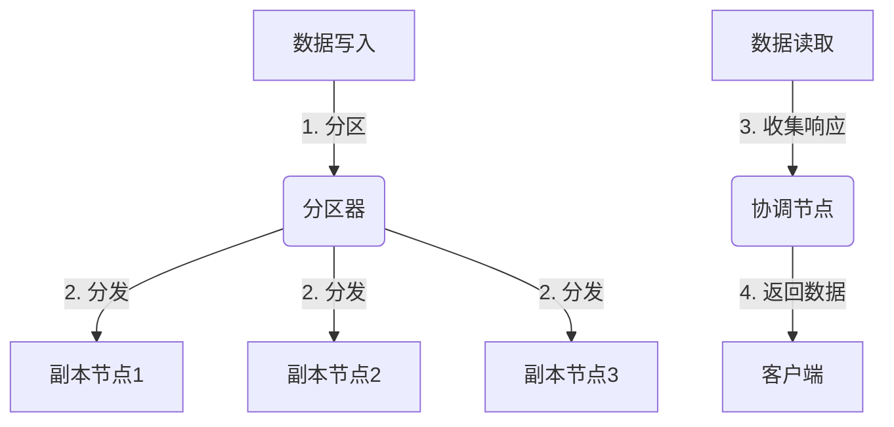

# Cassandra原理与代码实例讲解

## 1.背景介绍

### 1.1 什么是Cassandra

Apache Cassandra是一种开源的分布式NoSQL数据库管理系统,最初由Facebook设计用于存储收件箱数据。它是一个高度可扩展的分区行存储系统,能够处理大量的数据,并提供高可用性和无单点故障。Cassandra的设计目标是处理大规模数据集,并提供持续可用性和线性可扩展性。

### 1.2 Cassandra的主要特点

- **去中心化**:Cassandra是一个完全去中心化的系统,不存在单点故障。
- **可扩展性**:可以通过简单地添加更多节点来线性扩展系统,满足不断增长的读写吞吐量需求。
- **高可用性**:Cassandra通过数据复制和自动故障转移实现高可用性,可在节点出现故障时继续运行。
- **容错性**:Cassandra在设计时就考虑到了硬件故障的发生,可自动从节点故障中恢复。
- **分区**:Cassandra通过Dht(分布式哈希表)将数据分布在集群中,并自动重新分区以适应集群的增减。

### 1.3 Cassandra的应用场景

Cassandra非常适合于以下场景:

- **大数据量**:能够处理PB级别的数据
- **写入密集型工作负载**:优化了写入性能
- **读写并行**:通过分区可实现高并发读写
- **高可用性要求**:通过复制和自动故障转移提供高可用性
- **不断增长的数据集**:可线性扩展以适应不断增长的数据量

## 2.核心概念与联系  

### 2.1 数据模型

Cassandra使用**列族数据模型**而非关系模型。数据以**列族**的形式存储,每个列族包含**行**,每行由**行键**和**列**组成。列由**列键**和**值**构成。

```
列族1:
  行键1: 列1, 列2, ...
  行键2: 列1, 列3, ...
列族2:
  ...
```

这种模型类似于关系数据库中的**表**、**行**和**列**,但提供更大的灵活性,如列可以是任意数据类型,行可包含不同数量的列。

### 2.2 分区与复制

为实现可扩展性和高可用性,Cassandra使用**分区**和**复制**策略。

1. **分区(Partitioning)**

   数据通过**分区器(Partitioner)**根据行键进行分区,并分布到不同节点上。常用的分区器有Murmur3分区器、ByteOrdered分区器等。

2. **复制(Replication)** 

   为提高容错性,数据会在多个节点上复制。复制策略决定了数据在集群中的复制方式,如SimpleStrategy(适用于单数据中心)、NetworkTopologyStrategy(适用于多数据中心)等。

### 2.3 一致性级别

Cassandra支持可配置的一致性级别,用于权衡数据一致性和可用性。主要包括:

- **ONE**: 写入任意存活节点即可
- **QUORUM**: 写入大多数副本节点,读取大多数副本节点
- **ALL**: 写入所有副本节点,读取所有副本节点
- **LOCAL_QUORUM**: 针对单数据中心的QUORUM

较低的一致性级别提供更高的可用性,较高的一致性级别则提供更强的数据一致性。

### 2.4 Mermaid流程图



上图展示了Cassandra的核心写入和读取流程:

1. 客户端写入数据时,数据首先通过分区器进行分区
2. 分区后的数据被分发到不同的副本节点
3. 客户端读取数据时,协调节点收集副本节点的响应
4. 协调节点根据一致性级别返回数据给客户端

## 3.核心算法原理具体操作步骤

### 3.1 写入流程

1. **分区(Partitioning)**

   客户端向Cassandra集群发送写入请求,该请求首先通过分区器(Partitioner)计算出该数据应该存储在哪个分区(Token范围)。

2. **查找协调节点(Coordinator)**

   Cassandra使用一个节点作为该请求的协调节点,通常是Token范围的第一个节点。协调节点负责写入数据并确保数据被正确复制。

3. **复制(Replication)** 

   协调节点将数据复制到根据复制策略选择的其他节点。

4. **确认(Acknowledgement)**

   根据配置的一致性级别,协调节点等待足够数量的副本节点确认写入成功后,才向客户端返回写入成功响应。

5. **持久化(Persistence)**

   所有副本节点将内存中的数据持久化到磁盘的CommitLog和Data文件中。

### 3.2 读取流程

1. **协调节点(Coordinator)**

   客户端向任意Cassandra节点发送读取请求,该节点将作为协调节点处理该请求。

2. **数据位置(Data Location)**

   协调节点通过分区器计算出所需数据的Token范围,并查找到负责该范围的所有副本节点。

3. **数据获取(Data Retrieval)** 

   协调节点并行地从所有副本节点获取所需数据。

4. **数据合并(Data Reconciliation)**

   协调节点根据一致性级别,从收到的响应中选择数据版本,合并获得最终结果。

5. **响应(Response)**

   协调节点将合并后的结果返回给客户端。

### 3.3 一致性级别影响

一致性级别会影响写入和读取的具体操作:

- 对于写入,不同级别决定了需要写入多少副本才能返回成功响应。
- 对于读取,不同级别决定了需要从多少副本读取数据,以及如何处理数据版本不一致的情况。

较低的一致性级别可提供更好的性能和可用性,但可能导致读取陈旧数据。较高的一致性级别则提供更强的数据一致性保证。

## 4.数学模型和公式详细讲解举例说明

### 4.1 分区器(Partitioner)

Cassandra使用分区器将数据分布到不同的节点上。常用的分区器有:

1. **Murmur3分区器**

   Murmur3是Cassandra的默认分区器,使用Murmur3哈希算法将行键哈希到一个令牌(Token)范围内。

   Murmur3哈希函数:

   $$
   h = \operatorname{Murmur3}(key)
   $$

   其中$key$是行键的二进制表示。$h$是64位哈希值,被视为一个无符号整数,范围为$[0, 2^{64})$。

2. **ByteOrdered分区器**

   ByteOrdered分区器将行键按字节顺序进行排序和分区。

   $$
   \begin{align}
   h &= \operatorname{hash}(\operatorname{serialize}(key)) \\
     &= \sum_{i=0}^{n} key[i] \cdot 2^{8(n-i)}
   \end{align}
   $$

   其中$key$是行键的字节数组表示,长度为$n$。$h$是一个64位整数。

无论使用哪种分区器,最终都会将数据分布到$[0, 2^{64})$范围内的某个Token。Cassandra节点会负责该Token范围内的数据。

### 4.2 复制策略(Replication Strategy)

Cassandra使用复制策略来确定数据应该复制到哪些节点上。常用的复制策略有:

1. **SimpleStrategy**

   适用于单数据中心部署。副本数量为$N$,则每个虚拟节点(Token范围)会有$N$个副本,分布在不同的节点上。

   $$
   \text{replica_nodes} = \{(token + i \cdot \dfrac{2^{64}}{N+1}) \bmod 2^{64} \mid 0 \le i < N\}
   $$

   其中$token$是该虚拟节点的Token值。

2. **NetworkTopologyStrategy**

   适用于多数据中心部署。每个数据中心可以配置不同的副本数量。

   $$
   \begin{align}
   \text{replica_nodes} &= \bigcup_{\text{dc}} \text{get_replicas}(\text{dc}, \text{token}) \\
   \text{get_replicas}(\text{dc}, \text{token}) &= \{(token + i \cdot \dfrac{2^{64}}{\text{replication_factor}(\text{dc})+1}) \bmod 2^{64} \mid 0 \le i < \text{replication_factor}(\text{dc})\}
   \end{align}
   $$

   其中$\text{replication_factor}(\text{dc})$是数据中心$\text{dc}$的副本数量。

这些复制策略确保了数据在集群中的均匀分布,并提供了容错能力。

## 4.项目实践:代码实例和详细解释说明

接下来我们通过一个示例项目,演示如何使用Java客户端操作Cassandra数据库。

### 4.1 建立连接

首先,我们需要建立到Cassandra集群的连接:

```java
// 创建集群对象
Cluster cluster = Cluster.builder()
                        .addContactPoint("127.0.0.1")
                        .withPort(9042)
                        .build();

// 连接到集群,获取会话
Session session = cluster.connect();
```

这里我们使用`Cluster.builder()`创建一个`Cluster`实例,并指定Cassandra节点的IP和端口。然后通过`cluster.connect()`获取一个`Session`对象,用于执行查询。

### 4.2 键空间和表操作

接下来,我们创建一个键空间(相当于关系数据库中的数据库)和一个表:

```java
// 创建键空间
session.execute("CREATE KEYSPACE IF NOT EXISTS example_keyspace WITH replication = {'class':'SimpleStrategy', 'replication_factor':1}");

// 使用键空间
session.execute("USE example_keyspace");

// 创建表
session.execute("CREATE TABLE IF NOT EXISTS users (user_id UUID PRIMARY KEY, name TEXT, email TEXT)");
```

这里我们使用`SimpleStrategy`复制策略,副本数量为1。然后创建一个名为`users`的表,包含`user_id`(UUID主键)、`name`和`email`三个列。

### 4.3 数据操作

下面我们插入、查询和更新数据:

```java
// 插入数据
UUID userId = UUID.randomUUID();
session.execute("INSERT INTO users (user_id, name, email) VALUES (?, ?, ?)", userId, "John Doe", "john@example.com");

// 查询数据
ResultSet resultSet = session.execute("SELECT * FROM users WHERE user_id = ?", userId);
Row row = resultSet.one();
System.out.println("Name: " + row.getString("name")); // Name: John Doe

// 更新数据
session.execute("UPDATE users SET email = ? WHERE user_id = ?", "john.doe@example.com", userId);
```

我们使用`session.execute()`方法执行CQL查询语句。对于参数化查询,可以使用问号`?`作为占位符,并在后面提供对应的参数值。

查询结果以`ResultSet`的形式返回,我们可以遍历`ResultSet`中的`Row`对象获取具体的数据值。

### 4.4 关闭连接

最后,别忘了关闭集群连接:

```java
cluster.close();
```

通过这个示例,我们演示了如何使用Java客户端连接Cassandra、执行DDL和DML操作。您可以根据自己的需求扩展和修改代码。

## 5.实际应用场景

Cassandra被广泛应用于需要处理大量数据、高可用性和线性可扩展性的场景,例如:

### 5.1 物联网(IoT)数据处理

物联网设备会产生大量时序数据,Cassandra能够高效地存储和查询这些数据。例如,可以使用Cassandra存储传感器数据、日志数据等。

### 5.2 消息传递系统

Cassandra常被用作消息队列的持久层,存储消息数据。例如,Apache Kafka可以使用Cassandra作为数据存储。

### 5.3 内容分发网络(CDN)

CDN需要在全球范围内存储和分发大量静态内容,如网页、图片、视频等。Cassandra可以在全球范围内提供高可用的内容存储和分发服务。

### 5.4 推荐系统

推荐系统需要存储和处理大量用户行为数据,Cassandra可以作