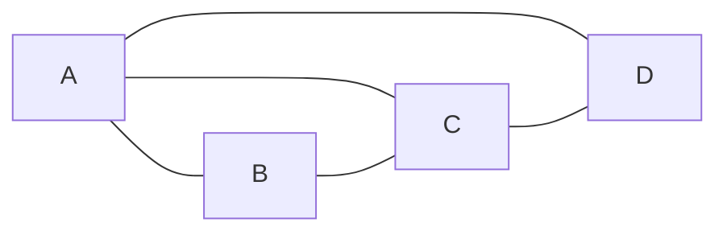

# Graph Triangle Counting算法原理与代码实例讲解

作者：禅与计算机程序设计艺术

## 1. 背景介绍
### 1.1 图三角计数问题定义
图三角计数(Graph Triangle Counting)是图论和网络科学中的一个基本问题。给定一个无向图G=(V,E)，其中V是顶点集，E是边集。图三角计数的目标是找出图G中三角形的数量。三角形是由三条边连接的三个顶点组成的完全子图。
### 1.2 问题的重要性
图三角计数在许多实际应用中扮演着重要角色，例如：
- 社交网络分析：三角形的数量可以反映网络的聚类程度和紧密程度。
- 生物信息学：在蛋白质相互作用网络中，三角形的存在可能表明这些蛋白质属于同一个复合物。
- 网络motif发现：三角形是最简单的网络motif之一，可用于研究网络的结构特征。

### 1.3 计算复杂度挑战
对于一个有n个顶点、m条边的图，暴力枚举所有可能的三元组来计数三角形需要$O(n^3)$的时间复杂度，这在处理大规模图时是不可行的。因此，研究更高效的图三角计数算法具有重要意义。

## 2. 核心概念与联系
### 2.1 图的基本概念
- 顶点(Vertex)：图的基本组成单元，表示实体对象。
- 边(Edge)：连接两个顶点，表示实体之间的关系。
- 度(Degree)：与一个顶点相连的边的数量。
- 邻接矩阵(Adjacency Matrix)：表示图的一种方式，用矩阵存储顶点之间的连接关系。

### 2.2 三角形的定义与性质
- 定义：由三条边连接的三个顶点组成的完全子图。
- 性质1：三角形中任意两点之间都有边相连。
- 性质2：三角形可以用三个顶点的度的乘积来表示。

### 2.3 图三角计数与相关问题
- 局部聚类系数：衡量一个顶点周围的紧密程度，与该顶点参与组成的三角形数量有关。
- 全局聚类系数：整个图的聚类程度，所有局部聚类系数的平均值。
- k-clique计数：计数图中所有大小为k的完全子图数量，三角形是3-clique的特例。

## 3. 核心算法原理具体操作步骤
### 3.1 暴力枚举算法
#### 3.1.1 基本思想
遍历图中所有可能的三元组，判断它们是否形成三角形。
#### 3.1.2 具体步骤
1. 遍历图中所有顶点对(u,v)，u<v。
2. 对于每个顶点对(u,v)，遍历所有可能的第三个顶点w，w>v。
3. 如果边(u,v)、(u,w)、(v,w)都存在，则找到一个三角形，计数器加1。
4. 返回最终的三角形数量。

#### 3.1.3 复杂度分析
时间复杂度：$O(n^3)$，空间复杂度：$O(1)$。

### 3.2 邻接矩阵算法
#### 3.2.1 基本思想
利用图的邻接矩阵，通过矩阵乘法运算来计数三角形。
#### 3.2.2 具体步骤
1. 计算邻接矩阵A的三次方$A^3$。
2. $A^3$的对角线元素之和即为三角形的数量。

#### 3.2.3 复杂度分析
时间复杂度：$O(n^{2.373})$，使用Coppersmith–Winograd算法进行矩阵乘法。空间复杂度：$O(n^2)$。

### 3.3 边迭代算法
#### 3.3.1 基本思想
遍历每条边，统计其两个端点的公共邻居数量，即为以该边为底边的三角形数量。
#### 3.3.2 具体步骤
1. 遍历图中所有边(u,v)。
2. 对于每条边(u,v)，计算u和v的公共邻居数量，即$|N(u) \cap N(v)|$。
3. 将所有边的公共邻居数量相加，得到三角形总数。

#### 3.3.3 复杂度分析
时间复杂度：$O(md_{max})$，其中m为边数，$d_{max}$为图中最大度。空间复杂度：$O(n+m)$。

## 4. 数学模型和公式详细讲解举例说明
### 4.1 三角形计数的数学表示
设图G=(V,E)，三角形数量记为$\Delta(G)$。
$$\Delta(G) = \frac{1}{6}\sum_{(u,v,w) \in V^3} A_{uv}A_{vw}A_{wu}$$
其中，$A$为图的邻接矩阵，$A_{uv}$表示顶点u和v之间是否有边相连，取值为0或1。

### 4.2 局部聚类系数与三角形的关系
顶点i的局部聚类系数$C_i$表示为：
$$C_i = \frac{2t_i}{d_i(d_i-1)}$$
其中，$t_i$为顶点i参与组成的三角形数量，$d_i$为顶点i的度。

### 4.3 全局聚类系数与三角形的关系
图G的全局聚类系数$C(G)$为所有顶点局部聚类系数的平均值：
$$C(G) = \frac{1}{n}\sum_{i=1}^n C_i = \frac{6\Delta(G)}{\sum_{i=1}^n d_i(d_i-1)}$$

### 4.4 计算实例
考虑下图所示的无向图G：



邻接矩阵$A$为：
$$A = \begin{bmatrix}
0 & 1 & 1 & 1\\
1 & 0 & 1 & 0\\
1 & 1 & 0 & 1\\
1 & 0 & 1 & 0
\end{bmatrix}$$

$A^3$的对角线元素之和为6，即图G中有2个三角形(ABC和ACD)。

顶点A的局部聚类系数：$C_A = \frac{2 \times 2}{3 \times 2} = \frac{2}{3}$。

图G的全局聚类系数：$C(G) = \frac{6 \times 2}{3 \times 2 + 2 \times 1 + 3 \times 2 + 2 \times 1} = \frac{12}{16} = \frac{3}{4}$。

## 5. 项目实践：代码实例和详细解释说明
以下是使用Python实现的图三角计数算法：

### 5.1 暴力枚举算法

```python
def brute_force_triangle_count(graph):
    count = 0
    n = len(graph)
    for u in range(n):
        for v in range(u+1, n):
            if graph[u][v] == 0:
                continue
            for w in range(v+1, n):
                if graph[u][w] == 1 and graph[v][w] == 1:
                    count += 1
    return count
```

### 5.2 邻接矩阵算法

```python
def matrix_triangle_count(graph):
    A = np.array(graph)
    A3 = np.linalg.matrix_power(A, 3)
    return np.trace(A3) // 6
```

### 5.3 边迭代算法

```python
def edge_iterator_triangle_count(graph):
    count = 0
    n = len(graph)
    for u in range(n):
        for v in range(u+1, n):
            if graph[u][v] == 0:
                continue
            common_neighbors = 0
            for w in range(n):
                if graph[u][w] == 1 and graph[v][w] == 1:
                    common_neighbors += 1
            count += common_neighbors
    return count // 2
```

以上代码中，`graph`表示图的邻接矩阵，使用二维列表表示。`n`为图的顶点数。暴力枚举算法通过三重循环遍历所有可能的三元组，判断它们是否形成三角形。邻接矩阵算法利用`numpy`库计算矩阵的三次方，并取对角线元素之和的1/6作为三角形数量。边迭代算法遍历每条边，统计其两个端点的公共邻居数量，将所有边的公共邻居数量相加后除以2得到三角形总数。

## 6. 实际应用场景
图三角计数算法在以下场景中有广泛应用：
### 6.1 社交网络分析
- 识别社交网络中的社区结构，三角形数量越多，社区内部的紧密程度越高。
- 计算用户之间的相似度，共同好友数量（三角形数量）可作为相似度的一个指标。
- 预测用户之间的潜在关系，三角形闭包原则认为，如果两个用户有共同好友，他们之间形成连接的可能性更大。

### 6.2 生物信息学
- 在蛋白质相互作用网络中，三角形可能表示这些蛋白质属于同一个复合物或参与相同的生物学过程。
- 通过比较不同物种的蛋白质相互作用网络的三角形数量，可以研究物种之间的进化关系。

### 6.3 网络motif发现
- 三角形是最简单的网络motif之一，可用于研究网络的结构特征。
- 通过统计真实网络中三角形的数量，并与随机网络进行比较，可以发现网络的非随机性和功能模块。

### 6.4 异常检测
- 在金融交易网络中，异常高频的三角形模式可能暗示着欺诈行为或市场操纵。
- 在通信网络中，异常的三角形数量可能表示网络中存在僵尸网络或恶意节点。

## 7. 工具和资源推荐
### 7.1 图处理库
- NetworkX (Python): 提供了丰富的图算法和数据结构，包括图三角计数。
- iGraph (Python, R, C++): 高性能的图处理库，支持多种编程语言。
- SNAP (C++): 斯坦福大学开发的通用网络分析平台，提供了高效的图三角计数实现。

### 7.2 大规模图处理框架
- Apache Spark - GraphX: 基于Spark的分布式图处理框架，支持图三角计数等算法。
- Apache Giraph: 基于Hadoop的大规模图处理系统，可用于分布式图三角计数。
- Pregel: Google提出的大规模图处理模型，许多框架如Giraph、GPS都是基于Pregel模型实现的。

### 7.3 图可视化工具
- Gephi: 开源的交互式图可视化和探索平台，可用于可视化图三角计数的结果。
- Cytoscape: 主要用于生物学网络的可视化和分析，但也适用于一般的图可视化任务。

### 7.4 数据集
- SNAP图数据集: 斯坦福大学收集的大规模真实世界网络数据，包括社交网络、通信网络、互联网等。
- KONECT图数据集: 科布伦茨大学收集的大规模网络数据集，涵盖社交、引文、协作等多个领域。

## 8. 总结：未来发展趋势与挑战
### 8.1 算法优化与加速
- 探索更高效的图三角计数算法，如矩阵乘法的优化、基于采样的近似算法等。
- 利用并行计算和分布式计算技术，如MapReduce、Spark等，实现大规模图三角计数的加速。

### 8.2 面向动态图的三角计数
- 现有算法主要针对静态图，而现实中的网络往往是动态演化的。
- 研究支持动态图更新的增量式三角计数算法，以适应网络的实时变化。

### 8.3 三角计数的近似算法
- 精确的三角计数在大规模图上的计算开销很大，近似算法可以在精度和效率之间取得平衡。
- 探索基于采样、数据流等技术的近似三角计数算法，在可接受的误差范围内快速估计三角形数量。

### 8.4 三角计数在新兴领域的应用
- 在时空网络、异构信息网络等新兴网络结构中，研究三角形的定义、计数方法和应用。
- 将图三角计数与深度学习结合，利用三角形数量等结构特征来改进图神经网络的性能。

## 