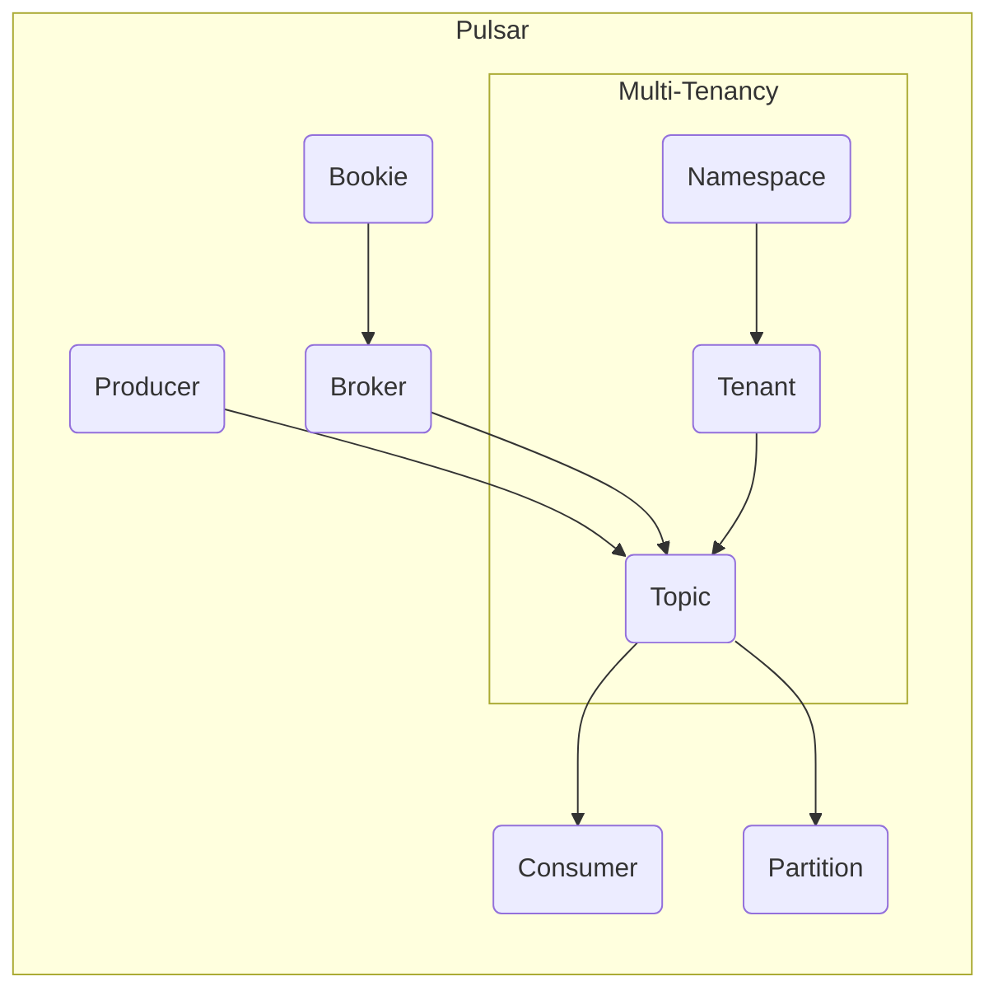

# Pulsar原理与代码实例讲解

作者：禅与计算机程序设计艺术

## 1.背景介绍

### 1.1 什么是Pulsar？
Pulsar是Apache软件基金会的一个开源项目，是下一代云原生分布式消息流平台。它提供了简单易用、高性能、高可靠的企业级消息队列和流处理功能。

### 1.2 Pulsar的主要特性
- 原生支持多租户
- 持久化存储，支持多种存储引擎
- 低延迟实时消息传递
- 灵活的消息传递模型
- 水平可扩展性
- 内置流处理

### 1.3 Pulsar的应用场景
Pulsar在很多场景下都有广泛应用，例如：
- 事件驱动架构
- 流数据处理
- 物联网数据采集
- 日志聚合
- 消息队列

## 2.核心概念与联系

### 2.1 Producer和Consumer
- Producer：消息生产者，负责生产和发送消息到Pulsar。
- Consumer：消息消费者，负责从Pulsar接收和处理消息。

### 2.2 Topic和Partition
- Topic：主题，是发布和订阅的基本单位。生产者将消息发送到特定主题，消费者通过订阅主题来消费消息。
- Partition：分区，一个Topic可以划分多个分区，以实现负载均衡和水平扩展。

### 2.3 Broker和Bookie
- Broker：消息代理，负责接收和分发消息，管理Topic和订阅关系。
- Bookie：存储节点，负责持久化存储消息数据。

### 2.4 Namespace和Tenant
- Tenant：租户，是多租户隔离的基本单位，不同租户的资源是完全隔离的。
- Namespace：命名空间，用于对Topic进行逻辑上的划分，方便管理。

下面是Pulsar核心概念之间的关系图：



## 3.核心算法原理具体操作步骤

### 3.1 Topic分发算法
Pulsar采用了一致性哈希算法来决定消息发送到哪个分区，具体步骤如下：
1. 对消息的key进行哈希。
2. 将哈希值映射到一个固定大小的环上。
3. 沿顺时针找到第一个大于等于哈希值的分区，该分区就是消息发送的目标分区。

### 3.2 消息存储算法
Pulsar使用了预写日志(Write Ahead Log)的方式来持久化存储消息，具体步骤如下：
1. 消息首先被追加写入Bookie的日志文件。
2. 日志文件根据一定规则滚动和压缩。
3. 消息被异步地从日志文件转移到另一个长期存储上，比如HDFS。
4. 最后在Broker中为每个Topic建立消息到存储位置的索引。

### 3.3 消息确认和重传算法
为了保证消息至少被消费一次，Pulsar采用了累积确认和重传的机制，具体步骤如下：
1. Consumer收到消息后，定期向Broker发送确认(Ack)请求。
2. Broker收到确认后，将消息从待确认队列移除。
3. 如果Broker长时间没有收到确认，会将消息重新发送给Consumer。
4. Consumer通过幂等性保证对重复消息不会重复处理。

## 4.数学模型和公式详细讲解举例说明

### 4.1 指数衰减移动平均算法
Pulsar使用了EWMA(Exponentially Weighted Moving Average)算法来估算消息的生产和消费速率，公式如下：

$$\begin{aligned}
\mathrm{EWMA}_t &= \mathrm{EWMA}_{t-1} + \alpha \cdot (r_t - \mathrm{EWMA}_{t-1}) \\
&= (1 - \alpha) \cdot \mathrm{EWMA}_{t-1} + \alpha \cdot r_t
\end{aligned}$$

其中，$\mathrm{EWMA}_t$是第$t$个时间窗口的速率估算值，$r_t$是第$t$个时间窗口的实际速率，$\alpha$是平滑系数，控制历史数据的权重。

举例说明，假设$\alpha=0.2$，前三个时间窗口的实际速率为10, 12, 15，则EWMA的计算过程如下：

- $\mathrm{EWMA}_1 = 10$
- $\mathrm{EWMA}_2 = 0.8 \cdot 10 + 0.2 \cdot 12 = 10.4$
- $\mathrm{EWMA}_3 = 0.8 \cdot 10.4 + 0.2 \cdot 15 = 11.32$

可以看出，EWMA能够平滑速率的短期波动，反映速率的长期趋势。Pulsar利用EWMA来触发负载均衡和扩缩容等操作。

### 4.2 Copyset算法
为了保证数据的持久性和可用性，Pulsar采用了Copyset副本放置算法，核心思想是尽量将Topic的副本分散到不同的机架上。

假设Pulsar集群有$N$个Broker，分布在$R$个机架上，每个Topic有$M$个副本，则Copyset放置算法可以表示为一个优化问题：

$$
\begin{aligned}
\min \quad & \sum_{i=1}^R \left(\sum_{j=1}^N x_{ij} - \frac{M}{R}\right)^2 \\
\mathrm{s.t.} \quad & \sum_{i=1}^R x_{ij} = 1, \quad \forall j=1,\ldots,N \\
& \sum_{j=1}^N x_{ij} \leq \left\lceil \frac{M}{R} \right\rceil, \quad \forall i=1,\ldots,R  \\
& x_{ij} \in \{0, 1\}, \quad \forall i,j
\end{aligned}
$$

其中，$x_{ij}$是一个二值变量，表示第$j$个Broker是否放置在第$i$个机架上。优化目标是最小化副本在机架间的均方差，约束条件保证每个Broker只属于一个机架，每个机架最多放置$\left\lceil \frac{M}{R} \right\rceil$个副本。

Pulsar使用了一个近似的贪心算法来求解这个组合优化问题，能够以较低的时间复杂度得到一个次优解。

## 5.项目实践：代码实例和详细解释说明

下面我们通过一个简单的Java代码实例来演示如何使用Pulsar的Producer API发送消息：

```java
PulsarClient client = PulsarClient.builder()
        .serviceUrl("pulsar://localhost:6650")
        .build();

Producer<byte[]> producer = client.newProducer()
        .topic("my-topic")
        .create();

for (int i = 0; i < 10; i++) {
    String message = "my-message-" + i;
    producer.send(message.getBytes());
}

producer.close();
client.close();
```

代码解释：
1. 首先通过`PulsarClient.builder()`创建一个Pulsar客户端实例，并指定Pulsar服务的地址。
2. 然后通过`client.newProducer()`创建一个生产者实例，并指定要发送消息的Topic名称。
3. 接着使用一个for循环来发送10条消息，每条消息的内容是一个字符串，通过`getBytes()`方法转换为字节数组。
4. 最后别忘了关闭生产者和客户端，释放资源。

下面是使用Consumer API消费消息的示例代码：

```java
PulsarClient client = PulsarClient.builder()
        .serviceUrl("pulsar://localhost:6650")
        .build();

Consumer<byte[]> consumer = client.newConsumer()
        .topic("my-topic")
        .subscriptionName("my-subscription")
        .subscribe();

while (true) {
    Message<byte[]> message = consumer.receive();
    String content = new String(message.getValue());
    System.out.println("Received message: " + content);
    consumer.acknowledge(message);
}
```

代码解释：
1. 首先同样创建一个Pulsar客户端实例。
2. 然后通过`client.newConsumer()`创建一个消费者实例，指定要订阅的Topic名称和订阅名称。
3. 接着使用一个无限循环来不断接收消息，通过`consumer.receive()`方法同步接收一条消息。
4. 将收到的字节数组消息转换为字符串，并打印出来。
5. 最后通过`consumer.acknowledge()`方法确认消息已经被成功处理。

以上就是使用Pulsar的Java客户端发送和消费消息的基本流程。Pulsar还提供了异步发送、批量发送、多主题订阅、消息过滤、死信队列等多种功能，可以根据实际需求进行选择和使用。

## 6.实际应用场景

Pulsar在很多实际场景中都得到了广泛应用，下面列举几个典型的案例。

### 6.1 金融交易系统
某证券公司使用Pulsar作为其核心交易系统的消息中间件，用于股票和期货的报单、撮合、成交等环节。Pulsar提供了低延迟、高吞吐的消息传输能力，以及灵活的Topic划分和订阅机制，能够满足交易系统的实时性和可扩展性需求。

### 6.2 车联网平台
某汽车制造商利用Pulsar搭建了一个车联网大数据平台，用于采集和分析来自车辆的各种传感器数据，如车速、油耗、故障码等。每辆车都作为一个Producer定期上报数据，后端的数据处理和分析系统通过订阅相应的Topic来消费数据。Pulsar的多租户功能可以很好地隔离不同车型的数据，而分区和负载均衡机制则保证了系统的高可用和弹性扩容能力。

### 6.3 日志聚合平台
某互联网公司使用Pulsar实现了一个集中式的日志收集和分析平台。分布在不同机器上的应用程序将日志以JSON格式发送到Pulsar的特定Topic中，然后由一个流处理引擎（如Apache Flink）消费这些日志数据，进行实时的统计分析和告警监控。Pulsar的持久化存储和多副本机制确保了日志数据不会丢失，而灵活的订阅模型和过滤器则方便了下游的消费者根据需要获取数据。

### 6.4 电商推荐系统
某电商平台的推荐系统使用Pulsar作为用户行为数据的流式传输通道。用户的各种行为事件，如浏览、收藏、加购、下单等，都作为一条消息发送到Pulsar的相应Topic中。推荐算法模型通过订阅这些Topic，实时更新用户的画像和偏好，并生成个性化的商品推荐结果。Pulsar提供的端到端延迟和吞吐保证，以及可扩展的分区和订阅机制，是构建实时推荐系统的理想选择。

## 7.工具和资源推荐

### 7.1 官方文档
Pulsar的官方网站提供了非常详尽的用户文档和API参考手册，是学习和使用Pulsar的权威资料。
- Pulsar官网：https://pulsar.apache.org/
- 用户文档：https://pulsar.apache.org/docs/en/standalone/
- API文档：https://pulsar.apache.org/api/

### 7.2 源码
Pulsar是一个完全开源的项目，其源代码托管在GitHub上，用户可以自由地下载、修改和贡献代码。
- GitHub地址：https://github.com/apache/pulsar

### 7.3 社区
Pulsar拥有一个活跃的开源社区，用户可以通过邮件列表、Slack频道等方式与其他用户和开发者交流。
- 邮件列表：https://pulsar.apache.org/contact/
- Slack频道：https://apache-pulsar.slack.com/

### 7.4 周边工具
围绕Pulsar，还有很多配套的周边工具和框架，可以方便地与Pulsar集成，扩展Pulsar的功能。
- Pulsar Manager：一个Web控制台，用于管理和监控Pulsar集群。
- Pulsar Adaptor：一组连接器，用于与其他系统（如Kafka、RabbitMQ）进行数据迁移和互操作。
- Pulsar Functions：一个轻量级的流处理框架，可以在Pulsar中运行用户自定义的处理逻辑。
- Pulsar IO：一组连接器，用于将Pulsar与外部数据源（如数据库、对象存储）进行集成。

## 8.总结：未