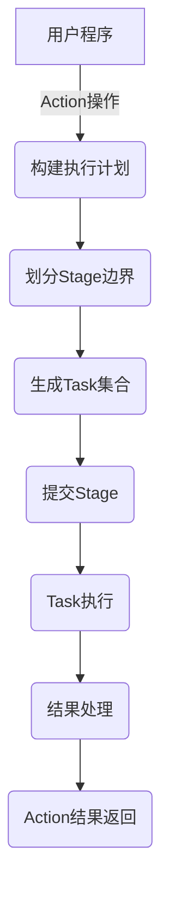

# Spark Stage原理与代码实例讲解

## 1.背景介绍

Apache Spark是一个开源的大数据处理引擎,它提供了一种高效、通用的数据处理方式。Spark的核心是弹性分布式数据集(Resilient Distributed Dataset,RDD),它是一种分布式内存抽象,能够缓存数据并支持并行操作。

Spark作业会被拆分为更小的单元,称为Stage。每个Stage会产生一些中间结果,并将其存储在内存或磁盘中。Stage的执行是由Spark的任务调度器(Task Scheduler)负责的,它会根据数据的位置和可用资源,将任务分发到不同的Executor上执行。

理解Spark Stage的原理对于优化Spark作业的性能至关重要。本文将深入探讨Spark Stage的工作原理,并通过代码示例帮助读者更好地掌握这一概念。

## 2.核心概念与联系

### 2.1 RDD(Resilient Distributed Dataset)

RDD是Spark的核心数据抽象,它是一个不可变、分区的记录集合。RDD可以从HDFS、HBase或者本地文件系统等数据源创建,也可以通过现有RDD进行转换操作得到新的RDD。

RDD支持两种类型的操作:转换(Transformation)和动作(Action)。转换操作会创建一个新的RDD,而动作操作会对RDD进行计算并返回结果。

### 2.2 Stage

Stage是Spark作业中的一个执行单元,它由一个或多个任务(Task)组成。当Spark需要计算一个RDD时,它会构建一个执行计划,将RDD的计算拆分为多个Stage。

每个Stage都包含一系列的转换操作,这些操作会被pipeline化执行,从而减少了数据的shuffle开销。Stage之间通过shuffle操作进行数据传输。

### 2.3 任务(Task)

Task是Spark中最小的工作单元,它会被分发到Executor上执行。每个Task会负责处理RDD的一个分区(Partition)。

Task分为两种类型:ShuffleMapTask和ResultTask。ShuffleMapTask会产生中间结果,并将其写入磁盘进行shuffle;而ResultTask会直接计算最终结果。

## 3.核心算法原理具体操作步骤

Spark Stage的执行过程可以概括为以下几个步骤:

1. **构建执行计划(Physical Plan)**: 当用户触发一个Action操作时,Spark会根据RDD的血统关系(Lineage)构建一个执行计划。这个执行计划描述了如何从初始RDD计算出最终结果。

2. **划分Stage边界**: Spark会根据宽依赖(Wide Dependencies)将执行计划划分为多个Stage。宽依赖指的是RDD之间存在shuffle操作,需要进行数据重分区。

3. **生成Task集合**: 对于每个Stage,Spark会为其RDD的每个分区生成一个Task。这些Task会被放入一个任务集合(Task Set)中。

4. **提交Stage**: Spark会按照Stage的依赖顺序依次提交每个Stage。在提交Stage时,Spark会将其Task Set分发到不同的Executor上执行。

5. **Task执行**: 每个Executor会并行执行它所分配的Task。Task的执行过程包括:读取输入数据、执行计算逻辑、生成结果。

6. **结果处理**: 对于最后一个Stage,其ResultTask会直接计算出最终结果。而对于中间Stage,其ShuffleMapTask会将中间结果写入磁盘,供下一个Stage使用。

7. **Action结果返回**: 最终结果会被收集并返回给Driver程序。

下面是一个示意图,展示了Spark Stage的执行流程:



## 4.数学模型和公式详细讲解举例说明

在Spark中,Task的调度是一个复杂的过程,它需要考虑多个因素,如数据的本地性、集群资源的利用率等。Spark使用了一种基于延迟调度(Delay Scheduling)的算法来实现高效的Task调度。

延迟调度算法的核心思想是,在提交Task之前,先等待一段时间,看看是否有更合适的Executor可用。这样可以提高数据的本地性,从而减少数据传输的开销。

我们用数学模型来描述延迟调度算法的工作原理。假设有一个Stage包含n个Task,记为$T = \{t_1, t_2, \ldots, t_n\}$。我们定义一个函数$f(t_i, e_j)$,用于计算将Task $t_i$分配给Executor $e_j$的代价。这个代价可以是数据传输的开销、计算资源的利用率等。

我们的目标是找到一个Task到Executor的映射$M$,使得总代价$\sum_{(t_i, e_j) \in M} f(t_i, e_j)$最小。

延迟调度算法的伪代码如下:

```
for each task t in T:
    minCost = infinity
    bestExecutor = null
    wait for a limited time:
        for each available executor e:
            cost = f(t, e)
            if cost < minCost:
                minCost = cost
                bestExecutor = e
    if bestExecutor is not null:
        assign t to bestExecutor
    else:
        assign t to any available executor
```

在这个算法中,$f(t_i, e_j)$可以是一个复杂的函数,它需要考虑多个因素,如数据的本地性、Executor的剩余资源等。Spark使用了启发式算法来近似求解这个优化问题。

通过延迟调度算法,Spark可以更好地利用集群资源,提高作业的执行效率。

## 4.项目实践:代码实例和详细解释说明

下面我们通过一个简单的WordCount示例,来看看Spark Stage是如何执行的。

```scala
val textFile = spark.read.textFile("hdfs://...")
val counts = textFile.flatMap(line => line.split(" "))
                  .map(word => (word, 1))
                  .reduceByKey(_ + _)
counts.saveAsTextFile("hdfs://...")
```

对于这个作业,Spark会构建如下的物理执行计划:

```
WriterCommitJob
 WriteTask
  ResultStage
   ShuffleMapStage
    FlatMapIterator
    MapIterator
    ReadWholeTextFile
```

我们可以看到,这个作业被划分为了两个Stage:

1. **ShuffleMapStage**: 这个Stage包含了`flatMap`和`map`两个转换操作。它的Task会读取文本文件,对每一行进行`flatMap`和`map`操作,生成`(word, 1)`这样的键值对。

2. **ResultStage**: 这个Stage包含了`reduceByKey`操作。它的Task会从ShuffleMapStage获取中间结果,对相同的key执行`reduce`操作,统计每个单词的出现次数。

让我们看看ShuffleMapStage的Task是如何执行的:

```scala
// FlatMapIterator
class FlatMapIterator(context: TaskContext, iter: Iterator[String])
  extends Iterator[(String, Int)] {
  
  private val flatMapFunc = x => x.split(" ")
  
  override def next(): (String, Int) = {
    val array = flatMapFunc(iter.next()).filter(_ != "")
    array.map(x => (x, 1))
  }
}

// MapIterator  
class MapIterator(context: TaskContext, iter: Iterator[(String, Int)])
  extends Iterator[(String, Int)] {
    
  private val mapFunc = x => x
  
  override def next(): (String, Int) = {
    val (k, v) = iter.next()
    mapFunc((k, v))
  }
}
```

这两个Iterator分别实现了`flatMap`和`map`操作。在Task的执行过程中,它们会被依次应用到每一行文本上,生成`(word, 1)`这样的键值对。

接下来,让我们看看ResultStage的Task是如何执行的:

```scala
// ReduceIterator
class ReduceIterator(context: TaskContext, iter: Iterator[(String, Int)], reduceFunc: (Int, Int) => Int)
  extends Iterator[(String, Int)] {
    
  private val map = new HashMap[String, Int]()
  
  iter.foreach { case (k, v) =>
    val newVal = map.getOrElse(k, 0) + v
    map.put(k, newVal)
  }
  
  override def next(): (String, Int) = {
    val (k, v) = map.next()
    (k, v)
  }
}
```

`ReduceIterator`会遍历ShuffleMapStage生成的中间结果,对于每个key,它会调用`reduceFunc`函数来累加value。最终,它会生成`(word, count)`这样的键值对,其中`count`就是该单词在文本文件中出现的次数。

通过这个示例,我们可以看到Spark是如何将作业拆分为多个Stage,并在每个Stage中执行一系列转换操作的。每个Stage都会生成中间结果,供下一个Stage使用。

## 5.实际应用场景

Spark Stage的概念在实际应用中扮演着重要的角色。以下是一些常见的应用场景:

1. **大数据处理**: Spark常被用于处理大规模的数据集,如日志数据、网络数据等。Stage的概念可以帮助Spark高效地处理这些数据,提高计算性能。

2. **机器学习**: Spark MLlib是Spark的机器学习库,它广泛应用于各种机器学习任务,如分类、回归、聚类等。Stage的概念可以帮助MLlib更好地利用集群资源,加速模型的训练和预测过程。

3. **流式计算**: Spark Streaming是Spark的流式计算模块,它可以实时处理来自Kafka、Flume等数据源的数据流。Stage的概念在Spark Streaming中也扮演着关键角色,帮助它高效地处理实时数据。

4. **图计算**: Spark GraphX是Spark的图计算库,它可以用于处理大规模图数据,如社交网络、知识图谱等。Stage的概念可以帮助GraphX更好地并行化图算法,提高计算效率。

5. **交互式分析**: Spark SQL和Spark DataFrame提供了交互式的数据分析能力,用户可以使用SQL或者DataFrame API来查询和处理数据。Stage的概念可以帮助Spark SQL和DataFrame优化查询执行计划,提高查询性能。

总的来说,Spark Stage的概念为Spark提供了高效的任务调度和执行机制,使其能够在各种应用场景下发挥出色的性能表现。

## 6.工具和资源推荐

如果你想深入学习Spark Stage的原理和实现细节,以下是一些推荐的工具和资源:

1. **Spark Web UI**: Spark提供了一个基于Web的UI界面,用于监控和调试Spark作业。在这个UI中,你可以查看作业的执行计划、Stage信息、Task信息等,这对于理解Spark Stage的执行过程非常有帮助。

2. **Spark源代码**: Spark是开源的,你可以直接阅读它的源代码,了解Stage的实现细节。相关的代码位于`org.apache.spark.scheduler`包中。

3. **Spark官方文档**: Spark的官方文档对Stage的概念和工作原理有详细的介绍,是一个很好的学习资源。

4. **Spark性能调优指南**: Spark官方提供了一份性能调优指南,其中包含了优化Stage执行的技巧和最佳实践。

5. **Spark相关书籍**:市面上有许多优秀的Spark相关书籍,如《Learning Spark》、《Spark高级数据分析》等,它们对Spark Stage的概念都有所涉及。

6. **Spark社区**: Spark拥有一个活跃的开发者社区,你可以在Spark邮件列表、Stack Overflow等平台上寻求帮助或分享经验。

7. **Spark Summit视频**: Spark Summit是Spark社区的年度大会,会有许多关于Spark Stage的演讲和分享,这些视频资源都是很好的学习材料。

通过利用这些工具和资源,你可以更深入地理解Spark Stage的原理,并掌握如何优化Spark作业的执行效率。

## 7.总结:未来发展趋势与挑战

Spark Stage是Spark实现高效分布式计算的关键机制之一。通过将作业拆分为多个Stage,Spark可以更好地利用集群资源,提高计算性能。

然而,随着大数据应用的不断发展,Spark Stage也面临着一些新的挑战和发展趋势:

1. **资源管理优化**: 随着集群规模的扩大,如何更好地管理和调度资源成为一个重要的课题。Spark需要优化其资源管理策略,以充分利用集群资源,提高Stage的执行效率。

2. **异构计算支持**:未来的大数据应用可能需要在CPU、GPU、FPGA等异构硬件上执行计算任务。Spark需要支持异构计算