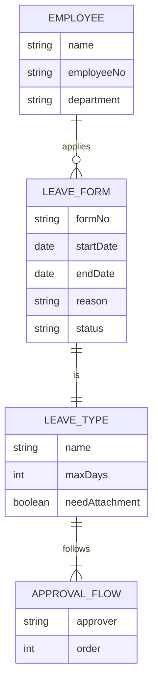

# 员工请假管理系统详细设计与具体代码实现

作者：禅与计算机程序设计艺术

## 1. 背景介绍

在现代企业管理中,员工请假管理是一项重要而繁琐的工作。传统的人工管理方式效率低下,容易出错,难以满足企业发展的需求。因此,开发一套功能完善、高效可靠的员工请假管理系统就显得尤为重要。

本文将详细介绍员工请假管理系统的需求分析、架构设计、数据库设计、核心算法、关键代码实现等内容,为企业信息化建设提供参考。

### 1.1 系统概述
#### 1.1.1 系统目标
#### 1.1.2 系统功能
#### 1.1.3 用户角色

### 1.2 需求分析  
#### 1.2.1 业务需求
#### 1.2.2 功能需求
#### 1.2.3 非功能需求

## 2. 核心概念与联系

员工请假管理系统涉及的核心概念包括:

- 员工:公司的正式员工,具有工号、姓名、部门等基本信息。
- 请假类型:如事假、病假、年假等,每种类型有不同的请假规则。
- 请假单:员工提交的请假申请,包含请假类型、时间、原因等信息。
- 审批流程:请假单的审批流程,一般为直接主管、部门负责人、HR等角色依次审批。

### 2.1 员工与请假单
#### 2.1.1 员工属性
#### 2.1.2 请假单属性
#### 2.1.3 二者关系

### 2.2 请假类型与审批流程
#### 2.2.1 请假类型管理
#### 2.2.2 审批流程配置
#### 2.2.3 类型与流程关联

### 2.3 核心概念ER图



## 3. 核心算法原理具体操作步骤

本系统的核心算法主要体现在请假时间的计算和审批流程的控制两个方面。

### 3.1 请假时间计算
#### 3.1.1 基本假期计算
#### 3.1.2 跨休息日请假
#### 3.1.3 节假日请假

### 3.2 审批流程控制
#### 3.2.1 审批流程初始化
#### 3.2.2 审批状态更新
#### 3.2.3 审批超时处理

## 4. 数学模型和公式详细讲解举例说明

在请假时间的计算中,我们需要用到日期时间的数学模型和计算公式。

### 4.1 日期时间表示
#### 4.1.1 日期表示法
#### 4.1.2 时间表示法
#### 4.1.3 日期时间组合

### 4.2 日期时间计算
#### 4.2.1 日期差值计算
假设请假起始日期为 $d_1$,结束日期为 $d_2$,则请假的自然日天数 $N$ 为:

$$ N = d_2 - d_1 + 1 $$

#### 4.2.2 工作日计算
假设请假起始日期为 $d_1$,结束日期为 $d_2$,$W(d)$ 代表日期 $d$ 是否为工作日,则请假的工作日天数 $W$ 为:

$$ W = \sum_{i=0}^{N-1} W(d_1+i) $$

其中 $W(d)$ 的取值如下:

$
W(d)=\begin{cases}
1, & \text{$d$ 为工作日}  \\
0, & \text{$d$ 为休息日}
\end{cases}
$

#### 4.2.3 跨休息日计算

### 4.3 公式应用举例
#### 4.3.1 事假天数计算
#### 4.3.2 病假天数计算
#### 4.3.3 婚假天数计算

## 5. 项目实践：代码实例和详细解释说明

下面我们使用Java语言,基于Spring Boot框架,实现员工请假管理系统的后端服务。

### 5.1 环境准备
#### 5.1.1 JDK安装配置
#### 5.1.2 Maven安装配置
#### 5.1.3 IDE安装配置

### 5.2 项目搭建
#### 5.2.1 Spring Boot项目创建
#### 5.2.2 数据库连接配置
#### 5.2.3 依赖包管理

### 5.3 领域模型设计
#### 5.3.1 Employee实体类
```java
@Data
public class Employee {
    private Long id;
    private String name;
    private String employeeNo;
    private String department;
    // 其他属性和方法
}
```
#### 5.3.2 LeaveType实体类
```java
@Data
public class LeaveType {
    private Long id;
    private String name;
    private Integer maxDays;
    private Boolean needAttachment;
    // 其他属性和方法
}
```
#### 5.3.3 LeaveForm实体类
```java
@Data
public class LeaveForm {
    private Long id;
    private String formNo;
    private Employee employee;
    private LeaveType leaveType;
    private LocalDate startDate;
    private LocalDate endDate;
    private String reason;
    private String status;
    // 其他属性和方法
}
```

### 5.4 数据访问层实现
#### 5.4.1 EmployeeDAO实现
#### 5.4.2 LeaveTypeDAO实现
#### 5.4.3 LeaveFormDAO实现

### 5.5 业务逻辑层实现
#### 5.5.1 EmployeeService实现
#### 5.5.2 LeaveTypeService实现
#### 5.5.3 LeaveFormService实现

```java
@Service
public class LeaveFormService {
    
    @Autowired
    private LeaveFormDAO leaveFormDAO;
    
    public void applyLeave(LeaveForm form) {
        // 参数校验
        
        // 请假时间计算
        long days = calLeaveDays(form.getStartDate(), form.getEndDate(), form.getLeaveType()); 
        if (days > form.getLeaveType().getMaxDays()) {
            throw new BusinessException("请假天数超过限制");
        }
        
        // 审批流程初始化
        form.setStatus(LeaveFormStatus.APPROVING);
        
        // 保存请假单
        leaveFormDAO.save(form);
        
        // 发送通知提醒审批
    }
    
    private long calLeaveDays(LocalDate d1, LocalDate d2, LeaveType type) {
        // 根据请假类型,调用不同的请假天数计算逻辑
    }
    
    public void approveLeave(String formNo, String approver, boolean pass) {
        // 根据表单号加载请假单
        LeaveForm form = leaveFormDAO.loadByNo(formNo);
        
        // 更新审批人和审批结果
        form.setApprover(approver);
        form.setResult(pass);
        
        // 判断审批流程是否结束
        if (form.isApproved()) {
            form.setStatus(LeaveFormStatus.APPROVED); 
        } else {
            form.setStatus(LeaveFormStatus.REJECTED);
        }
        
        // 保存请假单
        leaveFormDAO.update(form);
    }
}
```

### 5.6 控制层实现
#### 5.6.1 EmployeeController实现
#### 5.6.2 LeaveTypeController实现
#### 5.6.3 LeaveFormController实现

```java
@RestController
@RequestMapping("/leave")
public class LeaveFormController {
    
    @Autowired
    private LeaveFormService leaveFormService;
    
    @PostMapping("/apply")
    public ApiResult apply(@RequestBody LeaveForm form) {
        leaveFormService.applyLeave(form);
        return ApiResult.ok();
    }
    
    @PostMapping("/approve")
    public ApiResult approve(@RequestBody Map<String, Object> params) {
        String formNo = (String)params.get("formNo");
        String approver = (String)params.get("approver");
        boolean pass = (boolean)params.get("pass");
        leaveFormService.approveLeave(formNo, approver, pass);
        return ApiResult.ok();
    }
}
```

## 6. 实际应用场景

员工请假管理系统在企业内部管理中有着广泛的应用,下面列举几个典型场景:

### 6.1 企业人力资源管理
#### 6.1.1 员工请假审批
#### 6.1.2 请假数据统计分析
#### 6.1.3 人力资源规划

### 6.2 员工自助服务平台
#### 6.2.1 在线填写请假单
#### 6.2.2 请假单审批进度查询
#### 6.2.3 个人请假记录管理

### 6.3 与考勤系统集成
#### 6.3.1 请假数据同步
#### 6.3.2 考勤异常处理
#### 6.3.3 考勤报表生成

## 7. 工具和资源推荐

在员工请假管理系统的开发和应用过程中,我们可以借助一些工具和资源来提高效率和质量,主要包括:

### 7.1 需求管理工具
- Axure:原型设计工具
- Visio:流程图绘制工具
- XMind:思维导图工具

### 7.2 设计工具
- PowerDesigner:数据库设计工具
- Rational Rose:UML建模工具
- MindManager:架构设计工具

### 7.3 开发工具
- IntelliJ IDEA:Java IDE
- Visual Studio Code:前端开发工具
- Navicat:数据库管理工具

### 7.4 在线资源
- Spring官网:https://spring.io/
- 菜鸟教程:https://www.runoob.com/
- Stack Overflow:IT技术问答网站

## 8. 总结：未来发展趋势与挑战

员工请假管理系统经过多年的发展,已经从单一的请假审批工具,逐步演变为涵盖请假、考勤、薪酬等多个模块的综合性人力资源管理平台。未来,员工请假管理系统将呈现出以下发展趋势:

### 8.1 智能化
- 智能审批:基于机器学习的智能审批算法,自动识别异常请假行为。
- 语音交互:支持语音填单、语音审批,提高系统易用性。
- 智能提醒:根据请假规律智能提醒员工合理休假,提高工作效率。

### 8.2 移动化
- 移动端支持:提供手机APP,支持移动办公。
- 消息推送:及时将请假审批结果推送到员工手机。
- 移动审批:支持手机端在线审批,缩短审批时间。

### 8.3 平台化
- 开放API:提供标准的数据接口,支持与其他系统对接。
- 微服务化:基于微服务架构,支持灵活扩展和集成。
- 云部署:支持私有云、公有云等多种部署方式,降低企业IT成本。

同时,员工请假管理系统的发展也面临着一些挑战:

- 数据安全与隐私保护
- 系统性能与高可用性保障
- 业务流程的个性化定制
- 新技术应用与集成

总之,员工请假管理系统是一个融合管理学、计算机科学、人力资源等多学科知识的复杂系统,需要在实践中不断完善、创新,以适应企业管理变革的需求。

## 9. 附录：常见问题与解答

### 9.1 如何设置请假类型及审批流程?
请假类型和审批流程可在后台管理界面进行配置。系统预置了事假、病假、婚假等常见类型,也支持自定义新的类型。每个类型可以分别设置审批流程,支持多级审批。

### 9.2 请假时间如何计算?
请假时间分为自然日和工作日两种计算方式。自然日包含节假日,工作日则不包含。系统支持按照请假类型、起止时间自动计算请假时长。跨休息日的请假,只计算工作日部分。

### 9.3 请假单的审批状态有哪些?
请假单审批状态主要有:草稿、审批中、已通过、已拒绝、已取消、已过期六种。其中草稿是指填写了请假单但还未正式提交,审批中是指已提交请假单但还未完成审批流程,已通过和已拒绝分别代表审批通过和不通过,已取消是指员工主动取消了请假申请,已过期是指请假单审批超时未完成。

### 9.4 如何与考勤系统集成?
系统支持与第三方考勤