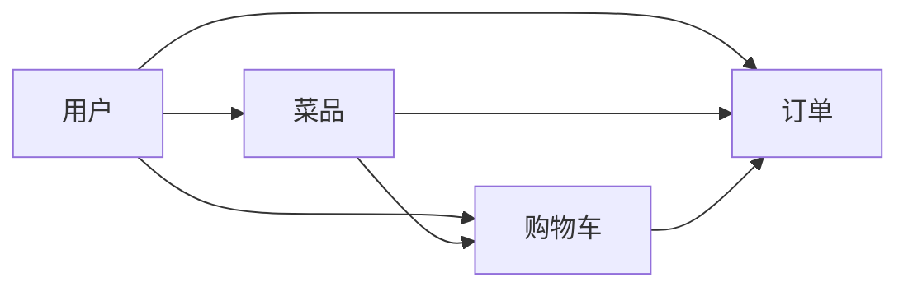

# 基于ssm的在线点餐系统

作者：禅与计算机程序设计艺术

## 1. 背景介绍

在互联网时代,随着人们生活节奏的加快和移动设备的普及,线上点餐已成为餐饮行业的重要趋势。传统的点餐模式效率低下,顾客需要排队等候,餐厅也难以高效管理订单和库存。因此,开发一个功能完善、易于使用的在线点餐系统势在必行。

本文将详细介绍基于Spring、Spring MVC和MyBatis(SSM)框架的在线点餐系统的设计与实现。该系统采用当前流行的Java Web技术栈,是餐饮信息化的优秀解决方案。

### 1.1 在线点餐的优势

在线点餐相比传统点餐模式有诸多优势:

1. 便捷高效:顾客可以随时随地浏览菜单、下单,无需排队等候,节省时间。  
2. 信息化管理:餐厅可通过系统后台管理菜品、订单和库存,提高运营效率。
3. 数据分析:系统可收集和分析销售数据,为经营决策提供数据支持。
4. 提升体验:个性化推荐、在线支付等功能可提升用户体验,增加顾客粘性。

### 1.2 SSM框架简介

SSM是当前主流的Java Web开发框架,包括:

- Spring:提供IOC和AOP等核心功能,是整个系统的基础。
- Spring MVC:基于Spring的Web框架,用于开发系统的表现层。  
- MyBatis:优秀的持久层框架,用于操作关系型数据库。

SSM框架具有轻量级、低耦合、易测试等优点,广泛应用于各类Web项目。

## 2. 核心概念与联系

在线点餐系统涉及的核心概念包括:

- 用户:分为管理员、商家和顾客三种角色,拥有不同的权限和功能。
- 菜品:由商家创建和管理,包含名称、价格、图片、分类等信息。
- 订单:顾客选择菜品后生成,包含用户信息、菜品详情、金额、状态等。
- 购物车:顾客在下单前可将菜品添加到购物车,并进行增删改操作。

这些概念之间的关系如下:



## 3. 核心算法原理具体操作步骤

在线点餐系统的核心算法主要体现在以下几个方面:

### 3.1 菜品推荐算法

根据用户的历史订单、浏览记录等数据,利用协同过滤等算法为其推荐可能感兴趣的菜品。

1. 收集用户行为数据,如订单、浏览记录、评分等。
2. 对数据进行清洗和预处理,去除噪声数据。
3. 构建用户-菜品矩阵,用于计算用户或菜品之间的相似度。
4. 利用UserCF或ItemCF算法计算相似度,生成推荐结果。
5. 对推荐结果进行排序和过滤,选取Top-N推荐给用户。

### 3.2 订单调度算法

在高并发场景下,系统需要合理调度订单到不同的商家和骑手,提高配送效率。可使用贪心、匈牙利算法等。

1. 根据订单的配送地址、商家位置等因素,计算订单与商家、骑手的匹配度。
2. 使用贪心策略,优先将匹配度高的订单分配给商家和骑手。
3. 对于复杂场景,可使用匈牙利算法等进行全局优化分配。
4. 分配结果需要兼顾订单的紧急程度、骑手的负载均衡等因素。

### 3.3 库存管理算法

商家需要合理管理菜品库存,避免售罄或积压。可使用经济订货量(EOQ)、安全库存等模型。

1. 根据菜品的历史销量、变动情况,预测未来一段时间内的需求量。
2. 结合菜品的订货成本、持有成本,使用EOQ模型计算最优订货量和订货点。
3. 在EOQ的基础上,结合预测误差、提前期等因素,计算安全库存量。
4. 实时监控库存水平,当低于订货点时触发补货,高于最大库存量时暂停订货。

## 4. 数学模型和公式详细讲解举例说明

### 4.1 协同过滤推荐算法

协同过滤(Collaborative Filtering)是常用的推荐算法,分为基于用户(User-based CF)和基于物品(Item-based CF)两种。以UserCF为例,核心思想是找到与目标用户兴趣相似的其他用户,然后将他们喜欢的物品推荐给目标用户。

#### 4.1.1 UserCF算法原理

1. 计算用户之间的相似度。常用的相似度度量有欧氏距离、皮尔逊相关系数等。以皮尔逊相关系数为例,公式为:

$$
sim(u,v) = \frac{\sum_{i \in I_{uv}}(r_{ui} - \bar{r}_u)(r_{vi} - \bar{r}_v)}{\sqrt{\sum_{i \in I_{uv}}(r_{ui} - \bar{r}_u)^2} \sqrt{\sum_{i \in I_{uv}}(r_{vi} - \bar{r}_v)^2}}
$$

其中$I_{uv}$是用户u和v共同评分的物品集合,$r_{ui}$是用户u对物品i的评分,$\bar{r}_u$是u的平均评分。

2. 找到与目标用户相似度最高的K个用户,称为"最近邻"。
3. 计算最近邻用户对各个物品的评分加权平均值,作为推荐得分:

$$
p_{ui} = \bar{r}_u + \frac{\sum_{v \in N_i(u)} sim(u,v) (r_{vi} - \bar{r}_v)}{\sum_{v \in N_i(u)} sim(u,v)}
$$

其中$N_i(u)$是对物品i有评分的最近邻用户集合。

4. 将得分最高的N个物品推荐给目标用户。

#### 4.1.2 算法实例

假设有用户评分数据如下:

| 用户\物品 | A    | B    | C    | D    |
| --------- | ---- | ---- | ---- | ---- |
| 张三      | 3    | 4    | 3    | 5    |
| 李四      | 4    | 3    | 4    | ?    |
| 王五      | 3    | 5    | 4    | ?    |

现在要给李四推荐D。

1. 计算李四与其他用户的相似度:

$$
sim(李四,张三) = 0.5 \\
sim(李四,王五) = 1.0
$$

2. 选取相似度最高的2个用户张三和王五。
3. 计算推荐得分:

$$
p_{李四,D} = \bar{r}_{李四} + \frac{sim(李四,张三) (r_{张三,D} - \bar{r}_{张三}) + sim(李四,王五) (r_{王五,D} - \bar{r}_{王五})}{sim(李四,张三) + sim(李四,王五)} \\
= 3.67 + \frac{0.5 \times (5 - 3.75)}{0.5 + 1.0} \\
= 4.29
$$

4. 可以给李四推荐物品D。

### 4.2 经济订货量(EOQ)模型

EOQ模型是库存管理中的经典模型,用于确定每次订货的最优数量,以使总库存成本最小。

#### 4.2.1 模型假设

1. 需求速率固定且已知。
2. 不允许缺货。
3. 补货无限制,到货即可使用。
4. 订货成本和持有成本固定且已知。

#### 4.2.2 模型公式

令$Q$为每次订货量,$D$为年需求量,$S$为单次订货成本,$H$为单位商品的年持有成本,则总库存成本$TC$为:

$$
TC = \frac{D}{Q}S + \frac{Q}{2}H
$$

对$TC$求$Q$的导数,并令其等于0,得到最优订货量$Q^*$:

$$
Q^* = \sqrt{\frac{2DS}{H}}
$$

订货周期$T$和再订货点$R$分别为:

$$
T = \frac{Q^*}{D} \\
R = dL
$$

其中$d$为日需求量,$L$为提前期。

#### 4.2.3 算法实例

某餐厅一年需要4000箱可乐,每箱价格10元,年持有成本率为20%,每次订货成本100元。

1. 计算最优订货量:

$$
Q^* = \sqrt{\frac{2 \times 4000 \times 100}{10 \times 20\%}} = 200 (箱)
$$

2. 计算订货周期:

$$
T = \frac{200}{4000} = 0.05 (年) \approx 18 (天)
$$

3. 假设提前期为3天,日需求量为11箱,则再订货点为:

$$
R = 11 \times 3 = 33 (箱)
$$

综上,该餐厅应每18天订货200箱可乐,当库存降至33箱时开始订货。

## 5. 项目实践：代码实例和详细解释说明

下面以登录功能为例,展示SSM框架的代码实现。

### 5.1 数据库设计

用户表`t_user`:

```sql
CREATE TABLE `t_user` (
  `id` int(11) NOT NULL AUTO_INCREMENT,
  `username` varchar(50) NOT NULL,
  `password` varchar(50) NOT NULL,
  `role` varchar(20) NOT NULL,
  PRIMARY KEY (`id`)
) ENGINE=InnoDB DEFAULT CHARSET=utf8;
```

### 5.2 实体类

```java
public class User {
    private Integer id;
    private String username;
    private String password;
    private String role;
    // 省略getter/setter
}
```

### 5.3 持久层

`UserMapper.java`:

```java
public interface UserMapper {
    User selectByUsername(String username);
}
```

`UserMapper.xml`:

```xml
<select id="selectByUsername" resultType="com.example.entity.User">
    SELECT * FROM t_user WHERE username = #{username}
</select>
```

### 5.4 业务层

`UserService.java`:

```java
public interface UserService {
    User login(String username, String password);
}
```

`UserServiceImpl.java`:

```java
@Service
public class UserServiceImpl implements UserService {
    @Autowired
    private UserMapper userMapper;
    
    @Override
    public User login(String username, String password) {
        User user = userMapper.selectByUsername(username);
        if (user != null && user.getPassword().equals(password)) {
            return user;
        }
        return null;
    }
}
```

### 5.5 表现层

`UserController.java`:

```java
@Controller
@RequestMapping("/user")
public class UserController {
    @Autowired
    private UserService userService;
    
    @PostMapping("/login")
    public String login(String username, String password, HttpSession session) {
        User user = userService.login(username, password);
        if (user != null) {
            session.setAttribute("user", user);
            return "redirect:/index";
        } else {
            return "login";
        }
    }
}
```

### 5.6 代码解释

1. 在`UserMapper.xml`中定义了根据用户名查询用户的SQL语句。
2. `UserMapper.java`定义了对应的Java接口方法。
3. `UserServiceImpl`中调用`UserMapper`的方法,并进行密码校验,实现登录逻辑。
4. `UserController`处理登录请求,调用`UserService`进行登录验证,将登录用户信息存入Session。
5. 登录成功则跳转到首页,失败则返回登录页面。

## 6. 实际应用场景

在线点餐系统可应用于多种场景:

1. 餐厅自营的外卖平台,如肯德基、麦当劳的官方App。
2. 第三方外卖平台,如美团外卖、饿了么等,接入众多餐厅。
3. 食堂、饭店的微信点餐小程序。
4. 智能食堂系统,如高校、企业食堂的刷卡或人脸识别点餐。

不同场景下,系统需要根据具体需求进行个性化定制,如:

- 支持多店铺管理,为连锁餐厅提供统一的后台管理。
- 与智能硬件集成,实现自助点餐、取餐。
- 对接第三方支付平台,支持多种支付方式。
- 引入人工智能技术,提供智能客服、菜品识别等功能。

总之,在线点餐系统需要与实际