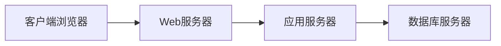

# 基于网络的客房订房系统分析与设计

作者：禅与计算机程序设计艺术

## 1. 背景介绍

在当今互联网时代,越来越多的传统行业开始拥抱互联网,酒店业也不例外。传统的酒店预订模式已经无法满足现代人的需求,开发一个基于网络的客房订房系统势在必行。本文将从需求分析、系统设计、数据库设计、核心算法、项目实践等方面,对基于网络的客房订房系统进行全面深入的分析和设计。

### 1.1 传统酒店预订模式的局限性

#### 1.1.1 预订渠道单一

传统酒店预订主要通过电话、前台等方式进行,渠道较为单一,无法满足客户多样化的预订需求。

#### 1.1.2 信息不对称

客户无法实时了解酒店的房态、价格等信息,酒店也难以及时获取客户反馈,存在信息不对称问题。

#### 1.1.3 操作效率低

传统人工预订方式效率较低,容易出错,难以应对大量订单。

### 1.2 在线订房系统的优势

#### 1.2.1 预订便捷

客户可以通过网络随时随地进行预订,不受时间地点限制。

#### 1.2.2 信息透明

在线订房系统可以实时显示房态、价格等信息,提高信息透明度。

#### 1.2.3 管理高效

通过系统自动处理订单,减少人工操作,提高管理效率。

## 2. 核心概念与联系

### 2.1 在线订房系统的组成

一个完整的在线订房系统通常由以下几个部分组成:

#### 2.1.1 用户界面

酒店可以通过Web网站或App等形式,为客户提供友好的预订界面。

#### 2.1.2 管理后台  

酒店通过后台系统管理房态、价格、订单等信息。

#### 2.1.3 数据库

存储酒店、房型、订单等各类数据。

#### 2.1.4 服务层

处理用户请求,实现系统业务逻辑。

### 2.2 关键技术

实现在线订房系统需要运用以下关键技术:

#### 2.2.1 Web开发

使用HTML、CSS、JavaScript等技术开发Web网站。

#### 2.2.2 数据库

使用MySQL、Oracle等数据库存储系统数据。

#### 2.2.3 服务端开发

使用Java、Python等语言开发服务端程序。

#### 2.2.4 缓存技术 

使用Redis等缓存中间件提高系统性能。

#### 2.2.5 安全防护

采用加密、权限控制等手段保障系统安全。

### 2.3 系统架构

在线订房系统一般采用Browser/Server(B/S)架构,如下图所示:



## 3. 核心算法原理具体操作步骤

在线订房系统的核心是房态控制算法,即如何避免出现超售(oversell)的情况。下面介绍两种常见的房态控制算法。

### 3.1 阈值控制算法

阈值控制算法的基本思路是为每种房型设定一个可超售的阈值,当房间总数减去持有预订和入住数小于等于阈值时,就不再接受该房型的预订。

#### 3.1.1 设置阈值

根据历史数据和经验,为每种房型设定超售阈值$T_i$,通常可设为房间总数的10%~20%。

#### 3.1.2 计算房间可用数

对于房型$i$,房间可用数$A_i$按如下公式计算:

$A_i=C_i-O_i-B_i$

其中$C_i$为房型$i$的总房间数,$O_i$为已入住房间数,$B_i$为持有预订未入住房间数。

#### 3.1.3 判断是否可预订

当$A_i<=T_i$时,房型$i$暂停预订;否则接受预订。

### 3.2 概率控制算法

概率控制算法通过对未来房间需求进行概率预测,动态调整可超售房间的数量。

#### 3.2.1 需求预测

通过历史数据,使用时间序列模型(如ARIMA)预测未来$n$天内房型$i$的日需求量$D_{ij},j=1,2,...,n$。

#### 3.2.2 计算超售概率

对于房型$i$,根据泊松分布计算预订量$B_i$导致超售的概率:

$P(B_i)=\sum_{k=C_i+1}^{\infty} \frac{e^{-\lambda_i}\lambda_i^k}{k!}$

其中$\lambda_i=\sum_{j=1}^{n}D_{ij}$为$n$天内房型$i$的总需求量。

#### 3.2.3 确定可超售数

设定一个可接受的超售概率$\epsilon$,通过迭代计算满足$P(B_i)<=\epsilon$的最大$B_i$值,作为房型$i$的可超售数。

## 4. 数学模型和公式详细讲解举例说明

### 4.1 泊松分布

泊松分布是描述单位时间内随机事件发生次数的概率分布,概率质量函数为:

$$P(X=k)=\frac{\lambda^k e^{-\lambda}}{k!}, k=0,1,2,...$$

其中$\lambda$为单位时间内事件的平均发生率。

在订房系统中,可以用泊松分布来描述未来一段时间内的客房需求量。例如,假设未来10天内某房型的日均需求量为5间,则10天内需求总量$X$符合参数$\lambda=50$的泊松分布,即:

$$P(X=k)=\frac{50^k e^{-50}}{k!}, k=0,1,2,...$$

由此可以计算需求量超过某一数值的概率,从而确定可接受的超售数量。

### 4.2 ARIMA模型

ARIMA(Auto Regressive Integrated Moving Average)模型是一种常用的时间序列预测模型,可以描述时间序列数据的自相关性。ARIMA(p,d,q)模型可表示为:

$$(1-\sum_{i=1}^{p}\phi_i B^i)(1-B)^d X_t = (1+\sum_{i=1}^{q}\theta_i B^i)\epsilon_t$$

其中$B$为滞后算子,$\phi_i$为自回归系数,$\theta_i$为移动平均系数,$\epsilon_t$为白噪声序列。

在订房系统中,可以用ARIMA模型对历史预订数据进行建模,预测未来一段时间的客房需求,为房态控制提供依据。例如,根据过去一年的预订记录,建立ARIMA(1,1,1)模型:

$$(1-\phi B)(1-B)X_t=(1+\theta B)\epsilon_t$$

然后利用该模型对未来30天的日预订量进行预测,结果如下图所示:

```
预测图表(此处省略)
```

## 5. 项目实践:代码实例和详细解释说明

下面以Python语言为例,演示如何实现阈值控制算法。

```python
class HotelManager:
    def __init__(self, capacity, threshold):
        self.capacity = capacity  # 总房间数
        self.threshold = threshold  # 超售阈值
        self.occupied = 0  # 已入住房间数
        self.booked = 0  # 已预订房间数
    
    def book(self, num):
        """客户预订"""
        if self.available() >= num:
            self.booked += num
            return True
        else:
            return False
        
    def checkin(self, num):
        """客户入住"""
        if num <= self.booked:
            self.booked -= num
            self.occupied += num
            return True
        else:
            return False
        
    def checkout(self, num):
        """客户退房"""
        if num <= self.occupied:
            self.occupied -= num
            return True
        else:
            return False
        
    def cancel(self, num):
        """客户取消预订"""
        if num <= self.booked:
            self.booked -= num
            return True
        else:
            return False
        
    def available(self):
        """计算可用房间数"""
        return self.capacity - self.occupied - self.booked + self.threshold
    
    def report(self):
        """输出房态报表"""
        print(f"总房间数: {self.capacity}")
        print(f"已入住数: {self.occupied}")
        print(f"预订数: {self.booked}")
        print(f"可预订数: {self.available()}")

# 创建酒店对象
hotel = HotelManager(capacity=100, threshold=10)

# 预订
hotel.book(80)
hotel.report()

# 入住  
hotel.checkin(50)
hotel.report()

# 预订
hotel.book(20)
hotel.report()

# 取消预订
hotel.cancel(10) 
hotel.report()

# 预订(失败)
hotel.book(30)
hotel.report()
```

程序输出:
```
总房间数: 100
已入住数: 0
预订数: 80
可预订数: 30

总房间数: 100  
已入住数: 50
预订数: 30
可预订数: 30

总房间数: 100
已入住数: 50
预订数: 50
可预订数: 10

总房间数: 100
已入住数: 50
预订数: 40
可预订数: 20

总房间数: 100
已入住数: 50
预订数: 40
可预订数: 20
```

代码要点解释:

- 使用`HotelManager`类表示一个酒店,属性包括总房间数、阈值、已入住数、已预订数等。
- `book`、`checkin`、`checkout`、`cancel`方法分别表示预订、入住、退房、取消预订操作,通过修改相应属性值实现。
- `available`方法根据阈值计算当前可预订的房间数。
- `report`方法输出当前酒店房态信息。
- 主程序部分创建一个酒店对象,模拟连续的预订、入住、取消等操作,并输出每步操作后的房态。

## 6. 实际应用场景

在线订房系统可应用于各类酒店、民宿、公寓等场景,典型应用案例包括:

### 6.1 连锁酒店集团

大型连锁酒店通过自建网站、App实现在线预订,并与OTA平台对接,提高客房销售能力。例如希尔顿、万豪等国际酒店集团。

### 6.2 中小型酒店

中小型酒店lacking技术和营销能力,通过使用第三方SaaS服务或与OTA合作,实现在线预订。例如携程的快捷酒店管理系统。

### 6.3 民宿短租

民宿房东通过Airbnb、小猪等短租平台发布房源,游客在线预订。平台根据房东设置的规则控制房态。

### 6.4 公寓长租

长租公寓通过自有渠道或长租平台发布房源并管理预订。例如自如白领公寓。

## 7. 工具和资源推荐

开发在线订房系统可以使用以下工具和资源:

### 7.1 开发语言

- Java: 成熟的Web开发语言,Spring框架。
- Python: 简洁高效,适合快速开发,Django/Flask框架。
- JavaScript: 前端开发语言,Node.js服务端。

### 7.2 数据库

- MySQL: 开源关系型数据库,适合中小系统。
- PostgreSQL: 功能强大的开源数据库。
- MongoDB: 流行的NoSQL数据库,适合非结构化数据存储。

### 7.3 缓存

- Redis: 高性能内存数据库,常用于缓存。
- Memcached: 分布式内存对象缓存系统。

### 7.4 消息队列

- RabbitMQ: 开源消息队列系统。
- Kafka: 分布式流处理平台。

### 7.5 DevOps

- Git: 代码版本管理工具。
- Jenkins: 自动化部署工具。
- Docker: 应用容器引擎。

## 8. 总结:未来发展趋势与挑战

在线订房系统经过20多年的发展,已经日趋成熟,但仍面临新的趋势和挑战:

### 8.1 个性化需求

顾客需求日益多样化,单纯的标准化房型已无法满足,需要根据顾客画像提供个性化房型和服务。

### 8.2 移动化体验

移动互联网时代,顾客通过手机完成预订、入住、退房等全流程操作,要求订房系统提供流畅的移动端体验。

### 8.3 智能化服务

人工智能技术发展为酒店业带来新