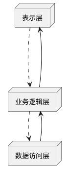

# 怎样培养积极乐观，责任心强，工作认真细致和良好的团队沟通与协作能力

## 1.背景介绍

### 1.1 为什么这些软实力很重要

在当今快节奏的工作环境中，技术专业知识固然重要,但同样重要的是一些软实力,比如积极乐观的心态、强烈的责任心、工作的细致认真以及良好的团队协作能力。这些软实力不仅能够帮助个人更好地完成工作任务,也能促进团队的高效运转,进而推动整个组织的成功。

#### 1.1.1 积极乐观的重要性

积极乐观的心态能让个人在面对挑战和困难时保持积极向上的态度,相信自己有能力克服困难。这种心态不仅能增强个人的信心和动力,也能感染和鼓舞周围的人,营造一个积极向上的工作氛围。

#### 1.1.2 责任心的重要性  

强烈的责任心意味着个人对自己的工作和承诺高度负责,会全力以赴完成任务,即使遇到困难也不会轻易放弃。这种责任心不仅体现在对工作的态度上,也体现在对团队和组织的忠诚度上。

#### 1.1.3 工作细致认真的重要性

工作细致认真意味着个人在工作中会非常谨慎、仔细,对细节高度重视。这不仅能确保工作质量,也能避免由于疏忽而导致的错误和失误,从而提高工作效率和生产力。

#### 1.1.4 良好团队协作能力的重要性

在现代组织中,很少有任务是由个人单打独斗完成的,大多数工作都需要团队合作。良好的团队协作能力能够促进成员之间的沟通和理解,有利于发挥团队的整体力量,完成更加出色的工作。

### 1.2 当前状况和挑战

尽管这些软实力的重要性不言而喻,但现实情况是,很多人在这些方面都存在不足。比如,一些人容易对工作产生消极情绪,责任心不强;一些人对工作马虎粗心,工作效率低下;还有一些人沟通能力差,难以与他人合作共事。

培养这些软实力面临的主要挑战包括:

- 个人习惯和性格的影响
- 缺乏系统的培训和指导
- 工作压力和环境的影响
- 缺乏自我反思和改进的意识

## 2.核心概念与联系

为了有效培养上述软实力,我们需要理解一些核心概念及其之间的联系。

### 2.1 正念(Mindfulness)

正念是一种将注意力集中在当下的体验上的状态,以开放和接纳的态度对待自己的想法和感受,而不加评判。通过正念练习,我们能够提高自我意识,管理情绪,从而培养积极乐观的心态。

### 2.2 自我效能感(Self-efficacy)

自我效能感是指个人对自己能够完成某项任务的信念或期望。强烈的自我效能感能增强个人的动机和毅力,从而培养责任心。

### 2.3 注意力管理(Attention Management)

注意力管理是指有效分配和控制注意力资源的能力。通过注意力管理训练,我们能够提高工作专注力,减少分心和干扰,从而提高工作效率和细致程度。

### 2.4 情商(Emotional Intelligence)

情商是指个人识别、理解、管理和运用自己和他人情绪的能力。高情商有助于改善人际关系,增强沟通和协作能力。

### 2.5 核心概念之间的关系

这些核心概念相互关联、相互影响。比如,正念有助于提高情商和注意力管理能力;自我效能感的提高有助于培养责任心;情商的提升有助于改善沟通和团队协作。通过系统培养,这些概念会形成正反馈,共同促进软实力的提高。

## 3.核心算法原理具体操作步骤

培养上述软实力并非一蹴而就,需要持之以恒的努力。以下是一些核心的训练方法和具体操作步骤:

### 3.1 正念训练

正念训练能让我们脱离思维的牵绊,完全投入当下,从而提高专注力,管理情绪,培养积极乐观的心态。常见的正念练习包括:

1. **呼吸观念**:将注意力集中在呼吸上,觉知每一次吸气和呼气的身体感受。
2. **身体扫描**:依次将注意力放在身体的不同部位,觉知每个部位的感受。
3. **正念行走**:在行走时将注意力集中在行走的动作和感受上。

这些练习可以每天进行10-20分钟。

### 3.2 自我效能感培养

提高自我效能感的关键是经历成功体验,并从中获得信心。具体步骤包括:

1. **设置可实现的目标**:将大目标分解为若干小目标,先完成容易的,积累成功经验。
2. **寻求模仿对象**:观察和学习他人如何完成类似任务,增强自己的信心。
3. **积极自我暗示**:反复告诉自己"我一定能行"等积极的自我暗示语。
4. **管理生理反应**:学会控制焦虑等消极生理反应,保持冷静从容。

### 3.3 注意力管理训练  

改善注意力管理能力的方法包括:

1. **单一任务专注**:每次只专注于一项任务,避免同时处理多个任务。
2. **计划和优先排序**:合理安排工作计划,优先处理重要紧急的任务。
3. **控制干扰**:远离干扰源,如社交媒体、噪音等,创造专注的环境。
4. **休息和恢复**:适当休息能让大脑得到恢复,提高专注力。

### 3.4 提升情商

提升情商的方法有:

1. **自我意识**:通过自我反省、他人反馈等方式提高对自己情绪的认知。
2. **同理心**:设身处地为他人着想,理解他人的感受和需求。
3. **积极表达**:用恰当的方式表达自己的想法和感受。
4. **情绪管理**:学会识别和调节消极情绪,保持情绪稳定。

## 4.数学模型和公式详细讲解举例说明

在培养软实力的过程中,我们可以借助一些数学模型和公式来量化和优化训练效果。

### 4.1 专注力模型

我们可以将个人的专注力建模为随时间变化的函数:

$$
F(t) = F_0 e^{-\lambda t}
$$

其中:
- $F(t)$是时间$t$时的专注力水平
- $F_0$是初始专注力水平
- $\lambda$是专注力衰减率,取决于个人状态和环境因素

通过控制$\lambda$,我们可以延长专注力持续时间。比如通过正念训练、控制干扰等措施来降低$\lambda$。

### 4.2 目标达成模型

我们可以用逻辑斯特函数建模目标达成的概率:

$$
P(x) = \frac{1}{1 + e^{-k(x-x_0)}}
$$

其中:
- $P(x)$是完成目标的概率
- $x$是投入的努力程度
- $x_0$是达成目标所需的临界努力值
- $k$是概率增长率,与个人的自我效能感相关

通过提高自我效能感(增大$k$)和付出恰当的努力($x > x_0$),我们就能提高目标达成的概率。

### 4.3 情商量化模型

我们可以将情商分解为几个维度,并对每个维度打分,然后加权求和得到总的情商分数:

$$
EQ = \sum_{i=1}^{n} w_i s_i
$$

其中:
- $EQ$是总的情商分数
- $n$是情商维度的数量
- $s_i$是第$i$个维度的分数
- $w_i$是第$i$个维度的权重

通过定期评估各维度并采取相应措施,我们可以持续提升情商水平。

以上仅是一些示例,在实际应用中我们可以根据需要构建更加复杂和精确的数学模型。

## 5.项目实践:代码实例和详细解释说明

为了更好地理解和应用上述概念和方法,我们可以通过一个实际项目来实践。这里我们将构建一个"专注力训练助手"应用程序。

### 5.1 需求分析

该应用程序需要具备以下功能:

1. 提供正念呼吸练习
2. 设置专注时间和休息时间
3. 屏蔽系统通知和干扰
4. 记录专注时间和任务完成情况
5. 根据记录生成专注力分析报告

### 5.2 系统架构

我们采用经典的三层架构,包括:

1. **表示层**:基于Web技术的用户界面
2. **业务逻辑层**:实现核心功能逻辑
3. **数据访问层**:与数据库交互




### 5.3 核心代码

以下是一些核心代码片段:

#### 5.3.1 正念呼吸练习

```javascript
// 呼吸动画效果
const breathAnimation = () => {
  const breath = document.querySelector('.breath');
  breath.classList.add('animate');
  setTimeout(() => breath.classList.remove('animate'), 6000);
}

// 呼吸提示
const breathInstruction = () => {
  const instruction = document.querySelector('.instruction');
  instruction.innerText = '吸气';
  setTimeout(() => instruction.innerText = '呼气', 3000);
}

// 开始正念呼吸
const startBreathing = () => {
  breathAnimation();
  breathInstruction();
  setTimeout(startBreathing, 6000);
}

startBreathing();
```

#### 5.3.2 设置专注时间

```javascript
// 设置专注时间
const setFocusTime = (minutes) => {
  const focusTimeInMS = minutes * 60 * 1000;
  setTimeout(showBreakModal, focusTimeInMS);
}

// 显示休息提示
const showBreakModal = () => {
  const breakModal = document.querySelector('#break-modal');
  breakModal.style.display = 'block';
}
```

#### 5.3.3 记录和分析

```python
import sqlite3
import pandas as pd

# 连接数据库
conn = sqlite3.connect('focus.db')
c = conn.cursor()

# 创建表
c.execute('''CREATE TABLE IF NOT EXISTS focus_sessions
             (start_time TEXT, end_time TEXT, duration INT, task TEXT)''')

# 插入新记录             
def log_session(start, end, duration, task):
    c.execute("INSERT INTO focus_sessions VALUES (?, ?, ?, ?)", (start, end, duration, task))
    conn.commit()
    
# 分析数据
def analyze():
    df = pd.read_sql_query("SELECT * FROM focus_sessions", conn)
    total_duration = df['duration'].sum()
    print(f"Total focus duration: {total_duration // 3600} hours")
```

这只是一个简单的示例,在实际开发中我们需要添加更多功能和优化,如异常处理、用户交互等。

## 6.实际应用场景

培养软实力对于各行各业都是非常重要的。以下是一些典型的应用场景:

### 6.1 软件开发

软件开发工作需要开发人员具备很强的专注力和责任心,同时也需要团队成员之间紧密协作。培养这些软实力有助于提高代码质量、加快开发进度、减少Bug等。

### 6.2 项目管理

项目经理需要具备优秀的沟通协调能力,能够整合各方资源、协调团队成员,推动项目顺利进行。同时也需要乐观积极的心态和强烈的责任心来应对各种挑战。

### 6.3 客户服务

客户服务人员需要有良好的沟通能力和同理心,能够耐心倾听客户需求、理解客户感受,并