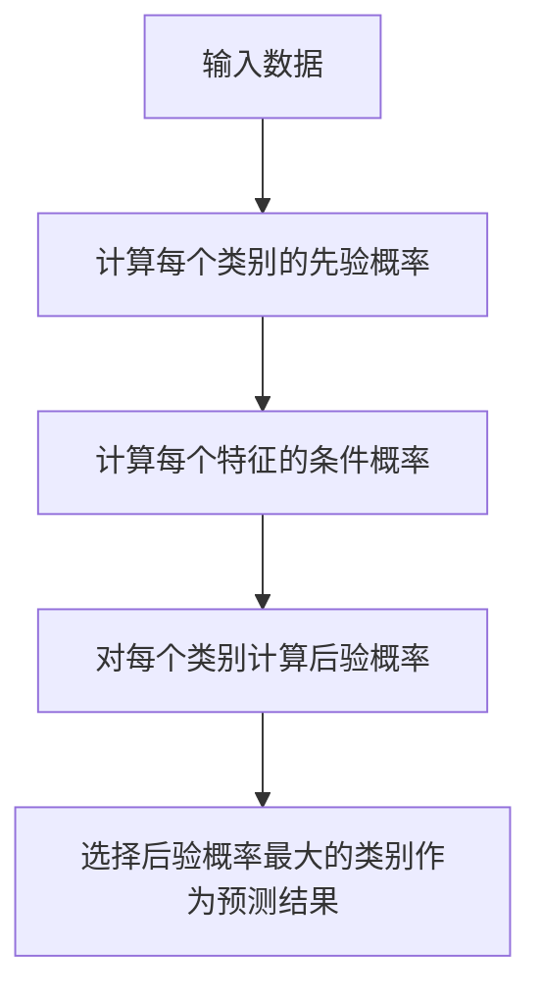

# 《机器学习算法：朴素贝叶斯》

## 1.背景介绍

### 1.1 机器学习概述

机器学习是人工智能的一个重要分支,旨在让计算机系统从数据中自动学习,获取知识或技能,并对未知数据做出智能决策或预测。随着大数据时代的到来,海量数据的出现为机器学习提供了广阔的应用前景。机器学习算法能够从大规模数据中发现隐藏的模式和规律,为各个领域提供有价值的见解和决策支持。

### 1.2 朴素贝叶斯分类器的重要性

在众多机器学习算法中,朴素贝叶斯分类器因其简单、高效且易于实现的特点而备受青睐。尽管基于朴素独立性假设,但在许多实际应用中,它仍能取得相当不错的分类性能。朴素贝叶斯分类器广泛应用于文本分类、垃圾邮件过滤、个人化推荐等领域,是机器学习入门者的首选算法之一。

## 2.核心概念与联系  

### 2.1 贝叶斯定理

朴素贝叶斯分类器的核心是贝叶斯定理,用于计算后验概率。贝叶斯定理公式如下:

$$P(Y|X)=\frac{P(X|Y)P(Y)}{P(X)}$$

其中:
- $P(Y|X)$ 为后验概率,即已知数据 $X$ 发生的情况下,事件 $Y$ 发生的概率
- $P(X|Y)$ 为条件概率,即已知事件 $Y$ 发生的情况下,数据 $X$ 出现的概率
- $P(Y)$ 为先验概率,即事件 $Y$ 发生的概率
- $P(X)$ 为证据概率,是对给定数据发生的概率

在分类问题中,我们希望找到能最大化后验概率 $P(Y|X)$ 的类别 $Y$。

### 2.2 朴素独立性假设

朴素贝叶斯分类器的"朴素"二字,源于它对于特征之间的条件独立性作出了"朴素"的假设。也就是说,在给定类别的情况下,所有特征两两之间都是条件独立的。数学表达式如下:

$$P(X|Y)=\prod_{i=1}^{n}P(X_i|Y)$$

其中 $X=(X_1, X_2, ..., X_n)$ 表示 $n$ 个特征。

尽管这个假设在实际情况中通常是不成立的,但朴素贝叶斯分类器仍能在很多场景下表现出良好的分类性能。这得益于它避免了维数灾难的出现,从而简化了计算。

### 2.3 类别先验概率与条件概率

在朴素贝叶斯分类器中,我们需要估计类别的先验概率 $P(Y)$ 以及每个特征在给定类别下的条件概率 $P(X_i|Y)$。常见的估计方法包括:

- 最大似然估计
- 贝叶斯估计(拉普拉斯平滑)
- 高斯朴素贝叶斯(对于连续值特征)

合理估计这些概率对于分类器的性能至关重要。

## 3.核心算法原理具体操作步骤

朴素贝叶斯分类器的工作原理可以概括为以下几个步骤:



1. **输入数据**:获取带有类别标签的训练数据集,用于估计先验概率和条件概率。

2. **计算类别先验概率**:对于每个类别 $Y$,计算其先验概率 $P(Y)$。通常使用最大似然估计或贝叶斯估计。

3. **计算特征条件概率**:对于每个特征 $X_i$ 和每个类别 $Y$,计算条件概率 $P(X_i|Y)$。对于离散值特征,可直接计数;对于连续值特征,通常假设服从高斯分布。

4. **计算后验概率**:对于每个实例 $X$ 和每个类别 $Y$,根据贝叶斯定理和朴素独立性假设,计算后验概率 $P(Y|X)$。

5. **预测类别**:选择能使后验概率 $P(Y|X)$ 最大化的类别 $Y$ 作为预测结果。

以上步骤反映了朴素贝叶斯分类器的核心思想:利用贝叶斯定理和朴素独立性假设,从训练数据中学习概率模型,并对新实例进行分类预测。

## 4.数学模型和公式详细讲解举例说明

### 4.1 离散值特征的朴素贝叶斯

对于离散值特征,我们可以通过计数的方式直接估计条件概率。设有 $m$ 个类别 $\{c_1, c_2, ..., c_m\}$,第 $j$ 个特征 $x_j$ 有 $n_j$ 个可能取值 $\{a_{j1}, a_{j2}, ..., a_{jn_j}\}$,则条件概率可以估计为:

$$P(x_j=a_{jl}|Y=c_k)=\frac{计数(x_j=a_{jl}, Y=c_k)}{计数(Y=c_k)}$$

其中,分子是在类别 $c_k$ 的实例中,特征 $x_j$ 取值为 $a_{jl}$ 的实例数;分母是类别 $c_k$ 的实例总数。

为了避免概率为零的情况,通常采用拉普拉斯平滑(加一平滑):

$$P(x_j=a_{jl}|Y=c_k)=\frac{计数(x_j=a_{jl}, Y=c_k)+1}{计数(Y=c_k)+n_j}$$

**示例**:假设我们有一个天气数据集,其中包含 5 个离散值特征:outlook(阳光/阴天/多云)、temperature(热/冷/温和)、humidity(高/正常)、windy(是/否)以及目标类别play(是/否)。我们希望预测在给定天气条件下是否适合去打球。

已知训练数据集中,在 "outlook=阳光,temperature=热,humidity=高,windy=真" 的条件下,play=是的实例数为 2,play=否的实例数为 3。则条件概率估计为:

$$\begin{aligned}
P(outlook&=阳光,temperature=热,humidity=高,windy=真|play=是)\\
&=\frac{2+1}{计数(play=是)+5}\\
P(outlook&=阳光,temperature=热,humidity=高,windy=真|play=否)\\
&=\frac{3+1}{计数(play=否)+5}
\end{aligned}$$

通过这种方式,我们可以估计出所有特征取值组合的条件概率,并结合先验概率计算后验概率,最终得到分类结果。

### 4.2 连续值特征的朴素贝叶斯

对于连续值特征,朴素贝叶斯分类器通常假设其服从高斯分布(正态分布)。在给定类别 $Y=c_k$ 的条件下,第 $j$ 个特征 $x_j$ 的条件概率密度函数为:

$$P(x_j|Y=c_k)=\frac{1}{\sqrt{2\pi\sigma_{jk}^2}}e^{-\frac{(x_j-\mu_{jk})^2}{2\sigma_{jk}^2}}$$

其中,均值 $\mu_{jk}$ 和标准差 $\sigma_{jk}$ 可以从训练数据中估计得到。

**示例**:假设我们有一个鸢尾花数据集,其中包含 4 个连续值特征:萼片长度、萼片宽度、花瓣长度和花瓣宽度,以及目标类别种类(setosa、versicolor、virginica)。我们希望根据这些特征预测鸢尾花的种类。

已知在训练数据集中,对于种类 setosa,花瓣长度的均值为 1.462,标准差为 0.173。则在给定种类 setosa 的条件下,花瓣长度 $x$ 的条件概率密度函数为:

$$P(x|种类=setosa)=\frac{1}{\sqrt{2\pi\times0.173^2}}e^{-\frac{(x-1.462)^2}{2\times0.173^2}}$$

通过计算每个特征在不同类别下的概率密度,并结合先验概率,我们可以得到后验概率,从而进行分类预测。

## 4.项目实践:代码实例和详细解释说明

以下是使用 Python 和 scikit-learn 库实现朴素贝叶斯分类器的代码示例,并对关键步骤进行了详细解释。

```python
from sklearn.datasets import load_iris
from sklearn.model_selection import train_test_split
from sklearn.naive_bayes import GaussianNB
from sklearn.metrics import accuracy_score

# 加载鸢尾花数据集
iris = load_iris()
X = iris.data  # 特征数据
y = iris.target  # 目标类别

# 拆分训练集和测试集
X_train, X_test, y_train, y_test = train_test_split(X, y, test_size=0.2, random_state=42)

# 创建高斯朴素贝叶斯分类器对象
gnb = GaussianNB()

# 在训练集上训练分类器
gnb.fit(X_train, y_train)

# 对测试集进行预测
y_pred = gnb.predict(X_test)

# 计算准确率
accuracy = accuracy_score(y_test, y_pred)
print("准确率: {:.2f}%".format(accuracy * 100))
```

**步骤解释**:

1. 导入所需的库和数据集。在这个例子中,我们使用了 scikit-learn 提供的鸢尾花数据集。

2. 将数据集拆分为训练集和测试集,以评估模型的泛化能力。

3. 创建高斯朴素贝叶斯分类器对象 `GaussianNB()`。scikit-learn 库提供了多种朴素贝叶斯分类器的实现,`GaussianNB` 适用于连续值特征,假设特征服从高斯分布。

4. 在训练集上训练分类器,使用 `fit()` 方法。在这个过程中,分类器会估计每个类别的先验概率,以及每个特征在不同类别下的条件概率密度函数的参数(均值和标准差)。

5. 使用训练好的分类器对测试集进行预测,调用 `predict()` 方法。

6. 计算预测结果与真实标签之间的准确率,使用 `accuracy_score()` 函数。

在这个示例中,我们在鸢尾花数据集上训练和测试了高斯朴素贝叶斯分类器。由于鸢尾花数据集的特征都是连续值,因此使用 `GaussianNB` 是合适的选择。如果数据集包含离散值特征,可以使用 `MultinomialNB` 或 `BernoulliNB` 等其他朴素贝叶斯分类器实现。

## 5.实际应用场景

朴素贝叶斯分类器由于其简单性和高效性,在许多实际应用场景中发挥着重要作用。以下是一些典型的应用示例:

### 5.1 文本分类

文本分类是朴素贝叶斯分类器最常见的应用之一。在这个场景中,每个文档被表示为一个特征向量,其中每个特征对应于一个单词或短语的出现次数或权重。朴素贝叶斯分类器可以根据这些特征,将文档分类到预定义的类别中,如新闻类别、垃圾邮件与非垃圾邮件等。

### 5.2 垃圾邮件过滤

垃圾邮件过滤是文本分类的一个特殊应用。在这个场景中,朴素贝叶斯分类器被训练用于区分垃圾邮件和非垃圾邮件。通过分析邮件正文、主题和其他特征,分类器可以有效地识别垃圾邮件,从而提高用户的工作效率。

### 5.3 个人化推荐系统

在推荐系统中,朴素贝叶斯分类器可以用于预测用户对某个项目(如电影、音乐或产品)的喜好程度。通过分析用户的历史行为数据(如浏览记录、购买记录等)和项目的特征,分类器可以为每个