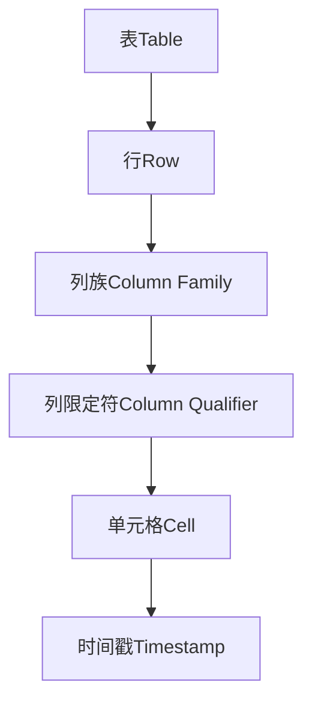
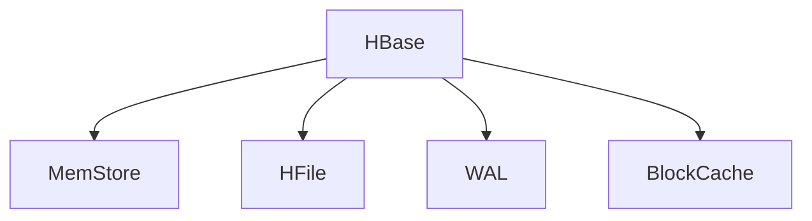
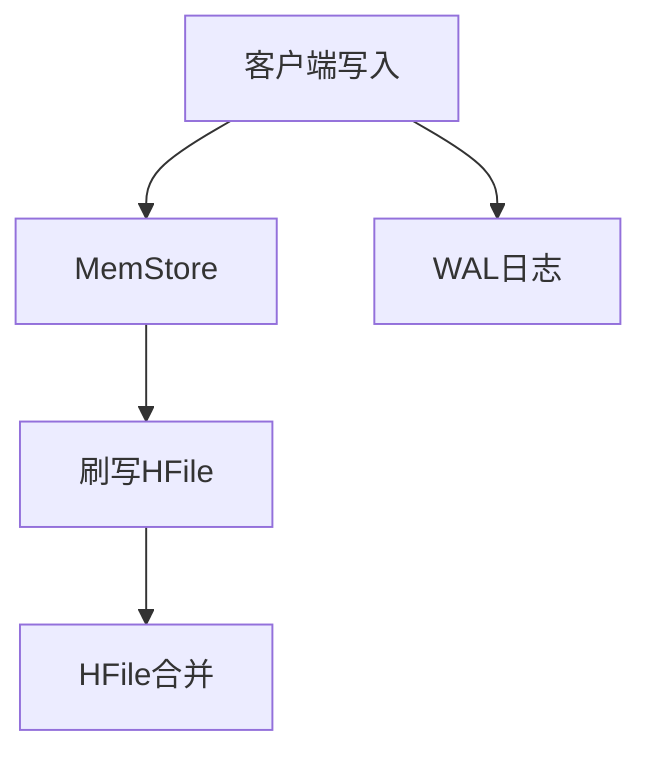
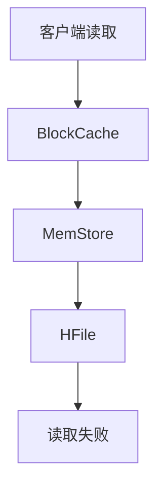
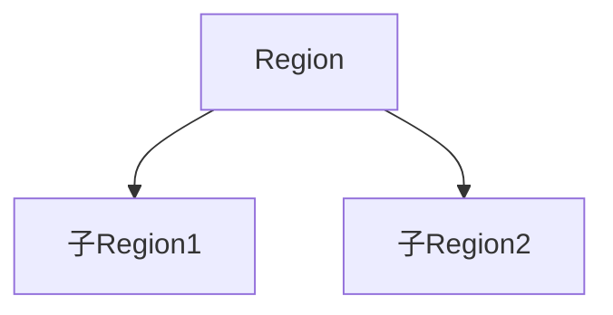
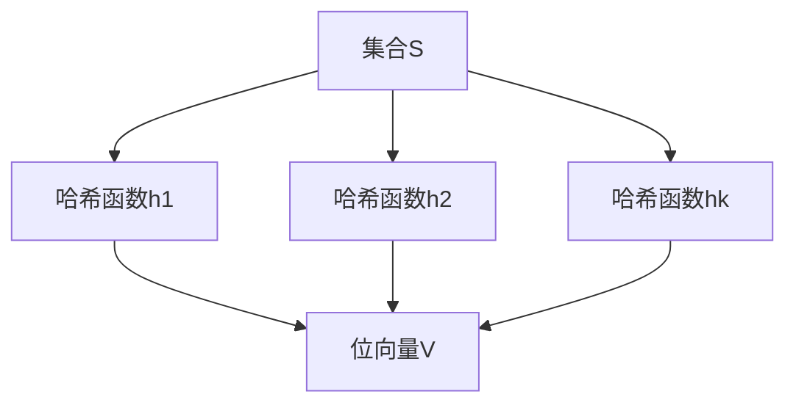

# AI系统HBase原理与代码实战案例讲解

## 1.背景介绍

### 1.1 大数据时代的到来

随着互联网、物联网、移动互联网等技术的快速发展,数据呈现出爆炸式增长。传统的关系型数据库已经无法满足大数据存储和处理的需求。因此,大数据技术应运而生,成为解决海量数据存储和处理的有力工具。

### 1.2 大数据技术概述

大数据技术主要包括:

- 存储: Hadoop分布式文件系统HDFS、NoSQL数据库(HBase、Cassandra等)
- 计算: MapReduce、Spark等分布式计算框架
- 资源管理和调度: YARN
- 数据集成: Sqoop、Flume、Kafka等

### 1.3 HBase简介

HBase是Apache开源的基于Hadoop分布式文件系统HDFS之上的面向列存储的分布式NoSQL数据库。它具有高可靠性、高性能、可伸缩、易扩展等特点,非常适合于存储结构化和半结构化的海量数据。

## 2.核心概念与联系

### 2.1 逻辑结构

HBase的逻辑数据模型类似于Google的BigTable数据模型,主要由以下几个部分组成:

- 表(Table)
- 行(Row)
- 列族(Column Family) 
- 列限定符(Column Qualifier)
- 单元格(Cell)
- 时间戳(Timestamp)



### 2.2 物理存储

HBase的底层物理存储结构采用了LSM(Log-Structured Merge-Tree)树结构,主要由:

- MemStore(内存存储)
- HFile(Hadoop文件系统HDFS上的文件)
- WAL(预写日志,Write-Ahead Log)
- BlockCache(读缓存)组成。



## 3.核心算法原理具体操作步骤

### 3.1 写数据流程

1. 客户端先将数据写入MemStore
2. 同时数据也会写入WAL(预写日志)作为数据恢复保证
3. 当MemStore达到一定阈值时,会将数据刷写到HFile
4. 多个HFile会定期合并成一个大的HFile,以优化读性能



### 3.2 读数据流程

1. 首先会从BlockCache中查找是否有缓存
2. 如果没有,则从MemStore查找
3. 如果MemStore也没有,则从HFile磁盘文件中查找
4. 如果还是没有找到,则读取失败



### 3.3 Region Split

为了支持数据的动态扩展,HBase会根据数据量自动对过大的Region进行拆分:

1. 当一个Region达到阈值时,会将该Region分为两个子Region
2. 新的子Region会分别包含原Region一半的数据
3. 原Region会被两个子Region所取代



## 4.数学模型和公式详细讲解举例说明

### 4.1 LSM树数据结构

HBase的底层存储结构采用了LSM(Log-Structured Merge-Tree)树,这是一种将数据持久化到磁盘的数据结构。LSM树的核心思想是:

- 将数据先缓存在内存中(MemStore)
- 当内存数据达到一定阈值时,将数据刷写到磁盘文件(HFile)
- 定期将多个小的磁盘文件合并成一个大文件

LSM树的写入复杂度为$O(1)$,读取复杂度为$O(log_BN)$,其中B是磁盘块大小,N是数据量。

$$
写入复杂度 = O(1)\\
读取复杂度 = O(log_BN)
$$

### 4.2 Bloom Filter

为了加速查询效率,HBase使用了Bloom Filter来判断一个key是否存在。Bloom Filter是一种空间高效的概率数据结构,用于快速判断某个元素是否存在于集合中。

假设我们有一个包含n个元素的集合S,定义一个长度为m位的位向量V,初始时所有位置为0。选择k个不同的哈希函数,对于集合S中的每个元素x,计算k个哈希值,并将V中对应的位置设置为1。



判断一个元素y是否在集合S中时,计算y的k个哈希值,如果对应V中的任何一个位置为0,则一定不在集合S中;否则有可能在集合S中,这是一个"假阳性"。

Bloom Filter的空间复杂度为$O(n)$,时间复杂度为$O(k)$,k是哈希函数个数。

## 4.项目实践:代码实例和详细解释说明

### 4.1 创建表

```java
// 创建表描述器
HTableDescriptor tableDescriptor = new HTableDescriptor(TableName.valueOf("test_table"));

// 创建列族描述器
HColumnDescriptor family = new HColumnDescriptor("cf");

// 添加列族到表
tableDescriptor.addFamily(family);

// 创建表
admin.createTable(tableDescriptor);
```

上面代码创建了一个名为"test_table"的表,包含一个列族"cf"。

### 4.2 插入数据

```java
// 获取表
Table table = connection.getTable(TableName.valueOf("test_table"));

// 构造Put对象
Put put = new Put(Bytes.toBytes("rowkey"));
put.addColumn(Bytes.toBytes("cf"), Bytes.toBytes("q1"), Bytes.toBytes("value1"));
put.addColumn(Bytes.toBytes("cf"), Bytes.toBytes("q2"), Bytes.toBytes("value2"));

// 插入数据
table.put(put);
table.close();
```

这段代码向"test_table"表中插入了一行数据,行键为"rowkey",包含两个列:"cf:q1"和"cf:q2"。

### 4.3 查询数据

```java
// 获取表
Table table = connection.getTable(TableName.valueOf("test_table"));

// 构造Get对象
Get get = new Get(Bytes.toBytes("rowkey"));

// 查询数据
Result result = table.get(get);

// 遍历结果
for(Cell cell : result.rawCells()) {
    System.out.println("Column Family: " + Bytes.toString(CellUtil.cloneFamily(cell)));
    System.out.println("Column Qualifier: " + Bytes.toString(CellUtil.cloneQualifier(cell)));
    System.out.println("Value: " + Bytes.toString(CellUtil.cloneValue(cell)));
}
table.close();
```

这段代码查询了"rowkey"这一行的所有列数据,并打印出了列族、列限定符和值。

## 5.实际应用场景

HBase凭借其高性能、高可靠、可伸缩等特性,被广泛应用于以下场景:

- 物联网(IoT)数据存储
- 日志数据分析
- 大数据实时查询(HBase+Phoenix)
- 社交网络数据存储(朋友圈、微博等)
- 电商用户行为数据分析

## 6.工具和资源推荐

- HBase Shell: HBase自带的命令行工具,用于管理和操作HBase
- HBase Web UI: HBase提供的基于Web的监控和管理界面
- Hue: Cloudera开源的方便使用HBase的Web界面
- Phoenix: HBase的SQL中间层,支持使用标准的JDBC API来查询HBase
- HBase书籍: "HBase实战"、"HBase操作指南"等

## 7.总结:未来发展趋势与挑战

### 7.1 云原生

未来HBase将继续向云原生的方向发展,支持在Kubernetes等容器编排平台上运行,并提供更好的云服务支持。

### 7.2 SQL支持

通过Phoenix等SQL中间层,HBase将提供更好的SQL查询支持,降低使用门槛。

### 7.3 人工智能

结合机器学习等AI技术,HBase可以提供更智能的数据分析和优化功能。

### 7.4 挑战

- 性能优化: 需要持续优化读写性能
- 运维简化: 降低运维复杂度
- 云端支持: 更好地支持公有云环境

## 8.附录:常见问题与解答

### 8.1 HBase适合什么样的应用场景?

HBase非常适合于:

- 存储结构化和半结构化的海量数据
- 需要低延迟的随机实时查询
- 数据量不断增长的应用
- 对数据一致性和可靠性要求较高的应用

### 8.2 HBase和传统关系型数据库有什么区别?

- 数据模型不同:HBase是面向列存储,关系型数据库是面向行存储
- 查询方式不同:HBase支持灵活的key/value查询,关系型数据库使用SQL
- 扩展性不同:HBase通过横向扩展来扩大容量,关系型数据库通过增加服务器配置来扩展
- 一致性不同:HBase最终一致,关系型数据库支持ACID特性

### 8.3 如何选择HBase的RowKey?

选择一个合理的RowKey对HBase的性能至关重要:

- 尽量保持RowKey的唯一性,避免热点问题
- 考虑数据的查询模式,将经常一起读取的数据存储在相邻的RowKey
- 对于字符串类型的RowKey,可以考虑反转或添加前缀等方式来提高局部性

### 8.4 如何优化HBase的性能?

- 优化RowKey设计
- 优化列族和列限定符设计
- 合理设置内存大小和缓存
- 优化压缩配置
- 预分区Region
- 监控性能指标并及时调优

总之,HBase作为大数据时代的重要存储引擎,在AI、物联网、电商等领域发挥着重要作用。了解HBase的原理和最佳实践,对于构建高性能、可扩展的大数据应用至关重要。