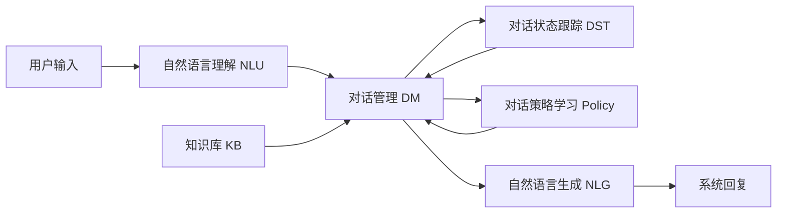

# Dialogue Systems原理与代码实例讲解

作者：禅与计算机程序设计艺术

## 1. 背景介绍

对话系统(Dialogue Systems)是人工智能领域的一个重要分支,旨在让计算机能够与人进行自然、连贯的对话交互。近年来,随着深度学习、自然语言处理等技术的快速发展,对话系统取得了长足进步,在客服、教育、娱乐等领域得到广泛应用。本文将全面介绍对话系统的原理、架构与算法,并给出详细的代码实例。

### 1.1 对话系统的定义与分类
#### 1.1.1 任务型对话系统
#### 1.1.2 开放域对话系统  
#### 1.1.3 问答系统

### 1.2 对话系统发展历程
#### 1.2.1 早期的基于规则的系统
#### 1.2.2 基于检索的对话系统
#### 1.2.3 基于生成的对话系统

### 1.3 对话系统面临的挑战
#### 1.3.1 语义理解
#### 1.3.2 上下文建模
#### 1.3.3 回复生成的连贯性与信息丰富性
#### 1.3.4 个性化与情感交互

## 2. 核心概念与联系

要构建一个优秀的对话系统,需要深入理解其中涉及的一些核心概念。本章节将阐述对话系统的关键组成部分,以及它们之间的内在联系。

### 2.1 自然语言理解(NLU) 
#### 2.1.1 分词与词性标注
#### 2.1.2 命名实体识别  
#### 2.1.3 句法分析
#### 2.1.4 语义角色标注

### 2.2 对话管理(Dialogue Management)
#### 2.2.1 对话状态跟踪
#### 2.2.2 对话策略学习
#### 2.2.3 对话控制

### 2.3 自然语言生成(NLG)
#### 2.3.1 回复内容规划
#### 2.3.2 句子实现
#### 2.3.3 文本修辞增强

### 2.4 知识库
#### 2.4.1 结构化知识库
#### 2.4.2 非结构化知识库
#### 2.4.3 知识库问答

### 2.5 对话系统架构

下面是一个典型的任务型对话系统架构示意图:



可以看出,对话系统的核心组件环环相扣,共同完成将用户输入转化为恰当回复的任务。理解各部分的功能与协作方式,是设计优秀对话系统的基础。

## 3. 核心算法原理具体操作步骤

本章节将详细介绍对话系统中使用的几种关键算法,包括意图识别、槽位填充、对话管理等,并梳理它们的基本原理与具体操作步骤。

### 3.1 意图识别
#### 3.1.1 意图识别任务定义
#### 3.1.2 基于规则的意图识别方法
#### 3.1.3 基于机器学习的意图识别方法  
##### 3.1.3.1 特征工程
##### 3.1.3.2 分类模型选择
##### 3.1.3.3 评估与优化

### 3.2 槽位填充
#### 3.2.1 槽位填充任务定义
#### 3.2.2 条件随机场(CRF)
##### 3.2.2.1 CRF原理
##### 3.2.2.2 特征模板构建
##### 3.2.2.3 训练与解码
#### 3.2.3 基于深度学习的槽位填充方法
##### 3.2.3.1 BiLSTM-CRF
##### 3.2.3.2 Attention机制

### 3.3 对话管理
#### 3.3.1 有限状态机(FSM)
##### 3.3.1.1 状态与转移
##### 3.3.1.2 动作设计
#### 3.3.2 基于规则的对话管理
##### 3.3.2.1 规则设计
##### 3.3.2.2 推理引擎
#### 3.3.3 基于强化学习的对话管理
##### 3.3.3.1 MDP建模
##### 3.3.3.2 Q-Learning算法
##### 3.3.3.3 策略网络

### 3.4 自然语言生成
#### 3.4.1 基于模板的生成方法
#### 3.4.2 基于检索的生成方法
#### 3.4.3 基于神经网络的生成方法
##### 3.4.3.1 Seq2Seq模型
##### 3.4.3.2 Transformer模型
##### 3.4.3.3 预训练模型

## 4. 数学模型和公式详细讲解举例说明

为了让读者更好地理解对话系统中涉及的数学原理,本章节将通过具体的案例,详细推导一些常见的数学模型与公式,并给出直观的解释。

### 4.1 CRF序列标注模型

我们以槽位填充任务为例,介绍CRF的数学形式。设输入序列为$X=(x_1,x_2,...,x_n)$,输出序列为$Y=(y_1,y_2,...,y_n)$,其中$y_i$是位置$i$的槽位标签。那么整个序列的条件概率可表示为:

$$P(Y|X)=\frac{1}{Z(X)} \exp\left(\sum_{i=1}^n\sum_{j=1}^m \lambda_j t_j(y_{i-1}, y_i, X, i)+\sum_{i=1}^n\sum_{k=1}^l \mu_k s_k(y_i, X, i)\right)$$

其中$Z(X)$是归一化因子,$t_j$ 和 $s_k$分别是转移特征函数和状态特征函数,$\lambda_j$和$\mu_k$是对应的权重系数。通过训练调整这些权重,可以得到一个性能优异的CRF槽位填充模型。

### 4.2 强化学习中的Q-Learning

在基于强化学习的对话管理中,我们常用Q-Learning算法来优化对话策略。Q-Learning的核心是价值函数$Q(s,a)$,表示在状态$s$下采取动作$a$的长期累积奖励。Q函数可通过贝尔曼方程递归定义:

$$Q(s_t,a_t) \leftarrow Q(s_t,a_t)+\alpha \left[r_{t+1}+\gamma \max_{a} Q(s_{t+1},a)-Q(s_t,a_t)\right]$$

其中$\alpha$是学习率,$\gamma$是折扣因子。这个更新公式可以理解为,当前状态-动作对的价值,应该等于即时奖励与下一状态的最大Q值之和。不断迭代更新Q函数,最终可收敛到最优策略。

### 4.3 Transformer的自注意力机制

Transformer是当前自然语言生成领域的主流模型。它的核心是自注意力机制(Self-Attention),可以捕捉句子内部的长距离依赖关系。设输入序列的词嵌入矩阵为$X \in \mathbb{R}^{n \times d}$,注意力函数定义为:

$$\text{Attention}(Q,K,V)=\text{softmax}\left(\frac{QK^T}{\sqrt{d_k}}\right)V$$

其中$Q=XW_Q, K=XW_K, V=XW_V$分别是查询、键、值矩阵,$W_Q, W_K, W_V \in \mathbb{R}^{d \times d_k}$是可学习的参数矩阵。将注意力计算的结果经过前馈网络,即可得到词语的新表示,自然地融入了上下文信息。

## 4. 项目实践:代码实例和详细解释说明

学习了对话系统的理论知识后,让我们动手实践一个简单的任务型对话系统,感受一下对话系统开发的基本流程。本项目基于rasa框架,实现一个天气查询对话机器人。

### 4.1 安装rasa

首先需要安装rasa框架,可以使用pip命令:

```bash
pip install rasa
```

### 4.2 定义意图与槽位

在`data/nlu.md`文件中定义系统的意图和槽位。比如:

```markdown
## intent:query_weather
- 今天天气怎么样
- 明天[北京](city)的天气如何
- 后天[上海](city)[下午](time)会不会下雨

## lookup:city
data/cities.txt
```

### 4.3 定义对话流程

在`data/stories.md`文件中定义对话流程。例如:

```markdown
## story_01
* query_weather
  - utter_ask_city
* inform_city
  - action_query_weather
  - utter_report_weather
```

### 4.4 编写自定义Action

在`actions.py`文件中编写自定义Action,用于查询天气API并返回结果:

```python
from rasa_sdk import Action
import requests

class ActionQueryWeather(Action):
    def name(self):
        return "action_query_weather"
        
    def run(self, dispatcher, tracker, domain):
        city = tracker.get_slot("city")
        date = tracker.get_slot("date")
        
        # 调用天气API查询结果
        url = f"http://xx.com/weather?city={city}&date={date}"
        result = requests.get(url).json()
        
        # 根据查询结果返回答复
        if result["status"] == "ok":
            weather = result["result"]["weather"]
            reply = f"{city}{date}的天气是{weather}"
        else:
            reply = f"对不起,我暂时无法查询{city}的天气"
        
        dispatcher.utter_message(reply)
        return []
```

### 4.5 训练与测试

通过以下命令训练对话模型:

```bash
rasa train
```

然后在终端启动对话服务:

```bash
rasa shell
```

现在就可以开始与天气机器人对话了,试试输入:

> User: 明天北京的天气怎么样?  
> Bot: 明天北京的天气是晴转多云,最高气温25℃,最低气温15℃。

是不是已经得到了一个简单但实用的天气对话机器人呢?你可以在此基础上丰富意图、槽位和对话场景,实现更加智能的对话系统。

## 5. 实际应用场景

对话系统在现实生活中有着广泛的应用,本章节列举几个典型场景,展现对话系统的价值。

### 5.1 智能客服

在电商、金融等领域,传统的人工客服面临成本高、效率低的问题。引入智能客服系统,可以自动解答用户的常见问题,大幅提升客服效率,降低人力成本。当遇到复杂问题时,还可以无缝转接人工客服,提供更专业的服务。

### 5.2 智能教育助手

在教育领域,智能对话助手可以辅助学生的学习过程。例如课后答疑、阅读理解训练、口语对话练习等,都可以通过对话系统高效实现。教育机器人还能根据学生的个性化需求,提供定制化的学习指导。

### 5.3 医疗健康咨询

在医疗健康领域,对话系统可作为"AI医生助手",初步了解患者病情,提供医疗知识咨询。一些常见病、慢性病的随访管理,也可通过对话系统辅助完成。此外,心理健康辅导机器人已成为很多人的"心灵伴侣",缓解现代人的压力和焦虑。

### 5.4 智能家居交互

随着IoT设备的普及,我们的家居变得越来越智能。通过对话界面控制家电,已成为一种趋势。例如"小爱同学,把卧室的灯打开""小度小度,现在室内的温度是多少"等,都是非常自然的语音交互方式。对话系统让智能家居更懂人心。

## 6. 工具和资源推荐

对话系统是一个涉及多学科、多技能的综合性领域。为方便读者进一步学习与实践,本章推荐一些常用的工具和学习资源。

### 6.1 开源对话系统框架
- Rasa: https://rasa.com/  
- DeepPavlov: https://deeppavlov.ai/ 
- Botpress: https://botpress.com/
- Houndify: https://www.houndify.com/

### 6.2 知识库构建工具
- 百度知识图谱: https://ai.baidu.com/tech/