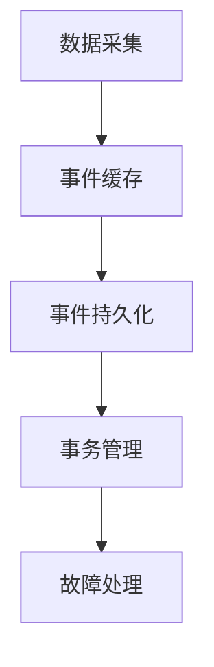
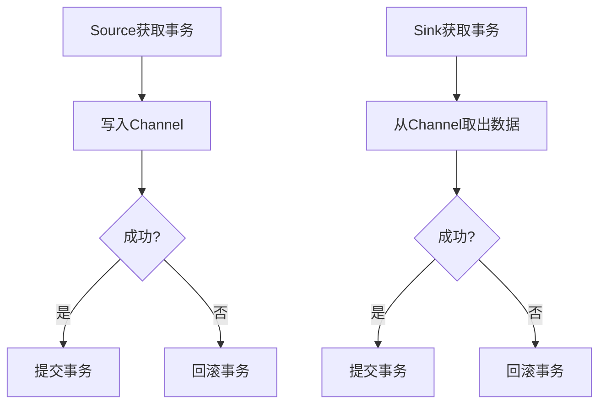
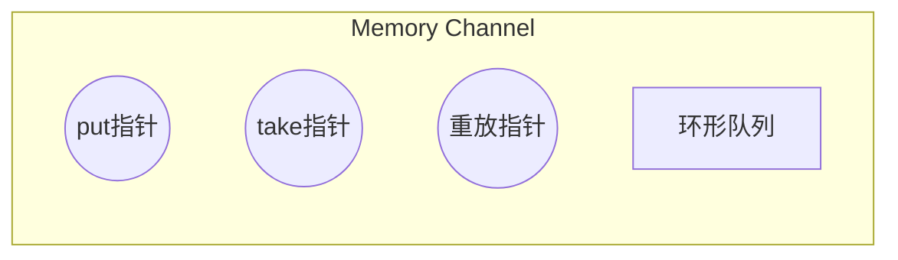
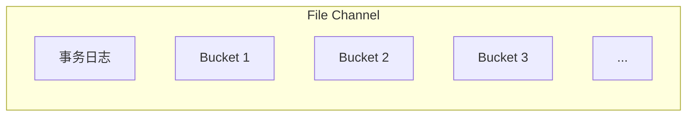

# Flume原理与代码实例讲解

## 1.背景介绍

### 1.1 什么是Flume

Apache Flume是一个分布式、可靠、高可用的海量日志数据收集系统,它可以从不同的数据源收集数据,经过聚合后传输到集中存储系统中,如HDFS、HBase等。Flume具有简单、灵活、可靠、容错、高可用等特点,广泛应用于日志收集、事务数据采集等领域。

### 1.2 Flume的作用

在大数据时代,各种服务和应用系统会产生大量的日志数据,如果不及时收集这些数据,就可能导致数据丢失、无法进行数据分析等问题。Flume可以高效、可靠地收集这些分散的日志数据,并将其传输到集中存储系统中,为后续的数据处理和分析奠定基础。

### 1.3 Flume的优势

- **简单灵活**:Flume基于流式数据传输,支持多种数据源和目的地,可以轻松构建和管理数据收集系统。
- **高可靠性**:Flume支持数据冗余备份,能够保证数据在传输过程中不丢失。
- **高容错性**:Flume支持故障转移和恢复机制,可以自动从故障中恢复。
- **高可扩展性**:Flume采用分布式架构,可以水平扩展以满足大规模数据收集需求。
- **事务机制**:Flume提供了事务机制,确保数据的一致性和原子性。

## 2.核心概念与联系

### 2.1 Flume的核心组件

Flume由以下三个核心组件组成:

1. **Source(源头)**:用于从外部系统收集数据,如Web服务器日志、应用程序日志等。
2. **Channel(通道)**:一个事件传输队列,用于缓存Source收集到的事件,直到被Sink持久化。
3. **Sink(下游)**:从Channel中取出事件,并将其持久化到外部存储系统,如HDFS、HBase等。

这三个组件通过事件流的方式串联在一起,构成了Flume的数据传输通路。


### 2.2 Flume的数据流

Flume的数据流是单向的,遵循以下流程:

1. Source接收数据,生成事件(Event),并将事件临时存储到Channel中。
2. Channel作为事件的缓存区,直到Sink从中取出事件。
3. Sink从Channel中取出事件,并将其持久化到外部存储系统。


### 2.3 Flume的可靠性机制

为了确保数据传输的可靠性,Flume采用了以下机制:

1. **事务机制**:Flume使用事务来保证数据的一致性和原子性。Source到Channel和Channel到Sink都是一个事务操作。
2. **Channel选择**:Flume提供了多种Channel实现,如Memory Channel、File Channel等,可以根据需求选择合适的Channel。
3. **故障转移和恢复**:Flume支持故障转移和恢复机制,可以在发生故障时自动切换到备份组件,并在恢复后继续传输数据。

## 3.核心算法原理具体操作步骤

### 3.1 Flume的工作原理

Flume的工作原理可以分为以下几个步骤:

1. **数据采集**:Source从外部系统采集数据,生成事件(Event)。
2. **事件缓存**:Source将事件写入Channel,Channel作为事件的缓存区。
3. **事件持久化**:Sink从Channel中取出事件,并将其持久化到外部存储系统。
4. **事务管理**:整个过程由事务机制管理,确保数据的一致性和原子性。
5. **故障处理**:如果发生故障,Flume会自动切换到备份组件,并在恢复后继续传输数据。



### 3.2 Flume的事务机制

Flume的事务机制是保证数据可靠传输的关键。事务机制分为两个阶段:

1. **Source到Channel**:Source将数据写入Channel时,需要先获取Channel的事务(Transaction)。如果写入成功,则提交事务;否则,回滚事务。
2. **Channel到Sink**:Sink从Channel取出数据时,也需要先获取Channel的事务。如果取出成功,则提交事务;否则,回滚事务。



通过事务机制,Flume可以保证数据在传输过程中的一致性和原子性,从而确保数据不会丢失或重复。

## 4.数学模型和公式详细讲解举例说明

在Flume中,Channel的选择对系统的性能和可靠性有着重要影响。不同的Channel实现采用了不同的数学模型和算法,以满足不同的需求。

### 4.1 Memory Channel

Memory Channel是Flume中最简单的Channel实现,它将事件存储在内存中。Memory Channel的优点是速度快,但缺点是容量有限,一旦发生故障或重启,内存中的数据将会丢失。

Memory Channel的内存管理采用了环形队列(Circular Queue)的数据结构,可以用以下公式表示:

$$
capacity = 2^{ceil(log_2(maxSize))}
$$

其中,capacity表示队列的实际容量,maxSize表示用户设置的最大容量。

Memory Channel使用了多个指针来管理队列,包括put指针、take指针和重放指针(replayPointer)。当队列满时,put指针会覆盖最早的事件,实现环形覆盖。



### 4.2 File Channel

File Channel是Flume中最可靠的Channel实现,它将事件持久化到本地文件系统中。File Channel的优点是可靠性高,但缺点是速度较慢。

File Channel采用了日志结构化(Log-structured)的数据组织方式,将事件按照顺序写入日志文件中。当日志文件达到一定大小时,会滚动生成新的日志文件。

File Channel使用了一个事务日志(TransactionLog)来记录每个事务的元数据,包括事务ID、事件数量、事件偏移量等。事务日志的格式如下:

```
<tx id> <event count> <data length> <oldest bucket id>
```

其中,tx id表示事务ID,event count表示事务中事件的数量,data length表示事件数据的总长度,oldest bucket id表示最老的Bucket ID。

File Channel使用了多个Bucket来存储事件数据,每个Bucket对应一个物理文件。Bucket的命名格式如下:

```
bucket_<uuid>.<bucket id>
```

其中,uuid是一个全局唯一标识符,bucket id是一个递增的整数。



File Channel的数据恢复过程如下:

1. 从事务日志中读取最新的事务ID和Bucket ID。
2. 从最老的Bucket开始,依次读取事件数据,直到最新的Bucket。
3. 根据事务ID和事件偏移量,重建事件队列。

通过日志结构化和事务日志的设计,File Channel可以在发生故障后快速恢复数据,确保数据的可靠性。

## 4.项目实践:代码实例和详细解释说明

在本节中,我们将通过一个简单的示例项目,演示如何使用Flume收集日志数据。

### 4.1 环境准备

1. 下载并解压Flume安装包。
2. 配置Flume的环境变量。
3. 启动Flume Agent。

```bash
# 解压Flume安装包
tar -zxvf apache-flume-1.9.0-bin.tar.gz

# 配置环境变量
export FLUME_HOME=/path/to/apache-flume-1.9.0-bin
export PATH=$PATH:$FLUME_HOME/bin

# 启动Flume Agent
flume-ng agent --conf conf --conf-file example.conf --name agent --Dflume.root.logger=INFO,console
```

### 4.2 配置Flume Agent

我们将配置一个简单的Flume Agent,它包含一个Tail Source、一个Memory Channel和一个Logger Sink。配置文件(example.conf)如下:

```properties
# Define the source, channel, and sink
agent.sources = tail_source
agent.channels = mem_channel
agent.sinks = logger_sink

# Configure the source
agent.sources.tail_source.type = exec
agent.sources.tail_source.command = tail -F /path/to/log/file.log

# Configure the channel
agent.channels.mem_channel.type = memory
agent.channels.mem_channel.capacity = 1000
agent.channels.mem_channel.transactionCapacity = 100

# Configure the sink
agent.sinks.logger_sink.type = logger
agent.sinks.logger_sink.channel = mem_channel

# Bind the source and sink to the channel
agent.sources.tail_source.channels = mem_channel
agent.sinks.logger_sink.channel = mem_channel
```

这个配置文件定义了以下组件:

1. **Tail Source**:使用exec类型的Source,通过tail命令实时读取日志文件。
2. **Memory Channel**:使用内存Channel,容量为1000个事件,每个事务最多100个事件。
3. **Logger Sink**:使用logger类型的Sink,将事件打印到控制台。

### 4.3 运行示例

启动Flume Agent后,它将实时读取日志文件中的新内容,并将其打印到控制台。你可以在另一个终端窗口中,向日志文件追加新的日志条目,观察Flume Agent的输出。

```
# 启动Flume Agent
flume-ng agent --conf conf --conf-file example.conf --name agent --Dflume.root.logger=INFO,console

# 在另一个终端窗口中追加日志
echo "This is a new log entry" >> /path/to/log/file.log
```

你应该能够在Flume Agent的控制台输出中看到新的日志条目。

```
2023-05-29 10:30:12,153 (logger_sink.INFO): This is a new log entry
```

通过这个简单的示例,你可以了解到如何配置和运行Flume Agent,以及Flume的基本工作原理。在实际应用中,你可以根据需求配置不同的Source、Channel和Sink,构建更加复杂的数据收集管道。

## 5.实际应用场景

Flume作为一个高可靠、高性能的日志收集系统,在实际应用中有着广泛的应用场景。

### 5.1 日志收集

最典型的应用场景就是收集各种服务器和应用程序产生的日志数据,如Web服务器日志、应用程序日志、数据库日志等。通过Flume,这些分散的日志数据可以被高效、可靠地收集到集中存储系统中,为后续的数据分析和处理提供基础数据。

### 5.2 事务数据采集

除了日志数据,Flume也可以用于采集各种事务数据,如电商网站的订单数据、金融系统的交易数据等。这些数据通常具有较高的时效性和重要性,需要及时、可靠地传输到数据处理系统中进行处理。

### 5.3 流式数据采集

随着物联网、移动互联网等新兴技术的发展,大量的流式数据不断产生,如传感器数据、移动设备数据等。Flume可以作为一个流式数据采集系统,实时收集这些数据,并将其传输到大数据处理平台,如Spark Streaming、Flink等,进行实时数据处理和分析。

### 5.4 数据集成

在大数据环境中,数据通常来自于多个异构数据源,如关系型数据库、NoSQL数据库、文件系统等。Flume可以作为一个数据集成工具,从这些不同的数据源采集数据,并将其集中到大数据存储系统中,为后续的数据处理和分析提供统一的数据视图。

### 5.5 安全日志审计

在企业级应用中,安全日志审计是一个重要的需求。Flume可以用于收集各种安全相关的日志数据,如防火