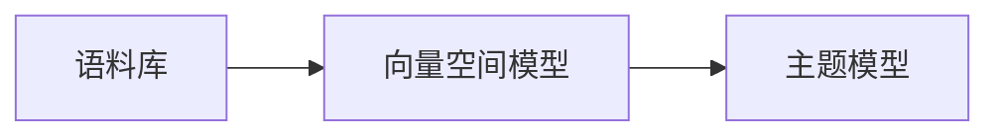

## 1.背景介绍

Gensim是一个开源的Python库，用于从文档中自动提取语义主题，它使用了一些先进的机器学习算法，如Latent Semantic Analysis (LSA), Latent Dirichlet Allocation (LDA)和Random Projections (RP)等。

Gensim的主要特点是处理大规模文本数据，它可以在一台普通的个人电脑上处理上百万篇文档。这使得Gensim在文本挖掘、自然语言处理、信息检索等领域得到了广泛的应用。

## 2.核心概念与联系

Gensim主要涉及到以下几个核心概念：

- **语料库（Corpus）**：语料库是一组文档的集合，每个文档都是一个词条的列表。在Gensim中，语料库是训练模型的基础。

- **向量空间模型（Vector Space Model）**：在Gensim中，每个文档都表示为一个向量，这个向量就是文档在向量空间模型中的表示。

- **主题模型（Topic Model）**：主题模型是一种统计模型，它用于发现文档集合中的抽象主题。Gensim提供了多种主题模型算法，如LSA、LDA和RP等。

这些核心概念之间的关系可以通过下面的Mermaid流程图来表示：



## 3.核心算法原理具体操作步骤

在Gensim中，主题模型的训练主要包括以下几个步骤：

1. **预处理**：这一步主要包括去除停用词、词干提取和词袋模型的构建等。

2. **构建语料库**：将预处理后的文档转换为Gensim可以处理的语料库格式。

3. **训练模型**：使用语料库训练主题模型。

4. **模型评估**：评估模型的质量，例如通过计算模型的困惑度（Perplexity）和主题一致性（Topic Coherence）。

5. **模型应用**：将训练好的模型应用到新的文档上，提取文档的主题。

## 4.数学模型和公式详细讲解举例说明

在Gensim中，文档的向量表示基于词袋模型。词袋模型假设文档是由其包含的词汇构成的，不考虑词汇的顺序和语法。每个文档可以表示为一个向量，向量的每个元素对应一个词汇，元素的值为该词汇在文档中的频率。

例如，给定一个词汇表`{'gensim': 0, 'is': 1, 'awesome': 2}`，文档`'gensim is awesome'`可以表示为向量`[1, 1, 1]`。

在主题模型中，每个主题可以看作是词汇的概率分布，每个文档则是主题的概率分布。例如，在LDA模型中，每个文档的主题分布可以表示为：

$$
\theta_d \sim Dir(\alpha)
$$

其中，$\theta_d$是文档$d$的主题分布，$Dir(\alpha)$表示参数为$\alpha$的狄利克雷分布。

每个主题的词汇分布可以表示为：

$$
\phi_k \sim Dir(\beta)
$$

其中，$\phi_k$是主题$k$的词汇分布，$Dir(\beta)$表示参数为$\beta$的狄利克雷分布。

每个文档中的每个词汇的主题则由以下公式决定：

$$
z_{dn} \sim Multinomial(\theta_d)
$$

$$
w_{dn} \sim Multinomial(\phi_{z_{dn}})
$$

其中，$z_{dn}$是文档$d$中第$n$个词汇的主题，$w_{dn}$是文档$d$中第$n$个词汇，$Multinomial(\theta_d)$表示参数为$\theta_d$的多项分布，$Multinomial(\phi_{z_{dn}})$表示参数为$\phi_{z_{dn}}$的多项分布。

## 4.项目实践：代码实例和详细解释说明

下面我们通过一个实际的例子来演示如何使用Gensim训练主题模型。

首先，我们需要导入必要的库：

```python
import gensim
from gensim import corpora
```

然后，我们定义一些预处理函数，用于去除停用词和进行词干提取：

```python
def remove_stopwords(texts):
    return [[word for word in doc if word not in stop_words] for doc in texts]

def lemmatization(texts, allowed_postags=['NOUN', 'ADJ', 'VERB', 'ADV']):
    """https://spacy.io/api/annotation"""
    texts_out = []
    for sent in texts:
        doc = nlp(" ".join(sent)) 
        texts_out.append([token.lemma_ for token in doc if token.pos_ in allowed_postags])
    return texts_out
```

接下来，我们读取文档数据，进行预处理，并构建语料库：

```python
# 读取文档数据
data = ['Gensim is a robust open-source vector space modeling and topic modeling toolkit.',
        'It implements the Latent Dirichlet Allocation (LDA) and can be used to extract topics from documents.',
        'Gensim is implemented in Python and can be easily integrated with other Python libraries.']

# 预处理
data_words = list(sent_to_words(data))
data_words = remove_stopwords(data_words)
data_lemmatized = lemmatization(data_words, allowed_postags=['NOUN', 'ADJ', 'VERB', 'ADV'])

# 构建语料库
id2word = corpora.Dictionary(data_lemmatized)
corpus = [id2word.doc2bow(text) for text in data_lemmatized]
```

然后，我们使用语料库训练LDA模型：

```python
lda_model = gensim.models.LdaMulticore(corpus=corpus,
                                       id2word=id2word,
                                       num_topics=10, 
                                       random_state=100,
                                       chunksize=100,
                                       passes=10,
                                       per_word_topics=True)
```

最后，我们可以使用训练好的模型提取文档的主题：

```python
for index, score in sorted(lda_model[corpus[0]], key=lambda tup: -1*tup[1]):
    print("\nScore: {}\t \nTopic: {}".format(score, lda_model.print_topic(index, 10)))
```

在这个例子中，我们使用了Gensim的LdaMulticore模型，这是一个并行化的LDA实现，可以充分利用多核CPU提高训练速度。

## 5.实际应用场景

Gensim在许多实际应用场景中都有广泛的应用，例如：

- **文本分类**：Gensim的主题模型可以用于文本分类，例如新闻分类、情感分析等。

- **文本聚类**：Gensim的主题模型可以用于文本聚类，例如社交媒体分析、用户反馈分析等。

- **推荐系统**：Gensim的主题模型可以用于推荐系统，例如基于内容的推荐、个性化推荐等。

- **信息检索**：Gensim的主题模型可以用于信息检索，例如文档检索、问题回答等。

## 6.工具和资源推荐

如果你对Gensim感兴趣，以下是一些有用的工具和资源：

- **Gensim官方文档**：Gensim的官方文档是学习Gensim的最好资源，它包含了详细的API文档和教程。

- **Gensim GitHub**：Gensim的GitHub仓库包含了所有的源代码，你可以在这里找到最新的开发版本和示例代码。

- **Gensim Google Group**：Gensim的Google Group是一个活跃的社区，你可以在这里找到许多有用的讨论和问题解答。

## 7.总结：未来发展趋势与挑战

Gensim作为一个强大的主题模型库，未来有着广阔的发展前景。随着深度学习和神经网络的发展，Gensim可能会集成更多的深度学习模型，例如Doc2Vec、Word2Vec等。同时，Gensim也需要解决一些挑战，例如如何处理大规模的文本数据，如何提高模型的训练速度，如何提高模型的解释性等。

## 8.附录：常见问题与解答

**Q: Gensim和其他主题模型库有什么区别？**

A: Gensim的主要优点是可以处理大规模的文本数据，并且提供了多种主题模型算法，例如LSA、LDA和RP等。此外，Gensim还提供了一些高级功能，例如模型的保存和加载，模型的在线更新等。

**Q: Gensim的主题模型可以用于其他语言的文本吗？**

A: 是的，Gensim的主题模型是基于词袋模型的，所以它可以用于任何语言的文本。但是，预处理步骤可能需要根据不同的语言进行调整，例如停用词的去除，词干的提取等。

**Q: Gensim的主题模型可以用于非文本数据吗？**

A: 是的，虽然Gensim的主题模型主要用于文本数据，但是它们也可以用于其他类型的数据，例如图像、音频、视频等。只要你可以将数据转换为词袋模型，就可以使用Gensim的主题模型。