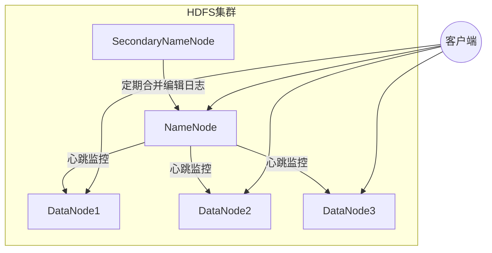
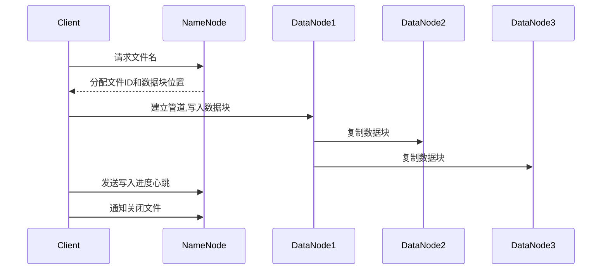
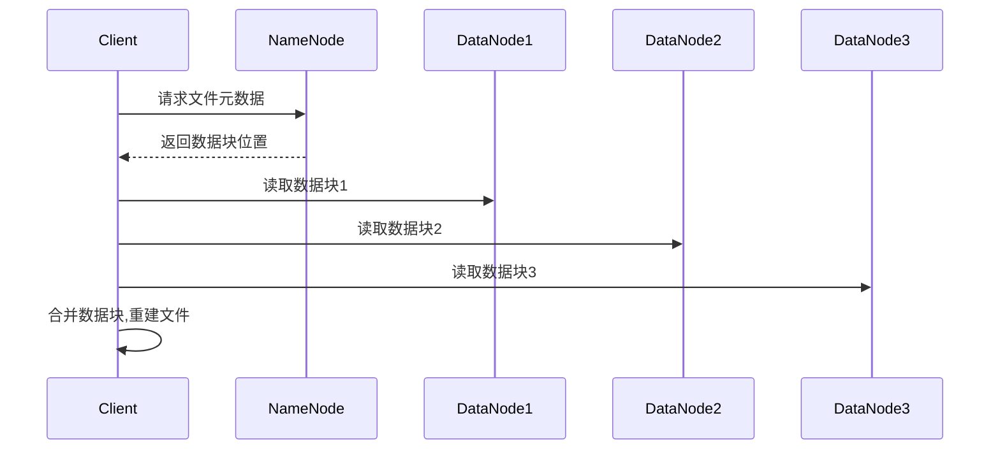

# HDFS原理与代码实例讲解

## 1.背景介绍

### 1.1 大数据时代的来临

随着互联网、移动互联网以及物联网的快速发展,海量的数据正以前所未有的规模和速度不断产生。这些数据来自于各种渠道,包括网络日志、社交媒体、传感器数据等,呈现出多样化、海量化的特点。传统的数据存储和处理方式已经无法满足当前大数据场景的需求。

### 1.2 大数据处理的挑战

大数据带来了诸多挑战:

1. **数据量大**:单个数据集可能达到TB甚至PB级别,远远超出了传统数据库的处理能力。
2. **数据种类多**:数据来源多样,格式也不尽相同,包括结构化数据(如关系数据库)和非结构化数据(如图像、视频等)。
3. **实时性要求高**:对于某些应用场景,需要在数据产生的第一时间就进行处理和分析。
4. **可扩展性差**:随着数据量的持续增长,需要具备良好的扩展性以应对不断增长的计算和存储需求。

### 1.3 Hadoop的诞生

为了应对大数据带来的挑战,Apache Hadoop应运而生。Hadoop是一个开源的分布式系统基础架构,由Apache软件基金会进行维护和开发。它主要由两部分组成:

1. **HDFS(Hadoop Distributed File System)**:一种高度容错的分布式文件系统,用于存储大规模数据。
2. **MapReduce**:一种分布式数据处理模型,用于并行处理和分析存储在HDFS上的大规模数据集。

本文将重点介绍HDFS的原理和实现。

## 2.核心概念与联系

### 2.1 HDFS概述

HDFS是一种设计用于在廉价的机器集群上运行的分布式文件系统。它具有以下核心特点:

1. **高容错性**:通过数据块复制和机架感知策略,可以提供高容错性和可用性。
2. **高吞吐量**:支持大规模数据的批处理操作,具有高吞吐量。
3. **大文件适用**:适合存储大文件,文件被划分为多个数据块,分布在集群中的多个节点上。
4. **可扩展性**:通过简单地增加新节点,可以线性扩展存储容量和计算能力。

### 2.2 HDFS架构

HDFS采用主从架构,主要由以下几个组件组成:

1. **NameNode**(名称节点):管理文件系统的命名空间和客户端对文件的访问。
2. **DataNode**(数据节点):实际存储文件数据块并执行数据块的读写操作。
3. **SecondaryNameNode**(辅助名称节点):定期合并NameNode的编辑日志,减轻NameNode的工作负载。

下面是HDFS的基本架构图:



### 2.3 文件存储机制

在HDFS中,文件被划分为一个或多个数据块(Block),每个数据块默认大小为128MB(可配置)。每个数据块会有多个副本(默认3个),分布存储在不同的DataNode上,以提供容错性和可用性。

NameNode负责维护文件到数据块的映射关系,以及数据块所在DataNode的位置信息。当客户端需要访问文件时,首先会向NameNode请求文件的元数据信息,然后直接与相应的DataNode进行数据交互。

## 3.核心算法原理具体操作步骤

### 3.1 文件写入流程

当客户端需要写入一个新文件时,会经历以下步骤:

1. 客户端与NameNode通信,获取一个可用的文件名。
2. NameNode为该文件分配一个唯一的文件ID,并确定数据块的副本存储位置。
3. 客户端与指定的DataNode建立管道,开始写入数据。
4. 数据块在DataNode之间进行复制,确保达到指定的副本数量。
5. 客户端定期向NameNode发送心跳信号,报告写入进度。
6. 写入完成后,客户端通知NameNode关闭文件。

下面是文件写入流程的示意图:



### 3.2 文件读取流程

当客户端需要读取一个文件时,会经历以下步骤:

1. 客户端与NameNode通信,获取文件的元数据信息,包括数据块位置等。
2. 客户端直接与存储相应数据块的DataNode建立连接,读取数据。
3. 如果某个DataNode发生故障,客户端会从其他DataNode读取该数据块的副本。
4. 客户端合并从各个DataNode读取的数据块,重建完整文件。

下面是文件读取流程的示意图:



## 4.数学模型和公式详细讲解举例说明

在HDFS中,数据块的副本存储位置选择策略是一个关键问题。HDFS采用机架感知策略,尽量将数据块的副本分布在不同的机架上,以提高容错性和可用性。

假设集群中有N个DataNode,分布在R个机架上,每个数据块需要存储F个副本(默认为3)。我们希望最大化每个数据块副本在不同机架上的分布,从而最小化由于单个机架故障导致的数据丢失风险。

定义目标函数:

$$
\max \sum_{i=1}^{R} \min_{j=1}^{F} x_{ij}
$$

其中,$ x_{ij} $表示第j个副本是否存储在第i个机架上,如果存储则为1,否则为0。

约束条件:

1. 每个数据块需要存储F个副本:

$$
\sum_{i=1}^{R} \sum_{j=1}^{F} x_{ij} = F
$$

2. 每个机架最多只能存储一个副本:

$$
\sum_{j=1}^{F} x_{ij} \leq 1, \quad \forall i \in \{1, 2, \ldots, R\}
$$

3. 变量取值范围:

$$
x_{ij} \in \{0, 1\}, \quad \forall i \in \{1, 2, \ldots, R\}, \quad \forall j \in \{1, 2, \ldots, F\}
$$

通过求解上述优化问题,我们可以得到数据块副本的最优存储位置,从而最大化数据可靠性和容错性。

例如,假设我们有3个机架,每个数据块需要存储3个副本。根据上述模型,最优的存储方案是将3个副本分别存储在不同的3个机架上。如果某个机架发生故障,其他两个机架上的副本仍然可用,从而避免数据丢失。

## 4.项目实践:代码实例和详细解释说明

下面我们通过一个简单的Java示例,演示如何在HDFS上进行文件的读写操作。

### 4.1 准备工作

首先,我们需要下载并配置Hadoop环境。可以从Apache Hadoop官网下载最新版本的二进制包,并按照官方文档进行安装和配置。

接下来,我们创建一个Maven项目,并在`pom.xml`文件中添加以下依赖项:

```xml
<dependency>
    <groupId>org.apache.hadoop</groupId>
    <artifactId>hadoop-common</artifactId>
    <version>3.3.4</version>
</dependency>
<dependency>
    <groupId>org.apache.hadoop</groupId>
    <artifactId>hadoop-hdfs</artifactId>
    <version>3.3.4</version>
</dependency>
```

### 4.2 写入文件

下面是一个简单的示例,演示如何将一个本地文件写入HDFS:

```java
import org.apache.hadoop.conf.Configuration;
import org.apache.hadoop.fs.FileSystem;
import org.apache.hadoop.fs.Path;

import java.io.InputStream;

public class HDFSWriteExample {
    public static void main(String[] args) throws Exception {
        // 配置HDFS文件系统
        Configuration conf = new Configuration();
        conf.set("fs.defaultFS", "hdfs://localhost:9000");
        FileSystem hdfs = FileSystem.get(conf);

        // 本地文件路径
        Path localPath = new Path("/path/to/local/file.txt");

        // HDFS文件路径
        Path hdfsPath = new Path("/path/in/hdfs/file.txt");

        // 打开本地文件输入流
        InputStream in = localPath.getFileSystem(conf).open(localPath);

        // 将数据写入HDFS
        hdfs.create(hdfsPath).copyFromStream(in);

        // 关闭文件系统
        hdfs.close();
    }
}
```

在上面的示例中,我们首先配置HDFS文件系统,指定NameNode的地址。然后,我们打开本地文件的输入流,并将数据写入HDFS指定的路径。最后,我们关闭HDFS文件系统。

### 4.3 读取文件

下面是一个简单的示例,演示如何从HDFS读取文件:

```java
import org.apache.hadoop.conf.Configuration;
import org.apache.hadoop.fs.FileSystem;
import org.apache.hadoop.fs.Path;
import org.apache.hadoop.io.IOUtils;

import java.io.OutputStream;

public class HDFSReadExample {
    public static void main(String[] args) throws Exception {
        // 配置HDFS文件系统
        Configuration conf = new Configuration();
        conf.set("fs.defaultFS", "hdfs://localhost:9000");
        FileSystem hdfs = FileSystem.get(conf);

        // HDFS文件路径
        Path hdfsPath = new Path("/path/in/hdfs/file.txt");

        // 打开本地文件输出流
        OutputStream out = System.out;

        // 从HDFS读取数据
        IOUtils.copyBytes(hdfs.open(hdfsPath), out, conf);

        // 关闭文件系统
        hdfs.close();
    }
}
```

在上面的示例中,我们首先配置HDFS文件系统,指定NameNode的地址。然后,我们打开本地的输出流(在这里是标准输出),并从HDFS指定的路径读取数据,将其复制到输出流中。最后,我们关闭HDFS文件系统。

通过这些简单的示例,我们可以看到如何使用Hadoop API在HDFS上进行文件的读写操作。在实际应用中,我们可以根据具体需求进行扩展和定制。

## 5.实际应用场景

HDFS的设计目标是为大数据场景提供可靠、高吞吐量的数据存储和访问服务。它广泛应用于以下领域:

### 5.1 大数据分析

HDFS是Apache Hadoop生态系统的核心组件之一,与MapReduce、Spark等大数据处理框架紧密集成。它为大数据分析提供了可靠、高效的数据存储和访问能力,支持对海量数据进行批处理和实时分析。

### 5.2 日志处理

在互联网、金融等行业,每天都会产生大量的日志数据,如网络日志、交易日志等。HDFS可以用于存储和处理这些海量日志数据,为日志分析、安全审计等提供支持。

### 5.3 物联网数据存储

随着物联网的发展,来自各种传感器和设备的数据量也在快速增长。HDFS可以作为物联网大数据的存储和处理平台,支持对海量设备数据进行存储、管理和分析。

### 5.4 内容存储和分发

HDFS也可以用于存储和分发大型文件,如视频、音频等多媒体内