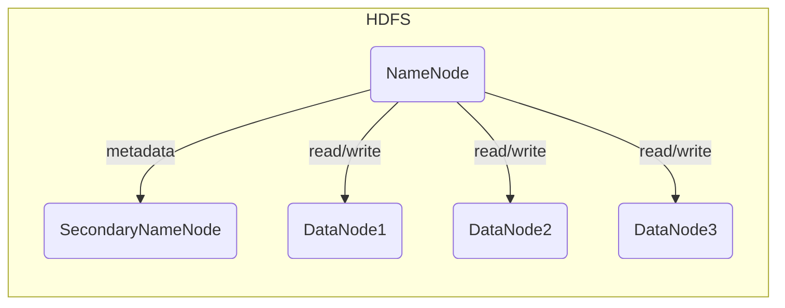
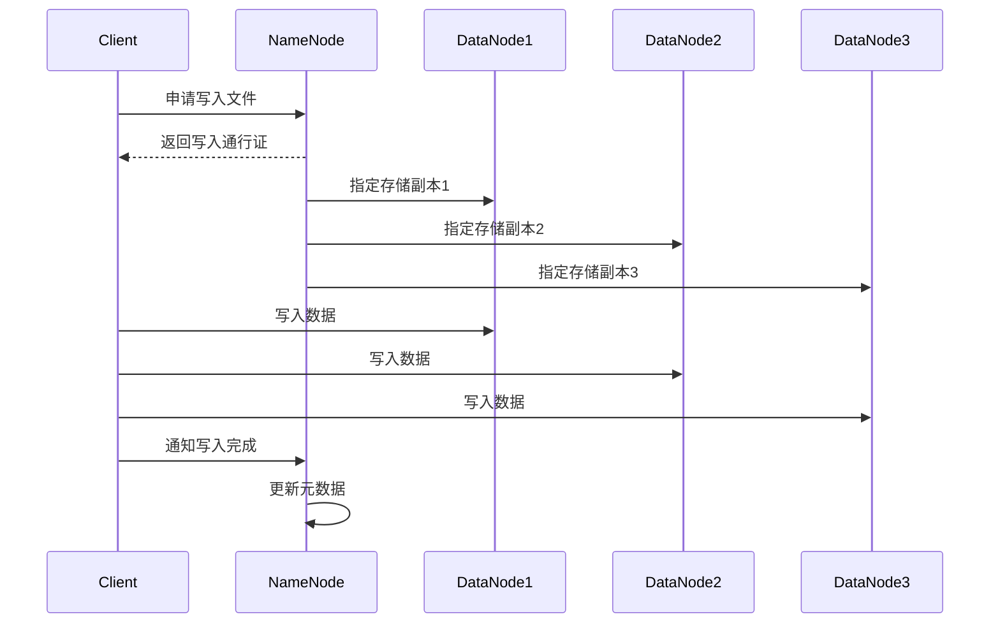
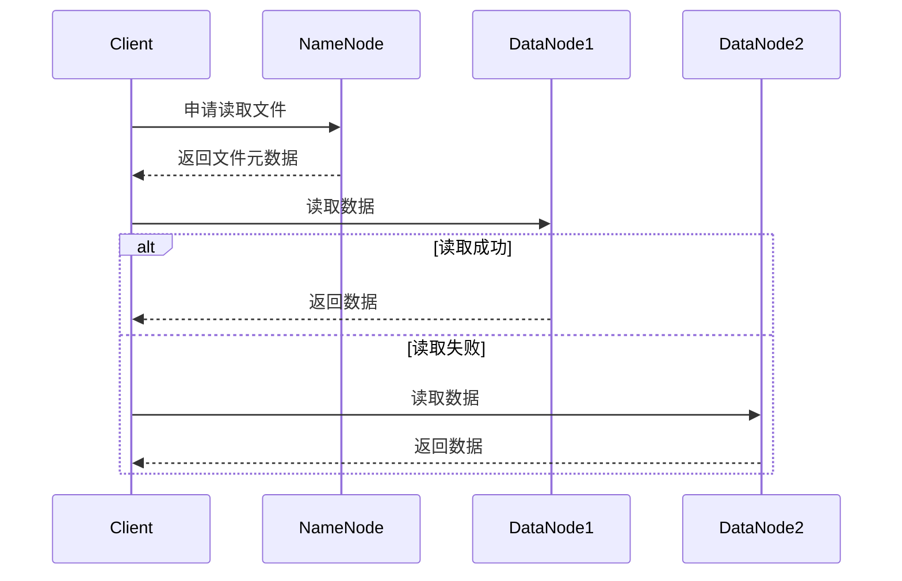

# HDFS原理与代码实例讲解

## 1.背景介绍

### 1.1 大数据时代的到来

随着互联网、移动互联网和物联网的快速发展,数据量呈现爆炸式增长。传统的数据存储和处理方式已经无法满足日益增长的需求。大数据时代的到来,对存储和处理海量数据提出了新的挑战。

### 1.2 大数据处理的需求

面对大数据,我们需要一种能够存储和处理大规模数据的系统,这种系统需要具备:

- 高容错性 - 能够防止硬件的频繁故障导致数据丢失
- 高扩展性 - 能够通过不断增加服务器来扩展存储能力
- 高性能 - 能够在可接受的时间范围内查询海量数据

### 1.3 Hadoop的诞生

Apache Hadoop 就是为了解决大数据存储和处理而诞生的分布式系统,其中核心组件之一就是HDFS(Hadoop分布式文件系统)。HDFS为海量数据的存储提供了可靠的解决方案。

## 2.核心概念与联系

### 2.1 HDFS概念

HDFS是一个高度容错的分布式文件系统,设计用于运行在廉价的机器上。它具有以下特点:

- 超高容错性
- 适合批处理操作
- 流式数据访问模式
- 大文件存储

### 2.2 HDFS架构

HDFS遵循主从架构,主要由以下几个组件组成:

- NameNode - 存储文件系统元数据
- DataNode - 存储实际数据块
- 辅助NameNode - 定期合并NameNode的编辑日志



### 2.3 HDFS文件块

HDFS采用了块设计,一个文件被分割成一个个块存储在不同的DataNode上,从而实现容错性和并行处理。默认块大小为128MB。

### 2.4 HDFS数据复制

为了提高容错性,HDFS会为每个数据块保存多个副本,副本存储在不同的DataNode上。默认副本数为3。

## 3.核心算法原理具体操作步骤  

### 3.1 写数据流程

1) Client向NameNode申请写入文件,获取一个文件写入通行证
2) NameNode分配一个数据块,并指定几个DataNode存储副本
3) Client按顺序向指定的DataNode写入数据
4) 数据写入成功后,Client通知NameNode完成写入
5) NameNode更新元数据



### 3.2 读数据流程

1) Client向NameNode申请读取文件
2) NameNode返回文件元数据(文件长度,块位置等)
3) Client直接从最近的DataNode读取数据
4) 如果读取失败,Client尝试从另一个DataNode读取



### 3.3 故障处理

1) DataNode故障
    - NameNode不间断地接收DataNode的心跳和块报告
    - 如果某个DataNode长时间没有发送心跳,NameNode会确认其已经故障
    - NameNode会在其他DataNode上复制有副本,以保证指定副本数目

2) NameNode故障
    - NameNode机器发生故障,需要手动干预
    - 从metadata和edits log中恢复元数据
    - 重新启动NameNode

## 4.数学模型和公式详细讲解举例说明

### 4.1 数据块放置策略

HDFS采用了优化的数据块放置策略,尽量将数据块分布在不同的机架上,以提高容错性和网络带宽利用率。

假设副本数为3,数据块放置遵循以下顺序:

1) 将第一个副本放在上传文件的节点所在的节点上(如果是集群外提交任务则随机挑选一个节点)
2) 将第二个副本放置在与第一个副本不同的机架的随机节点上
3) 将第三个副本放置在与第二个副本相同机架的随机节点上

我们用数学模型来表示:

假设有N个机架,每个机架有$M_i$个节点,第i个机架上有$x_i$个副本,则目标函数为:

$$\max \sum_{i=1}^N x_i$$

约束条件为:

- $\sum_{i=1}^N x_i = 3$ (副本数为3)
- $x_i \leq M_i$ (每个机架上的副本数不超过该机架节点数)

通过这种策略,可以最大化数据可靠性和网络带宽利用率。

### 4.2 机架感知

为了实现上述数据块放置策略,HDFS需要感知集群的网络拓扑结构。这是通过机架感知(Rack Awareness)来实现的。

每个DataNode启动时会发送一个包含网络拓扑层次代码的注册信息给NameNode,例如 /rack1/node1。NameNode据此构建集群拓扑结构映射。

## 4.项目实践:代码实例和详细解释说明

接下来我们通过一个简单的Java示例来演示HDFS的基本操作。

### 4.1 HDFS Java API

HDFS提供了Java API供开发者进行交互,主要涉及以下几个核心类:

- `DistributedFileSystem` - 与HDFS交互的文件系统接口
- `FSDataInputStream` - HDFS文件输入流
- `FSDataOutputStream` - HDFS文件输出流
- `Path` - HDFS文件路径

### 4.2 连接HDFS

```java
Configuration conf = new Configuration();
conf.set("fs.defaultFS", "hdfs://namenode:9000");
FileSystem fs = FileSystem.get(conf);
```

上面的代码创建了一个HDFS客户端实例,用于与HDFS交互。`fs.defaultFS`指定了NameNode的地址。

### 4.3 上传文件到HDFS

```java
Path src = new Path("file:///path/to/local/file.txt"); 
Path dst = new Path("/user/hdfs/file.txt");
fs.copyFromLocalFile(src, dst);
```

上面的代码将本地文件`file.txt`上传到HDFS的`/user/hdfs/file.txt`路径下。

### 4.4 从HDFS读取文件

```java
Path file = new Path("/user/hdfs/file.txt");
FSDataInputStream in = fs.open(file);
// 读取文件内容
in.close();
```

`fs.open()`方法打开HDFS上的文件,返回一个`FSDataInputStream`用于读取文件内容。

### 4.5 列出HDFS目录

```java
Path dir = new Path("/user/hdfs/");
FileStatus[] files = fs.listStatus(dir);
for (FileStatus f : files) {
    System.out.println(f.getPath());
}
```

`fs.listStatus()`方法列出指定目录下的所有文件和目录。

通过这些基本API,我们就可以与HDFS进行交互,实现各种操作。

## 5.实际应用场景

HDFS作为Hadoop生态系统的核心存储系统,在许多领域得到了广泛应用:

### 5.1 大数据分析

由于HDFS能够存储和处理海量数据,所以它常被用于大数据分析领域,比如网络日志分析、用户行为分析等。

### 5.2 内容存储

一些网站和应用使用HDFS存储大量的用户内容,如社交网络图片、视频等。

### 5.3 数据湖

数据湖是指存储各种各样原始数据的大型存储池,HDFS非常适合作为数据湖的底层存储。

### 5.4 物联网数据

物联网设备产生的海量数据也需要使用HDFS进行存储和处理。

## 6.工具和资源推荐  

### 6.1 HDFS Web UI

HDFS提供了基于Web的用户界面,用于查看集群状态、文件系统等信息。默认端口50070。

### 6.2 HDFS命令行工具

HDFS自带了命令行工具,可用于管理和操作HDFS,如`hdfs dfs`等命令。

### 6.3 开源工具

- Hue - 基于Web的HDFS文件浏览器
- DistCp - 用于HDFS之间的数据复制
- Isilon InsightIQ - HDFS监控工具

### 6.4 资源推荐

- HDFS官方文档
- HDFS权威指南
- Hadoop实战手册

## 7.总结:未来发展趋势与挑战

HDFS作为分布式文件系统的典范,在解决大数据存储问题方面发挥了重要作用。但是它也面临一些挑战和发展方向:

### 7.1 元数据管理

随着存储的数据量不断增加,单一的NameNode在元数据管理方面将面临瓶颈。需要探索新的元数据管理架构。

### 7.2 异构存储支持  

目前HDFS主要支持磁盘存储,将来需要能够无缝支持其他存储介质,如固态硬盘、对象存储等。

### 7.3 安全性加强

提高HDFS的安全性是一个重要方向,包括数据加密、访问控制等。

### 7.4 云存储集成

未来HDFS可能需要与公有云存储服务深度集成,实现跨云存储和计算。

### 7.5 机器学习支持

为了支持人工智能和机器学习的发展,HDFS需要优化以更好地支持这些新兴工作负载。

## 8.附录:常见问题与解答

1. **HDFS适合存储什么样的数据?**

   HDFS更适合存储大文件,不太适合存储大量小文件。因为大量小文件会给NameNode的内存元数据带来压力。

2. **为什么HDFS的默认块大小是128MB?**

   128MB是一个折中的大小,不会太大导致磁盘空间浪费,也不会太小导致过多的块元数据。

3. **HDFS是否支持数据修改?**

   不支持,HDFS设计为一次写入多次读取的模型。如果需要修改,需要重新写入整个文件。

4. **HDFS的缺点是什么?**

   HDFS不太适合低延迟数据访问,元数据存储受单点故障影响,并发写入能力有限等。

5. **如何选择HDFS的复制因子?**

   复制因子取决于可靠性和存储成本的权衡。通常3是一个不错的默认值,但对于关键任务可以适当增加。

通过这篇博客,我们全面地介绍了HDFS的原理、架构、算法、应用场景等方方面面。HDFS作为大数据存储的基石,将继续在未来的数字时代扮演重要角色。