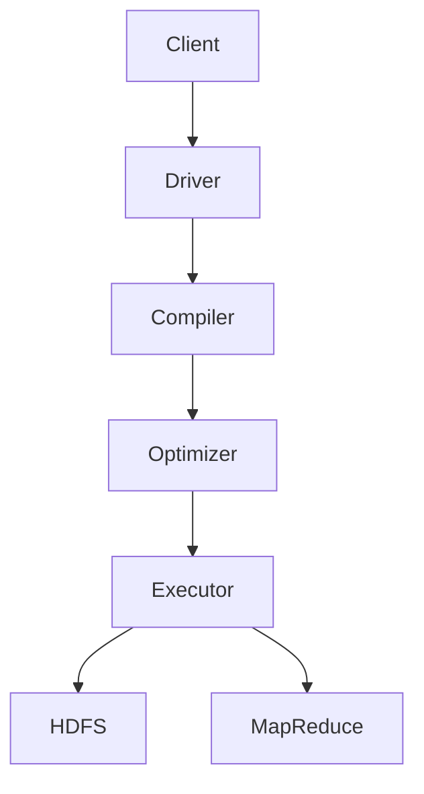

# HiveQL在生物信息学中的应用

## 1. 背景介绍

### 1.1 生物信息学的兴起

生物信息学是一门融合生物学、计算机科学和信息技术的新兴学科。随着基因组测序技术的飞速发展,生物数据的产生量呈指数级增长,传统的数据处理方式已无法满足需求。因此,生物信息学应运而生,旨在利用计算机科学和信息技术来存储、管理、分析和解释海量的生物数据。

### 1.2 大数据处理的挑战

生物数据的特点是体积庞大、种类繁多且复杂多变。例如,人类基因组数据就高达3GB,而在临床和科研领域,每天都会产生大量测序数据。处理如此庞大的数据集对于传统的关系型数据库来说是一个巨大挑战。

### 1.3 Hadoop生态系统的作用

Apache Hadoop是一个开源的大数据处理框架,可以高效地存储和处理海量数据。Hadoop生态系统包括多种工具,如HDFS分布式文件系统、MapReduce并行计算框架、Hive数据仓库等,为生物信息学数据处理提供了强大的支持。

## 2. 核心概念与联系  

### 2.1 Hive简介

Apache Hive是建立在Hadoop之上的数据仓库基础架构,它提供了一种类SQL的查询语言HiveQL(Hive Query Language),使得熟悉SQL的用户能够轻松地管理和分析存储在Hadoop分布式文件系统(HDFS)中的大规模数据集。

### 2.2 HiveQL与SQL的关系

HiveQL借鉴了SQL的语法,使得SQL程序员可以方便地将现有的SQL技能转移到Hive上。但与SQL不同的是,HiveQL被设计用于处理存储在HDFS中的大规模数据集,而不是传统的行存储数据库。

### 2.3 Hive在生物信息学中的作用

在生物信息学领域,Hive可用于:

- 存储和管理海量的生物数据,如基因组测序数据、蛋白质组学数据等
- 使用HiveQL进行数据提取、转换和加载(ETL)
- 对生物数据进行统计分析和数据挖掘
- 与其他大数据工具(如Spark、Pig)集成,构建端到端的数据处理管道

## 3. 核心算法原理具体操作步骤

### 3.1 Hive架构概览

Hive采用了经典的主从架构,由以下几个主要组件组成:

1. **Metastore**:元数据存储,保存着数据库、表、分区等元数据信息
2. **Driver**:处理HiveQL查询的组件,负责查询编译、优化和执行
3. **Compiler**:将HiveQL查询转换为一系列的MapReduce任务
4. **Executor**:在Hadoop集群上执行MapReduce任务

下面是Hive查询执行的基本流程:



### 3.2 HiveQL查询执行步骤

1. **语法分析**: 将HiveQL查询字符串解析成抽象语法树(AST)
2. **类型检查**: 检查AST中的类型是否正确
3. **语义分析**: 构建查询块的有向无环图,解析表和列等元数据
4. **优化**: 对查询块进行逻辑优化,如投影剪裁、谓词下推等
5. **执行**: 生成MapReduce作业,并在Hadoop集群上执行

## 4. 数学模型和公式详细讲解举例说明

在生物信息学中,常常需要对序列数据进行比对和分析。在这个过程中,会涉及到一些数学模型和算法,下面我们以Smith-Waterman算法为例进行说明。

Smith-Waterman算法是一种用于局部序列比对的经典动态规划算法,它可以找到两个序列之间的最佳局部比对。该算法的数学模型如下:

设有两个序列$S_1$和$S_2$,长度分别为$m$和$n$,我们定义一个$(m+1) \times (n+1)$的打分矩阵$H$,其中$H_{i,j}$表示$S_1$的前$i$个字符与$S_2$的前$j$个字符的最佳比对分数。

$$
H_{i,j} = \max \begin{cases}
    0\\
    H_{i-1,j-1} + w(S_1[i], S_2[j])\\
    H_{i-1,j} + w_g\\
    H_{i,j-1} + w_g
\end{cases}
$$

其中:

- $w(S_1[i], S_2[j])$是将$S_1[i]$与$S_2[j]$进行比对时的打分函数
- $w_g$是开缺口的惩罚分数

该算法的时间复杂度为$O(mn)$,空间复杂度为$O(mn)$。

以下是Smith-Waterman算法在HiveQL中的一个实现示例:

```sql
ADD JAR /path/to/smithwaterman.jar;

CREATE TEMPORARY FUNCTION sw 
AS 'com.example.SmithWaterman';

SELECT sw('ACGTACGT', 'CGTCGTCGT');
```

在这个例子中,我们首先加载了包含Smith-Waterman算法实现的JAR包,然后创建了一个临时的UDF(用户自定义函数),最后调用该函数对两个DNA序列进行比对。

## 4. 项目实践:代码实例和详细解释说明

在本节中,我们将通过一个实际的基因组数据处理项目,演示如何在Hive中使用HiveQL进行数据分析。

### 4.1 项目背景

假设我们有一个存储在HDFS上的大规模基因组变异数据集,其中包含了来自不同个体的DNA测序数据。我们的目标是统计每个个体中不同基因位点的变异频率,以帮助研究人员发现与疾病相关的基因变异。

### 4.2 数据准备

首先,我们需要在Hive中创建一个外部表,将HDFS上的数据文件映射为Hive表。假设数据文件的格式如下:

```
个体ID,基因位置,参考碱基,变异碱基
1,12345,A,G
1,67890,T,C
2,12345,A,A
...
```

我们可以使用以下HiveQL语句创建表:

```sql
CREATE EXTERNAL TABLE variants(
  sample_id INT,
  position INT, 
  ref_base STRING,
  alt_base STRING
)
ROW FORMAT DELIMITED
FIELDS TERMINATED BY ','
LOCATION '/path/to/data';
```

### 4.3 数据分析

接下来,我们可以使用HiveQL对数据进行分析。例如,计算每个个体中不同位点的变异频率:

```sql
SELECT sample_id, position, 
       ROUND(COUNT(CASE WHEN ref_base <> alt_base THEN 1 END) * 1.0 / COUNT(*), 4) AS variant_freq
FROM variants
GROUP BY sample_id, position;
```

这条查询首先按照`sample_id`和`position`对数据进行分组,然后计算每个组中变异碱基的比例作为变异频率。

我们还可以进一步分析,例如找出变异频率超过某个阈值的位点:

```sql
SELECT sample_id, position, variant_freq
FROM (
  SELECT sample_id, position,
         ROUND(COUNT(CASE WHEN ref_base <> alt_base THEN 1 END) * 1.0 / COUNT(*), 4) AS variant_freq
  FROM variants
  GROUP BY sample_id, position
) t
WHERE variant_freq > 0.2;
```

### 4.4 结果存储

最后,我们可以将分析结果存储到HDFS或其他存储系统中,以备后续使用。例如,将结果保存为Parquet文件:

```sql
INSERT OVERWRITE DIRECTORY '/path/to/output'
ROW FORMAT DELIMITED
FIELDS TERMINATED BY ','
SELECT sample_id, position, variant_freq
FROM (
  SELECT sample_id, position,
         ROUND(COUNT(CASE WHEN ref_base <> alt_base THEN 1 END) * 1.0 / COUNT(*), 4) AS variant_freq
  FROM variants
  GROUP BY sample_id, position
) t
WHERE variant_freq > 0.2;
```

这条语句将变异频率大于0.2的结果保存到HDFS的`/path/to/output`路径下,以逗号分隔的文本文件格式存储。

通过这个示例,我们可以看到HiveQL在处理大规模基因组数据时的强大功能。它不仅能够高效地存储和管理海量数据,而且可以使用类SQL语法进行灵活的数据分析和处理。

## 5. 实际应用场景

HiveQL在生物信息学领域有着广泛的应用,下面列举了一些典型的场景:

### 5.1 基因组数据分析

基因组测序技术的飞速发展使得每天都会产生大量的基因组数据,HiveQL可以用于存储和分析这些海量的数据。例如,我们可以使用HiveQL对不同个体的基因组数据进行变异检测、注释、富集分析等。

### 5.2 转录组数据处理

转录组测序技术可以测量细胞在特定条件下基因的表达水平,产生的数据量也非常庞大。HiveQL可以用于存储和处理这些转录组数据,如计算基因的差异表达、聚类分析等。

### 5.3 蛋白质组学数据挖掘

蛋白质组学研究蛋白质的结构、功能和相互作用,产生的数据种类繁多、格式复杂。HiveQL可以帮助整合和处理这些异构数据,如进行蛋白质鉴定、定量分析等。

### 5.4 临床数据集成

在临床研究中,往往需要将来自不同源头的数据(如电子病历、基因组数据、影像数据等)进行集成和关联分析。HiveQL可以用于构建临床数据湖,实现跨源数据的整合和分析。

## 6. 工具和资源推荐

在使用HiveQL进行生物信息学数据分析时,以下工具和资源可能会非常有用:

### 6.1 Hive生态工具

- **Hive Metastore**:元数据存储,支持多种后端数据库
- **Hive WebUI**:基于Web的可视化查询界面
- **Hive JDBC/ODBC驱动**:允许使用JDBC/ODBC连接Hive
- **Hive StreamingAPI**:支持流式数据处理

### 6.2 集成工具

- **Apache Spark**:与Hive集成,提供内存计算能力
- **Apache Pig**:高级数据流语言,可与Hive交互
- **Apache Zeppelin**:基于Web的交互式数据分析工具

### 6.3 可视化工具

- **Tableau**:商业数据可视化工具,支持连接Hive
- **Apache Superset**:开源的现代数据探索和可视化Web应用

### 6.4 教程和文档

- **Apache Hive官方文档**
- **Hive编程指南** (O'Reilly出版)
- **生物信息学数据技能** (Coursera在线课程)

## 7. 总结:未来发展趋势与挑战

### 7.1 大数据分析的持续需求

随着生物数据的不断积累,对高效、可扩展的大数据分析工具的需求将持续增长。作为Hadoop生态系统中成熟的SQL引擎,Hive将继续在生物信息学领域发挥重要作用。

### 7.2 云计算和无服务器架构

未来,更多的生物信息学分析工作可能会迁移到云端,利用云服务商提供的无服务器架构(如AWS Athena)进行即时、按需的数据分析。Hive需要与这些新架构进行更好的集成。

### 7.3 机器学习和人工智能的融合

生物信息学数据分析正在从传统的统计方法向机器学习和人工智能方向发展。Hive需要与机器学习框架(如Apache Spark MLlib)进行更紧密的集成,以支持更复杂的分析任务。

### 7.4 数据质量和标准化

由于生物数据来源众多、格式复杂,确保数据质量和标准化是一个巨大的挑战。Hive需要提供更强大的数据质量管理和元数据管理功能。

### 7.5 隐私和安全

生物数据往往涉及个人隐私,如何在保护隐私的同时实现数据共享和分析是一个需要解决的问题。Hive需要加强对数据加密、访问控制等安全功能的支持。

## 8. 附录:常见问题与解答

### 8.1 Hive与