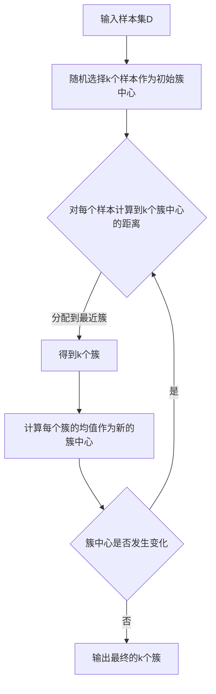

# K-均值聚类K-means原理与代码实例讲解

作者：禅与计算机程序设计艺术

## 1. 背景介绍

### 1.1 聚类分析概述
聚类分析是数据挖掘和机器学习领域中一个重要的研究方向,其目的是将数据集中的样本划分为若干个通常是不相交的子集,每个子集称为一个"簇"。通过这样的划分,每个簇可能对应于一些潜在的概念或类别。聚类分析可以帮助我们发现数据内在的分布结构和规律。

### 1.2 K-means聚类算法简介
K-means是一种经典的基于划分的聚类算法,由MacQueen在1967年提出。它以k为参数,把n个对象分成k个簇,使簇内具有较高的相似度,而簇间的相似度较低。 

K-means算法的基本思想是:通过迭代寻找k个簇的一种划分方案,使得用这k个簇的均值来代表相应各簇时所得到的总体误差最小。k值通常小于样本数n。

### 1.3 K-means算法的优缺点

#### 1.3.1 优点
- 原理简单,实现容易,收敛速度快。
- 当簇近似球形时,分类效果较好。
- 算法的时间复杂度为O(nkt),空间复杂度为O(k+t),其中n为样本数,k为簇数,t为迭代次数。

#### 1.3.2 缺点
- 需要预先确定k值,不同的k值会导致不同的聚类结果。
- 对噪声和异常点敏感,少量的异常点可能会对平均值产生较大影响。
- 容易收敛到局部最优。对初始质心的位置敏感,容易陷入局部最优。
- 只适用于可以计算均值的数据。

## 2. 核心概念与联系

### 2.1 距离度量
聚类分析中,需要计算样本之间的距离或相似度。常用的距离度量包括:
- 欧氏距离(Euclidean Distance):两点之间的直线距离。
- 曼哈顿距离(Manhattan Distance):两点在正交坐标系上的绝对轴距总和。
- 切比雪夫距离(Chebyshev Distance):两点各坐标数值差的最大值。
- 闵可夫斯基距离(Minkowski Distance):欧氏距离和曼哈顿距离的推广。

### 2.2 样本均值
给定样本集D={x1,x2,...,xm},每个样本为n维向量,则样本均值为:
$$\bar{x}=\frac{1}{m}\sum_{i=1}^{m}x_i$$

样本均值反映了样本集合的中心位置。

### 2.3 样本方差
给定样本集D={x1,x2,...,xm},每个样本为n维向量,则样本方差为:
$$S^2=\frac{1}{m-1}\sum_{i=1}^{m}(x_i-\bar{x})^2$$

样本方差反映了样本集合的离散程度。

### 2.4 目标函数
K-means算法的目标是最小化所有样本到其所属簇中心的距离平方和,即最小化平方误差E:
$$E=\sum_{i=1}^{k}\sum_{x\in C_i}||x-\bar{x_i}||^2$$

其中,k为簇的个数,Ci为第i个簇,x为Ci中的样本,$\bar{x_i}$为Ci的均值向量。

## 3. 核心算法原理具体操作步骤

K-means算法的具体步骤如下:

### 3.1 初始化
随机选择k个样本作为初始的簇中心。

### 3.2 聚类分配
对于每个样本xi,计算其到k个簇中心的距离,将其分配到距离最近的簇。

### 3.3 计算新的簇中心
对于每个簇,计算该簇内所有样本的均值,作为新的簇中心。

### 3.4 迭代求解
重复步骤2和3,直到簇中心不再发生变化或达到最大迭代次数。

算法流程如下图所示:



## 4. 数学模型和公式详细讲解举例说明

### 4.1 样本集和簇
假设有一个n维的样本集D={x1,x2,...,xm},xi=(xi1,xi2,...,xin),i=1,2,...,m。
将D划分为k个簇{C1,C2,...,Ck},每个簇Cj包含mj个样本。

### 4.2 簇中心
簇Cj的中心$\bar{x_j}$为该簇内所有样本的均值向量:

$$\bar{x_j}=(\bar{x_{j1}},\bar{x_{j2}},...,\bar{x_{jn}})$$

其中,
$$\bar{x_{jl}}=\frac{1}{m_j}\sum_{x_i\in C_j}x_{il},l=1,2,...,n$$

### 4.3 样本到簇中心的距离
样本xi到簇中心$\bar{x_j}$的距离为:

$$d(x_i,\bar{x_j})=\sqrt{\sum_{l=1}^{n}(x_{il}-\bar{x_{jl}})^2}$$

### 4.4 目标函数求解
K-means的目标是最小化平方误差E:

$$\min E=\sum_{j=1}^{k}\sum_{x_i\in C_j}||x_i-\bar{x_j}||^2$$

其中,
$$||x_i-\bar{x_j}||^2=\sum_{l=1}^{n}(x_{il}-\bar{x_{jl}})^2$$

求解上述目标函数的过程即为K-means聚类的过程。每次迭代时,重新计算簇中心,并将样本重新分配到最近的簇,直到簇中心不再变化。

### 4.5 举例说明
假设有6个二维样本点,坐标如下:
(1,1),(1,2),(2,1),(6,6),(7,6),(6,7)

令k=2,随机选择(1,1)和(6,6)作为初始簇中心。

迭代过程:
1. 计算每个样本到两个簇中心的距离,得到划分C1={(1,1),(1,2),(2,1)},C2={(6,6),(7,6),(6,7)}。
2. 计算新的簇中心$\bar{x_1}$=(1.33,1.33),$\bar{x_2}$=(6.33,6.33)。
3. 重新计算样本到新簇中心的距离,划分不变。
4. 迭代结束,得到最终的两个簇。

## 5. 项目实践：代码实例和详细解释说明

下面给出Python实现K-means聚类的代码:

```python
import numpy as np

class KMeans:
    def __init__(self, n_clusters=2, max_iter=300):
        self.n_clusters = n_clusters
        self.max_iter = max_iter
        self.centroids = None
        
    def fit(self, X):
        # 随机选择初始质心
        idx = np.random.choice(X.shape[0], self.n_clusters, replace=False)
        self.centroids = X[idx, :]
        
        for _ in range(self.max_iter):
            # 计算每个样本到质心的距离
            distances = self._calc_distances(X)
            
            # 将每个样本分配到最近的簇
            cluster_labels = np.argmin(distances, axis=1)
            
            # 更新质心
            new_centroids = np.array([X[cluster_labels == i].mean(axis=0)
                                      for i in range(self.n_clusters)])
            
            # 判断质心是否发生变化
            if np.all(self.centroids == new_centroids):
                break
            self.centroids = new_centroids
        
        return self
    
    def predict(self, X):
        distances = self._calc_distances(X)
        return np.argmin(distances, axis=1)
    
    def _calc_distances(self, X):
        distances = np.zeros((X.shape[0], self.n_clusters))
        for i, centroid in enumerate(self.centroids):
            distances[:, i] = np.linalg.norm(X - centroid, axis=1)
        return distances
```

代码解释:
- `__init__`方法初始化模型参数,包括簇的个数`n_clusters`和最大迭代次数`max_iter`。
- `fit`方法对样本进行聚类。首先随机选择`n_clusters`个样本作为初始质心,然后迭代执行以下步骤:
  - 计算每个样本到各个质心的距离。
  - 将每个样本分配到距离最近的簇。
  - 对每个簇,计算簇内样本的均值作为新的质心。
  - 如果质心不再发生变化,则停止迭代。
- `predict`方法对新的样本进行分类。计算样本到各个质心的距离,将其分配到距离最近的簇。
- `_calc_distances`方法计算样本到质心的距离。使用欧氏距离作为距离度量。

使用该模型进行聚类的示例代码:

```python
from sklearn.datasets import make_blobs

# 生成样本数据
X, _ = make_blobs(n_samples=100, centers=3, random_state=42)

# 构建K-means模型
kmeans = KMeans(n_clusters=3)

# 训练模型
kmeans.fit(X)

# 预测新样本的簇标签
labels = kmeans.predict(X)
```

## 6. 实际应用场景

K-means聚类算法在实际中有广泛的应用,例如:

### 6.1 客户细分
根据客户的属性(如年龄、收入、消费行为等)对客户进行聚类,发现不同的客户群体,制定针对性的营销策略。

### 6.2 图像分割
将图像划分为若干个区域,每个区域内的像素点具有相似的颜色、纹理等特征。可用于目标检测、场景理解等任务。

### 6.3 文本聚类
对文本数据进行聚类,发现主题、话题等潜在的语义结构。可用于文本分类、信息检索等任务。

### 6.4 异常检测
将正常数据聚为一类,异常数据聚为另一类,从而实现异常点的检测。

### 6.5 推荐系统
根据用户的兴趣爱好、行为习惯等,将用户聚为不同的群体,实现个性化推荐。

## 7. 工具和资源推荐

### 7.1 scikit-learn
scikit-learn是Python机器学习领域的重要工具库,提供了K-means等多种聚类算法的高效实现。
官网:https://scikit-learn.org/

### 7.2 ELKI
ELKI是一个用Java编写的开源数据挖掘软件,主要用于聚类分析和异常检测,包含多种聚类算法。
官网:https://elki-project.github.io/

### 7.3 Weka
Weka是一个用Java编写的开源机器学习和数据挖掘软件,提供了多种聚类算法,并带有图形用户界面。
官网:https://www.cs.waikato.ac.nz/ml/weka/

### 7.4 Cluster 3.0
Cluster 3.0是一个用C语言编写的聚类分析软件,主要用于基因表达数据分析。
下载地址:http://bonsai.hgc.jp/~mdehoon/software/cluster/

### 7.5 资源
- 《统计学习方法》李航
- 《机器学习》周志华
- 《数据挖掘:概念与技术》Jiawei Han
- Coursera上吴恩达的机器学习课程

## 8. 总结：未来发展趋势与挑战

### 8.1 K-means算法的改进
针对K-means算法的缺陷,学者们提出了多种改进方法,如二分K-means、Kernel K-means、Mini Batch K-means等。这些算法在一定程度上克服了K-means的局限性。

### 8.2 聚类算法的发展
除了K-means,还有多种其他类型的聚类算法,如层次聚类、密度聚类、谱聚类等。将不同类型的聚类算法结合起来,有望获得更好的聚类效果。

### 8.3 高维数据聚类
随着数据维度的增加,传统的聚类算法面临"维度灾难"的挑战。如何对高维数据进行有效聚类是一个亟待解决的问题。子空间