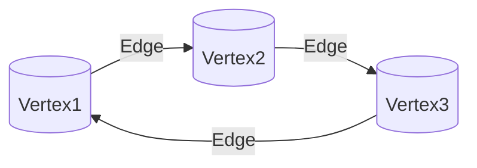
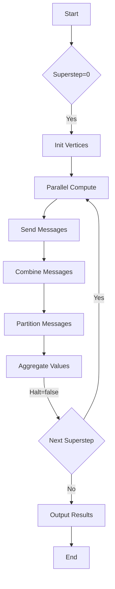

# Pregel原理与代码实例讲解

## 1.背景介绍

### 1.1 大数据时代的到来

随着互联网、物联网和云计算的快速发展,海量数据的产生已经成为一种常态。传统的数据处理方式很难满足大数据场景下对数据处理的需求,因此迫切需要一种新的计算模型来应对这一挑战。

### 1.2 图计算的重要性

在现实世界中,很多复杂的系统都可以用图模型来表示和分析,例如社交网络、交通网络、知识图谱等。因此,对于图数据的高效处理和分析变得尤为重要。

### 1.3 Pregel的诞生

为了解决大规模图数据处理的问题,谷歌于2010年提出了Pregel图计算框架。Pregel借鉴了BSP(Bulk Synchronous Parallel)模型的思想,将图计算任务分解成一系列超步(superstep),每个超步由并行计算和全局同步barrier组成。这种设计使得Pregel可以高效地在大规模分布式系统上执行图算法。

## 2.核心概念与联系

### 2.1 图的表示

在Pregel中,图由顶点(Vertex)和边(Edge)组成。每个顶点维护着自己的值(Value)和出边(OutEdges),通过消息(Message)与其他顶点交换数据。



### 2.2 超步(Superstep)

Pregel将计算过程划分为一系列超步,每个超步包含以下三个阶段:

1. **并行计算阶段**: 所有顶点并行执行用户定义的计算逻辑,处理收到的消息,更新自身值,并发送新的消息给其他顶点。

2. **消息传递阶段**: 系统收集并重新分发所有顶点发送的消息。

3. **全局同步barrier**: 系统等待所有消息传递完毕,进入下一个超步。

### 2.3 计算模型

Pregel的计算模型由用户定义的计算函数组成,主要有:

- `compute(messages)`: 顶点的主要计算逻辑,处理收到的消息,更新自身值,发送新消息。

- `combine(messages)`: 对发送到同一目的地的消息进行合并,减少网络传输。

- `aggregate(value)`: 对所有顶点的值进行聚合,用于全局同步条件判断。

## 3.核心算法原理具体操作步骤 

### 3.1 Pregel算法流程

Pregel算法的执行流程如下:



1. 初始化(Superstep=0): 为每个顶点分配初始值。

2. 并行计算: 所有顶点并行执行`compute()`函数,处理收到的消息,更新自身值,发送新消息。

3. 消息传递: 
    - 消息合并(`combine()`): 对发送到同一目的地的消息进行合并。
    - 消息分区: 按目的顶点对消息进行分区。

4. 全局同步: 
    - 值聚合(`aggregate()`): 对所有顶点的值进行聚合,用于判断是否满足终止条件。
    - 判断终止条件: 如果满足终止条件(如无新消息产生),则输出结果并结束;否则进入下一个超步,重复2-4步骤。

### 3.2 示例:单源最短路径

我们以经典的单源最短路径问题为例,说明Pregel算法的具体实现。

1. 初始化: 将源顶点的距离值设为0,其他顶点设为无穷大。

2. 并行计算:
    - 顶点接收来自邻居的最短距离消息。
    - 更新自身距离值为min(当前值, 邻居距离+边权重)。
    - 如果距离值有更新,则向所有邻居发送新的距离消息。

3. 消息合并: 对于发送到同一顶点的多条距离消息,只保留最小值。

4. 全局同步: 
    - 判断是否有新的距离值更新。
    - 如果没有更新,则终止计算,输出最终结果。

通过多轮迭代,最终所有顶点都会收敛到从源点的最短距离值。

## 4.数学模型和公式详细讲解举例说明

在Pregel中,我们可以使用数学模型和公式来描述和分析算法。以单源最短路径问题为例:

设 $G=(V, E)$ 为一个加权图,其中 $V$ 为顶点集合, $E$ 为边集合。对于每条边 $(u, v) \in E$,其权重为 $w(u, v)$。我们的目标是找到从源点 $s \in V$ 到其他所有顶点的最短路径距离。

定义 $d(v)$ 为从源点 $s$ 到顶点 $v$ 的最短路径距离。我们可以使用动态规划的思路,通过迭代更新每个顶点的距离值:

$$
d(v) = \min\limits_{u \in N(v)} \{d(u) + w(u, v)\}
$$

其中 $N(v)$ 表示顶点 $v$ 的邻居集合。

在每一轮迭代中,每个顶点都会并行执行上述更新规则,直到所有顶点的距离值收敛(不再发生更新)。最终,所有顶点的 $d(v)$ 值就是从源点 $s$ 到该顶点的最短路径距离。

我们可以证明,该算法在无负权环的情况下,最多需要 $|V|-1$ 轮迭代就能收敛到最终结果。

## 4.项目实践:代码实例和详细解释说明

下面我们通过一个具体的代码示例,来展示如何使用Pregel实现单源最短路径算法。我们将使用Giraph(一种基于Hadoop的开源Pregel实现)作为编程框架。

### 4.1 定义图数据结构

```java
public static class ShortestPathVertex extends
        Vertex<IntWritable, IntWritable, IntWritable, IntWritable> {

    // 顶点值: 当前最短路径距离
    private static final IntWritable DIST_INFINITY = new IntWritable(Integer.MAX_VALUE);

    // 计算逻辑
    public void compute(Iterator<IntWritable> msgIterator) {
        // 初始化
        if (getSuperstep() == 0) {
            IntWritable vertexId = getVertexId();
            if (vertexId.get() == 0) {
                setValue(new IntWritable(0)); // 源点距离为0
            } else {
                setValue(DIST_INFINITY); // 其他顶点距离为无穷大
            }
        }

        // 更新距离值
        int minDist = isSource() ? 0 : Integer.MAX_VALUE;
        for (IntWritable msg : msgIterator) {
            int currDist = msg.get();
            if (currDist < minDist) {
                minDist = currDist;
            }
        }

        IntWritable currValue = getValue();
        if (currValue.get() > minDist) {
            currValue.set(minDist);
            setValue(currValue);

            // 向邻居发送新的距离消息
            for (Edge<IntWritable, IntWritable> e : getEdges()) {
                IntWritable distValue = new IntWritable(minDist + e.getValue().get());
                sendMsg(e.getTargetVertexId(), distValue);
            }
        }

        // 如果没有更新,则投票halt
        if (getSuperstep() > 2 && minDist >= currValue.get()) {
            voteToHalt();
        }
    }
}
```

在上面的代码中,我们定义了一个`ShortestPathVertex`类,继承自Giraph的`Vertex`类。每个顶点维护一个`IntWritable`类型的值,表示当前最短路径距离。

在`compute()`方法中,我们实现了单源最短路径算法的核心逻辑:

1. 初始化(Superstep=0): 将源点距离设为0,其他顶点距离设为无穷大。

2. 更新距离值: 
    - 遍历收到的所有消息,找到最小距离值`minDist`。
    - 如果`minDist`小于当前距离值,则更新当前值。
    - 向所有邻居发送新的距离消息。

3. 终止条件: 如果在连续两轮迭代中,顶点的距离值没有更新,则投票halt。

### 4.2 运行Pregel作业

```java
public static void main(String[] args) throws Exception {
    String inputPath = args[0];
    String outputPath = args[1];
    int numWorkers = Integer.parseInt(args[2]);

    Configuration conf = new Configuration();
    Job job = Job.getInstance(conf);
    job.setJarByClass(ShortestPathsApp.class);
    job.setWorkerCommunication(WorkerCommunicationSplitManager.class, WorkerCommunicationSplitManagerSplitWorker.class);

    job.setVertexInputFormatClass(SimpleVertexInputFormat.class);
    FileInputFormat.setInputPaths(job, new Path(inputPath));

    job.setVertexOutputFormatClass(SimpleVertexOutputFormat.class);
    FileOutputFormat.setOutputPath(job, new Path(outputPath));

    job.setNumWorkers(numWorkers);
    job.setVertexClass(ShortestPathVertex.class);

    job.waitForCompletion(true);
}
```

上面的代码展示了如何在Giraph中运行一个Pregel作业。我们需要指定输入数据路径、输出路径和worker数量作为参数。

在作业配置中,我们设置了顶点类(`ShortestPathVertex`)、输入/输出格式等参数。最后,我们提交作业并等待执行完成。

### 4.3 输入数据格式

Giraph支持多种图数据格式作为输入,例如纯文本格式。对于单源最短路径问题,我们可以使用如下格式表示一个简单的图:

```
# 顶点列表
0
1
2
3
4

# 边列表
0 1 1
0 4 5
1 2 2
2 3 1
3 1 3
4 3 2
4 2 6
```

第一部分列出了所有顶点的ID,第二部分描述了边的信息,每行表示一条边`源顶点 目标顶点 权重`。

### 4.4 输出结果

运行Pregel作业后,我们可以在指定的输出路径下查看计算结果。对于单源最短路径问题,输出将包含每个顶点的最终距离值,例如:

```
0 0
1 1
2 3
3 2
4 5
```

表示从源点0到各个顶点的最短路径距离分别为0、1、3、2和5。

通过上面的代码示例,我们可以看到如何使用Pregel框架实现分布式图算法。尽管代码细节较多,但核心思想就是将计算任务分解为一系列超步,在每个超步中并行执行顶点计算、消息传递和全局同步。

## 5.实际应用场景

Pregel及其变体框架已被广泛应用于各种图计算场景,包括但不限于:

1. **社交网络分析**: 在社交网络中,可以使用Pregel执行页面排名、社区发现、影响力分析等算法。

2. **知识图谱构建**: 知识图谱是一种结构化的知识表示形式,可以使用Pregel进行知识抽取、实体链接和推理等任务。

3. **金融风险分析**: 在金融领域,可以将交易网络建模为图,使用Pregel分析风险传播和异常交易检测。

4. **推荐系统**: 基于图的协同过滤算法可以在Pregel上高效实现,用于个性化推荐。

5. **路径规划**: Pregel可以用于计算交通网络中的最短路径、最佳路线等问题。

6. **生物信息学**: 在蛋白质互作网络、基因调控网络等领域,Pregel可以用于分析和发现重要模式。

总的来说,Pregel为大规模图数据处理提供了高效、可扩展的解决方案,在各个领域都有广泛的应用前景。

## 6.工具和资源推荐

如果您对Pregel及其相关技术感兴趣,以下是一些值得关注的工具和资源:

1. **Giraph**: Apache开源的Pregel实现,基于Hadoop构建,支持多种图计算算法。

2. **Spark GraphX**: Spark