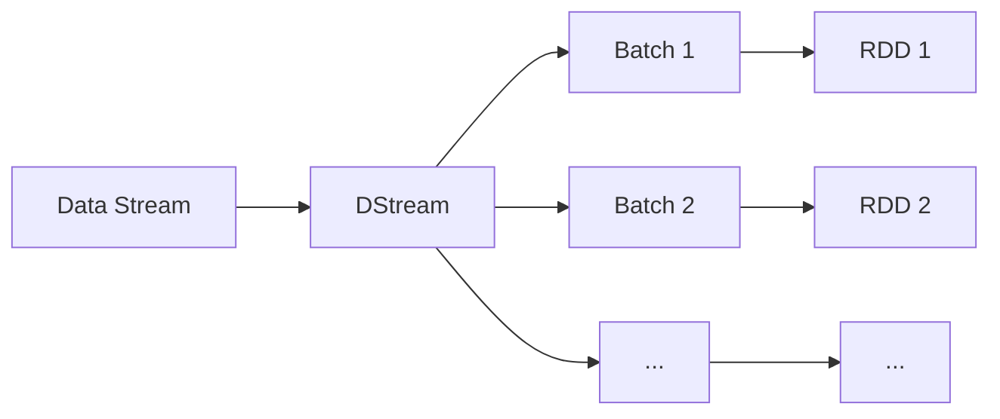

# Spark Streaming原理与代码实例讲解

作者：禅与计算机程序设计艺术

## 1. 背景介绍
### 1.1 大数据流处理的重要性
在当今大数据时代,海量数据以持续不断的流式方式实时产生,传统的批处理模式已经无法满足实时性要求。流式数据处理成为大数据领域的重要分支,在实时推荐、异常检测、欺诈识别等众多场景发挥着关键作用。
### 1.2 Spark Streaming 的崛起 
Spark Streaming 作为 Apache Spark 生态系统中流处理组件,自2013年推出以来广受业界欢迎。它继承了Spark 快速、易用、通用的特点,并提供了高吞吐、强一致性保证、高容错性和可扩展性,成为流处理领域的重要工具。
### 1.3 本文的目的和价值
本文将深入剖析Spark Streaming的技术原理,包括核心概念、工作机制、容错语义等,并辅以代码实例和最佳实践。无论你是Spark新手还是有经验的工程师,都能从本文获得对Spark Streaming全面深入的理解,并将其应用到实际项目中去。

## 2. 核心概念与联系
### 2.1 DStream
DStream(Discretized Stream)是Spark Streaming的核心抽象,代表持续不断的数据流。DStream 可以看作是一系列的RDD(弹性分布式数据集),每个RDD包含一个时间间隔内的数据。
### 2.2 Receiver
Receiver是专门用来接收实时输入数据流的组件。Spark Streaming提供了多种内置的Receiver,如 Socket、Kafka、Flume等,也允许用户自定义Receiver。
### 2.3 Job、Batch、Batch Interval
Spark Streaming 将持续的数据流划分成一系列的batch,每个batch的数据被当作一个RDD 处理。Batch Interval 指每个batch的时间间隔,如1秒。Job则代表对一个batch数据的处理过程。
### 2.4 核心概念关系图解
下图展示了DStream、Batch、RDD三者的关系:


## 3. 核心算法原理具体操作步骤
### 3.1 初始化StreamingContext
StreamingContext 是Spark Streaming的入口。创建StreamingContext需要指定Spark配置和batch interval。
```scala
val conf = new SparkConf().setAppName(appName).setMaster(master)
val ssc = new StreamingContext(conf, Seconds(1))
```
### 3.2 定义输入DStream
通过StreamingContext从数据源创建输入DStream。不同的数据源对应不同的创建方式。如从Kafka创建:
```scala
val kafkaParams = Map[String, Object](
  "bootstrap.servers" -> "localhost:9092",
  "key.deserializer" -> classOf[StringDeserializer],
  "value.deserializer" -> classOf[StringDeserializer],
  "group.id" -> "use_a_separate_group_id_for_each_stream",
  "auto.offset.reset" -> "latest"
)

val topics = Array("topicA", "topicB")
val stream = KafkaUtils.createDirectStream[String, String](
  ssc,
  LocationStrategies.PreferConsistent,
  ConsumerStrategies.Subscribe[String, String](topics, kafkaParams)
)
```
### 3.3 转换操作
对DStream 进行类似RDD的转换操作,如map、filter、reduce等,这些转换是延迟执行的。
```scala
val wordsStream = stream.flatMap(_.split(" "))
val pairStream = wordsStream.map(word => (word, 1))
val countStream = pairStream.reduceByKey(_ + _)
```
### 3.4 输出操作
输出操作触发所有前面的转换算子真正执行计算,如print()会在每个batch输出结果,foreachRDD允许对RDD自定义处理。
```scala
countStream.print()

countStream.foreachRDD { rdd =>
  val spark = SparkSession.builder.config(rdd.sparkContext.getConf).getOrCreate()
  import spark.implicits._

  val df = rdd.toDF("word", "count")
  df.write.format("jdbc")
    .option("url", "jdbc:mysql://localhost/test")
    .option("dbtable", "wordcount")
    .option("user", "root")
    .option("password", "123456")
    .mode(SaveMode.Append)
    .save()
}
```
### 3.5 启动流计算
调用streamingContext.start() 启动Spark Streaming,调用awaitTermination等待终止。
```scala
ssc.start()
ssc.awaitTermination()
```

## 4. 数学模型和公式详细讲解举例说明
### 4.1 滑动窗口
Spark Streaming 支持窗口操作,如reduceByKeyAndWindow。窗口大小和滑动步长可以用数学公式表示:

设窗口长度为 $T$,滑动步长为 $S$,每个时刻 $t_i$ 的窗口 $W_i$ 包含区间 $[t_i - T, t_i]$ 内的数据。相邻两个窗口的数据重叠部分为 $T-S$。

若 $T=3, S=2$,则相邻窗口如下:

$W_1: [t_1-3, t_1]$
$W_2: [t_2-3, t_2]$, 与$W_1$重叠 $[t_1-1, t_1]$

### 4.2 Watermark
Watermark是Spark Structured Streaming引入的解决数据延迟和乱序问题的机制。Watermark的公式定义如下:

$Watermark(t) = t - \delta$ 

其中 $t$ 是当前处理时间,而 $\delta$ 是允许数据延迟的阈值。Spark只处理event time小于Watermark的数据,而将大于Watermark的数据缓存起来,等待一段时间再处理。

例如,设 $\delta$ 为10分钟。当前时间是 12:30,则12:20之前的数据被处理,12:20~12:30的数据被缓存。当Watermark推进到12:40时,12:30之前的缓存数据才被处理。

## 5. 项目实践：代码实例和详细解释说明
下面我们用一个实际项目:实时单词计数,来演示Spark Streaming的完整代码。

### 5.1 项目需求
统计一个TCP数据流中单词出现频率,每10秒更新一次统计结果。

### 5.2 项目代码
```scala
import org.apache.spark.SparkConf
import org.apache.spark.streaming.{Seconds, StreamingContext}

object NetworkWordCount {
  def main(args: Array[String]) {
    // 创建SparkConf
    val sparkConf = new SparkConf().setAppName("NetworkWordCount")
    // 创建StreamingContext,每10秒一个batch
    val ssc = new StreamingContext(sparkConf, Seconds(10))
  
    // 创建文本输入流,监听9999端口
    val lines = ssc.socketTextStream("localhost", 9999)
    
    // 切分单词
    val words = lines.flatMap(_.split(" "))
    
    // 转换成(word, 1)的tuple
    val wordTuples = words.map(word => (word, 1))
    
    // 按单词聚合并求和
    val wordCounts = wordTuples.reduceByKey(_ + _)
    
    // 打印结果
    wordCounts.print()
    
    // 启动流计算
    ssc.start()
    ssc.awaitTermination()
  }
}
```

### 5.3 代码解释
1. 首先创建SparkConf和StreamingContext,设置每10秒一个batch。
2. 用socketTextStream创建一个文本流,监听localhost的9999端口。这个流就是DStream。
3. 用flatMap对每一行文本进行切分,得到一个包含所有单词的DStream。
4. 用map将每个单词转换成(word, 1)的tuple形式。
5. 用reduceByKey按单词聚合并对出现次数求和。Spark会在内部为每10秒的数据生成一个RDD,并执行reduceByKey。
6. 用print()打印每一个batch的计算结果。
7. 用start()启动流计算,用awaitTermination()等待终止。

## 6. 实际应用场景
Spark Streaming在实际生产中有非常广泛的应用,下面列举几个典型场景:

### 6.1 实时日志分析
Web服务器、移动App会源源不断地产生日志数据。用Spark Streaming 可以实时分析日志,统计PV/UV、用户访问路径、异常请求等,及时反馈业务状态。

### 6.2 实时推荐
电商网站、新闻App、短视频平台等都会实时收集用户的浏览、点击行为。将用户行为作为流式数据,用Spark Streaming处理,更新用户画像,给用户实时推荐感兴趣的商品、新闻和视频。

### 6.3 实时欺诈检测
银行、证券、保险等金融机构需要实时识别异常交易和欺诈行为。将交易数据作为流式输入,用Spark Streaming结合机器学习模型,实时判断每笔交易的风险,防范欺诈。

### 6.4 物联网数据分析
工业设备、智能家电、可穿戴设备会持续产生海量传感器数据。用Spark Streaming 实时分析物联网数据,可以及时发现设备故障,优化能源使用,提供个性化服务。

## 7. 工具和资源推荐
### 7.1 编程语言
Spark Streaming支持Scala、Java、Python等多种语言。推荐使用Scala,因为Spark就是用Scala编写的,Scala代码最简洁高效。

### 7.2 集成开发环境
Scala 常用的IDE有IntelliJ IDEA和Scala IDE for Eclipse。前者是JetBrains开发的商业IDE,功能强大;后者是基于Eclipse的开源IDE。

### 7.3 构建工具
Scala项目通常用sbt作为构建工具。类似Java的Maven,sbt可以管理库依赖和项目构建。另一个选择是Maven的Scala插件。

### 7.4 部署工具
生产环境部署Spark应用,可以用Spark自带的spark-submit,也可以用YARN、Mesos等资源管理系统。对于容器化部署,可以用Kubernetes。

### 7.5 监控工具
Spark UI 可以监控Spark Streaming的运行状态,如batch处理延迟、收到的记录数等。Ganglia、Grafana等第三方工具可以监控Spark集群的CPU、内存、网络等资源使用情况。

### 7.6 学习资源
- 官方文档:Spark Streaming Programming Guide是权威指南。
- 书籍:《Spark: The Definitive Guide》、《Learning Spark, 2nd Edition》等。
- 视频课程:Udemy、Coursera有Spark相关课程。
- 技术博客:The Databricks Blog、Spark Technology Center等。

## 8. 总结:未来发展趋势与挑战
### 8.1 结构化流处理
Spark Structured Streaming 是Spark Streaming的升级版,提供更高层的抽象和更强的一致性语义。它将会是Spark流处理的发展方向。

### 8.2 流批一体
流处理和批处理在源头架构和API层面会进一步融合。Spark已经用DataFrame/Dataset统一了流批API。未来会有更多统一的流批处理引擎出现。

### 8.3 SQL化
Spark SQL使得Spark能处理结构化数据。随着Structured Streaming的成熟,用户可以用标准SQL处理流式数据,大大降低使用门槛。

### 8.4 机器学习
Spark MLlib已经支持一些流式机器学习算法。未来Spark会与TensorFlow、PyTorch等深度学习框架进一步整合,支持端到端的流式机器学习pipeline。

### 8.5 挑战
- 乱序数据:如何高效处理乱序数据,平衡准确性、延迟和资源消耗,是一大挑战。
- 状态管理:流式应用通常要在内存中维护大量状态数据,需要高效的状态存储和容错机制。
- 背压机制:如何平衡上游数据生成速率和下游数据处理能力,避免数据积压,是背压机制需要解决的问题。

## 9. 附录:常见问题与解答
### Q1:Spark Streaming和Flink的区别是什么?
A1:二者都是流处理引擎,但在流模型、时间语义、容错机制等方面有差异。Spark Streaming是微批处理模型,而Flink是纯流模型;Spark Streaming主要支持处理时间,而Flink同时支持事件时间和处理时间;Spark Streaming 采用checkpoint和lineage容错,而Flink采用分布式快照。

### Q2:Spark Streaming如何保证exactly-once语义?
A2:Spark Streaming通过WAL(write-ahead log)和