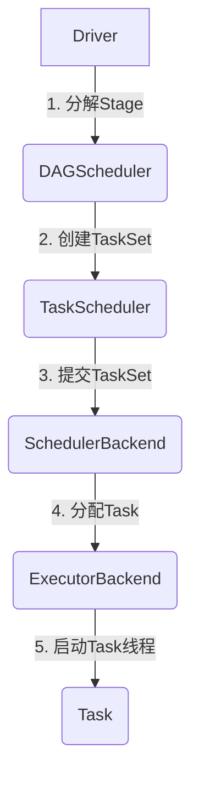
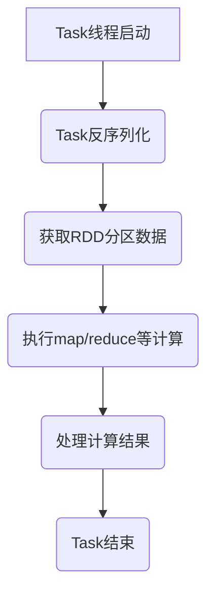
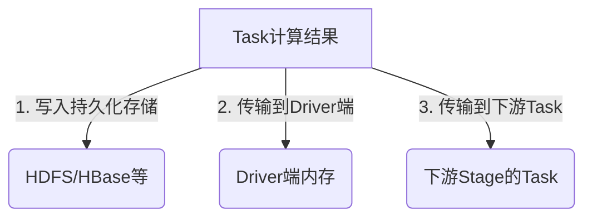
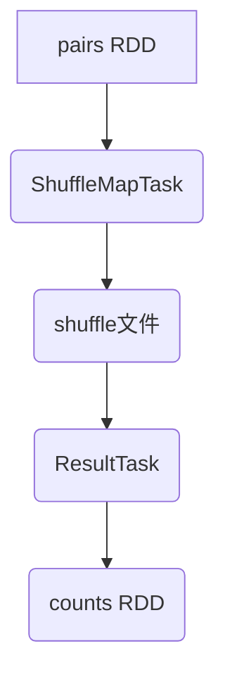

# Spark Task原理与代码实例讲解

## 1.背景介绍

Apache Spark是一种用于大规模数据处理的统一分析引擎。它提供了一种称为Resilient Distributed Dataset (RDD) 的数据结构，用于分布式内存计算。RDD是一种不可变的、分区的记录集合，可以并行操作。Spark Task是Spark执行计划中最小的工作单元,负责处理RDD分区上的数据。

Spark Task的执行过程包括以下几个主要阶段:

1. **Task获取**:ExecutorBackend向SchedulerBackend申请Task资源,SchedulerBackend分配Task给ExecutorBackend。

2. **Task反序列化**:ExecutorBackend反序列化Task,准备执行。

3. **Task计算**:Task获取RDD分区数据,执行计算逻辑。

4. **Task结果处理**:Task将计算结果返回给Spark Driver或者存储到外部系统。

Spark Task的执行效率直接影响整个Spark作业的性能,因此理解Task原理并优化Task执行非常重要。

## 2.核心概念与联系

### 2.1 Task类型

Spark中有两种主要的Task类型:ShuffleMapTask和ResultTask。

**ShuffleMapTask**负责执行map阶段的计算,生成中间shuffle文件,供后续reduce任务读取。

**ResultTask**负责执行最终的action操作,例如foreach、count、collect等。

### 2.2 TaskSet和Stage

TaskSet是一组相互关联的Task的集合,由同一个RDD的不同分区组成。Stage是TaskSet的集合,一个作业可以分为多个Stage执行。

### 2.3 TaskScheduler和TaskSchedulingMode 

TaskScheduler负责将TaskSet分发到Executor上执行。Spark支持多种TaskSchedulingMode:

- FIFO: 先来先服务
- FAIR: 根据资源公平调度
- LOCALITY_FIRST: 优先本地节点
- LOCALITY_WAIT: 等待本地节点可用

## 3.核心算法原理具体操作步骤  

### 3.1 Task提交流程

1. Driver程序将RDD逻辑执行计划分解为多个Stage
2. 对于每个Stage,Spark创建一个TaskSet
3. TaskScheduler将TaskSet提交给SchedulerBackend
4. SchedulerBackend分配Task给ExecutorBackend
5. ExecutorBackend在Executor上启动Task线程执行Task



### 3.2 Task执行流程

1. Task反序列化计算逻辑
2. 获取RDD分区数据
3. 执行map/reduce等计算逻辑
4. 处理计算结果
5. Task结束



### 3.3 Task结果处理

Task结果处理方式有三种:

1. 写入持久化存储(HDFS/HBase等)
2. 传输到Driver端
3. 传输到下游Stage的Task



## 4.数学模型和公式详细讲解举例说明

在Spark作业的执行过程中,有一些重要的数学模型和公式需要了解,以便更好地理解和优化Spark作业。

### 4.1 数据本地性原理

数据本地性是Spark调度器的一个重要原则,旨在尽可能将计算任务调度到存储数据的节点上,以减少数据传输开销。Spark使用以下公式计算数据本地性级别:

$$
DataLocality = \begin{cases}
    PROCESS\_LOCAL, & \text{if data is in the same JVM} \\
    NODE\_LOCAL, & \text{if data is on the same node} \\
    RACK\_LOCAL, & \text{if data is on the same rack} \\
    ANY, & \text{otherwise}
\end{cases}
$$

其中,PROCESS_LOCAL > NODE_LOCAL > RACK_LOCAL > ANY。

### 4.2 Spark内存管理模型

Spark采用统一的内存管理模型,将Executor的内存分为三部分:

- Reserved Memory: 用于存储Spark内部数据结构,如广播变量等。
- User Memory: 用于存储RDD数据和中间结果。
- Unmanaged Memory: 用于其他用途,如第三方库等。

Spark使用以下公式计算User Memory的大小:

$$
UserMemory = max(requestedMemory, minimumMemory) \\
minimumMemory = max(384MB, fractionOfHeapSpace * HeapSize)
$$

其中,requestedMemory是用户请求的内存大小,fractionOfHeapSpace默认为0.6。

### 4.3 Spark Shuffle性能模型

Shuffle过程是Spark作业中的一个关键环节,其性能直接影响整个作业的执行效率。Spark Shuffle的性能可以用以下公式估算:

$$
ShuffleTime = \sum_{i=1}^{n} (ReadTime_i + NetworkTime_i + WriteTime_i)
$$

其中,n是Mapper的数量,ReadTime是读取数据的时间,NetworkTime是网络传输时间,WriteTime是写入数据的时间。

为了优化Shuffle性能,可以采取以下策略:

- 减少Shuffle写入文件数量
- 增加Shuffle并行度
- 使用高效的序列化格式
- 优化网络配置

## 5.项目实践:代码实例和详细解释说明

下面通过一个简单的WordCount示例,展示如何在Spark中提交和执行Task。

### 5.1 WordCount示例代码

```scala
import org.apache.spark.{SparkConf, SparkContext}

object WordCount {
  def main(args: Array[String]): Unit = {
    // 创建SparkConf
    val conf = new SparkConf().setAppName("WordCount")
    // 创建SparkContext
    val sc = new SparkContext(conf)

    // 读取文件
    val lines = sc.textFile("data.txt")
    // 分词
    val words = lines.flatMap(line => line.split(" "))
    // 映射为(word, 1)格式
    val pairs = words.map(word => (word, 1))
    // 按key聚合统计
    val counts = pairs.reduceByKey(_ + _)
    // 保存结果
    counts.saveAsTextFile("output")
  }
}
```

### 5.2 执行流程解释

1. 创建SparkConf和SparkContext
2. 通过textFile()创建lines RDD
3. 对lines RDD执行flatMap()转换,生成words RDD
4. 对words RDD执行map()转换,生成pairs RDD
5. 对pairs RDD执行reduceByKey()行动,生成counts RDD
6. 对counts RDD执行saveAsTextFile()行动,将结果保存到HDFS

在执行过程中,Spark会根据RDD的依赖关系构建DAG,并将DAG分解为多个Stage执行。每个Stage都会生成一个TaskSet,TaskScheduler负责将TaskSet分发到Executor上执行Task。

以reduceByKey()为例,它会触发一个ShuffleMapTask和多个ResultTask:

1. ShuffleMapTask读取RDD分区数据,进行map操作并生成shuffle文件
2. ResultTask读取shuffle文件,进行reduce操作并输出最终结果



## 6.实际应用场景

Spark Task广泛应用于各种大数据处理场景,包括但不限于:

- **批处理分析**: 利用Spark进行离线数据分析,如用户行为分析、日志处理等。
- **流式计算**: 使用Spark Streaming进行实时数据流处理,如网络日志分析、在线推荐等。
- **机器学习**: 利用Spark MLlib进行分布式机器学习算法训练,如逻辑回归、决策树等。
- **图计算**: 使用Spark GraphX进行大规模图数据处理,如社交网络分析、路径规划等。

## 7.工具和资源推荐  

- **Apache Spark官网**: https://spark.apache.org/
- **Spark编程指南**: https://spark.apache.org/docs/latest/rdd-programming-guide.html
- **Spark性能调优指南**: https://spark.apache.org/docs/latest/tuning.html
- **Spark UI**: Spark自带的Web UI,用于监控和调试Spark作业
- **Apache Spark官方文档**: https://spark.apache.org/documentation.html
- **Spark源码**: https://github.com/apache/spark
- **Spark社区**: https://spark.apache.org/community.html

## 8.总结:未来发展趋势与挑战

Spark作为大数据处理的核心引擎,其发展趋势和面临的挑战包括:

- **AI和机器学习的融合**: 将Spark与深度学习框架(如TensorFlow)更紧密地集成,提供端到端的AI解决方案。
- **流式处理增强**: 加强Spark Streaming的功能,支持更低延迟和更高吞吐量的流式处理。
- **云原生支持**: 更好地支持云原生环境,如Kubernetes集成、Serverless等。
- **性能优化**: 持续优化Spark的性能,包括内存管理、任务调度、数据局部性等方面。
- **简化使用体验**: 提供更友好的API和工具,降低使用门槛,吸引更多开发者加入Spark社区。

## 9.附录:常见问题与解答

1. **什么是Spark Task?**

Spark Task是Spark执行计划中最小的工作单元,负责处理RDD分区上的数据。

2. **Spark Task有哪些类型?**

Spark主要有两种Task类型:ShuffleMapTask和ResultTask。

3. **如何提高Spark Task的执行效率?**

可以从以下几个方面着手:
- 优化数据局部性,尽量将Task调度到存储数据的节点上
- 合理设置Spark内存参数,避免内存不足或浪费
- 优化Shuffle性能,减少Shuffle写入文件数量,增加并行度
- 使用高效的序列化格式,减少网络传输开销

4. **Spark Task是如何调度和执行的?**

TaskScheduler负责将TaskSet分发给SchedulerBackend,SchedulerBackend再将Task分配给ExecutorBackend执行。

5. **Spark Task的执行过程包括哪些阶段?**

Spark Task的执行过程包括:Task获取、Task反序列化、Task计算、Task结果处理。

6. **如何监控和调试Spark Task?**

可以使用Spark自带的Web UI查看Task的执行情况,也可以在代码中添加日志输出,了解Task的运行状态。