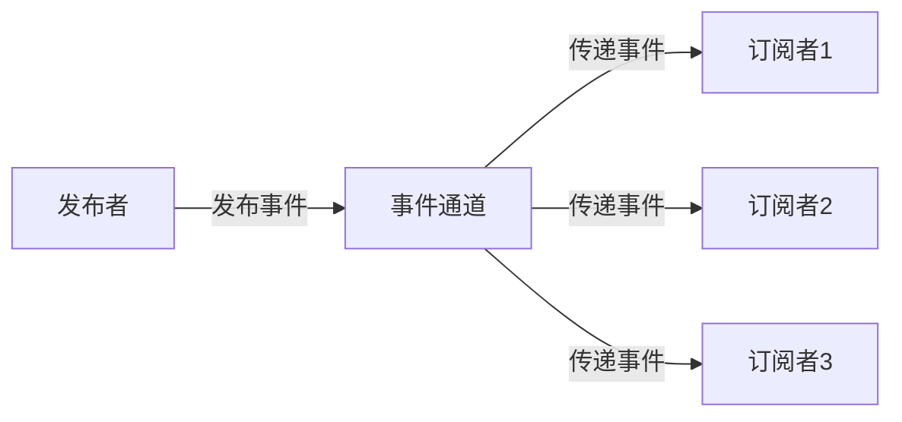
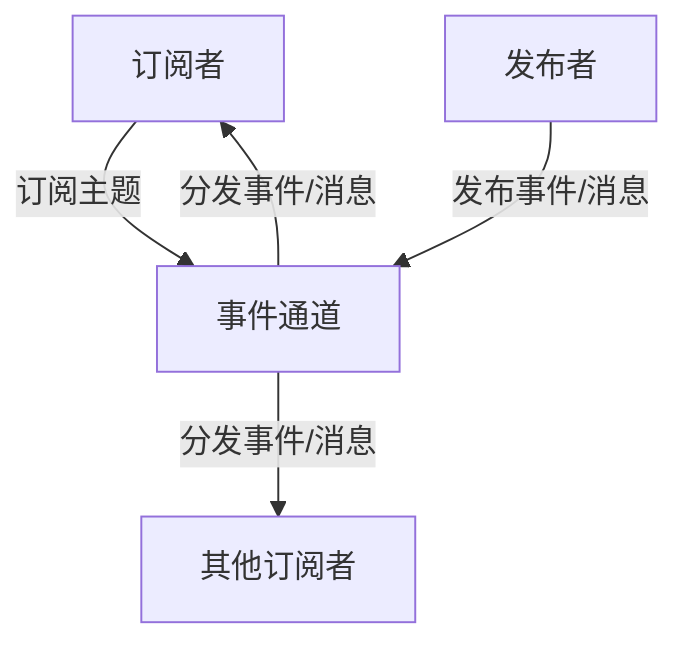

# 发布订阅 原理与代码实例讲解

## 1. 背景介绍

### 1.1 什么是发布订阅模式

发布订阅模式（Publish-Subscribe Pattern）是一种消息传递模式，它定义了一种对象之间的一对多的依赖关系，让多个订阅者对象可以同时监听某一个发布者对象。这种模式是实现松耦合的一种常用方式。

### 1.2 发布订阅模式的优势

- **解耦**：发布者和订阅者之间没有直接依赖关系，不需要知道对方的存在，实现了很好的解耦。
- **可扩展性**：新的订阅者可以动态地添加到系统中，而无需修改发布者的代码。
- **并发操作**：订阅者在接收消息后可以并发执行操作，提高系统的吞吐量。
- **可靠性**：一条消息可以传递给多个订阅者，提高了系统的可靠性。

### 1.3 发布订阅模式的应用场景

发布订阅模式在软件开发中有广泛的应用场景，例如：

- **事件驱动编程**：GUI 编程、异步编程等。
- **企业应用集成**：在不同系统之间传递消息和事件。
- **网络服务**：如 RSS 订阅、WebHooks 等。
- **物联网**：传感器数据的采集和分发。

## 2. 核心概念与联系

### 2.1 核心概念

- **发布者（Publisher）**：负责发布事件/消息的对象。
- **订阅者（Subscriber）**：对某个事件/消息有兴趣，需要订阅该事件/消息的对象。
- **事件通道（Event Channel）**：发布者和订阅者之间传递事件/消息的通道，它们通过事件通道进行通信。
- **主题（Topic）**：事件/消息所属的类型，订阅者可以根据主题进行订阅。



### 2.2 发布订阅模式的实现方式

发布订阅模式可以通过多种方式实现，包括：

- **观察者模式**：发布者和订阅者之间存在直接依赖关系。
- **消息队列**：使用中间件作为事件通道，如 RabbitMQ、Kafka 等。
- **事件总线**：在应用程序内部实现一个事件总线作为事件通道。

## 3. 核心算法原理具体操作步骤

### 3.1 发布订阅模式的核心算法

发布订阅模式的核心算法包括以下几个步骤：

1. **订阅**：订阅者向事件通道注册自己对某个主题的订阅关系。
2. **发布**：发布者向事件通道发布一个事件/消息，并指定该事件/消息的主题。
3. **分发**：事件通道获取到发布的事件/消息后，根据该事件/消息的主题，将其分发给所有订阅了该主题的订阅者。
4. **处理**：订阅者接收到事件/消息后，执行相应的处理逻辑。



### 3.2 发布订阅模式的具体实现步骤

以下是使用事件总线方式实现发布订阅模式的具体步骤：

1. **定义事件类**：定义一个表示事件/消息的类，包含事件主题、事件数据等属性。
2. **创建事件总线**：创建一个事件总线类作为事件通道，维护订阅者列表和提供订阅/发布方法。
3. **订阅事件**：订阅者调用事件总线的订阅方法，传入感兴趣的主题和自身的回调函数。
4. **发布事件**：发布者创建一个事件对象，并调用事件总线的发布方法，传入该事件对象。
5. **分发事件**：事件总线获取到发布的事件后，根据事件主题，遍历订阅者列表，并调用订阅者的回调函数，将事件数据传递给订阅者。

## 4. 数学模型和公式详细讲解举例说明

在发布订阅模式中，通常不需要使用复杂的数学模型或公式。但是，如果需要对事件的传递进行优化或者进行性能分析，可以使用一些简单的数学模型或公式。

例如，假设有 $n$ 个订阅者订阅了某个主题，当发布一个事件时，事件通道需要将该事件分发给所有订阅者。我们可以使用以下公式来估计分发事件所需的时间：

$$
T = n \times t_p + t_d
$$

其中：

- $T$ 表示分发事件所需的总时间。
- $n$ 表示订阅者的数量。
- $t_p$ 表示处理每个订阅者所需的时间。
- $t_d$ 表示事件通道分发事件的固定开销时间。

如果我们知道 $t_p$ 和 $t_d$ 的具体值，就可以根据订阅者数量 $n$ 来估计分发事件所需的时间。这对于优化事件分发过程或者评估系统的性能非常有帮助。

另一个例子是，如果事件通道使用队列来缓存事件，我们可以使用队列理论中的一些公式来分析队列的行为，例如计算平均等待时间、队列长度等。

## 4. 项目实践：代码实例和详细解释说明

为了更好地理解发布订阅模式的实现，我们将使用 Python 编写一个简单的示例。在这个示例中，我们将创建一个事件总线作为事件通道，并实现订阅、发布和事件处理的功能。

### 4.1 定义事件类

首先，我们定义一个表示事件的类 `Event`，它包含事件主题和事件数据两个属性：

```python
class Event:
    def __init__(self, topic, data):
        self.topic = topic
        self.data = data
```

### 4.2 创建事件总线

接下来，我们创建一个事件总线类 `EventBus`，它作为事件通道，维护订阅者列表，并提供订阅、发布和取消订阅的方法。

```python
class EventBus:
    def __init__(self):
        self.subscribers = {}

    def subscribe(self, topic, callback):
        if topic in self.subscribers:
            self.subscribers[topic].append(callback)
        else:
            self.subscribers[topic] = [callback]

    def publish(self, event):
        topic = event.topic
        if topic in self.subscribers:
            for callback in self.subscribers[topic]:
                callback(event.data)

    def unsubscribe(self, topic, callback):
        if topic in self.subscribers:
            self.subscribers[topic].remove(callback)
```

- `subscribe(topic, callback)`：订阅者调用该方法，传入感兴趣的主题和自身的回调函数，将回调函数添加到对应主题的订阅者列表中。
- `publish(event)`：发布者调用该方法，传入一个事件对象。事件总线根据事件主题，遍历订阅者列表，并调用每个订阅者的回调函数，将事件数据传递给订阅者。
- `unsubscribe(topic, callback)`：订阅者调用该方法，传入主题和自身的回调函数，从对应主题的订阅者列表中移除该回调函数。

### 4.3 使用示例

现在，我们来看一个使用事件总线的示例。假设我们有两个订阅者：一个订阅了 "news" 主题，另一个订阅了 "music" 主题。

```python
# 创建事件总线
event_bus = EventBus()

# 定义订阅者回调函数
def news_subscriber(data):
    print(f"News subscriber received: {data}")

def music_subscriber(data):
    print(f"Music subscriber received: {data}")

# 订阅主题
event_bus.subscribe("news", news_subscriber)
event_bus.subscribe("music", music_subscriber)

# 发布事件
event_bus.publish(Event("news", "Breaking news!"))
event_bus.publish(Event("music", "New album released!"))
```

输出结果：

```
News subscriber received: Breaking news!
Music subscriber received: New album released!
```

在这个示例中，我们首先创建了一个事件总线实例 `event_bus`。然后，我们定义了两个订阅者回调函数 `news_subscriber` 和 `music_subscriber`，分别用于处理 "news" 和 "music" 主题的事件。

接下来，我们调用 `subscribe` 方法，将回调函数注册到对应的主题上。最后，我们发布了两个事件，一个属于 "news" 主题，另一个属于 "music" 主题。

事件总线根据事件主题，将事件数据传递给相应的订阅者回调函数。因此，"Breaking news!" 被传递给了 `news_subscriber`，而 "New album released!" 被传递给了 `music_subscriber`。

通过这个示例，我们可以清楚地看到发布订阅模式的工作原理，以及如何使用事件总线实现该模式。

## 5. 实际应用场景

发布订阅模式在实际应用中有广泛的应用场景，下面是一些常见的例子：

### 5.1 GUI 编程

在图形用户界面（GUI）编程中，发布订阅模式被广泛用于实现事件驱动编程。例如，在 Windows 编程中，控件会发布各种事件（如鼠标点击、键盘输入等），而应用程序则订阅感兴趣的事件并执行相应的操作。

### 5.2 异步编程

在异步编程中，发布订阅模式可以用于解耦异步操作和事件处理。例如，在 Node.js 中，可以使用 EventEmitter 模块实现发布订阅模式，用于处理异步 I/O 操作的事件。

### 5.3 企业应用集成

在企业应用集成（EAI）中，发布订阅模式被用于在不同系统之间传递消息和事件。例如，当一个系统发生某个事件时，它可以发布一个消息，而其他感兴趣的系统则可以订阅该消息并执行相应的操作。

### 5.4 物联网

在物联网（IoT）领域，发布订阅模式可以用于传感器数据的采集和分发。传感器作为发布者，发布采集到的数据，而其他系统作为订阅者，订阅感兴趣的数据进行处理和分析。

### 5.5 消息队列

消息队列系统（如 RabbitMQ、Kafka 等）通常采用发布订阅模式来实现消息的传递和处理。生产者发布消息到队列中，而消费者则订阅队列并消费消息。

## 6. 工具和资源推荐

为了更好地理解和实现发布订阅模式，以下是一些推荐的工具和资源：

### 6.1 开源库和框架

- **Python**：标准库中的 `asyncio` 模块提供了 `EventEmitter` 类，可以用于实现发布订阅模式。还有一些第三方库如 `PyPubSub`、`RxPY` 等。
- **JavaScript**：Node.js 中的 `EventEmitter` 模块可以用于实现发布订阅模式。还有一些第三方库如 `RxJS`、`PubSubJS` 等。
- **Java**：Java 中没有内置的发布订阅模式实现，但有许多第三方库如 `Google Guava`、`RxJava` 等。
- **C#**：.NET 中的 `EventHandler` 和 `EventArgs` 可以用于实现发布订阅模式。还有一些第三方库如 `Reactive Extensions` 等。

### 6.2 消息队列系统

- **RabbitMQ**：一个流行的开源消息队列系统，支持多种消息传递协议，包括 AMQP。
- **Apache Kafka**：一个分布式流处理平台，常用于构建实时数据管道和流应用程序。
- **Apache ActiveMQ**：一个支持多种协议的开源消息队列系统。
- **Amazon SQS**：AWS 提供的分布式消息队列服务。

### 6.3 在线资源

- **设计模式**：学习发布订阅模式及其他设计模式的在线资源，如《设计模式：可复用面向对象软件的基础》一书。
- **博客和教程**：介绍发布订阅模式及其实