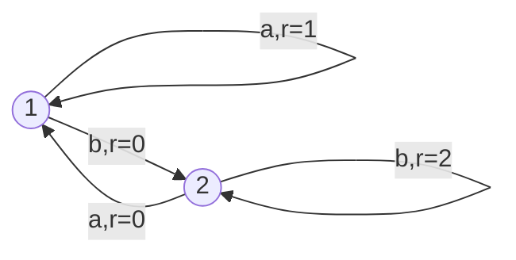

# 强化学习：学习率与折扣因子选择

作者：禅与计算机程序设计艺术

## 1. 背景介绍

### 1.1 强化学习概述
强化学习(Reinforcement Learning, RL)是机器学习的一个重要分支,它通过智能体(Agent)与环境(Environment)的交互来学习最优策略,以获得最大的累积奖励。与监督学习和非监督学习不同,强化学习不需要预先准备好标注数据,而是通过探索(Exploration)和利用(Exploitation)来不断优化策略。

### 1.2 学习率和折扣因子的重要性
在强化学习算法中,学习率(Learning Rate)和折扣因子(Discount Factor)是两个非常重要的超参数,它们直接影响了算法的收敛速度和学习效果。学习率决定了每次更新时,新获得的信息对原有策略的影响程度;而折扣因子则反映了未来奖励对当前决策的重要性。合理地设置这两个参数,对于强化学习算法的性能至关重要。

### 1.3 本文的目的和结构
本文将深入探讨强化学习中学习率和折扣因子的选择问题。首先,我们将介绍这两个概念的基本定义和数学表示。然后,通过理论分析和实验对比,讨论不同参数设置对算法性能的影响。最后,给出一些实用的参数调优建议和思路。希望通过本文的讨论,能够帮助读者更好地理解和应用强化学习算法。

## 2. 核心概念与联系

### 2.1 马尔可夫决策过程
强化学习问题通常被建模为马尔可夫决策过程(Markov Decision Process, MDP)。一个MDP由状态集合S、动作集合A、状态转移概率P、奖励函数R和折扣因子γ组成。在每个时刻t,智能体根据当前状态$s_t$选择一个动作$a_t$,环境根据状态转移概率给出下一个状态$s_{t+1}$和即时奖励$r_t$。智能体的目标是最大化累积奖励:

$$G_t=\sum_{k=0}^{\infty}\gamma^kr_{t+k}$$

其中,$\gamma \in [0,1]$为折扣因子。

### 2.2 值函数与贝尔曼方程
在MDP中,我们定义状态值函数$V^\pi(s)$为从状态s开始,遵循策略π所获得的期望累积奖励。它满足贝尔曼方程:

$$V^\pi(s)=\sum_a\pi(a|s)\sum_{s',r}p(s',r|s,a)[r+\gamma V^\pi(s')]$$

类似地,动作值函数$Q^\pi(s,a)$表示在状态s下选择动作a,然后遵循策略π的期望累积奖励,其贝尔曼方程为:

$$Q^\pi(s,a)=\sum_{s',r}p(s',r|s,a)[r+\gamma\sum_{a'}\pi(a'|s')Q^\pi(s',a')]$$

### 2.3 学习率与值函数更新
学习率(Learning Rate)决定了每次迭代时,新的估计值对原有估计值的影响程度。以Q-Learning算法为例,其值函数更新公式为:

$$Q(s_t,a_t) \leftarrow Q(s_t,a_t)+\alpha[r_t+\gamma\max_aQ(s_{t+1},a)-Q(s_t,a_t)]$$

其中,$\alpha \in (0,1]$为学习率。较大的学习率意味着新的经验对Q值估计的影响更大,而较小的学习率则使得算法更加稳健,不易受到噪声的干扰。

### 2.4 折扣因子与奖励衰减
折扣因子(Discount Factor)反映了未来奖励对当前决策的重要程度。$\gamma=0$意味着智能体只关心即时奖励,而$\gamma=1$则表示所有未来奖励都同等重要。一般情况下,我们取$\gamma \in [0.9, 0.99]$。较大的折扣因子会使得智能体更加重视长期利益,但可能难以收敛;而较小的折扣因子则使得智能体更加短视,可能错失全局最优解。

## 3. 核心算法原理具体操作步骤

### 3.1 Q-Learning算法
Q-Learning是一种经典的异策略时序差分学习算法,它直接估计最优动作值函数$Q^*(s,a)$。其具体步骤如下:

1. 初始化Q(s,a),对所有s∈S,a∈A,任意设置Q(s,a)的初值,如0。
2. 重复以下步骤,直到收敛:
   1) 根据某种策略(如ε-greedy)选择动作a,得到即时奖励r和下一状态s'。
   2) 更新Q(s,a):
      $$Q(s,a) \leftarrow Q(s,a)+\alpha[r+\gamma\max_{a'}Q(s',a')-Q(s,a)]$$
   3) s←s'
3. 输出最优策略:$\pi^*(s)=\arg\max_aQ^*(s,a)$

### 3.2 Sarsa算法
Sarsa(State-Action-Reward-State-Action)是一种同策略时序差分学习算法,它基于当前策略估计动作值函数$Q^\pi(s,a)$。其具体步骤如下:

1. 初始化Q(s,a),对所有s∈S,a∈A,任意设置Q(s,a)的初值。
2. 重复以下步骤,直到收敛:
   1) 根据当前策略π选择动作a,得到即时奖励r和下一状态s'。
   2) 根据策略π选择s'下的动作a'。
   3) 更新Q(s,a):
      $$Q(s,a) \leftarrow Q(s,a)+\alpha[r+\gamma Q(s',a')-Q(s,a)]$$
   4) s←s',a←a'
3. 输出学到的策略π

### 3.3 DQN算法
DQN(Deep Q-Network)算法使用深度神经网络来逼近最优动作值函数,从而可以处理大规模状态空间的问题。其主要思想是:

1. 使用两个神经网络:Q网络和目标网络。Q网络用于生成动作,目标网络用于计算目标Q值。
2. 维护一个经验回放池(Experience Replay),存储历史转移数据(s,a,r,s')。
3. 每隔一定步数,从回放池中随机采样一批转移数据,计算TD误差并更新Q网络参数。
4. 每隔一定步数,将Q网络参数复制给目标网络。

DQN算法的详细步骤可以参考原论文[1]。

## 4. 数学模型和公式详细讲解举例说明

### 4.1 学习率对Q值收敛的影响

考虑一个简单的二态MDP,状态空间为{1,2},动作空间为{a,b}。奖励函数和状态转移概率如下图所示:



假设折扣因子$\gamma=0.5$,我们使用Q-Learning算法来估计最优Q值。令初始Q值为0,即$Q_0(s,a)=0,\forall s,a$。

当学习率$\alpha=0.5$时,前两次更新如下:

$$
\begin{aligned}
Q_1(1,a) &= Q_0(1,a)+0.5[1+0.5\max_aQ_0(1,a)-Q_0(1,a)]=0.5 \\
Q_1(1,b) &= Q_0(1,b)+0.5[0+0.5\max_aQ_0(2,a)-Q_0(1,b)]=0 \\
Q_1(2,a) &= Q_0(2,a)+0.5[0+0.5\max_aQ_1(1,a)-Q_0(2,a)]=0.125 \\ 
Q_1(2,b) &= Q_0(2,b)+0.5[2+0.5\max_aQ_1(2,a)-Q_0(2,b)]=1.0625
\end{aligned}
$$

$$
\begin{aligned}
Q_2(1,a) &= Q_1(1,a)+0.5[1+0.5\max_aQ_1(1,a)-Q_1(1,a)]=0.75 \\  
Q_2(1,b) &= Q_1(1,b)+0.5[0+0.5\max_aQ_1(2,a)-Q_1(1,b)]=0.0625 \\
Q_2(2,a) &= Q_1(2,a)+0.5[0+0.5\max_aQ_2(1,a)-Q_1(2,a)]=0.3125 \\
Q_2(2,b) &= Q_1(2,b)+0.5[2+0.5\max_aQ_2(2,a)-Q_1(2,b)]=1.3281
\end{aligned}
$$

可以看出,经过两次更新,各状态动作对的Q值已经开始收敛到真实值。

而当学习率较小,如$\alpha=0.1$时,前两次更新为:

$$
\begin{aligned}
Q_1(1,a) &= 0.1 \\
Q_1(1,b) &= 0 \\
Q_1(2,a) &= 0.025 \\ 
Q_1(2,b) &= 0.2025
\end{aligned}
$$

$$
\begin{aligned}
Q_2(1,a) &= 0.19 \\
Q_2(1,b) &= 0.0025 \\
Q_2(2,a) &= 0.0725 \\
Q_2(2,b) &= 0.3681  
\end{aligned}
$$

此时Q值的更新速度明显变慢,收敛需要更多的迭代次数。

综上,学习率越大,算法收敛速度越快,但也可能导致振荡和不稳定。实际应用中,我们通常采用随时间衰减的学习率,在保证收敛的同时加快学习速度。一种常见的做法是:

$$\alpha_t=\frac{\alpha_0}{1+\beta t}$$

其中,$\alpha_0$为初始学习率,$\beta$为衰减速率,$t$为当前时间步。

### 4.2 折扣因子对最优策略的影响

还是考虑上面的二态MDP,我们分析不同折扣因子下的最优策略。

当$\gamma=0$时,智能体只关心即时奖励。容易得到最优策略为:
$$\pi^*(1)=a,\pi^*(2)=b$$

当$\gamma=0.5$时,我们可以通过值迭代法求解最优值函数和最优策略。初始化$V_0(s)=0$,迭代公式为:

$$V_{t+1}(s)=\max_a\sum_{s'}p(s'|s,a)[r(s,a,s')+\gamma V_t(s')]$$

代入数值计算可得:

$$
\begin{aligned}
V_1(1) &= \max\{1+0.5V_0(1),0+0.5V_0(2)\}=1 \\
V_1(2) &= \max\{0+0.5V_0(1),2+0.5V_0(2)\}=2 \\
V_2(1) &= \max\{1+0.5V_1(1),0+0.5V_1(2)\}=1.5 \\ 
V_2(2) &= \max\{0+0.5V_1(1),2+0.5V_1(2)\}=2.5
\end{aligned}
$$

继续迭代下去,我们发现值函数收敛到$V^*(1)=2,V^*(2)=4$,此时最优策略为:
$$\pi^*(1)=b,\pi^*(2)=b$$

可见,折扣因子越大,智能体越重视长期利益,最终得到的最优策略也会有所不同。

当$\gamma=1$时,问题退化为平均奖励MDP,需要使用不同的算法求解,此处不再赘述。

### 4.3 学习率和折扣因子的联合效应

在实际应用中,学习率和折扣因子往往需要联合调节,以达到理想的学习效果。一般而言:

- 当环境状态变化缓慢,奖励延迟较大时,宜采用较大的折扣因子和较小的学习率,使智能体重视长期利益,并保证学习的稳定性。
- 当环境状态变化快,奖励即时可得时,可以采用较小的折扣因子和较大的学习率,使智能体快速适应环境,并加快学习速度。
- 当环境存在噪声,奖励函数有随机扰动时,宜采用较小的学习率,以减少噪声对策略学习的影响。
- 对于非平稳环境,可以使用自适应的学习率和折扣因子策略，使智能体能够动态调整参数以适应环境的变化。

## 5. 项目实践：代码实例和详细解释说明

为了更好地理解学习率和折扣因子的选择，我们将通过一个简单的强化学习项目来演示这些参数的影响。我们将使用经典的CartPole环境，并通过Q-Learning算法来训练智能体。

### 5.1 环境设置

首先，我们需要安装OpenAI Gym和其他必要的库：

```bash
pip install gym numpy matplotlib
```

### 5.2 Q-Learning算法实现

以下是Q-Learning算法在CartPole环境中的实现：

```python
import gym
import numpy as np
import matplotlib.pyplot as plt

# 设置环境
env = gym.make('CartPole-v1')

# Q-Learning参数
alpha = 0.1  # 学习率
gamma = 0.99  # 折扣因子
epsilon = 0.1  # 探索率
num_episodes = 1000  # 训练轮数

# 离散化状态空间
def discretize_state(state, bins):
    state_adj = (state - env.observation_space.low) / (env.observation_space.high - env.observation_space.low)
    return tuple(np.digitize(state_adj, bins) - 1)

# 初始化Q表
state_bins = [np.linspace(-4.8, 4.8, 10), np.linspace(-4, 4, 10), np.linspace(-0.418, 0.418, 10), np.linspace(-4, 4, 10)]
q_table = np.zeros([10, 10, 10, 10, env.action_space.n])

# 训练过程
rewards = []
for episode in range(num_episodes):
    state = discretize_state(env.reset(), state_bins)
    total_reward = 0
    done = False
    
    while not done:
        if np.random.uniform(0, 1) < epsilon:
            action = env.action_space.sample()  # 探索
        else:
            action = np.argmax(q_table[state])  # 利用

        next_state, reward, done, _ = env.step(action)
        next_state = discretize_state(next_state, state_bins)
        total_reward += reward

        best_next_action = np.argmax(q_table[next_state])
        td_target = reward + gamma * q_table[next_state][best_next_action]
        td_error = td_target - q_table[state][action]
        q_table[state][action] += alpha * td_error

        state = next_state

    rewards.append(total_reward)
    if (episode + 1) % 100 == 0:
        print(f'Episode {episode + 1}: Total Reward: {total_reward}')

# 绘制奖励曲线
plt.plot(rewards)
plt.xlabel('Episode')
plt.ylabel('Total Reward')
plt.show()
```

### 5.3 参数调优

在实际应用中，我们可以通过实验调整学习率和折扣因子，观察其对训练效果的影响。以下是一些常见的调优策略：

1. **固定折扣因子，调整学习率**：在固定折扣因子的情况下，逐步调整学习率，观察收敛速度和稳定性。
2. **固定学习率，调整折扣因子**：在固定学习率的情况下，逐步调整折扣因子，观察智能体对长期奖励的敏感性。
3. **联合调整**：同时调整学习率和折扣因子，找到最优组合。

### 5.4 实验结果分析

通过实验，可以观察到不同参数设置对训练效果的影响。例如，较大的学习率可能导致算法快速收敛但不稳定，而较小的学习率则可能导致收敛速度较慢但更加稳健。同样，较大的折扣因子可能使智能体更加重视长期奖励，但也可能导致难以收敛，而较小的折扣因子则使智能体更加短视。

## 6. 实际应用场景

### 6.1 游戏AI

在游戏AI中，合理选择学习率和折扣因子可以使智能体更好地学习游戏策略。例如，在策略游戏中，智能体需要平衡短期收益和长期战略目标，因此需要较大的折扣因子；而在快节奏的动作游戏中，较小的折扣因子可能更加合适。

### 6.2 机器人控制

在机器人控制中，学习率和折扣因子的选择直接影响机器人对环境的适应能力和控制精度。例如，在复杂的动态环境中，较小的学习率可以使机器人更加稳健地学习控制策略，而较大的折扣因子可以使机器人更好地规划长期路径。

### 6.3 财务决策

在财务决策中，智能体需要权衡短期收益和长期回报。合理选择折扣因子可以使智能体更加重视长期投资回报，而合理的学习率则可以提高算法的收敛速度和稳定性。

## 7. 工具和资源推荐

### 7.1 强化学习框架

- **OpenAI Gym**: 提供了丰富的强化学习环境和工具，便于实验和算法测试。
- **Stable Baselines3**: 一个基于PyTorch的强化学习库，包含了多种强化学习算法的实现。

### 7.2 参数调优工具

- **Optuna**: 一个高效的超参数优化框架，支持分布式优化和多种优化算法。
- **Ray Tune**: 一个分布式超参数调优库，支持大规模超参数搜索和自动化调优。

### 7.3 资源推荐

- **OpenAI Gym 官方文档**: [https://gym.openai.com/docs/](https://gym.openai.com/docs/)
- **Stable Baselines3 官方文档**: [https://stable-baselines3.readthedocs.io/](https://stable-baselines3.readthedocs.io/)
- **Optuna 官方文档**: [https://optuna.readthedocs.io/](https://optuna.readthedocs.io/)
- **Ray Tune 官方文档**: [https://docs.ray.io/en/latest/tune/index.html](https://docs.ray.io/en/latest/tune/index.html)

## 8. 总结：未来发展趋势与挑战

### 8.1 未来发展趋势

- **自适应参数调整**：未来的强化学习算法将更加智能，能够根据环境动态调整学习率和折扣因子，提高学习效率和稳定性。
- **多任务学习**：随着多任务学习的兴起，智能体需要在不同任务之间共享知识，合理选择和调整学习率和折扣因子将变得更加重要。
- **深度强化学习**：深度强化学习将继续发展，结合深度神经网络和强化学习算法，处理复杂的高维状态空间问题。

### 8.2 挑战

- **计算资源需求**：强化学习算法的训练过程通常需要大量的计算资源，如何优化算法结构和超参数，降低计算资源需求是一个重要挑战。
- **数据效率**：强化学习算法通常需要大量的交互数据，如何提高数据效率，减少样本复杂度是一个需要解决的问题。
- **模型解释性**：强化学习算法的复杂性使其难以解释，如何提高模型的可解释性和透明度是一个重要研究方向。

## 9. 附录：常见问题与解答

### 9.1 如何选择合适的学习率？

选择合适的学习率需要根据具体问题和环境进行实验调整。一般而言，较大的学习率可以加快收敛速度，但可能导致不稳定；较小的学习率则可以提高稳定性，但收敛速度较慢。可以通过实验逐步调整，找到最优的学习率。

### 9.2 如何选择合适的折扣因子？

折扣因子的选择需要根据问题的性质和智能体对长期奖励的重视程度进行调整。一般情况下，折扣因子取值在0.9到0.99之间。较大的折扣因子使智能体更加重视长期奖励，但可能难以收敛；较小的折扣因子则使智能体更加短视，可能错失全局最优解。

### 9.3 如何调整学习率和折扣因子以适应动态环境？

在动态环境中，可以使用自适应的学习率和折扣因子策略，使智能体能够动态调整参数以适应环境的变化。例如，可以使用随时间衰减的学习率和折扣因子，或者根据环境变化情况动态调整参数。

通过本文的讨论，我们深入探讨了强化学习中学习率和折扣因子的选择问题，包括其基本定义和数学表示、不同参数设置对算法性能的影响、实用的参数调优建议和思路。希望通过本文的内容，能够帮助读者更好地理解和应用强化学习算法，提高算法的性能和效率。