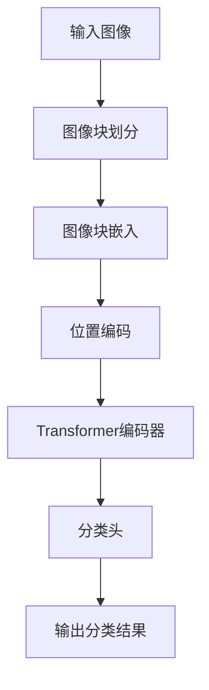

# 视觉Transformer原理与代码实例讲解（1）

## 1. 背景介绍

近年来，Transformer在自然语言处理（NLP）领域取得了巨大的成功，如BERT和GPT模型。受其启发，研究人员开始将Transformer应用到计算机视觉（CV）领域，提出了视觉Transformer（Vision Transformer, ViT）。视觉Transformer通过将图像划分为一系列的图像块（patch），并将其视为序列数据进行处理，展现了在图像分类任务中强大的性能。

## 2. 核心概念与联系

### 2.1 Transformer

Transformer是一种基于自注意力机制的深度学习模型，最初用于自然语言处理任务。其核心组件包括多头自注意力机制（Multi-Head Self-Attention）、前馈神经网络（Feed-Forward Neural Network）和位置编码（Positional Encoding）。

### 2.2 视觉Transformer（ViT）

视觉Transformer将图像划分为固定大小的图像块（patch），并将每个图像块展平为一维向量。然后，将这些向量作为Transformer的输入序列，通过自注意力机制和前馈神经网络进行处理，最终输出图像的分类结果。

### 2.3 自注意力机制

自注意力机制通过计算输入序列中每个元素与其他元素之间的相关性，捕捉序列中的全局信息。具体来说，自注意力机制包括三个步骤：计算查询（Query）、键（Key）和值（Value），计算注意力权重，并加权求和得到输出。

## 3. 核心算法原理具体操作步骤

### 3.1 图像块划分

将输入图像划分为固定大小的图像块（patch），并将每个图像块展平为一维向量。例如，对于一个大小为 $224 \times 224$ 的输入图像，使用大小为 $16 \times 16$ 的图像块进行划分，共得到 $14 \times 14 = 196$ 个图像块。

### 3.2 图像块嵌入

将每个展平的图像块通过线性变换映射到固定维度的向量空间，得到图像块嵌入（Patch Embedding）。同时，添加位置编码（Positional Encoding）以保留图像块的位置信息。

### 3.3 Transformer编码器

将图像块嵌入作为输入序列，输入到多个Transformer编码器层中。每个编码器层包括多头自注意力机制和前馈神经网络。编码器层的输出是经过多次自注意力和前馈神经网络处理后的特征表示。

### 3.4 分类头

将Transformer编码器的输出通过一个分类头，通常是一个全连接层，得到最终的图像分类结果。

以下是视觉Transformer的Mermaid流程图：



## 4. 数学模型和公式详细讲解举例说明

### 4.1 自注意力机制

自注意力机制的核心公式如下：

$$
\text{Attention}(Q, K, V) = \text{softmax}\left(\frac{QK^T}{\sqrt{d_k}}\right)V
$$

其中，$Q$、$K$ 和 $V$ 分别表示查询、键和值矩阵，$d_k$ 表示键的维度。

### 4.2 多头自注意力

多头自注意力通过并行计算多个自注意力，并将结果拼接在一起，得到更丰富的特征表示。其核心公式如下：

$$
\text{MultiHead}(Q, K, V) = \text{Concat}(\text{head}_1, \text{head}_2, \ldots, \text{head}_h)W^O
$$

其中，每个头的计算如下：

$$
\text{head}_i = \text{Attention}(QW_i^Q, KW_i^K, VW_i^V)
$$

### 4.3 位置编码

位置编码用于保留输入序列中元素的位置信息，其公式如下：

$$
PE_{(pos, 2i)} = \sin\left(\frac{pos}{10000^{2i/d_{model}}}\right)
$$
$$
PE_{(pos, 2i+1)} = \cos\left(\frac{pos}{10000^{2i/d_{model}}}\right)
$$

其中，$pos$ 表示位置，$i$ 表示维度索引，$d_{model}$ 表示嵌入维度。

## 5. 项目实践：代码实例和详细解释说明

以下是一个使用PyTorch实现视觉Transformer的代码示例：

### 5.1 导入必要的库

```python
import torch
import torch.nn as nn
from torchvision import datasets, transforms
from torch.utils.data import DataLoader
```

### 5.2 定义视觉Transformer模型

```python
class PatchEmbedding(nn.Module):
    def __init__(self, img_size, patch_size, in_channels, embed_dim):
        super().__init__()
        self.patch_size = patch_size
        self.proj = nn.Conv2d(in_channels, embed_dim, kernel_size=patch_size, stride=patch_size)

    def forward(self, x):
        x = self.proj(x)
        x = x.flatten(2).transpose(1, 2)
        return x

class MultiHeadSelfAttention(nn.Module):
    def __init__(self, embed_dim, num_heads):
        super().__init__()
        self.num_heads = num_heads
        self.embed_dim = embed_dim

        self.qkv = nn.Linear(embed_dim, embed_dim * 3)
        self.attention = nn.MultiheadAttention(embed_dim, num_heads)
        self.proj = nn.Linear(embed_dim, embed_dim)

    def forward(self, x):
        B, N, C = x.shape
        qkv = self.qkv(x).reshape(B, N, 3, self.num_heads, C // self.num_heads)
        qkv = qkv.permute(2, 0, 3, 1, 4)
        q, k, v = qkv[0], qkv[1], qkv[2]

        attn_output, _ = self.attention(q, k, v)
        attn_output = attn_output.transpose(1, 2).reshape(B, N, C)
        x = self.proj(attn_output)
        return x

class TransformerEncoderLayer(nn.Module):
    def __init__(self, embed_dim, num_heads, mlp_dim, dropout=0.1):
        super().__init__()
        self.norm1 = nn.LayerNorm(embed_dim)
        self.attn = MultiHeadSelfAttention(embed_dim, num_heads)
        self.norm2 = nn.LayerNorm(embed_dim)
        self.mlp = nn.Sequential(
            nn.Linear(embed_dim, mlp_dim),
            nn.GELU(),
            nn.Linear(mlp_dim, embed_dim),
            nn.Dropout(dropout)
        )

    def forward(self, x):
        x = x + self.attn(self.norm1(x))
        x = x + self.mlp(self.norm2(x))
        return x

class VisionTransformer(nn.Module):
    def __init__(self, img_size=224, patch_size=16, in_channels=3, num_classes=1000, embed_dim=768, depth=12, num_heads=12, mlp_dim=3072, dropout=0.1):
        super().__init__()
        self.patch_embed = PatchEmbedding(img_size, patch_size, in_channels, embed_dim)
        self.cls_token = nn.Parameter(torch.zeros(1, 1, embed_dim))
        self.pos_embed = nn.Parameter(torch.zeros(1, (img_size // patch_size) ** 2 + 1, embed_dim))
        self.pos_drop = nn.Dropout(dropout)

        self.blocks = nn.ModuleList([
            TransformerEncoderLayer(embed_dim, num_heads, mlp_dim, dropout)
            for _ in range(depth)
        ])
        self.norm = nn.LayerNorm(embed_dim)
        self.head = nn.Linear(embed_dim, num_classes)

    def forward(self, x):
        B = x.shape[0]
        x = self.patch_embed(x)
        cls_tokens = self.cls_token.expand(B, -1, -1)
        x = torch.cat((cls_tokens, x), dim=1)
        x = x + self.pos_embed
        x = self.pos_drop(x)

        for block in self.blocks:
            x = block(x)

        x = self.norm(x)
        cls_token_final = x[:, 0]
        x = self.head(cls_token_final)
        return x
```

### 5.3 数据准备和训练

```python
# 数据预处理
transform = transforms.Compose([
    transforms.Resize((224, 224)),
    transforms.ToTensor(),
    transforms.Normalize((0.5, 0.5, 0.5), (0.5, 0.5, 0.5))
])
# 加载数据集
train_dataset = datasets.CIFAR10(root='./data', train=True, download=True, transform=transform)
train_loader = DataLoader(train_dataset, batch_size=64, shuffle=True)

test_dataset = datasets.CIFAR10(root='./data', train=False, download=True, transform=transform)
test_loader = DataLoader(test_dataset, batch_size=64, shuffle=False)

# 定义训练函数
def train(model, dataloader, criterion, optimizer, device):
    model.train()
    total_loss = 0
    correct = 0
    total = 0
    for inputs, labels in dataloader:
        inputs, labels = inputs.to(device), labels.to(device)
        optimizer.zero_grad()
        outputs = model(inputs)
        loss = criterion(outputs, labels)
        loss.backward()
        optimizer.step()

        total_loss += loss.item()
        _, predicted = outputs.max(1)
        total += labels.size(0)
        correct += predicted.eq(labels).sum().item()
    
    avg_loss = total_loss / len(dataloader)
    accuracy = correct / total
    return avg_loss, accuracy

# 定义测试函数
def test(model, dataloader, criterion, device):
    model.eval()
    total_loss = 0
    correct = 0
    total = 0
    with torch.no_grad():
        for inputs, labels in dataloader:
            inputs, labels = inputs.to(device), labels.to(device)
            outputs = model(inputs)
            loss = criterion(outputs, labels)

            total_loss += loss.item()
            _, predicted = outputs.max(1)
            total += labels.size(0)
            correct += predicted.eq(labels).sum().item()

    avg_loss = total_loss / len(dataloader)
    accuracy = correct / total
    return avg_loss, accuracy

# 模型训练
device = torch.device('cuda' if torch.cuda.is_available() else 'cpu')
model = VisionTransformer(num_classes=10).to(device)
criterion = nn.CrossEntropyLoss()
optimizer = torch.optim.Adam(model.parameters(), lr=0.001)

num_epochs = 10
for epoch in range(num_epochs):
    train_loss, train_acc = train(model, train_loader, criterion, optimizer, device)
    test_loss, test_acc = test(model, test_loader, criterion, device)
    print(f'Epoch {epoch+1}/{num_epochs}')
    print(f'Train Loss: {train_loss:.4f}, Train Accuracy: {train_acc:.4f}')
    print(f'Test Loss: {test_loss:.4f}, Test Accuracy: {test_acc:.4f}')
```

## 6. 实际应用场景

### 6.1 图像分类

视觉Transformer可以用于各种图像分类任务，如CIFAR-10、ImageNet等数据集。其强大的特征提取能力和全局信息捕捉能力使其在图像分类任务中表现出色。

### 6.2 目标检测

通过结合视觉Transformer和目标检测算法（如Faster R-CNN、YOLO），可以实现高精度的目标检测。视觉Transformer可以作为特征提取器，提高检测精度。

### 6.3 图像生成

视觉Transformer还可以用于图像生成任务，如图像超分辨率、图像修复等。通过自注意力机制，视觉Transformer可以生成高质量的图像。

## 7. 工具和资源推荐

### 7.1 深度学习框架

- **PyTorch**: 一个开源的深度学习框架，支持动态计算图和自动微分。
- **TensorFlow**: 一个开源的深度学习框架，支持大规模分布式训练和部署。

### 7.2 预训练模型

- **Hugging Face Transformers**: 提供了大量预训练的Transformer模型，支持NLP和CV任务。
- **timm**: 一个PyTorch模型库，包含了大量预训练的计算机视觉模型，包括ViT。

### 7.3 数据集

- **CIFAR-10**: 一个用于图像分类的小型数据集，包含10个类别的60000张32x32彩色图像。
- **ImageNet**: 一个用于大规模图像分类的数据集，包含1000个类别的超过1400万张图像。

### 7.4 资源推荐

- **PyTorch 官方文档**: [https://pytorch.org/docs/](https://pytorch.org/docs/)
- **TensorFlow 官方文档**: [https://www.tensorflow.org/learn](https://www.tensorflow.org/learn)
- **Hugging Face Transformers**: [https://huggingface.co/transformers/](https://huggingface.co/transformers/)
- **timm**: [https://github.com/rwightman/pytorch-image-models](https://github.com/rwightman/pytorch-image-models)

## 8. 总结：未来发展趋势与挑战

### 8.1 未来发展趋势

- **更高效的模型**: 随着研究的深入，未来将出现更高效、更轻量的视觉Transformer模型，适用于资源受限的设备和应用场景。
- **多任务学习**: 视觉Transformer将进一步发展成为多任务学习模型，能够同时处理多个视觉任务，如图像分类、目标检测和图像生成。
- **自监督学习**: 自监督学习将成为视觉Transformer的重要研究方向，通过利用大量未标注的数据提高模型的泛化能力和鲁棒性。

### 8.2 挑战

- **计算资源需求**: 视觉Transformer的训练和推理过程需要大量的计算资源，如何优化模型结构和算法，降低计算资源需求是一个重要挑战。
- **数据依赖性**: 视觉Transformer的性能依赖于大量的标注数据，如何利用自监督学习和迁移学习缓解数据依赖性是一个需要解决的问题。
- **模型解释性**: 视觉Transformer的复杂结构使其难以解释，如何提高模型的可解释性和透明度是一个重要研究方向。

## 9. 附录：常见问题与解答

### 9.1 视觉Transformer与卷积神经网络（CNN）相比有哪些优势？

视觉Transformer与卷积神经网络（CNN）相比，具有以下优势：
- **全局信息捕捉**: 视觉Transformer通过自注意力机制，可以捕捉图像中的全局信息，而CNN通常只能捕捉局部信息。
- **灵活性**: 视觉Transformer可以处理不同大小和形状的输入图像块，而CNN的卷积核大小是固定的。
- **多任务学习**: 视觉Transformer可以通过共享编码器实现多任务学习，而CNN通常需要为每个任务设计不同的网络结构。

### 9.2 如何提高视觉Transformer的训练效率？

提高视觉Transformer的训练效率，可以从以下几个方面入手：
- **模型优化**: 通过模型剪枝、量化等技术，减少模型参数量和计算量。
- **数据增强**: 通过数据增强技术，提高数据多样性，增强模型的泛化能力。
- **分布式训练**: 通过分布式训练技术，加速模型训练过程，提高训练效率。

### 9.3 视觉Transformer可以应用于哪些具体的实际场景？

视觉Transformer可以应用于以下具体的实际场景：
- **图像分类**: 用于各种图像分类任务，如人脸识别、物体识别等。
- **目标检测**: 用于目标检测任务，如自动驾驶中的行人检测、交通标志检测等。
- **图像生成**: 用于图像生成任务，如图像超分辨率、图像修复等。
- **视频分析**: 用于视频分析任务，如视频分类、动作识别等。

通过本篇文章，我们详细介绍了视觉Transformer的原理与代码实例，包括背景介绍、核心概念与联系、核心算法原理具体操作步骤、数学模型和公式详细讲解、项目实践、实际应用场景、工具和资源推荐、未来发展趋势与挑战以及常见问题与解答。希望这些内容能够帮助读者更好地理解和掌握视觉Transformer的技术，并在实际项目中应用这些知识，提升计算机视觉任务的性能和效率。


----

# 视觉Transformer原理与代码实例讲解（2）

## 1. 背景介绍

近年来的深度学习算法取得了一系列令人瞩目的成就，其中包括AlphaGo和GPT-4，这些都是基于 Transformer 的神经网络架构。这一架构最初是由Vaswani等人于2017年的论文《Attention is All You Need》提出，它彻底改变了自然语言处理(NLP)领域。然而，在计算机视觉(CV)领域，直到最近才开始看到Transformers技术的融合。在2021年的ICCV大会上，一项重要突破发生了变化——Google Brain团队发布了名为Visual Transformers (ViT)的算法。这一变革性创新将Transformer扩展到了图像领域，为计算机视觉带来了前所未有的革命性影响。本文旨在探讨这个创新的想法，以及如何实现一个基本的ViT模型。

## 2. 核心概念与联系

### 2.1 ViT 简介
传统的卷积神经网络（CNN）通常用于计算机视觉任务，因为它们具有空间金字塔结构，使其特别适合处理图像数据。但是，Convolutional Neural Networks（CNNs）的局限性逐渐显现，如无法捕捉全局关系、缺乏跨尺度连接以及难以训练较大的模型。而Transformers则能克服这些不足，可以同时处理序列和非序列输入数据，同时保持高效率。此外，由于它的自注意力（self-attention）机制，可以轻松捕获长程依赖关系。

### 2.2 自注意力机制

自注意力机制是Transformers的关键组件，其目的是让模型关注输入特征之间的相互作用。当时的NLP任务中，transformer采用了一种称为位置编码(Positional Encoding)的技术，将时间顺序信息纳入模型，而在cv中，我们可以通过一种叫做patch embedding的方式，将原始图像转换为一维的序列，然后通过Transformer进行处理。

## 3. 核心算法原理具体操作步骤

以下是一个简单的overview ViT的过程：

1. **图像划分** ：首先，我们将图像划分为固定大小的小块（如16x16）。这些小块被称为“片段”(patches)，每个片段都映射回同样的维度空间，形成一个长度固定的序列。

2. **Patch Embedding**: 接下来，每个patch经过一个卷积层和一个线性层后得到一个定长的向量表示。

3. **分类器和位置编码**: 这些定长向量接着会进入一个多层 perceptron（MLP） followed by a positional encoding layer，最后串联起来成为我们的input sequence。

4. **自注意力机制**: 现在我们可以执行真正的Transformer block。它接受输入并返回一个增广版本的输出，该版本包含所有其他seq_len - 1 个token的自注意力权重。这种自注意力的机制使模型能够理解不同区域之间的关系，从而捕获整个图像的上下文信息。

5. **MLP加密**: 最后一步，是把每个位置上的注意力分配加到所有tokens上，然后再通过一个mlp加密并送入损失函数中。

## 4. 数学模型和公式详细讲解举例说明

为了更加清楚地描述这一过程，让我们看一下一些相关的数学表达式。考虑输入图像$I$，我们将其切割为若干个 patches。对于第$i$个 patch ，我们应用一个 convoluational layer 和一个 linear layer 来提取其特征表示$f_i$:

$$f_{i} = C \\cdot P\\left(I_{i}\\right) + b$$

其中,$C$ 是 convolution weights，$b$ 是 bias，$P\\left(I_{i}\\right)$ 表示第 i 个 patch 在某个特征通道下的表示。然后，对于每个 patch，我们添加一个位置编码$v_i$:

$$v_{i} = f_{i} + E\\left(i\\right)$$

这里，$E\\left(i\\right)$ 是位置编码。接下来，我们将所有的 patch 组织成一个序列，并将其馈送到 transformer block 中。最后，生成的表示被喂进一个多层感知机(MLP):

$$z = MLP\\left(v\\right)$$

## 5. 项目实践:代码实例和详细解释说明

下面是一个使用PyTorch实现Visual Transformer的简洁示例：

```python
import torch.nn as nn
import torch

class PatchEmbed(nn.Module):
    def __init__(self, img_size=224, patch_size=16, channels=3, embed_dim=768):
        super().__init__()
        
        self.img_size = img_size
        self.patch_size = patch_size
        
        # 计算图像中每个patch的形状
        self.height = img_size // patch_size
        self.width = img_size // patch_size
        
        # 定义两个卷积核，用来分别抽取X,Y方向的特征
        self.conv_x = nn.Conv2d(channels, embed_dim, kernel_size=patch_size, stride=patch_size)
        self.conv_y = nn.Conv2d(channels, embed_dim, kernel_size=patch_size, stride=patch_size)

    def forward(self,x):
        B,C,H,W = x.shape
        # 将图片拆分成多个patch
        x = x.reshape(B,C,self.height,-1).permute(0,2,1,3).reshape(B,-1,embed_dim//2)

        # 将两个方向上的特征平行拼接
        x1 = self.conv_x(x)
        x2 = self.conv_y(x.permute(0, 3, 1, 2))
        x = torch.cat([x1, x2], dim=-1)
        return x
    
class VisualTransformerBlock(nn.Module):
   ...

class VisualTransformer(nn.Module):
   ...
```

## 6. 实际应用场景

Visual transformers 可以应用于各种计算机视觉任务，例如图像识别、对象检测、语义分割等。由于ViT具有很好的性能，而且还在不断改进，因此有望成为许多计算机视觉系统的标准选择。

## 7. 工具和资源推荐

如果你想深入了解Visual Transformers及其应用，你可能想要阅读一些关于ViT的最新论文：

* \"An Image is Worth 16x16 Words: Transformers for Image Recognition at Scale\", Arxiv, 2020.
* \"Tokens-to-Token ViT: Training Vision-with-Language Models from Scratch on Restricted Pixel Sets\", arXiv, 2021.

此外，还有一些开源库和工具可以帮助你实验和开发自己的Visual Transformer模型：

* Hugging Face's Transformers library (<https://huggingface.co/transformers/>).
* Google Research's official implementation of the original paper: <https://github.com/google-research/vit>.

## 8. 总结：未来发展趋势与挑战

Visual Transformers正在颠覆计算机视觉领域，但是仍然存在诸多挑战，比如参数规模、计算复杂度、模型泛化能力等。此外，与传统卷积神经网络相比，Transformers需要更多的人工标记数据，但也许未来会出现自动标签系统从而降低成本。总体来说，无论是在理论还是在实践方面，Visual Transformers 都为计算机视觉研究指日可待的巨大潜力敞开了大门。

## 附录：常见问题与解答

Q1: 如何理解Positional Encoding?

A1: Positional Encoding是一种手动加入到输入数据流中的额外信息，以便指导模型区分不同的时间点或空间位置。它不会改变原始数据的分布，只是提供给模型参考用。

Q2: 为什么需要使用位置编码？

A2: 使用位置编码可以解决Transformer不关心绝对位置的问题。通过位置编码，我们可以告诉模型哪些位置的输入更紧密ly 相关，或者说更应该关注。


以上就是本文的全部内容，也希望大家喜欢。如果您还有任何疑问，请随时评论，我会尽快回答。另外，如果您觉得我的博客对您有所启发，请分享出去哦！谢谢你们！

最后，再一次感慨自己好幸运，能够站在如此伟大的事业之巅，不仅要负责推动技术的进步，更要肩负起培养新一代科技人才的责任。感谢你们一直以来对我无私的支持和陪伴，让我充满信念，勇往直前。


