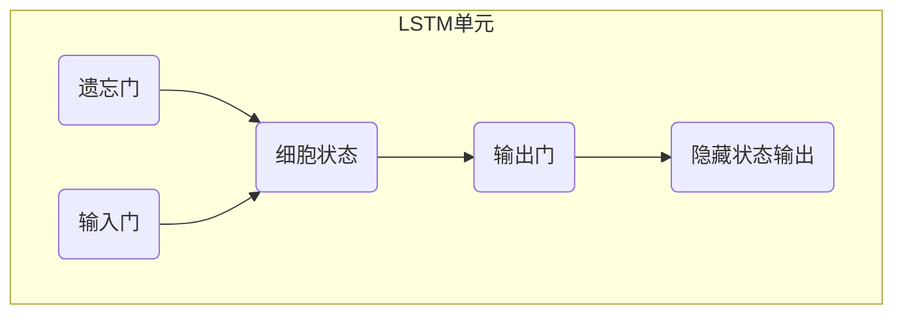

# 长短期记忆网络 (Long Short-Term Memory)

## 1.背景介绍

### 1.1 序列数据处理的挑战

在自然语言处理、语音识别、时间序列预测等领域,我们常常需要处理序列数据,例如文本、语音、视频等。这些数据具有时间或空间上的依赖关系,即当前的输出不仅取决于当前的输入,还取决于之前的输入序列。传统的前馈神经网络或卷积神经网络无法很好地捕捉这种长期依赖关系,因为在反向传播时,梯度或信息会在长期传播中逐渐消失或爆炸。

### 1.2 循环神经网络的局限性

为了解决这个问题,研究人员提出了循环神经网络(Recurrent Neural Network, RNN)。RNN通过在隐藏层中引入循环连接,使得网络具有记忆能力,可以捕捉序列数据中的动态行为。然而,标准的RNN在学习长期依赖关系时仍然存在梯度消失或爆炸的问题,这限制了它们在实际应用中的表现。

## 2.核心概念与联系  

### 2.1 LSTM的提出

为了解决RNN梯度问题,1997年,Sepp Hochreiter和Jurgen Schmidhuber提出了长短期记忆网络(Long Short-Term Memory, LSTM)。LSTM是一种特殊的RNN,它通过精心设计的门控机制和记忆细胞状态,有效地解决了长期依赖问题,大大提高了RNN在处理长序列数据时的性能。

### 2.2 LSTM与RNN的关系

LSTM可以看作是RNN的一种变体,它们都属于序列模型的范畴。与标准的RNN相比,LSTM在网络结构上进行了改进,引入了一些门控单元,使得网络能够更好地控制信息的流动,从而缓解梯度消失或爆炸的问题。

### 2.3 LSTM在深度学习中的地位

随着深度学习的兴起,LSTM在自然语言处理、语音识别、机器翻译等领域取得了巨大成功,成为序列建模的主流方法之一。LSTM的出现为解决长期依赖问题提供了有力的工具,推动了相关领域的快速发展。

## 3.核心算法原理具体操作步骤

### 3.1 LSTM网络结构

LSTM网络的核心组成部分是一个记忆细胞状态和三个控制该状态的门:遗忘门(forget gate)、输入门(input gate)和输出门(output gate)。



1) 遗忘门: 决定从上一时刻的细胞状态中保留和丢弃哪些信息。
2) 输入门: 决定从当前输入和上一时刻的隐藏状态中获取什么新信息,并更新细胞状态。
3) 输出门: 决定输出什么值作为当前时刻的隐藏状态。

通过这些门控机制,LSTM可以学习到哪些信息应该被保留下来,哪些信息应该被遗忘,从而解决长期依赖问题。

### 3.2 LSTM前向传播过程

LSTM在每个时刻t的前向传播过程如下:

1) 计算遗忘门:

$$f_t = \sigma(W_f \cdot [h_{t-1}, x_t] + b_f)$$

其中$h_{t-1}$是上一时刻的隐藏状态, $x_t$是当前时刻的输入, $W_f$和$b_f$是遗忘门的权重和偏置。$\sigma$是sigmoid激活函数,确保遗忘门的值在0到1之间。

2) 计算输入门和候选细胞状态:

$$i_t = \sigma(W_i \cdot [h_{t-1}, x_t] + b_i)$$
$$\tilde{C}_t = \tanh(W_C \cdot [h_{t-1}, x_t] + b_C)$$

其中$i_t$是输入门, $\tilde{C}_t$是候选细胞状态。$W_i$、$W_C$、$b_i$和$b_C$分别是输入门和候选细胞状态的权重和偏置。

3) 更新细胞状态:

$$C_t = f_t * C_{t-1} + i_t * \tilde{C}_t$$

新的细胞状态$C_t$是上一时刻细胞状态$C_{t-1}$的一部分(通过遗忘门控制)与当前候选细胞状态$\tilde{C}_t$的加权和(通过输入门控制)。

4) 计算输出门和隐藏状态输出:

$$o_t = \sigma(W_o \cdot [h_{t-1}, x_t] + b_o)$$
$$h_t = o_t * \tanh(C_t)$$

其中$o_t$是输出门, $h_t$是当前时刻的隐藏状态输出。$W_o$和$b_o$是输出门的权重和偏置。

通过上述步骤,LSTM在每个时刻都会更新细胞状态和隐藏状态输出,从而捕捉序列数据中的长期依赖关系。

## 4.数学模型和公式详细讲解举例说明

### 4.1 LSTM的数学表示

我们可以用下面的公式来表示LSTM在时刻t的计算过程:

$$\begin{aligned}
f_t &= \sigma(W_f \cdot [h_{t-1}, x_t] + b_f) \\
i_t &= \sigma(W_i \cdot [h_{t-1}, x_t] + b_i) \\
\tilde{C}_t &= \tanh(W_C \cdot [h_{t-1}, x_t] + b_C) \\
C_t &= f_t * C_{t-1} + i_t * \tilde{C}_t \\
o_t &= \sigma(W_o \cdot [h_{t-1}, x_t] + b_o) \\
h_t &= o_t * \tanh(C_t)
\end{aligned}$$

其中:

- $f_t$是遗忘门的输出
- $i_t$是输入门的输出  
- $\tilde{C}_t$是候选细胞状态
- $C_t$是当前细胞状态
- $o_t$是输出门的输出
- $h_t$是当前时刻的隐藏状态输出

### 4.2 LSTM门控机制的作用

让我们通过一个具体例子来理解LSTM的门控机制是如何工作的。

假设我们正在处理一个自然语言句子"The cat was playing in the garden"。在处理到"was"这个词时,LSTM需要记住主语是"cat",同时遗忘之前的信息"The"。

1) 遗忘门决定遗忘"The"这个词,即$f_t$对应"The"的位置值接近0。
2) 输入门决定记住"cat"这个词,即$i_t$对应"cat"的位置值接近1。
3) 细胞状态$C_t$保留了"cat"的信息,遗忘了"The"的信息。
4) 输出门控制着当前时刻的输出$h_t$,使其只输出与"was"相关的信息。

通过上述门控机制,LSTM能够有选择性地保留和遗忘信息,从而更好地捕捉长期依赖关系。

### 4.3 LSTM与GRU的区别

除了LSTM,另一种常用的门控循环单元是门控循环单元(Gated Recurrent Unit, GRU)。GRU相对于LSTM有更简单的结构,它合并了遗忘门和输入门,只有两个门:重置门(reset gate)和更新门(update gate)。

GRU的计算过程如下:

$$\begin{aligned}
z_t &= \sigma(W_z \cdot [h_{t-1}, x_t]) \\
r_t &= \sigma(W_r \cdot [h_{t-1}, x_t]) \\
\tilde{h}_t &= \tanh(W \cdot [r_t * h_{t-1}, x_t]) \\
h_t &= (1 - z_t) * h_{t-1} + z_t * \tilde{h}_t
\end{aligned}$$

其中:

- $z_t$是更新门,控制前一状态的遗留程度
- $r_t$是重置门,控制忘记前一状态的程度
- $\tilde{h}_t$是候选隐藏状态
- $h_t$是当前时刻的隐藏状态输出

相比LSTM,GRU的参数更少,计算更快,但在某些任务上的表现可能略差于LSTM。在实际应用中,需要根据具体问题选择合适的模型。

## 5.项目实践: 代码实例和详细解释说明

为了更好地理解LSTM的工作原理,我们来看一个使用Python和PyTorch实现LSTM的示例。我们将构建一个LSTM模型,对一个简单的序列数据集进行预测。

### 5.1 准备数据

我们将使用一个人工合成的数据集,其中包含一系列长度为5的序列,每个序列由0和1组成。我们的目标是预测序列的最后一个元素。

```python
import torch
from torch import nn

# 生成训练数据
data = [torch.tensor([0, 1, 0, 0, 1]), torch.tensor([1, 0, 1, 1, 0]),
        torch.tensor([0, 1, 1, 0, 1]), torch.tensor([1, 1, 1, 1, 1]),
        torch.tensor([0, 0, 0, 0, 0])]
labels = [torch.tensor([1]), torch.tensor([0]), torch.tensor([1]),
          torch.tensor([1]), torch.tensor([0])]
```

### 5.2 定义LSTM模型

我们定义一个简单的LSTM模型,包含一个LSTM层和一个全连接层。

```python
class LSTMModel(nn.Module):
    def __init__(self, input_size, hidden_size, output_size):
        super(LSTMModel, self).__init__()
        self.hidden_size = hidden_size
        self.lstm = nn.LSTM(input_size, hidden_size, batch_first=True)
        self.fc = nn.Linear(hidden_size, output_size)

    def forward(self, x):
        _, (h_n, _) = self.lstm(x)
        y = self.fc(h_n.squeeze(0))
        return y

# 实例化模型
input_size = 1
hidden_size = 4
output_size = 1
model = LSTMModel(input_size, hidden_size, output_size)
```

在前向传播过程中,我们将输入序列传递给LSTM层,获取最后一个时刻的隐藏状态$h_n$,然后通过全连接层得到输出$y$。

### 5.3 训练模型

我们定义损失函数和优化器,然后进行模型训练。

```python
criterion = nn.BCEWithLogitsLoss()
optimizer = torch.optim.Adam(model.parameters(), lr=0.01)

# 训练循环
for epoch in range(1000):
    optimizer.zero_grad()
    outputs = []
    for x, y in zip(data, labels):
        x = x.unsqueeze(0).unsqueeze(2).float()  # 增加batch和channel维度
        output = model(x)
        outputs.append(output)
    loss = criterion(torch.cat(outputs), torch.tensor(labels).float())
    loss.backward()
    optimizer.step()
    if epoch % 100 == 0:
        print(f'Epoch [{epoch+1}/1000], Loss: {loss.item():.4f}')
```

在每个epoch中,我们将输入序列传递给模型,计算损失,并使用反向传播更新模型参数。

### 5.4 评估模型

最后,我们可以在测试数据上评估模型的性能。

```python
# 测试数据
test_data = [torch.tensor([1, 0, 1, 0, 1])]
test_labels = [torch.tensor([1])]

with torch.no_grad():
    outputs = []
    for x, y in zip(test_data, test_labels):
        x = x.unsqueeze(0).unsqueeze(2).float()
        output = model(x)
        outputs.append(output)
    predictions = torch.round(torch.cat(outputs))
    print('Predictions:', predictions)
    print('Labels:', test_labels)
```

输出结果显示,我们的LSTM模型能够正确预测测试序列的最后一个元素。

通过这个简单的示例,我们可以看到如何使用PyTorch实现LSTM模型,并对序列数据进行建模和预测。在实际应用中,您可以根据具体问题调整模型结构、超参数和训练策略,以获得更好的性能。

## 6.实际应用场景

LSTM由于其强大的序列建模能力,在许多领域都有广泛的应用。

### 6.1 自然语言处理

LSTM在自然语言处理任务中表现出色,例如机器翻译、文本生成、情感分析