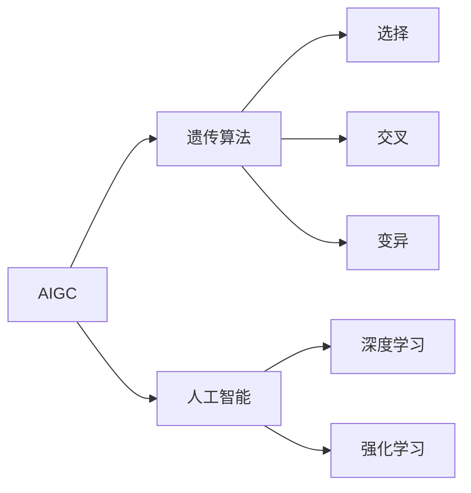

## 1.背景介绍

在计算机科学的历史长河中，算法一直是推动其发展的关键动力。随着人工智能的兴起，一种名为AIGC（Artificial Intelligence Genetic Coding）的编程模型应运而生。AIGC是一种利用遗传算法原理进行编程的模型，它将人工智能的学习能力与遗传算法的优化能力相结合，以实现更高效的编程和解决问题的能力。

## 2.核心概念与联系

AIGC的核心在于利用遗传算法的原理进行编程。遗传算法是一种搜索算法，它模拟了自然界中的生物进化过程，包括选择、交叉和变异等操作。在AIGC中，我们将程序或问题的解看作一个个体，将一组解看作一个种群。通过对种群进行遗传操作，我们可以不断优化种群，最终得到最优或者接近最优的解。

在AIGC中，还引入了人工智能的概念，比如深度学习、强化学习等，用于对遗传算法进行优化。通过人工智能的学习能力，我们可以更好地理解种群的特性，从而更好地进行遗传操作，以得到更优的解。



## 3.核心算法原理具体操作步骤

AIGC的核心算法原理包括以下几个步骤：

1. 初始化种群：首先，我们需要创建一个初始种群。这个种群可以是随机生成的，也可以是根据某些先验知识生成的。

2. 评估种群：然后，我们需要对种群中的每一个个体进行评估，得到他们的适应度值。适应度值反映了一个个体的优劣，通常，适应度值越高，个体越优秀。

3. 选择操作：根据个体的适应度值，我们进行选择操作，选择出优秀的个体。

4. 交叉操作：然后，我们进行交叉操作，通过交换优秀个体的部分基因，生成新的个体。

5. 变异操作：最后，我们进行变异操作，随机改变个体的部分基因，以增加种群的多样性。

6. 重复上述步骤，直到满足结束条件，如达到预设的迭代次数，或者种群的适应度值已经不再提高。

## 4.数学模型和公式详细讲解举例说明

在AIGC中，我们使用适应度函数来评估个体的优劣。适应度函数的定义如下：

$$
f(x) = \sum_{i=1}^{n} w_i x_i
$$

其中，$x$是一个个体，$x_i$是个体的第$i$个基因，$w_i$是第$i$个基因的权重，$n$是基因的数量。

在选择操作中，我们通常使用轮盘赌选择法，其公式如下：

$$
p(x) = \frac{f(x)}{\sum_{i=1}^{m} f(x_i)}
$$

其中，$p(x)$是个体$x$被选择的概率，$f(x)$是个体$x$的适应度值，$m$是种群的大小。

在交叉操作中，我们通常使用单点交叉，其公式如下：

$$
x' = (x_1, x_2, \ldots, x_i, y_{i+1}, y_{i+2}, \ldots, y_n)
$$

$$
y' = (y_1, y_2, \ldots, y_i, x_{i+1}, x_{i+2}, \ldots, x_n)
$$

其中，$x'$和$y'$是新生成的个体，$x$和$y$是父母个体，$i$是交叉点。

在变异操作中，我们通常使用位翻转变异，其公式如下：

$$
x_i' = 1 - x_i
$$

其中，$x_i'$是变异后的基因，$x_i$是变异前的基因。

## 5.项目实践：代码实例和详细解释说明

下面，我们将通过一个简单的示例来演示AIGC的使用。在这个示例中，我们将使用AIGC来解决一个简单的优化问题：求解函数$f(x) = x^2$的最小值。

首先，我们需要定义适应度函数。在这个问题中，适应度函数就是目标函数$f(x) = x^2$的负值。因为我们希望求解的是最小值，所以适应度值越大（即目标函数值越小），个体越优秀。

```python
def fitness(x):
    return -x**2
```

然后，我们需要定义选择、交叉和变异操作。在这个问题中，我们可以使用轮盘赌选择法、单点交叉和位翻转变异。

```python
def select(population):
    # 轮盘赌选择法
    pass

def crossover(x, y):
    # 单点交叉
    pass

def mutate(x):
    # 位翻转变异
    pass
```

接下来，我们就可以开始进行遗传操作了。我们初始化一个种群，然后不断进行选择、交叉和变异操作，直到满足结束条件。

```python
# 初始化种群
population = init_population()

# 进行遗传操作
for i in range(max_iterations):
    population = select(population)
    population = crossover(population)
    population = mutate(population)
```

最后，我们可以从种群中选择出适应度值最高的个体，作为问题的解。

```python
best_individual = max(population, key=fitness)
print('Solution:', best_individual)
```

## 6.实际应用场景

AIGC在很多实际应用场景中都有着广泛的应用，例如：

- 优化问题：AIGC可以用于解决各种优化问题，比如旅行商问题、背包问题等。

- 机器学习：AIGC可以用于优化机器学习模型的参数，提高模型的性能。

- 图像处理：AIGC可以用于图像分割、特征提取等任务。

- 控制系统：AIGC可以用于优化控制系统的控制参数，提高系统的性能。

## 7.工具和资源推荐

如果你想要深入了解和学习AIGC，下面的工具和资源可能会对你有所帮助：

- DEAP：这是一个用于演化计算的Python库，包含了遗传算法、遗传编程等多种演化算法。

- PyTorch：这是一个用于深度学习的Python库，可以用于实现AIGC中的人工智能部分。

- "Genetic Algorithms in Search, Optimization and Machine Learning"：这是一本关于遗传算法的经典书籍，对遗传算法的原理和应用进行了深入的介绍。

## 8.总结：未来发展趋势与挑战

AIGC是一种将人工智能与遗传算法相结合的编程模型，具有很大的潜力和应用价值。然而，AIGC也面临着一些挑战，比如如何有效地结合人工智能和遗传算法、如何提高算法的效率和稳定性等。

随着人工智能和遗传算法的不断发展，我相信AIGC将会有更广阔的应用前景。我希望这篇文章能帮助你对AIGC有更深入的理解，也希望你能在实际的项目中应用AIGC，解决实际的问题。

## 9.附录：常见问题与解答

1. **问题**：AIGC和传统的遗传算法有什么区别？

   **答**：AIGC和传统的遗传算法的主要区别在于，AIGC引入了人工智能的概念，用于对遗传算法进行优化。通过人工智能的学习能力，我们可以更好地理解种群的特性，从而更好地进行遗传操作，以得到更优的解。

2. **问题**：AIGC适用于解决哪些问题？

   **答**：AIGC适用于解决各种优化问题，比如旅行商问题、背包问题等。此外，AIGC也可以用于机器学习、图像处理、控制系统等领域。

3. **问题**：AIGC的效率如何？是否有可能在大规模问题上使用？

   **答**：AIGC的效率取决于很多因素，比如种群的大小、遗传操作的复杂性等。在大规模问题上，AIGC可能需要较长的时间才能得到满意的解。然而，通过合理的设计和优化，我们还是可以在大规模问题上使用AIGC的。

作者：禅与计算机程序设计艺术 / Zen and the Art of Computer Programming