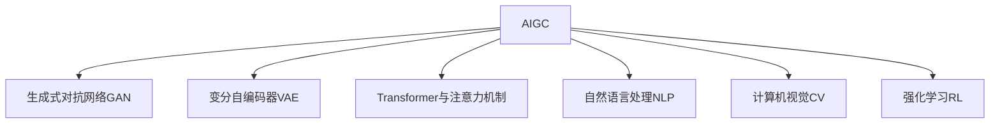

# AIGC(AI Generated Content) - 原理与代码实例讲解

## 1. 背景介绍

### 1.1 AIGC的兴起与发展历程
#### 1.1.1 早期的AIGC探索
#### 1.1.2 深度学习时代的AIGC突破
#### 1.1.3 AIGC在各领域的应用拓展

### 1.2 AIGC的定义与特点
#### 1.2.1 AIGC的定义
#### 1.2.2 AIGC的核心特点
#### 1.2.3 AIGC与传统内容生成方式的区别

### 1.3 AIGC的价值与意义
#### 1.3.1 AIGC在内容创作领域的革命性影响
#### 1.3.2 AIGC对于个人与企业的价值
#### 1.3.3 AIGC对于社会发展的意义

## 2. 核心概念与联系

### 2.1 AIGC的核心概念
#### 2.1.1 生成式对抗网络(GAN)
#### 2.1.2 变分自编码器(VAE)  
#### 2.1.3 Transformer与注意力机制

### 2.2 AIGC与相关领域的联系
#### 2.2.1 AIGC与自然语言处理(NLP)
#### 2.2.2 AIGC与计算机视觉(CV)
#### 2.2.3 AIGC与强化学习(RL)

### 2.3 AIGC的核心概念关系图

## 3. 核心算法原理具体操作步骤

### 3.1 生成式对抗网络(GAN)
#### 3.1.1 GAN的基本原理
#### 3.1.2 GAN的训练过程
#### 3.1.3 GAN的具体操作步骤

### 3.2 变分自编码器(VAE)
#### 3.2.1 VAE的基本原理
#### 3.2.2 VAE的训练过程  
#### 3.2.3 VAE的具体操作步骤

### 3.3 Transformer与注意力机制
#### 3.3.1 Transformer的基本原理
#### 3.3.2 注意力机制的原理与应用
#### 3.3.3 Transformer的具体操作步骤

## 4. 数学模型和公式详细讲解举例说明

### 4.1 生成式对抗网络(GAN)的数学模型
#### 4.1.1 GAN的目标函数
$$\min_G \max_D V(D,G) = \mathbb{E}_{x \sim p_{data}(x)}[\log D(x)] + \mathbb{E}_{z \sim p_z(z)}[\log (1 - D(G(z)))]$$
#### 4.1.2 GAN的损失函数
#### 4.1.3 GAN的优化算法

### 4.2 变分自编码器(VAE)的数学模型  
#### 4.2.1 VAE的目标函数
$$\mathcal{L}(\theta, \phi) = -\mathbb{E}_{z \sim q_{\phi}(z|x)}[\log p_{\theta}(x|z)] + \mathbb{KL}(q_{\phi}(z|x) || p(z))$$
#### 4.2.2 VAE的损失函数
#### 4.2.3 VAE的优化算法

### 4.3 Transformer的数学模型
#### 4.3.1 自注意力机制的数学表示
$$Attention(Q,K,V) = softmax(\frac{QK^T}{\sqrt{d_k}})V$$
#### 4.3.2 多头注意力机制
#### 4.3.3 位置编码

## 5. 项目实践：代码实例和详细解释说明

### 5.1 基于GAN的AIGC项目实践
#### 5.1.1 项目概述与目标
#### 5.1.2 数据准备与预处理
#### 5.1.3 模型构建与训练
#### 5.1.4 生成结果展示与评估

### 5.2 基于VAE的AIGC项目实践
#### 5.2.1 项目概述与目标
#### 5.2.2 数据准备与预处理
#### 5.2.3 模型构建与训练
#### 5.2.4 生成结果展示与评估

### 5.3 基于Transformer的AIGC项目实践
#### 5.3.1 项目概述与目标
#### 5.3.2 数据准备与预处理
#### 5.3.3 模型构建与训练
#### 5.3.4 生成结果展示与评估

## 6. 实际应用场景

### 6.1 AIGC在文本生成领域的应用
#### 6.1.1 自动写作与内容创作
#### 6.1.2 对话生成与聊天机器人
#### 6.1.3 文本摘要与生成式问答

### 6.2 AIGC在图像生成领域的应用
#### 6.2.1 人脸生成与属性编辑
#### 6.2.2 风格迁移与图像翻译
#### 6.2.3 图像超分辨率与修复

### 6.3 AIGC在音频生成领域的应用 
#### 6.3.1 语音合成与转换
#### 6.3.2 音乐生成与风格迁移
#### 6.3.3 环境音生成与增强

## 7. 工具和资源推荐

### 7.1 AIGC开源框架与库
#### 7.1.1 TensorFlow与Keras
#### 7.1.2 PyTorch与torchvision
#### 7.1.3 OpenAI GPT系列模型

### 7.2 AIGC预训练模型与数据集
#### 7.2.1 图像生成预训练模型
#### 7.2.2 文本生成预训练模型
#### 7.2.3 AIGC常用数据集

### 7.3 AIGC学习资源与社区
#### 7.3.1 在线课程与教程
#### 7.3.2 研究论文与综述
#### 7.3.3 AIGC开发者社区

## 8. 总结：未来发展趋势与挑战

### 8.1 AIGC技术的发展趋势
#### 8.1.1 多模态AIGC的融合发展
#### 8.1.2 AIGC与知识图谱的结合
#### 8.1.3 AIGC在元宇宙中的应用前景

### 8.2 AIGC面临的挑战与问题
#### 8.2.1 AIGC的伦理与安全问题
#### 8.2.2 AIGC生成内容的版权问题
#### 8.2.3 AIGC技术的可解释性与可控性

### 8.3 AIGC的未来研究方向
#### 8.3.1 提高AIGC生成内容的多样性与创造力
#### 8.3.2 AIGC与人机交互的深度融合
#### 8.3.3 AIGC在实际应用中的落地与优化

## 9. 附录：常见问题与解答

### 9.1 AIGC与传统内容生成方式的区别是什么？
### 9.2 AIGC生成的内容是否具有版权？
### 9.3 如何评估AIGC生成内容的质量？
### 9.4 AIGC技术的发展对内容创作者有什么影响？
### 9.5 如何学习和掌握AIGC技术？

作者：禅与计算机程序设计艺术 / Zen and the Art of Computer Programming