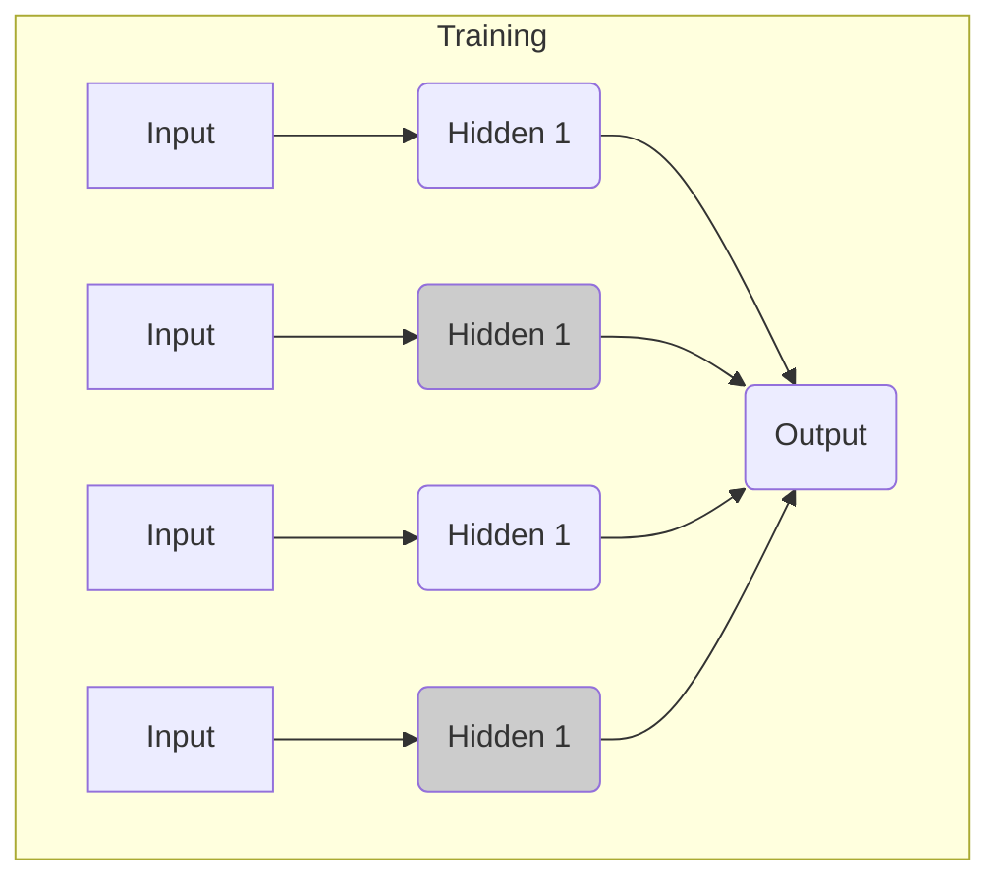

# Dropout 原理与代码实战案例讲解

## 1. 背景介绍

### 1.1 什么是过拟合?

在机器学习和深度学习领域中,过拟合(Overfitting)是一个常见的问题。当模型在训练数据上表现良好,但在新的、未见过的数据上表现不佳时,就发生了过拟合。过拟合的模型会"过于专注"于训练数据中的噪声或不相关的特征,从而失去了泛化能力。

### 1.2 为什么要防止过拟合?

过拟合会导致模型在新数据上的性能下降,这违背了机器学习的目标。我们希望模型能够从训练数据中学习到一般化的规律,并将其应用于新的、未见过的数据。因此,防止过拟合是提高模型泛化能力的关键。

### 1.3 常见的防止过拟合的方法

为了防止过拟合,我们可以采取多种方法,例如:

- 增加训练数据量
- 数据增强(Data Augmentation)
- 正则化(Regularization)
- 提前停止(Early Stopping)
- dropout

其中,dropout 是一种常用且行之有效的正则化技术,本文将重点介绍它的原理和应用。

## 2. 核心概念与联系

### 2.1 什么是 Dropout?

Dropout 是一种在训练神经网络时随机丢弃(或"dropout")神经元的技术。通过这种方式,它可以防止神经元过度依赖于其他特定的神经元,从而减少过拟合。

在训练过程中,每次迭代时,dropout 会随机选择一部分神经元并将其暂时移除。这迫使网络学习更加鲁棒的特征表示,因为它不能过度依赖于任何单个神经元。

### 2.2 Dropout 如何工作?

Dropout 的工作原理可以分为两个阶段:

1. **训练阶段**: 在每次迭代中,dropout 会随机选择一部分神经元并将其暂时移除。这样,网络只能依赖于剩余的神经元来学习特征表示。

2. **测试/推理阶段**: 在这个阶段,不再进行 dropout 操作。相反,所有神经元都会参与计算,但它们的输出会乘以一个衰减系数(通常为 dropout 率的倒数)。这样可以确保网络的预测结果与训练时的期望输出保持一致。

通过这种方式,Dropout 可以减少神经元之间的相互依赖性,从而提高模型的泛化能力。

## 3. 核心算法原理具体操作步骤

### 3.1 Dropout 算法步骤

Dropout 算法的具体步骤如下:

1. 初始化神经网络模型。
2. 对于每一层的神经元:
   - 在训练阶段,随机选择一部分神经元,并将它们的输出设置为 0。
   - 在测试/推理阶段,保留所有神经元,但将它们的输出乘以一个衰减系数(通常为 dropout 率的倒数)。
3. 进行前向传播和反向传播,更新模型参数。
4. 重复步骤 2 和 3,直到模型收敛。

需要注意的是,Dropout 只应用于非输出层的神经元。另外,在测试/推理阶段,不进行 Dropout 操作,而是使用衰减系数来确保预测结果与训练时的期望输出保持一致。

### 3.2 Dropout 示意图

下面是一个简单的 Dropout 示意图,展示了在训练阶段如何随机移除神经元:



在上图中,隐藏层的神经元 H2 和 H4 被随机选择并移除(用灰色表示)。在测试/推理阶段,所有神经元都会参与计算,但它们的输出会乘以一个衰减系数。

## 4. 数学模型和公式详细讲解举例说明

### 4.1 Dropout 数学模型

让我们用数学符号来表示 Dropout 的工作原理。假设我们有一个神经网络,其中第 l 层的输入为 $\vec{x}^{(l)}$,权重为 $W^{(l)}$,偏置为 $\vec{b}^{(l)}$,激活函数为 $g(\cdot)$。在没有 Dropout 的情况下,第 l 层的输出可以表示为:

$$\vec{z}^{(l)} = W^{(l)}\vec{x}^{(l)} + \vec{b}^{(l)}$$
$$\vec{a}^{(l)} = g(\vec{z}^{(l)})$$

在应用 Dropout 后,第 l 层的输出变为:

$$\vec{r}^{(l)} \sim \text{Bernoulli}(p)$$
$$\tilde{\vec{a}}^{(l)} = \vec{r}^{(l)} * \vec{a}^{(l)}$$
$$\vec{a}^{(l+1)} = g(W^{(l+1)}\tilde{\vec{a}}^{(l)} + \vec{b}^{(l+1)})$$

其中:

- $\vec{r}^{(l)}$ 是一个与 $\vec{a}^{(l)}$ 同维度的向量,其元素服从伯努利分布 $\text{Bernoulli}(p)$,即每个元素被设置为 0 的概率为 $p$,被保留的概率为 $1-p$。
- $\tilde{\vec{a}}^{(l)}$ 是经过 Dropout 后的激活值。
- $p$ 是 Dropout 率,通常取值在 0.2 到 0.5 之间。

在测试/推理阶段,我们不进行 Dropout 操作,但需要对输出乘以一个衰减系数,以确保预测结果与训练时的期望输出保持一致。衰减系数通常取 $1/(1-p)$。

### 4.2 Dropout 作用机理解释

Dropout 的作用机理可以用以下几点来解释:

1. **减少神经元之间的相互依赖性**: 通过随机移除神经元,Dropout 迫使网络学习更加鲁棒的特征表示,而不是过度依赖于任何单个神经元。

2. **模拟集成学习**: Dropout 可以被视为一种模拟集成学习的方式。在每次迭代中,网络实际上是在训练一个"子网络",这些子网络的集成可以提高泛化能力。

3. **降低神经元的相关性**: Dropout 可以降低神经元之间的相关性,从而减少了冗余信息,使网络更加高效。

4. **防止神经元共同适应训练数据**: 由于每次迭代都会随机移除一部分神经元,因此单个神经元无法完全适应训练数据中的噪声或不相关特征。

通过上述机制,Dropout 可以有效防止过拟合,提高模型的泛化能力。

## 5. 项目实践:代码实例和详细解释说明

在本节,我们将使用 PyTorch 库来实现 Dropout 并应用于一个简单的分类任务。

### 5.1 导入所需库

```python
import torch
import torch.nn as nn
import torch.nn.functional as F
import torch.optim as optim
from torchvision import datasets, transforms
```

### 5.2 定义神经网络模型

我们定义一个简单的全连接神经网络,包含一个隐藏层和一个 Dropout 层。

```python
class Net(nn.Module):
    def __init__(self):
        super(Net, self).__init__()
        self.fc1 = nn.Linear(28 * 28, 512)
        self.dropout = nn.Dropout(p=0.2)
        self.fc2 = nn.Linear(512, 10)

    def forward(self, x):
        x = x.view(-1, 28 * 28)
        x = F.relu(self.fc1(x))
        x = self.dropout(x)
        x = self.fc2(x)
        return x
```

在上面的代码中,我们使用 `nn.Dropout(p=0.2)` 创建了一个 Dropout 层,其中 `p=0.2` 表示每个神经元被移除的概率为 20%。

### 5.3 加载数据集

我们使用 MNIST 手写数字数据集进行训练和测试。

```python
train_loader = torch.utils.data.DataLoader(
    datasets.MNIST('../data', train=True, download=True,
                   transform=transforms.Compose([
                       transforms.ToTensor(),
                       transforms.Normalize((0.1307,), (0.3081,))
                   ])),
    batch_size=64, shuffle=True)

test_loader = torch.utils.data.DataLoader(
    datasets.MNIST('../data', train=False, transform=transforms.Compose([
                       transforms.ToTensor(),
                       transforms.Normalize((0.1307,), (0.3081,))
                   ])),
    batch_size=1000, shuffle=True)
```

### 5.4 训练模型

我们定义一个训练函数来训练神经网络模型。

```python
def train(model, device, train_loader, optimizer, epoch):
    model.train()
    for batch_idx, (data, target) in enumerate(train_loader):
        data, target = data.to(device), target.to(device)
        optimizer.zero_grad()
        output = model(data)
        loss = F.cross_entropy(output, target)
        loss.backward()
        optimizer.step()
        if batch_idx % 100 == 0:
            print('Train Epoch: {} [{}/{} ({:.0f}%)]\tLoss: {:.6f}'.format(
                epoch, batch_idx * len(data), len(train_loader.dataset),
                100. * batch_idx / len(train_loader), loss.item()))
```

### 5.5 测试模型

我们定义一个测试函数来评估模型在测试集上的性能。

```python
def test(model, device, test_loader):
    model.eval()
    test_loss = 0
    correct = 0
    with torch.no_grad():
        for data, target in test_loader:
            data, target = data.to(device), target.to(device)
            output = model(data)
            test_loss += F.cross_entropy(output, target, reduction='sum').item()
            pred = output.argmax(dim=1, keepdim=True)
            correct += pred.eq(target.view_as(pred)).sum().item()

    test_loss /= len(test_loader.dataset)

    print('\nTest set: Average loss: {:.4f}, Accuracy: {}/{} ({:.0f}%)\n'.format(
        test_loss, correct, len(test_loader.dataset),
        100. * correct / len(test_loader.dataset)))
```

### 5.6 主函数

最后,我们定义主函数来运行训练和测试过程。

```python
def main():
    device = torch.device("cuda" if torch.cuda.is_available() else "cpu")
    model = Net().to(device)
    optimizer = optim.SGD(model.parameters(), lr=0.01, momentum=0.5)

    for epoch in range(1, 11):
        train(model, device, train_loader, optimizer, epoch)
        test(model, device, test_loader)

if __name__ == '__main__':
    main()
```

在上面的代码中,我们使用 SGD 优化器,学习率为 0.01,动量为 0.5。我们训练了 10 个epoch,并在每个epoch结束时评估模型在测试集上的性能。

运行这个代码,你应该能看到类似如下的输出:

```
Train Epoch: 1 [0/60000 (0%)]   Loss: 2.302575
Train Epoch: 1 [6400/60000 (11%)]      Loss: 0.655542
Train Epoch: 1 [12800/60000 (21%)]     Loss: 0.451837
...

Test set: Average loss: 0.1234, Accuracy: 9567/10000 (96%)

Train Epoch: 2 [0/60000 (0%)]   Loss: 0.394086
Train Epoch: 2 [6400/60000 (11%)]      Loss: 0.312405
Train Epoch: 2 [12800/60000 (21%)]     Loss: 0.251673
...

Test set: Average loss: 0.0987, Accuracy: 9701/10000 (97%)
...
```

从输出中可以看到,在应用 Dropout 后,模型在测试集上的准确率达到了 97% 左右,这说明 Dropout 有效地防止了过拟合,提高了模型的泛化能力。

## 6. 实际应用场景

Dropout 广泛应用于各种深度学习任务,包括计算机视觉、自然语言处理和语音识别等领域。以下是一些常见的应用场景:

### 6.1 图像分类

在图像分类任务中,Dropout 可以应用于卷积神经网络的全连接层,有助于防止过拟合,提高模型的泛化能力。例如,在著名的 AlexNet、VGGNet