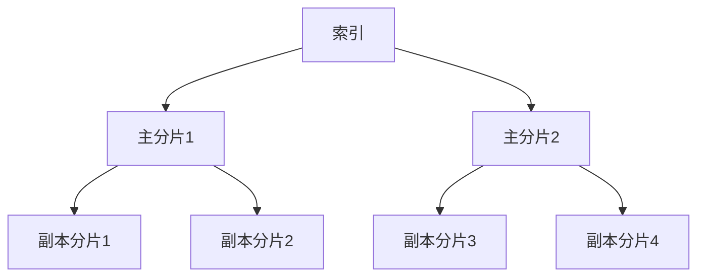
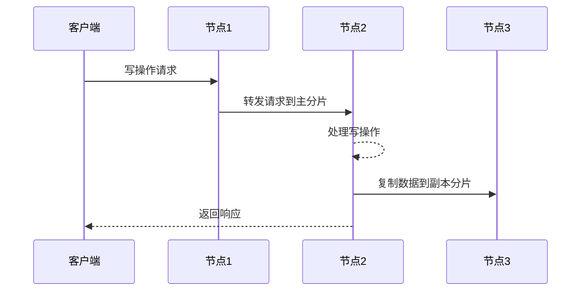
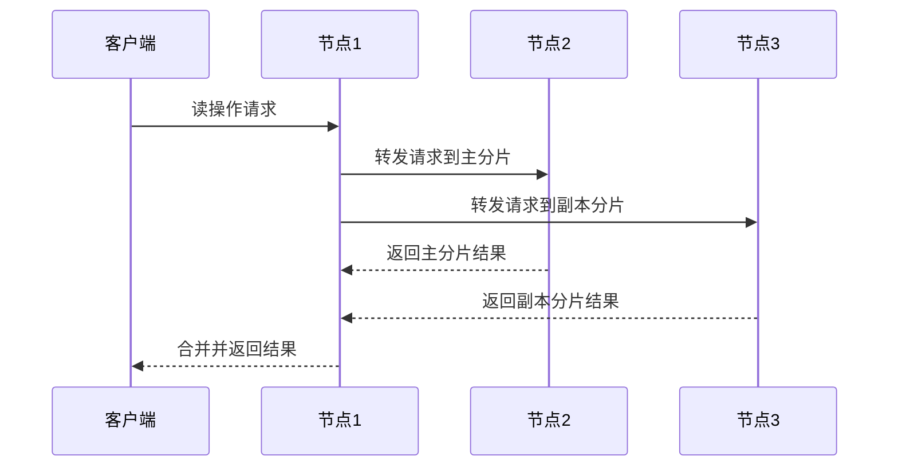

# ElasticSearch Replica原理与代码实例讲解

## 1.背景介绍

### 1.1 什么是ElasticSearch

ElasticSearch是一个分布式、RESTful风格的搜索和数据分析引擎,它能够解决不断涌现出的各种用例场景,是目前最受欢迎的企业级搜索引擎之一。ElasticSearch基于Apache Lucene构建,能够快速存储、搜索和分析大量数据。

### 1.2 ElasticSearch集群和分片

ElasticSearch可以作为单个节点运行,但更多时候它被设置为集群模式,以提供更高的可用性和可扩展性。一个ElasticSearch集群由一个或多个节点组成,每个节点属于集群的一部分,存储数据和参与集群的操作。

为了实现水平扩展,ElasticSearch将数据分散存储在多个分片(shards)上。每个分片本身就是一个Lucene索引。应用程序数据被划分为多个文档,存储在不同的分片中。

### 1.3 Replica的作用

为了提高数据冗余和高可用性,ElasticSearch允许为每个分片创建一个或多个副本(replicas)。副本是分片的精确拷贝,用于防止硬件故障或节点宕机导致的数据丢失。当某个分片无法使用时,ElasticSearch会自动将请求转发到该分片的副本上。

## 2.核心概念与联系

### 2.1 主分片和副本分片

在ElasticSearch中,每个索引都会被划分为多个分片。其中一个分片被称为主分片(primary shard),其余的是副本分片(replica shards)。主分片负责处理所有的索引和查询操作,而副本分片只是被动复制主分片的数据。



### 2.2 主分片和副本分片的关系

主分片和副本分片之间存在如下关系:

1. 每个主分片都有一个或多个副本分片。
2. 副本分片是主分片的精确拷贝,包含完全相同的数据。
3. 写操作(索引、更新、删除)只能在主分片上执行,然后自动复制到副本分片。
4. 读操作(搜索、获取)可以在主分片或任意副本分片上执行。

### 2.3 副本分片的作用

副本分片的主要作用包括:

1. **数据冗余**: 如果某个节点发生故障,其上的主分片或副本分片数据会丢失。但由于有副本分片,数据仍然可以从其他副本分片获取。
2. **提高查询吞吐量**: 查询操作可以在所有副本分片上并行执行,提高了查询的吞吐量和速度。
3. **分担写操作压力**: 尽管写操作只能在主分片上执行,但主分片会自动复制到副本分片,分担了写压力。

## 3.核心算法原理具体操作步骤

### 3.1 创建索引时设置副本数量

在创建索引时,可以通过`number_of_replicas`参数指定副本数量。例如,以下命令创建一个名为`products`的索引,设置3个副本分片:

```
PUT /products
{
  "settings": {
    "number_of_shards": 2,
    "number_of_replicas": 3
  }
}
```

该索引将有2个主分片和6个副本分片(每个主分片3个副本),总共8个分片。

### 3.2 写操作流程

当执行写操作(索引、更新、删除)时,数据首先被写入主分片,然后主分片将数据复制到所有副本分片。具体流程如下:

1. 客户端向任意节点发送写操作请求。
2. 该节点通过算法计算出文档应该存储在哪个主分片上。
3. 该节点将请求转发给存储该主分片的节点。
4. 主分片处理写操作,并将数据复制到所有副本分片。
5. 一旦所有副本分片都复制完成,写操作才算真正完成。



### 3.3 读操作流程

读操作(搜索、获取)可以在任意副本分片上执行,从而提高吞吐量。具体流程如下:

1. 客户端向任意节点发送读操作请求。
2. 该节点计算出文档可能存在的主分片和副本分片。
3. 该节点将请求并行转发到这些分片所在的节点。
4. 每个节点在本地分片上执行读操作。
5. 节点将结果返回给协调节点(发送请求的节点)。
6. 协调节点合并所有分片的结果,并返回给客户端。



## 4.数学模型和公式详细讲解举例说明

在ElasticSearch中,有一些与副本分片相关的重要公式和概念。

### 4.1 总分片数量

ElasticSearch集群中的总分片数量由以下公式计算:

$$
总分片数量 = 主分片数量 \times (副本数量 + 1)
$$

例如,如果一个索引有3个主分片,副本数量设置为2,那么总分片数量为:

$$
总分片数量 = 3 \times (2 + 1) = 9
$$

即该索引总共有9个分片(3个主分片和6个副本分片)。

### 4.2 分片分配算法

ElasticSearch使用特殊的分片分配算法来决定将分片分配到哪些节点上。该算法的目标是实现高可用性和负载均衡。分片分配算法考虑以下因素:

- 尽量将主分片和副本分片分散到不同的节点上,以防止单点故障。
- 尽量将分片均匀分布在所有节点上,实现负载均衡。
- 考虑节点的硬件资源(CPU、内存、磁盘等),将更多分片分配给资源更多的节点。

分片分配算法使用一些启发式规则和概率模型,通过迭代优化的方式寻找最佳分配方案。具体算法过于复杂,这里不再赘述。

### 4.3 写吞吐量与副本数量

由于写操作只能在主分片上执行,因此写吞吐量与副本数量的关系如下:

$$
写吞吐量 \propto \frac{1}{副本数量 + 1}
$$

也就是说,写吞吐量与副本数量成反比。副本数量越多,写吞吐量就越低,因为需要将数据复制到更多的副本分片上。

但是,适当增加副本数量能够提高数据冗余和查询吞吐量。因此,在设置副本数量时需要权衡写吞吐量和数据可靠性之间的平衡。

## 5.项目实践:代码实例和详细解释说明

下面通过一个简单的Java示例演示如何使用ElasticSearch客户端API创建索引、插入数据并查询数据。

### 5.1 创建ElasticSearch客户端

首先,我们需要创建一个ElasticSearch客户端实例,用于与ElasticSearch集群进行交互。

```java
// 创建ElasticSearch客户端
RestHighLevelClient client = new RestHighLevelClient(
    RestClient.builder(
        new HttpHost("localhost", 9200, "http")));
```

### 5.2 创建索引

接下来,我们创建一个名为`products`的索引,设置2个主分片和3个副本分片。

```java
// 创建索引请求
CreateIndexRequest request = new CreateIndexRequest("products");
request.settings(Settings.builder()
    .put("index.number_of_shards", 2)
    .put("index.number_of_replicas", 3)
);

// 发送创建索引请求
CreateIndexResponse createIndexResponse = client.indices().create(request, RequestOptions.DEFAULT);
```

### 5.3 插入数据

现在,我们向`products`索引插入一些产品数据。

```java
// 插入数据
IndexRequest request = new IndexRequest("products")
    .source(
        "name", "Product 1",
        "description", "This is the first product",
        "price", 9.99
    );
IndexResponse response = client.index(request, RequestOptions.DEFAULT);
```

### 5.4 查询数据

最后,我们执行一个搜索查询,查找名称包含"Product"的所有文档。

```java
// 搜索查询
SearchRequest searchRequest = new SearchRequest("products");
SearchSourceBuilder sourceBuilder = new SearchSourceBuilder();
sourceBuilder.query(QueryBuilders.matchQuery("name", "Product"));
searchRequest.source(sourceBuilder);

SearchResponse searchResponse = client.search(searchRequest, RequestOptions.DEFAULT);

// 输出查询结果
SearchHits hits = searchResponse.getHits();
for (SearchHit hit : hits) {
    Map<String, Object> sourceAsMap = hit.getSourceAsMap();
    System.out.println("Name: " + sourceAsMap.get("name"));
    System.out.println("Description: " + sourceAsMap.get("description"));
    System.out.println("Price: " + sourceAsMap.get("price"));
    System.out.println("---");
}
```

在上面的示例中,我们首先创建了一个ElasticSearch客户端实例。然后,我们创建了一个名为`products`的索引,设置了2个主分片和3个副本分片。接下来,我们向该索引插入了一个产品文档。最后,我们执行了一个搜索查询,查找名称包含"Product"的所有文档,并输出查询结果。

通过这个简单的示例,您可以了解如何使用ElasticSearch Java客户端API执行基本的索引、数据插入和查询操作。

## 6.实际应用场景

ElasticSearch的副本机制在许多实际应用场景中发挥着重要作用,例如:

### 6.1 电子商务网站

在电子商务网站中,产品数据需要被快速搜索和检索。ElasticSearch可以用于存储和索引大量的产品信息,并提供高效的搜索功能。通过设置适当的副本数量,可以实现数据冗余和高可用性,确保即使某些节点发生故障,用户仍然可以正常搜索和购买产品。

### 6.2 日志分析系统

日志分析系统需要收集和分析来自各种来源的大量日志数据。ElasticSearch可以作为日志存储和分析的后端,通过分片和副本机制实现高吞吐量和可靠性。即使某些节点发生故障,也不会影响日志数据的完整性和查询能力。

### 6.3 网站搜索引擎

许多大型网站都需要提供内部搜索引擎,允许用户搜索网站内容。ElasticSearch可以用于索引网站的所有页面和内容,并提供快速、准确的搜索功能。通过设置合适的副本数量,可以提高搜索吞吐量和可用性,确保用户获得良好的搜索体验。

### 6.4 安全威胁检测系统

安全威胁检测系统需要实时监控和分析大量的网络流量和安全事件数据。ElasticSearch可以用于存储和索引这些数据,并提供强大的搜索和聚合分析功能。通过副本机制,可以确保即使某些节点发生故障,也不会影响数据的完整性和分析能力。

## 7.工具和资源推荐

### 7.1 ElasticSearch官方资源

- [ElasticSearch官网](https://www.elastic.co/elasticsearch/): 提供ElasticSearch的下载、文档、教程和社区支持。
- [ElasticSearch参考手册](https://www.elastic.co/guide/en/elasticsearch/reference/current/index.html): 详细介绍了ElasticSearch的各种概念、配置和API。
- [ElasticSearch客户端库](https://www.elastic.co/guide/en/elasticsearch/client/index.html): 提供了多种编程语言的客户端库,方便与ElasticSearch集群进行交互。

### 7.2 Elas