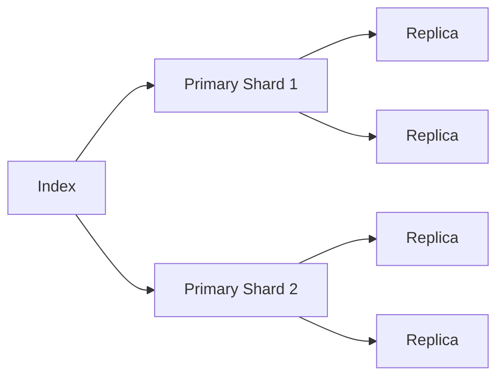
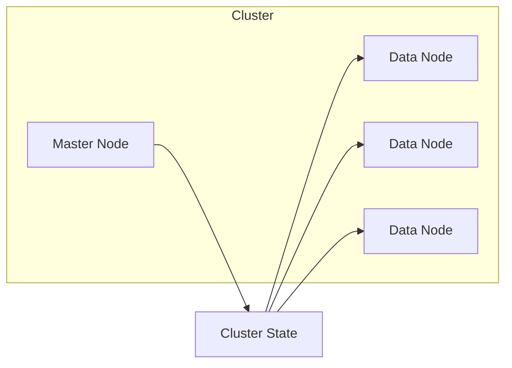

# ElasticSearch原理与代码实例讲解

## 1.背景介绍

### 1.1 什么是ElasticSearch?

ElasticSearch是一个分布式、RESTful风格的搜索和数据分析引擎,它能够实时地存储、搜索和分析大量数据。它基于Apache Lucene库构建,并通过简单的RESTful API提供了分布式的全文搜索引擎,可以用于云计算环境中进行复杂的数据挖掘。

### 1.2 ElasticSearch的应用场景

ElasticSearch可广泛应用于各种场景,例如:

- 电商网站的商品搜索
- 日志数据分析
- 基于地理位置的数据搜索和分析
- 安全分析
- 业务分析
- 网站搜索
- 自动补全和建议

### 1.3 ElasticSearch的优势

- 分布式,易于扩展
- 近实时搜索
- 多租户支持
- 支持全文检索
- RESTful风格,使用简单
- 多语言客户端支持

## 2.核心概念与联系

### 2.1 集群(Cluster)

ElasticSearch可以由多个节点(Node)组成一个集群,集群通过统一的集群名称进行标识。集群中会自动选举一个主节点(Master Node),其他节点为数据节点(Data Node)。


### 2.2 索引(Index)

索引是ElasticSearch中的逻辑命名空间,用于存储关联的文档数据。一个索引可以分为多个分片(Shard),每个分片可以有一个或多个副本(Replica)。



### 2.3 文档(Document)

文档是ElasticSearch中最小的数据单元,用JSON格式表示。每个文档都属于一个索引,并由唯一的ID标识。

```json
{
  "name": "John Doe",
  "age": 30,
  "email": "john@example.com"
}
```

### 2.4 映射(Mapping)

映射定义了文档及其包含的字段如何存储和索引。它包括字段的数据类型、分析器、是否索引等设置。

```json
{
  "properties": {
    "name": {
      "type": "text"
    },
    "age": {
      "type": "integer"
    },
    "email": {
      "type": "keyword"
    }
  }
}
```

## 3.核心算法原理具体操作步骤

### 3.1 倒排索引

ElasticSearch的核心算法是基于倒排索引(Inverted Index)的全文搜索。倒排索引是一种数据结构,用于将文档中的词条映射到包含它们的文档列表。

1. **分词(Tokenization)**: 将文本按照某种规则分解为词条(Token)。
2. **词条过滤(Token Filtering)**: 对分词结果进行标准化,如转小写、去除标点符号等。
3. **构建倒排索引**: 为每个词条创建一个倒排索引项,包含该词条出现的文档列表。


### 3.2 相关性评分

当进行搜索时,ElasticSearch会根据查询和文档的相关性对结果进行评分和排序。常用的评分算法有:

- **TF-IDF(Term Frequency-Inverse Document Frequency)**: 考虑词条在文档中的频率和在整个索引中的稀有程度。
- **BM25(Okapi BM25)**: 基于TF-IDF,并引入了其他调整因子,如字段长度、文档长度等。
- **语义向量**: 利用词嵌入(Word Embedding)等技术,计算查询和文档在语义空间的相似度。

### 3.3 分布式架构

ElasticSearch采用分布式架构,支持横向扩展。主要原理包括:

1. **分片(Sharding)**: 索引被划分为多个分片,分布在不同节点上,提高并行处理能力。
2. **副本(Replication)**: 每个分片可以有一个或多个副本,提高数据冗余和查询吞吐量。
3. **集群发现(Cluster Discovery)**: 节点通过组播或单播方式相互发现,形成集群。
4. **集群状态(Cluster State)**: 主节点维护集群的元数据和状态,并将其同步到其他节点。
5. **分片分配(Shard Allocation)**: 主节点根据一定策略,将分片分配到不同的数据节点上。



## 4.数学模型和公式详细讲解举例说明

### 4.1 TF-IDF

TF-IDF(Term Frequency-Inverse Document Frequency)是一种常用的相关性评分算法,用于计算一个词条对于一个文档或查询的重要程度。

TF-IDF由两部分组成:

1. **词频(Term Frequency, TF)**: 一个词条在文档中出现的频率。

$$
TF(t,d) = \frac{freq(t,d)}{max\_freq(d)}
$$

其中,$ freq(t,d) $表示词条$ t $在文档$ d $中出现的频率,$ max\_freq(d) $表示文档$ d $中出现频率最高的词条的频率。

2. **逆向文档频率(Inverse Document Frequency, IDF)**: 一个词条在整个文档集合中的普遍重要性程度。

$$
IDF(t,D) = log\frac{N}{df_t} + 1
$$

其中,$ N $表示文档总数,$ df_t $表示包含词条$ t $的文档数量。

综合TF和IDF,TF-IDF的计算公式为:

$$
TFIDF(t,d,D) = TF(t,d) \times IDF(t,D)
$$

TF-IDF值越高,表示该词条对于文档或查询越重要。

### 4.2 BM25

BM25(Okapi BM25)是一种改进的TF-IDF算法,引入了更多的调整因子,如字段长度、文档长度等。

BM25的计算公式为:

$$
BM25(q,d) = \sum_{t \in q} IDF(t) \cdot \frac{tf(t,d) \cdot (k_1 + 1)}{tf(t,d) + k_1 \cdot (1 - b + b \cdot \frac{|d|}{avgdl})}
$$

其中:

- $ q $表示查询
- $ d $表示文档
- $ tf(t,d) $表示词条$ t $在文档$ d $中的词频
- $ |d| $表示文档$ d $的长度
- $ avgdl $表示文档集合的平均长度
- $ k_1 $和$ b $是调整因子,用于控制词频和文档长度的影响程度

BM25相比TF-IDF,考虑了更多的因素,通常能够获得更好的搜索质量。

## 5.项目实践:代码实例和详细解释说明

### 5.1 安装和配置ElasticSearch

ElasticSearch可以通过多种方式安装,包括下载预编译的二进制包、使用Docker镜像等。以下是使用Docker安装ElasticSearch的示例:

```bash
# 拉取ElasticSearch Docker镜像
docker pull docker.elastic.co/elasticsearch/elasticsearch:7.17.3

# 运行ElasticSearch容器
docker run -d --name elasticsearch -p 9200:9200 -p 9300:9300 -e "discovery.type=single-node" docker.elastic.co/elasticsearch/elasticsearch:7.17.3
```

### 5.2 使用ElasticSearch Java客户端

ElasticSearch提供了多种语言的客户端,以下是使用Java客户端的示例:

```java
// 创建ElasticSearch客户端
RestHighLevelClient client = new RestHighLevelClient(
    RestClient.builder(
        new HttpHost("localhost", 9200, "http")));

// 创建索引
CreateIndexRequest request = new CreateIndexRequest("products");
CreateIndexResponse response = client.indices().create(request, RequestOptions.DEFAULT);

// 插入文档
Map<String, Object> data = new HashMap<>();
data.put("name", "Product A");
data.put("price", 99.99);
IndexRequest indexRequest = new IndexRequest("products")
    .id("1")
    .source(data);
IndexResponse indexResponse = client.index(indexRequest, RequestOptions.DEFAULT);

// 搜索文档
SearchRequest searchRequest = new SearchRequest("products");
SearchSourceBuilder sourceBuilder = new SearchSourceBuilder();
sourceBuilder.query(QueryBuilders.matchQuery("name", "Product"));
searchRequest.source(sourceBuilder);
SearchResponse searchResponse = client.search(searchRequest, RequestOptions.DEFAULT);

// 处理搜索结果
SearchHits hits = searchResponse.getHits();
for (SearchHit hit : hits) {
    Map<String, Object> source = hit.getSourceAsMap();
    System.out.println("Name: " + source.get("name") + ", Price: " + source.get("price"));
}

// 关闭客户端
client.close();
```

上述代码演示了如何创建ElasticSearch客户端、创建索引、插入文档、搜索文档等基本操作。

### 5.3 使用ElasticSearch查询DSL

ElasticSearch提供了一种灵活的查询语言,称为查询DSL(Query DSL),可以构建复杂的查询。以下是一个组合查询的示例:

```json
{
  "query": {
    "bool": {
      "must": [
        {
          "match": {
            "name": "Product"
          }
        }
      ],
      "filter": [
        {
          "range": {
            "price": {
              "gte": 50,
              "lte": 100
            }
          }
        }
      ]
    }
  }
}
```

上述查询将搜索包含"Product"的文档,并且价格在50到100之间。

## 6.实际应用场景

ElasticSearch可以应用于各种场景,以下是一些常见的应用示例:

### 6.1 电商网站商品搜索

在电商网站中,ElasticSearch可以用于构建高效的商品搜索引擎,支持全文搜索、facet过滤、相关度排序等功能。

### 6.2 日志分析

ElasticSearch可以与Logstash和Kibana配合,构建ELK日志分析平台,用于收集、存储和分析大量的日志数据。

### 6.3 网站搜索

ElasticSearch可以为网站提供全文搜索功能,支持对网页内容、用户评论等进行搜索和分析。

### 6.4 安全分析

ElasticSearch可以用于安全领域,如实时监控和分析网络流量、检测入侵行为等。

### 6.5 基于地理位置的搜索

ElasticSearch支持基于地理位置的搜索,可以用于构建基于位置的推荐系统、物流跟踪等应用。

## 7.工具和资源推荐

### 7.1 Kibana

Kibana是ElasticSearch的官方数据可视化平台,提供了丰富的图表和仪表板功能,可以方便地探索和分析ElasticSearch中的数据。

### 7.2 Logstash

Logstash是ELK技术栈中的日志收集和处理工具,可以从各种来源收集数据,并将其发送到ElasticSearch进行存储和分析。

### 7.3 Beats

Beats是一系列轻量级的数据发送器,用于从不同的源头(如服务器、容器、虚拟机等)收集数据,并将其发送到ElasticSearch或Logstash进行处理。

### 7.4 ElasticSearch Head

ElasticSearch Head是一个基于Web的ElasticSearch集群管理工具,提供了直观的界面,可以方便地查看集群状态、索引映射、执行搜索等操作。

### 7.5 ElasticSearch客户端

ElasticSearch提供了多种语言的客户端,包括Java、Python、Go、.NET等,方便开发人员在应用程序中集成ElasticSearch功能。

## 8.总结:未来发展趋势与挑战

### 8.1 机器学习和深度学习

ElasticSearch正在不断融入机器学习和深度学习技术,以提供更智能的搜索和分析功能。例如,通过语义向量和词嵌入技术,可以实现更准确的相关性评分和推荐。

### 8.2 云原生和Kubernetes支持

随着云计算和容器技术的发展,ElasticSearch也在不断加强对云原生和Kubernetes的支持,以更好地适应云环境的需求。

### 8.3 安全性和合规性

随着