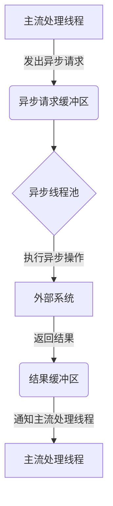

# Flink Async I/O原理与代码实例讲解

## 1.背景介绍

### 1.1 Apache Flink简介

Apache Flink是一个开源的分布式流处理框架,专门为有状态计算而设计。它支持高吞吐量和低延迟的数据流处理,并提供事件驱动型的应用程序的准确一次性处理语义。Flink还支持有状态的流处理应用程序,能够在应用程序崩溃或发生故障转移时自动恢复,保证端到端的一致性。

### 1.2 Flink Async I/O概述

在流处理中,经常会遇到需要与外部系统进行交互的场景,例如访问数据库、Web服务或文件系统等。这些操作通常是阻塞式的,会导致整个流处理管道的延迟增加。为了解决这个问题,Flink提供了Async I/O机制,允许将阻塞操作异步化,从而提高整体吞吐量。

Async I/O通过将阻塞操作交给一个线程池来异步执行,避免了主流处理线程被阻塞。当异步操作完成时,结果会被缓存并发送回主流处理管道。这种异步处理模式能够充分利用CPU资源,提高整体系统吞吐量。

## 2.核心概念与联系

### 2.1 异步请求处理流程

Flink Async I/O的核心概念是将阻塞操作异步化,避免主流处理线程被阻塞。其处理流程如下所示:



1. 主流处理线程遇到需要与外部系统交互的操作时,会发出异步请求并将其放入异步请求缓冲区。
2. 异步线程池会从缓冲区中取出请求,并执行实际的异步操作,例如访问数据库或Web服务。
3. 异步操作完成后,结果会被放入结果缓冲区。
4. 结果缓冲区会通知主流处理线程,让它从缓冲区中取出结果进行后续处理。

通过这种异步处理模式,主流处理线程不会被阻塞,从而提高了整体吞吐量。同时,异步线程池可以根据需求动态调整大小,以适应不同的负载情况。

### 2.2 异步快照与一致性

由于Flink支持有状态的流处理应用程序,因此需要保证在发生故障时能够正确恢复状态,实现端到端的一致性。对于异步操作,Flink采用了异步快照机制来保证一致性。

异步快照的工作原理是:在执行异步操作之前,Flink会先对当前状态进行快照,并将快照信息与异步请求一起发送给异步线程池。如果异步操作失败,Flink可以根据快照信息恢复到之前的一致状态,然后重试异步操作。这种机制保证了即使在异步操作失败的情况下,也能够保持端到端的一致性。

## 3.核心算法原理具体操作步骤

### 3.1 异步I/O算法流程

Flink Async I/O的核心算法流程如下:

1. **发出异步请求**:当主流处理线程遇到需要与外部系统交互的操作时,它会创建一个异步请求对象,并将其放入异步请求缓冲区。
2. **执行异步操作**:异步线程池会从缓冲区中取出请求,并执行实际的异步操作。
3. **缓存结果**:异步操作完成后,结果会被缓存在结果缓冲区中。
4. **通知主流处理线程**:结果缓冲区会通知主流处理线程,让它从缓冲区中取出结果进行后续处理。
5. **处理结果**:主流处理线程从结果缓冲区中取出结果,并继续后续的流处理逻辑。

### 3.2 异步快照算法流程

为了保证端到端的一致性,Flink采用了异步快照机制。其算法流程如下:

1. **创建快照**:在执行异步操作之前,Flink会先对当前状态进行快照。
2. **发送快照信息**:快照信息会与异步请求一起发送给异步线程池。
3. **执行异步操作**:异步线程池执行实际的异步操作。
4. **检查操作结果**:如果异步操作成功,则继续后续流程。否则,进入恢复状态步骤。
5. **恢复状态**:根据快照信息,Flink会恢复到之前的一致状态。
6. **重试异步操作**:在恢复状态后,Flink会重试异步操作。

通过这种机制,Flink能够保证即使在异步操作失败的情况下,也能够保持端到端的一致性。

## 4.数学模型和公式详细讲解举例说明

在Flink Async I/O中,异步请求和结果的缓冲区大小是一个关键参数,直接影响系统的吞吐量和延迟。为了确定合适的缓冲区大小,我们可以建立一个简单的数学模型。

假设:
- 每个异步操作的平均处理时间为$T_{op}$
- 异步线程池中的线程数为$N_{thread}$
- 主流处理线程的吞吐量为$R_{in}$

则异步线程池的最大吞吐量为:

$$R_{max} = \frac{N_{thread}}{T_{op}}$$

为了避免主流处理线程被阻塞,我们需要确保异步线程池的吞吐量大于主流处理线程的吞吐量,即:

$$R_{max} > R_{in}$$

将上面两个公式合并,我们可以得到:

$$N_{thread} > R_{in} \times T_{op}$$

这个不等式给出了异步线程池中线程数的下界。同时,我们还需要考虑缓冲区的大小。假设异步请求缓冲区的大小为$B_{req}$,结果缓冲区的大小为$B_{res}$,则需要满足:

$$B_{req} \geq R_{in} \times T_{op}$$
$$B_{res} \geq R_{in} \times T_{op}$$

这两个不等式给出了缓冲区大小的下界。通过合理设置异步线程池大小和缓冲区大小,我们可以确保Flink Async I/O的高吞吐量和低延迟。

## 5.项目实践:代码实例和详细解释说明

在这一节,我们将通过一个实际的代码示例,演示如何在Flink作业中使用Async I/O。我们将构建一个简单的流处理应用程序,它会从Kafka消费消息,对消息中的URL进行异步HTTP请求,并将响应结果输出到另一个Kafka主题。

### 5.1 项目依赖

首先,我们需要在项目的`pom.xml`文件中添加以下依赖项:

```xml
<dependency>
    <groupId>org.apache.flink</groupId>
    <artifactId>flink-streaming-java</artifactId>
    <version>${flink.version}</version>
</dependency>
<dependency>
    <groupId>org.apache.flink</groupId>
    <artifactId>flink-connector-kafka</artifactId>
    <version>${flink.version}</version>
</dependency>
```

这些依赖项包含了Flink流处理核心库和Kafka连接器。

### 5.2 异步HTTP请求函数

接下来,我们定义一个异步HTTP请求函数,它将URL作为输入,并返回HTTP响应的字符串形式:

```java
import org.apache.flink.configuration.Configuration;
import org.apache.flink.streaming.api.functions.async.ResultFuture;
import org.apache.flink.streaming.api.functions.async.RichAsyncFunction;
import org.apache.http.HttpResponse;
import org.apache.http.client.methods.HttpGet;
import org.apache.http.impl.nio.client.CloseableHttpAsyncClient;
import org.apache.http.impl.nio.client.HttpAsyncClients;
import org.apache.http.util.EntityUtils;

import java.util.Collections;
import java.util.concurrent.CompletableFuture;
import java.util.function.Supplier;

public class AsyncHttpRequest extends RichAsyncFunction<String, String> {

    private transient CloseableHttpAsyncClient httpClient;

    @Override
    public void open(Configuration parameters) throws Exception {
        httpClient = HttpAsyncClients.createDefault();
        httpClient.start();
    }

    @Override
    public void close() throws Exception {
        httpClient.close();
    }

    @Override
    public void asyncInvoke(String url, ResultFuture<String> resultFuture) {
        CompletableFuture<String> httpRequest = CompletableFuture.supplyAsync(new Supplier<String>() {
            @Override
            public String get() {
                try {
                    HttpGet request = new HttpGet(url);
                    HttpResponse response = httpClient.execute(request, null).get();
                    return EntityUtils.toString(response.getEntity());
                } catch (Exception e) {
                    return e.getMessage();
                }
            }
        });

        httpRequest.thenAccept(resultFuture::complete);
    }
}
```

这个函数继承自`RichAsyncFunction`，它是Flink提供的用于异步操作的基类。我们重写了`open`和`close`方法,分别用于创建和关闭HTTP客户端。

`asyncInvoke`方法是异步操作的核心逻辑。它接受一个URL作为输入,并创建一个`CompletableFuture`对象来执行HTTP请求。当请求完成后,结果会通过`ResultFuture`对象传递回主流处理线程。

### 5.3 Flink作业主函数

最后,我们编写Flink作业的主函数,将上面定义的异步HTTP请求函数集成到流处理管道中:

```java
import org.apache.flink.streaming.api.datastream.AsyncDataStream;
import org.apache.flink.streaming.api.datastream.DataStream;
import org.apache.flink.streaming.api.environment.StreamExecutionEnvironment;
import org.apache.flink.streaming.connectors.kafka.FlinkKafkaConsumer;
import org.apache.flink.streaming.connectors.kafka.FlinkKafkaProducer;

import java.util.Properties;

public class AsyncIOJob {

    public static void main(String[] args) throws Exception {
        StreamExecutionEnvironment env = StreamExecutionEnvironment.getExecutionEnvironment();

        Properties kafkaProps = new Properties();
        kafkaProps.setProperty("bootstrap.servers", "kafka-broker-url");
        kafkaProps.setProperty("group.id", "async-io-job");

        FlinkKafkaConsumer<String> kafkaConsumer = new FlinkKafkaConsumer<>("input-topic", new SimpleStringSchema(), kafkaProps);

        DataStream<String> inputStream = env.addSource(kafkaConsumer);

        DataStream<String> resultStream = AsyncDataStream.unorderedWait(
                inputStream,
                new AsyncHttpRequest(),
                10000,
                10000,
                10
        );

        resultStream.addSink(new FlinkKafkaProducer<>("output-topic", new SimpleStringSchema(), kafkaProps));

        env.execute("Async IO Job");
    }
}
```

在这个例子中,我们首先创建一个Kafka消费者,从输入主题读取URL字符串。然后,我们使用`AsyncDataStream.unorderedWait`方法将输入流转换为异步流,并指定异步HTTP请求函数。

`AsyncDataStream.unorderedWait`方法的参数分别是:

1. 输入流
2. 异步函数
3. 超时时间(毫秒)
4. 异步请求缓冲区大小
5. 容量因子(用于计算结果缓冲区大小)

最后,我们将异步流的结果输出到另一个Kafka主题。

通过这个示例,您可以看到如何在Flink中使用Async I/O来异步执行阻塞操作,从而提高整体吞吐量。

## 6.实际应用场景

Flink Async I/O可以应用于各种需要与外部系统交互的流处理场景,例如:

1. **数据库查询**:在流处理中,经常需要根据输入数据查询数据库获取额外信息。使用Async I/O可以避免数据库查询阻塞主流处理线程。

2. **Web服务调用**:许多流处理应用需要与外部Web服务进行交互,例如获取实时数据或执行远程计算。Async I/O可以让这些调用异步执行,提高整体吞吐量。

3. **文件系统操作**:一些流处理作业需要读取或写入文件系统,这些操作通常是阻塞的。使用Async I/O可以避免文件系统操作阻塞主流处理线程。

4. **机器学习模型推理**:在一些场景下,流处理应用需要调用机器学习模型进行推理。由于模型推理通常是计算密集型的,使用Async I/O可以