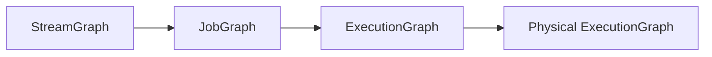

# Flink JobManager原理与代码实例讲解

## 1.背景介绍

Apache Flink是一个开源的分布式流处理和批处理框架,用于在无边界和有边界数据流上进行有状态的计算。Flink能够支持各种规模的数据处理,从单机到数千台机器组成的集群。在Flink的分布式架构中,JobManager是一个核心组件,负责管理和调度整个Flink作业的执行。

### 1.1 Flink的分布式架构概述
#### 1.1.1 Client
#### 1.1.2 JobManager  
#### 1.1.3 TaskManager

### 1.2 JobManager在Flink架构中的地位
#### 1.2.1 作业管理
#### 1.2.2 资源管理 
#### 1.2.3 任务调度

## 2.核心概念与联系

要深入理解JobManager的工作原理,我们需要先了解一些Flink中的核心概念。

### 2.1 Flink运行时的组成
#### 2.1.1 作业图(JobGraph)
#### 2.1.2 执行图(ExecutionGraph)  
#### 2.1.3 物理执行图(Physical ExecutionGraph)

### 2.2 任务链(Operator Chains)

### 2.3 数据流图(Dataflow Graph)
#### 2.3.1 Source
#### 2.3.2 Transformation
#### 2.3.3 Sink

### 2.4 执行图生成过程



## 3.核心算法原理具体操作步骤

JobManager的核心工作是生成和管理ExecutionGraph。下面我们详细讲解ExecutionGraph的生成算法。

### 3.1 StreamGraph转换为JobGraph
#### 3.1.1 StreamNode的生成
#### 3.1.2 JobVertex的生成
#### 3.1.3 IntermediateDataSet的生成
#### 3.1.4 JobEdge的生成

### 3.2 JobGraph转换为ExecutionGraph  
#### 3.2.1 JobVertex转换为ExecutionJobVertex
#### 3.2.2 IntermediateDataSet转换为IntermediateResult
#### 3.2.3 JobEdge转换为ExecutionEdge
#### 3.2.4 ExecutionVertex的生成

### 3.3 ExecutionGraph转换为Physical ExecutionGraph
#### 3.3.1 资源分配
#### 3.3.2 任务链优化
#### 3.3.3 任务调度

## 4.数学模型和公式详细讲解举例说明

### 4.1 数据流模型

Flink的数据流可以用如下公式表示:

$$stream := (e_1, e_2, ..., e_n)$$

其中$e_i$表示数据流中的事件。

### 4.2 窗口模型

Flink支持时间窗口(Time Window)和计数窗口(Count Window)。一个时间窗口可以表示为:

$$w := (start, end)$$

其中$start$和$end$分别表示窗口的起始时间和结束时间。

一个滑动计数窗口可以用如下公式表示:

$$w := (c, s)$$

其中$c$表示窗口大小,$s$表示滑动步长。

### 4.3 状态管理

Flink中的状态可以分为Keyed State和Operator State。假设一个状态后端有$n$个Key Groups,第$i$个Key Group可以表示为:

$$KG_i := \{ (k_1, v_1), (k_2, v_2), ..., (k_m, v_m) \}$$

其中$k_j$表示状态的key,$v_j$表示状态的value。

## 5.项目实践：代码实例和详细解释说明

下面我们通过一个简单的WordCount例子,来演示如何使用Flink API编写一个作业。

```java
public class WordCount {

    public static void main(String[] args) throws Exception {
        
        final StreamExecutionEnvironment env = StreamExecutionEnvironment.getExecutionEnvironment();
        
        DataStream<String> text = env.fromElements(
            "To be, or not to be,that is the question", 
            "Whether 'tis nobler in the mind to suffer",
            "The slings and arrows of outrageous fortune",
            "Or to take arms against a sea of troubles");

        DataStream<Tuple2<String, Integer>> counts = 
            text.flatMap(new Tokenizer())
                .keyBy(value -> value.f0)
                .sum(1);

        counts.print();

        env.execute("Streaming WordCount");
    }

    public static class Tokenizer implements FlatMapFunction<String, Tuple2<String, Integer>> {

        @Override
        public void flatMap(String value, Collector<Tuple2<String, Integer>> out) {
            String[] tokens = value.toLowerCase().split("\\W+");
            for (String token : tokens) {
                if (token.length() > 0) {
                    out.collect(new Tuple2<>(token, 1));
                }
            }
        }
    }

}
```

这个例子首先通过`env.fromElements`创建了一个DataStream数据源,然后经过`flatMap`进行分词,接着使用`keyBy`进行分组,最后用`sum`算子对单词计数。

当这个作业提交到Flink时,JobManager会生成如下的ExecutionGraph:


## 6.实际应用场景

Flink广泛应用于多个行业领域,下面列举几个典型的应用场景。

### 6.1 电商实时大屏
#### 6.1.1 实时计算PV、UV等指标
#### 6.1.2 实时统计订单量、销售额
#### 6.1.3 实时检测异常行为

### 6.2 物联网数据处理
#### 6.2.1 传感器数据的实时处理
#### 6.2.2 设备监控与故障预警
#### 6.2.3 车联网数据分析

### 6.3 金融风控
#### 6.3.1 实时欺诈检测
#### 6.3.2 实时计算风险指标
#### 6.3.3 异常交易行为识别

## 7.工具和资源推荐

### 7.1 Flink官方文档
中文版: https://flink.apache.org/zh/  
英文版: https://flink.apache.org/

### 7.2 书籍推荐
《Stream Processing with Apache Flink》  
《Streaming Systems》

### 7.3 社区与博客
Flink中文社区: http://flink.cn/  
Apache Flink Blog: https://flink.apache.org/blog/

## 8.总结：未来发展趋势与挑战

### 8.1 Flink的未来发展趋势
#### 8.1.1 Flink SQL的持续演进
#### 8.1.2 与机器学习平台的深度集成
#### 8.1.3 云原生的支持与改进

### 8.2 面临的挑战
#### 8.2.1 流批一体的统一编程框架
#### 8.2.2 更易用的API与开发体验
#### 8.2.3 大规模集群的自动化运维

## 9.附录：常见问题与解答

### 9.1 Flink与Spark Streaming的区别?
### 9.2 Flink支持哪些状态后端?
### 9.3 Flink的exactly-once语义是如何实现的?
### 9.4 如何处理反压问题?
### 9.5 Flink的内存管理机制是怎样的?

作者：禅与计算机程序设计艺术 / Zen and the Art of Computer Programming