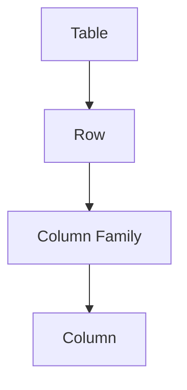
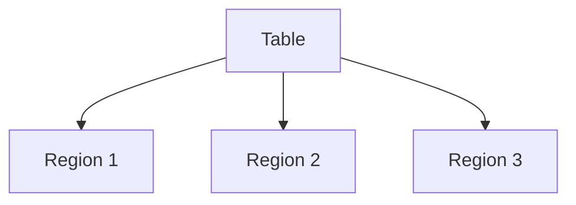
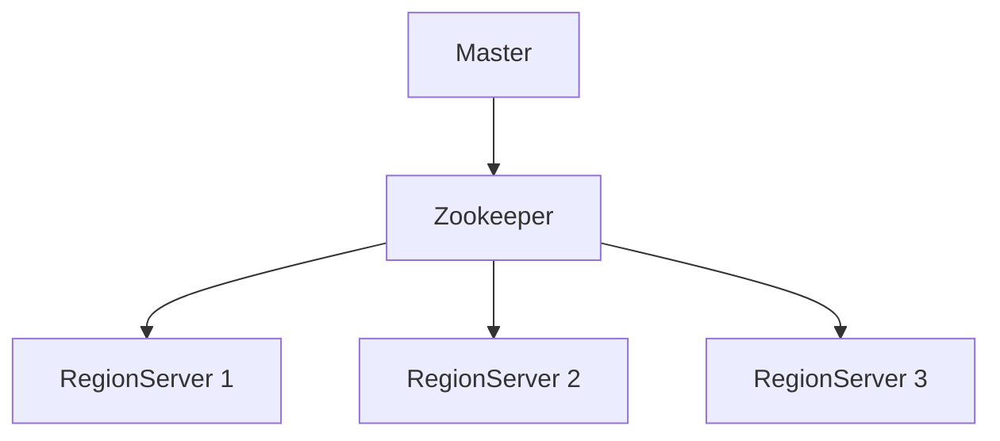
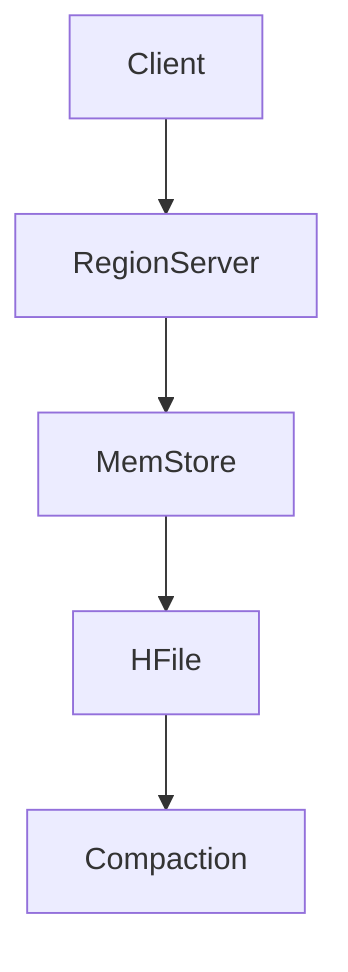
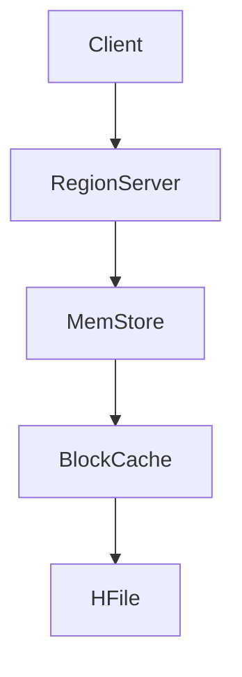
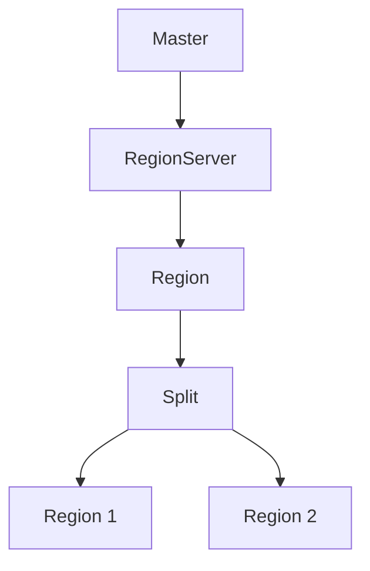
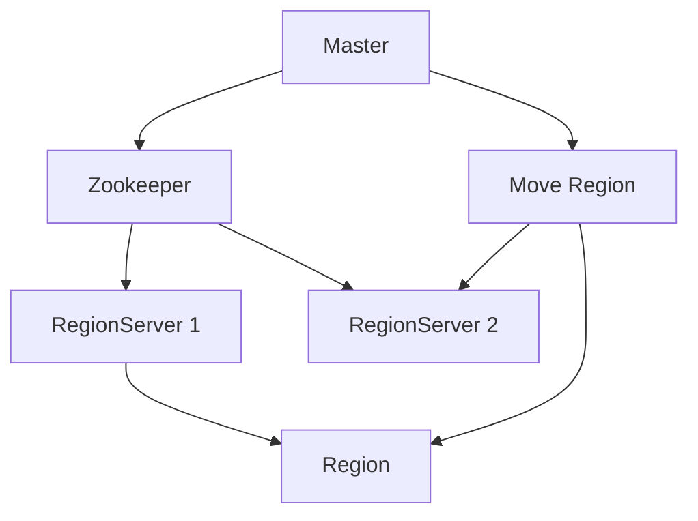

# HBase分布式列式数据库原理与代码实例讲解

## 1.背景介绍

### 1.1 大数据时代的到来

随着互联网、物联网和人工智能等技术的快速发展,数据呈现出爆炸式增长。传统的关系型数据库已经无法满足大数据时代对数据存储和处理的需求。大数据时代对数据存储系统提出了新的挑战,需要一种能够高效存储和处理海量结构化、半结构化和非结构化数据的分布式数据库系统。

### 1.2 列式数据库的优势

为了解决大数据存储和处理的挑战,列式数据库(Column-Oriented Database)应运而生。与传统的行式数据库不同,列式数据库按列存储数据,具有更高的写入性能、更好的数据压缩率和更高效的查询性能。列式数据库非常适合于大数据分析场景,例如日志分析、时序数据处理等。

### 1.3 HBase介绍

HBase是一个分布式、可伸缩、面向列的开源大数据库,它建立在Hadoop文件系统(HDFS)之上,可以为大数据提供随机、实时的读写访问。HBase灵感来自于Google的BigTable论文,被广泛应用于Facebook、Twitter、Yahoo等知名公司的大数据应用中。

## 2.核心概念与联系

### 2.1 HBase数据模型

HBase的数据模型由表(Table)、行(Row)、列族(Column Family)和列(Column)组成。每个表由多个行组成,每行又由多个列族构成,每个列族包含多个列。HBase通过行键(Row Key)来寻址存储数据,行键按字典序排列。



### 2.2 Region

为了实现数据的分布式存储和负载均衡,HBase将表按行键范围划分为多个Region。每个Region由一个或多个存储文件组成,包括数据文件和元数据文件。Region是HBase中分布式存储和并行计算的基本单元。



### 2.3 RegionServer

RegionServer是HBase中负责存储和管理Region的核心组件。每个RegionServer管理着若干个Region,并负责响应客户端的读写请求。RegionServer通过Zookeeper与Master保持通信,接收Master的指令进行Region的分裂、迁移等操作。



### 2.4 Master

Master是HBase集群的管理者,负责监控集群状态、协调RegionServer、负载均衡等任务。Master通过Zookeeper监控RegionServer的状态,并根据负载情况进行Region的分配和迁移。

## 3.核心算法原理具体操作步骤

### 3.1 写入流程

1. 客户端向RegionServer发送写入请求
2. RegionServer将数据先写入内存中的MemStore
3. 当MemStore达到一定阈值时,将数据刷写到HFile(Hadoop文件系统)
4. HFile定期进行合并,形成更大的HFile



### 3.2 读取流程

1. 客户端向RegionServer发送读取请求
2. RegionServer先在MemStore中查找数据
3. 如果MemStore中没有,则在BlockCache中查找
4. 如果BlockCache中也没有,则从HFile中读取数据



### 3.3 Region分裂

当一个Region达到一定阈值时,为了保持Region的大小合理,HBase会自动对该Region进行分裂,形成两个新的Region。分裂操作由Master协调完成。



### 3.4 Region迁移

为了实现集群的负载均衡,Master会根据RegionServer的负载情况,将部分Region迁移到其他RegionServer上。迁移操作由Master协调完成,并通知客户端Region的新位置。



## 4.数学模型和公式详细讲解举例说明

### 4.1 LSM树

HBase的存储引擎采用了LSM(Log-Structured Merge-Tree)树的数据结构,LSM树由内存组件(MemStore)和磁盘组件(HFile)组成。写入操作先落到内存中,当内存达到一定阈值时,将数据刷写到磁盘上的HFile中。定期对HFile进行合并,形成更大的HFile。

LSM树的写入复杂度为$O(1)$,读取复杂度为$O(log_BN)$,其中B为每个磁盘块的大小,N为总数据量。

$$
W(N) = O(1) \\
R(N) = O(log_BN)
$$

### 4.2 BloomFilter

HBase使用BloomFilter来减少磁盘IO,提高读取性能。BloomFilter是一种空间高效的概率数据结构,用于快速判断一个元素是否存在于集合中。

假设BloomFilter的长度为m位,使用k个哈希函数,插入n个元素,则误判率为:

$$
p = (1 - e^{-kn/m})^k \approx (1 - e^{-k^2/m})^{km/k}
$$

通过适当选择k和m,可以将误判率控制在一个较低的水平。

### 4.3 数据编码

为了提高存储效率,HBase对数据进行了编码压缩。HBase使用前缀编码(Prefix Encoding)和差分编码(Diff Encoding)来压缩行键和列族名称,使用数据块编码(Data Block Encoding)来压缩列数据。

假设行键的长度为l,前缀长度为p,则压缩后的行键长度为:

$$
l' = p + \lfloor\log_2(l-p+1)\rfloor
$$

## 5.项目实践：代码实例和详细解释说明

### 5.1 创建表

```java
import org.apache.hadoop.conf.Configuration;
import org.apache.hadoop.hbase.HBaseConfiguration;
import org.apache.hadoop.hbase.HColumnDescriptor;
import org.apache.hadoop.hbase.HTableDescriptor;
import org.apache.hadoop.hbase.TableName;
import org.apache.hadoop.hbase.client.Admin;
import org.apache.hadoop.hbase.client.Connection;
import org.apache.hadoop.hbase.client.ConnectionFactory;

public class CreateTable {
    public static void main(String[] args) throws Exception {
        Configuration conf = HBaseConfiguration.create();
        Connection connection = ConnectionFactory.createConnection(conf);
        Admin admin = connection.getAdmin();

        HTableDescriptor tableDesc = new HTableDescriptor(TableName.valueOf("my_table"));
        tableDesc.addFamily(new HColumnDescriptor("cf1"));
        tableDesc.addFamily(new HColumnDescriptor("cf2"));

        admin.createTable(tableDesc);
        admin.close();
        connection.close();
    }
}
```

上述代码创建了一个名为"my_table"的HBase表,包含两个列族"cf1"和"cf2"。

### 5.2 插入数据

```java
import org.apache.hadoop.conf.Configuration;
import org.apache.hadoop.hbase.HBaseConfiguration;
import org.apache.hadoop.hbase.TableName;
import org.apache.hadoop.hbase.client.Connection;
import org.apache.hadoop.hbase.client.ConnectionFactory;
import org.apache.hadoop.hbase.client.Put;
import org.apache.hadoop.hbase.client.Table;
import org.apache.hadoop.hbase.util.Bytes;

public class PutData {
    public static void main(String[] args) throws Exception {
        Configuration conf = HBaseConfiguration.create();
        Connection connection = ConnectionFactory.createConnection(conf);
        Table table = connection.getTable(TableName.valueOf("my_table"));

        Put put = new Put(Bytes.toBytes("row1"));
        put.addColumn(Bytes.toBytes("cf1"), Bytes.toBytes("col1"), Bytes.toBytes("value1"));
        put.addColumn(Bytes.toBytes("cf2"), Bytes.toBytes("col2"), Bytes.toBytes("value2"));

        table.put(put);
        table.close();
        connection.close();
    }
}
```

上述代码向"my_table"表中插入了一行数据,行键为"row1",列族"cf1"中的列"col1"的值为"value1",列族"cf2"中的列"col2"的值为"value2"。

### 5.3 查询数据

```java
import org.apache.hadoop.conf.Configuration;
import org.apache.hadoop.hbase.HBaseConfiguration;
import org.apache.hadoop.hbase.TableName;
import org.apache.hadoop.hbase.client.Connection;
import org.apache.hadoop.hbase.client.ConnectionFactory;
import org.apache.hadoop.hbase.client.Get;
import org.apache.hadoop.hbase.client.Result;
import org.apache.hadoop.hbase.client.Table;
import org.apache.hadoop.hbase.util.Bytes;

public class GetData {
    public static void main(String[] args) throws Exception {
        Configuration conf = HBaseConfiguration.create();
        Connection connection = ConnectionFactory.createConnection(conf);
        Table table = connection.getTable(TableName.valueOf("my_table"));

        Get get = new Get(Bytes.toBytes("row1"));
        Result result = table.get(get);

        byte[] value1 = result.getValue(Bytes.toBytes("cf1"), Bytes.toBytes("col1"));
        byte[] value2 = result.getValue(Bytes.toBytes("cf2"), Bytes.toBytes("col2"));

        System.out.println("Value1: " + Bytes.toString(value1));
        System.out.println("Value2: " + Bytes.toString(value2));

        table.close();
        connection.close();
    }
}
```

上述代码从"my_table"表中查询行键为"row1"的数据,并输出列族"cf1"中列"col1"的值和列族"cf2"中列"col2"的值。

## 6.实际应用场景

### 6.1 日志分析

HBase非常适合于日志分析场景。日志数据通常是半结构化的,包含时间戳、IP地址、用户ID等多个维度,可以将这些维度作为行键和列族存储在HBase中。通过HBase的快速随机读取能力,可以高效地对日志数据进行分析和查询。

### 6.2 物联网数据存储

物联网设备产生的时序数据量非常庞大,需要一个高效的分布式存储系统。HBase可以将设备ID作为行键,将不同类型的传感器数据存储在不同的列族中,实现对物联网数据的高效存储和查询。

### 6.3 内容存储

HBase也可以用于存储网站、社交媒体等应用中的内容数据,如用户资料、文章、评论等。将用户ID或内容ID作为行键,将不同类型的数据存储在不同的列族中,可以实现高效的内容存储和检索。

## 7.工具和资源推荐

### 7.1 HBase Shell

HBase Shell是HBase自带的命令行工具,可以方便地执行DDL和DML操作,查看集群状态等。HBase Shell提供了丰富的命令,是学习和管理HBase的好工具。

### 7.2 HBase Web UI

HBase Web UI是HBase的Web界面,可以直观地查看集群状态、Region分布、RegionServer负载等信息,方便集群管理和故障排查。

### 7.3 开源客户端

HBase提供了多种语言的开源客户端,如Java、Python、C++等,方便开发人员在不同语言环境下访问HBase。

### 7.4 HBase书籍和文档

- 《HBase: The Definitive Guide》:HBase官方权威指南
- 《HBase实战》:HBase实战经验分享
- HBase官方文档:https://hbase.apache.org/

## 8.总结：未来发展趋势与挑战

### 8.1 云原生化

随着云计算的普及,HBase也在向云原生化方向发展。未来HBase将更好地支持Kubernetes等容器编排平台,实现自动化部署和弹性伸缩。

### 8.2 SQL支持

为了降低使用门槛,HBase正在加强对SQL的支持,允许用户使用熟悉的SQL语言进行数据查询和分析。

### 8.3 机器学习集成

HBase将更好地与机器学习框架集成,支持在HBase上直接进行模型训练和预测,实现数据存储和计算的无缝融合。

### 8.4 安全性和隐私保护

随着数据安全和隐私保护日益受到重视,HBase需要加强对数据加密、