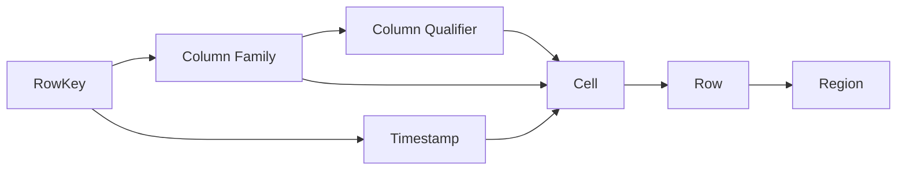

# HBase原理与代码实例讲解

## 1.背景介绍

### 1.1 大数据时代的数据存储挑战

在当今大数据时代,海量数据的存储和处理已成为各行各业面临的重大挑战。传统的关系型数据库在面对TB、PB级别的海量数据时,无论是在存储容量还是查询性能上都难以满足实时性和可扩展性的需求。为了应对大数据带来的挑战,诞生了一系列NoSQL数据库,其中HBase就是应运而生的分布式列族存储系统。

### 1.2 HBase的诞生与发展历程

HBase起源于Google发表的BigTable论文,是一个高可靠、高性能、面向列、可伸缩的分布式存储系统。它构建在HDFS之上,综合了BigTable和Dynamo的优点,可为大数据提供随机、实时的读写访问。HBase自2007年诞生以来,迅速成为Hadoop生态圈的重要组成部分,广泛应用于各大互联网公司的实际业务场景中。

### 1.3 HBase在大数据领域的地位

HBase作为Hadoop生态圈的核心组件之一,在大数据存储和处理领域占据着重要地位。它不仅可以存储海量的结构化和半结构化数据,还支持高并发的随机读写操作,是搭建实时数据处理、用户画像、推荐系统等大数据应用的首选存储方案。同时,HBase良好的可扩展性和容错性,使其成为构建企业级大数据平台的重要基石。

## 2.核心概念与联系

### 2.1 RowKey行键

RowKey是HBase表中用于唯一标识每一行数据的主键。每个RowKey都按照字典序排列,方便快速查找。在HBase中,数据按照RowKey的字典序存储,这种设计有利于批量读取。

### 2.2 Column Family列族

HBase表按照列族来组织数据。每个列族可包含多个列,每个列由Column Family和Column Qualifier唯一确定。不同列族在物理上单独存储,可以实现不同列族的独立压缩和优化。

### 2.3 Timestamp时间戳

在HBase中,每个单元格都保存着同一份数据的多个版本,这些版本按照时间倒序排列,最新的数据排在最前面。时间戳代表了数据写入的时间点,默认为系统时间。

### 2.4 Region分区

为了便于管理,HBase按照RowKey将表水平切分成多个Region。每个Region由一个或多个HDFS文件组成,存储一定范围内的数据。当Region增大到一定程度后,会自动进行拆分,从而保证查询效率。

### 2.5 概念联系

HBase中的核心概念紧密关联,构成了一个完整的存储体系。RowKey、Column Family和Timestamp共同决定了一个单元格,多个单元格组成一行,多行数据又被划分在不同的Region中。这种设计使得HBase能够支持海量数据的存储和高效访问。



## 3.核心算法原理具体操作步骤

### 3.1 写流程

1. Client将写请求发送给ZooKeeper,获取META表所在的RegionServer地址。
2. Client访问META表,根据RowKey找到目标数据对应的Region及其RegionServer。 
3. Client向目标RegionServer发送写请求。
4. RegionServer将数据写入MemStore并记录WAL日志。
5. 当MemStore达到阈值后,触发flush操作,将数据持久化到StoreFile。

### 3.2 读流程

1. Client将读请求发送给ZooKeeper,获取META表所在的RegionServer地址。
2. Client访问META表,根据RowKey找到目标数据对应的Region及其RegionServer。
3. Client向目标RegionServer发送读请求。
4. RegionServer依次在BlockCache、MemStore和StoreFile中查找所需数据。
5. 如果在BlockCache中找到数据,直接返回;否则,继续在MemStore中查找。
6. 如果在MemStore中找到数据,将数据返回,并异步更新BlockCache。
7. 如果MemStore中未找到,则在StoreFile中查找,并将查到的数据块缓存到BlockCache,再返回给Client。

### 3.3 Compaction机制

Compaction分为Minor Compaction和Major Compaction两种:
- Minor Compaction会将多个小的StoreFile合并成一个大的StoreFile,提高查询效率。
- Major Compaction会对Region下的所有StoreFile执行合并操作,清理掉过期和删除的数据。

Compaction的具体步骤如下:
1. 将多个StoreFile中的数据按照Key合并,并对重复数据执行去重。
2. 如果是Major Compaction,则会删除超过TTL的过期数据和标记为删除的数据。
3. 将合并后的数据写入一个新的StoreFile,并生成对应的索引文件。
4. 待新的StoreFile生成后,原有的StoreFile会被删除,新的StoreFile会被加载到HFile的Reader中供查询使用。

## 4.数学模型和公式详细讲解举例说明

### 4.1 Bloom Filter布隆过滤器

HBase使用Bloom Filter来加速RoWKey的查找。Bloom Filter是一种空间效率很高的随机数据结构,它利用位数组和多个哈希函数来判断一个元素是否在集合中。

Bloom Filter的数学模型如下:
- 假设Bloom Filter的位数组长度为 $m$,哈希函数的个数为 $k$,要插入的元素个数为 $n$。
- 对于一个元素,经过 $k$ 个哈希函数映射到位数组中的 $k$ 个位置,将这些位置设为1。
- 查询时,对元素再次执行同样的哈希计算,如果所有 $k$ 个位置都为1,则认为元素在集合中;反之则认为不在。

Bloom Filter的误判率 $P$ 可由以下公式近似估算:

$$ P = (1 - e^{-kn/m})^k $$

例如,假设 $m=1024,k=3,n=100$,则误判率约为:

$$ P = (1 - e^{-3*100/1024})^3 \approx 0.0485 $$

可见,Bloom Filter在很小的空间开销下,能够实现较低的误判率,加速了HBase的RowKey查找过程。

### 4.2 LSM-Tree

HBase的存储引擎基于LSM-Tree(Log-Structured Merge-Tree)实现。LSM-Tree由内存表(MemStore)和持久化的HFile组成,可实现高效的写入和读取。

LSM-Tree的核心思想是将随机写转化为顺序写,具体如下:
1. 写操作先写入内存表MemStore。
2. 当MemStore达到阈值后,触发flush操作,将数据顺序写入磁盘,生成新的HFile。
3. 随着HFile的不断生成,会触发Compaction,对HFile进行合并和清理。

LSM-Tree的写放大和读放大分别可用以下公式估算:
- 写放大: $WA = \frac{磁盘写入量}{实际写入量} = 1 + \frac{1}{T}$
- 读放大: $RA = \frac{磁盘读取量}{实际读取量} = 1 + \frac{N}{B}$

其中,$T$为MemStore的flush阈值,$N$为HFile的个数,$B$为HFile的block大小。

例如,假设 $T=128MB,N=50,B=64KB$,则写放大和读放大分别为:

$$ WA = 1 + \frac{1}{128} \approx 1.008 $$
$$ RA = 1 + \frac{50}{64} \approx 1.78 $$

可见,LSM-Tree在写放大很小的情况下,实现了较高的写入性能;但读放大相对较大,需要通过布隆过滤器等机制进行优化。

## 5.项目实践：代码实例和详细解释说明

下面通过一个具体的代码实例,演示如何使用Java API操作HBase。

### 5.1 创建连接

```java
Configuration config = HBaseConfiguration.create();
Connection connection = ConnectionFactory.createConnection(config);
```

首先,创建一个Configuration对象,加载HBase的配置信息。然后,通过ConnectionFactory创建一个Connection对象,与HBase建立连接。

### 5.2 创建表

```java
Admin admin = connection.getAdmin();
TableName tableName = TableName.valueOf("test_table");

HTableDescriptor tableDesc = new HTableDescriptor(tableName);
HColumnDescriptor columnFamily1 = new HColumnDescriptor("cf1");
tableDesc.addFamily(columnFamily1);

admin.createTable(tableDesc);
```

通过Connection获取Admin接口,用于管理HBase。然后,指定表名并创建HTableDescriptor,代表一个表的schema。接着,创建HColumnDescriptor并指定列族名,将其添加到HTableDescriptor中。最后,通过Admin接口创建表。

### 5.3 插入数据

```java
Table table = connection.getTable(tableName);
Put put = new Put(Bytes.toBytes("row1"));
put.addColumn(Bytes.toBytes("cf1"), Bytes.toBytes("col1"), Bytes.toBytes("value1")); 
table.put(put);
```

通过Connection获取Table接口,用于操作HBase表。创建一个Put对象,并指定RowKey。然后,向Put中添加列数据,包括列族、列名和值。最后,通过Table接口执行put操作,将数据插入表中。

### 5.4 查询数据

```java
Get get = new Get(Bytes.toBytes("row1"));
Result result = table.get(get);
byte[] value = result.getValue(Bytes.toBytes("cf1"), Bytes.toBytes("col1"));
String valueStr = Bytes.toString(value);
System.out.println("Result: " + valueStr);
```

创建一个Get对象,指定要查询的RowKey。通过Table接口执行get操作,返回一个Result对象。从Result中获取指定列的值,并转换为字符串输出。

### 5.5 删除表

```java
admin.disableTable(tableName);
admin.deleteTable(tableName);
```

通过Admin接口先禁用表,然后删除表。

### 5.6 关闭连接

```java
table.close();
admin.close();
connection.close();
```

操作完成后,关闭Table、Admin和Connection,释放资源。

以上就是通过Java API操作HBase的基本流程,实际应用中还需要考虑批量读写、过滤器、二级索引等优化手段,以提升HBase的性能。

## 6.实际应用场景

HBase在许多实际场景中得到广泛应用,下面列举几个典型的应用案例。

### 6.1 交互式查询

HBase适合存储非结构化和半结构化的数据,支持字段的动态增删。利用HBase的实时随机读写能力,可以实现毫秒级的交互式查询,用于实时数据分析、即席查询等场景。

### 6.2 时序数据存储

HBase天然适合存储时序数据。将时间戳作为RowKey的一部分,可以高效地存储和查询海量的时序数据,广泛应用于物联网、金融、监控等领域。例如,OpenTSDB就是一个基于HBase的分布式时序数据库。

### 6.3 用户行为分析

HBase可以存储海量的用户行为日志数据,如点击、浏览、购买等,用于分析用户的行为模式。通过RowKey的设计,可以快速定位到某个用户的所有行为记录,支持实时的个性化推荐和精准营销。

### 6.4 内容存储与检索

HBase可用于非结构化内容(如网页、文档、图片等)的存储与检索。将内容的元数据作为RowKey,可以快速检索到所需的内容。例如,淘宝的商品图片、Facebook的用户照片都是存储在HBase中的。

### 6.5 消息存储

HBase可作为消息队列的持久化存储,保证消息的可靠传输。生产者将消息写入HBase,消费者通过轮询或订阅的方式从HBase读取消息进行消费,可实现准实时的消息处理。

## 7.工具和资源推荐

### 7.1 HBase Shell

HBase Shell是HBase的命令行工具,提供了交互式的操作界面。通过Shell可以执行表的创建、删除、数据的增删改查等操作,对于HBase的学习和调试非常有帮助。

### 7.2 HBase REST API

HBase提供了RESTful API,允许通过HTTP协议对HBase进行操作。REST API对多语言的支持更加友好,可通过curl等工具方便地访问HBase。

### 7.3 HBase Java API

对于Java开发者,HBase提供了