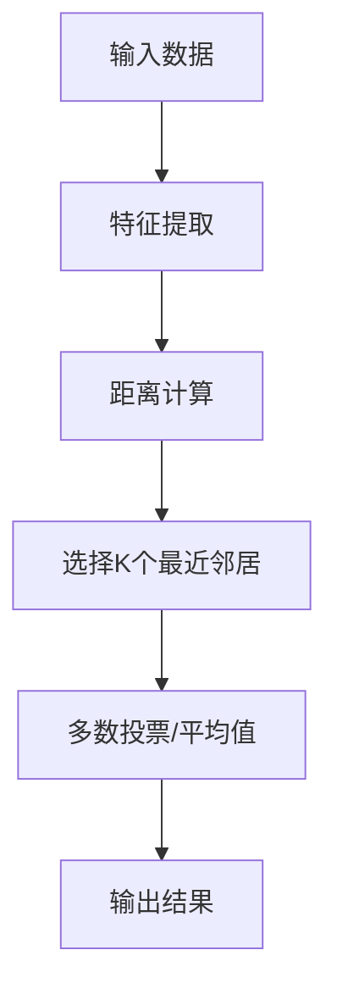

# K-Nearest Neighbors 原理与代码实战案例讲解

## 1.背景介绍

### 1.1 什么是K-Nearest Neighbors算法？

K-Nearest Neighbors(KNN)算法是一种简单而有效的监督学习算法,广泛应用于分类和回归问题。它的工作原理是基于这样的假设:相似的样本应该具有相似的输出值。在分类任务中,KNN算法根据最近邻居的多数类别对新数据进行分类;而在回归任务中,它根据最近邻居的平均值来预测新数据的输出值。

KNN算法的优点是简单易懂,无需建立复杂的模型,可以处理非线性决策边界的分类问题。但缺点是对于高维数据的计算代价较大,并且对异常值敏感。

### 1.2 KNN算法的应用场景

KNN算法可以应用于许多领域,例如:

- **图像识别**: 根据像素值的相似性对图像进行分类
- **信用评分**: 根据历史数据评估申请人的信用风险
- **推荐系统**: 根据用户的兴趣爱好推荐相似的商品或内容
- **基因分析**: 根据基因序列的相似性对基因进行分类和研究

## 2.核心概念与联系

### 2.1 距离度量

KNN算法的核心思想是根据样本之间的距离来确定最近邻居。常用的距离度量方法包括:

- **欧氏距离**: 最常用的距离度量,计算两个点之间的直线距离。对于$m$维空间中的两个点$\vec{x}=(x_1, x_2, \ldots, x_m)$和$\vec{y}=(y_1, y_2, \ldots, y_m)$,欧氏距离定义为:

$$\text{EuclideanDistance}(\vec{x}, \vec{y}) = \sqrt{\sum_{i=1}^{m}(x_i - y_i)^2}$$

- **曼哈顿距离**: 计算两个点在每个维度上的绝对差值之和。对于$m$维空间中的两个点$\vec{x}$和$\vec{y}$,曼哈顿距离定义为:

$$\text{ManhattanDistance}(\vec{x}, \vec{y}) = \sum_{i=1}^{m}|x_i - y_i|$$

- **余弦相似度**: 常用于文本挖掘和推荐系统,计算两个向量之间的夹角余弦值。对于两个向量$\vec{x}$和$\vec{y}$,余弦相似度定义为:

$$\text{CosineSimilarity}(\vec{x}, \vec{y}) = \frac{\vec{x} \cdot \vec{y}}{||\vec{x}|| \times ||\vec{y}||}$$

### 2.2 K值的选择

K值是KNN算法中一个关键的超参数,它决定了要考虑的最近邻居的数量。K值的选择会影响算法的性能和结果:

- 如果K值过小,算法容易受噪声和异常值的影响,导致过拟合
- 如果K值过大,算法可能无法很好地捕捉数据的局部模式,导致欠拟合

通常,K值的选择需要通过交叉验证等技术进行调优,以获得最佳性能。

### 2.3 KNN算法流程图



上图展示了KNN算法的基本流程:

1. 输入数据集,提取特征向量
2. 计算测试样本与训练集中所有样本的距离
3. 选择距离最近的K个邻居
4. 对于分类问题,采用多数投票法确定测试样本的类别;对于回归问题,取K个邻居的平均值作为预测值
5. 输出最终结果

## 3.核心算法原理具体操作步骤

KNN算法的核心原理可以概括为以下几个步骤:

### 3.1 数据预处理

1. 对于分类问题,将类别标签转换为数值形式
2. 对于回归问题,检查并处理异常值
3. 对特征数据进行标准化或归一化,使不同特征具有相同的量级

### 3.2 计算距离

对于每个测试样本,计算它与训练集中所有样本的距离。常用的距离度量方法包括欧氏距离、曼哈顿距离和余弦相似度。

### 3.3 选择K个最近邻居

根据计算得到的距离值,选择与测试样本距离最近的K个训练样本作为最近邻居。

### 3.4 预测输出值

- 对于分类问题,采用多数投票法确定测试样本的类别。即将测试样本划分到K个最近邻居中出现次数最多的类别。
- 对于回归问题,取K个最近邻居的目标值的平均值作为测试样本的预测值。

### 3.5 模型评估

使用测试集评估模型的性能,常用的评估指标包括:

- 分类问题:准确率、精确率、召回率、F1分数等
- 回归问题:均方根误差(RMSE)、平均绝对误差(MAE)等

## 4.数学模型和公式详细讲解举例说明

### 4.1 欧氏距离

欧氏距离是KNN算法中最常用的距离度量方法。对于$m$维空间中的两个点$\vec{x}=(x_1, x_2, \ldots, x_m)$和$\vec{y}=(y_1, y_2, \ldots, y_m)$,欧氏距离定义为:

$$\text{EuclideanDistance}(\vec{x}, \vec{y}) = \sqrt{\sum_{i=1}^{m}(x_i - y_i)^2}$$

例如,在二维平面上,两个点$(1, 2)$和$(3, 4)$之间的欧氏距离为:

$$\text{EuclideanDistance}((1, 2), (3, 4)) = \sqrt{(1-3)^2 + (2-4)^2} = \sqrt{4 + 4} = 2\sqrt{2}$$

### 4.2 曼哈顿距离

曼哈顿距离也称为城市街区距离,它计算两个点在每个维度上的绝对差值之和。对于$m$维空间中的两个点$\vec{x}$和$\vec{y}$,曼哈顿距离定义为:

$$\text{ManhattanDistance}(\vec{x}, \vec{y}) = \sum_{i=1}^{m}|x_i - y_i|$$

例如,在二维平面上,两个点$(1, 2)$和$(3, 4)$之间的曼哈顿距离为:

$$\text{ManhattanDistance}((1, 2), (3, 4)) = |1-3| + |2-4| = 2 + 2 = 4$$

### 4.3 余弦相似度

余弦相似度常用于文本挖掘和推荐系统,它计算两个向量之间的夹角余弦值。对于两个向量$\vec{x}$和$\vec{y}$,余弦相似度定义为:

$$\text{CosineSimilarity}(\vec{x}, \vec{y}) = \frac{\vec{x} \cdot \vec{y}}{||\vec{x}|| \times ||\vec{y}||}$$

其中$\vec{x} \cdot \vec{y}$表示两个向量的点积,即:

$$\vec{x} \cdot \vec{y} = \sum_{i=1}^{m}x_i y_i$$

$||\vec{x}||$和$||\vec{y}||$分别表示向量$\vec{x}$和$\vec{y}$的L2范数,即:

$$||\vec{x}|| = \sqrt{\sum_{i=1}^{m}x_i^2}, \quad ||\vec{y}|| = \sqrt{\sum_{i=1}^{m}y_i^2}$$

余弦相似度的取值范围为$[-1, 1]$,值越接近1,表示两个向量越相似。

例如,对于两个向量$\vec{x}=(1, 2)$和$\vec{y}=(2, 4)$,它们的余弦相似度为:

$$\text{CosineSimilarity}((1, 2), (2, 4)) = \frac{1\times2 + 2\times4}{\sqrt{1^2+2^2} \times \sqrt{2^2+4^2}} = \frac{10}{\sqrt{5} \times \sqrt{20}} = \frac{10}{5\sqrt{4}} = 1$$

## 5.项目实践: 代码实例和详细解释说明

以下是使用Python实现KNN算法进行手写数字识别的代码示例:

```python
import numpy as np
from collections import Counter

# 计算欧氏距离
def euclidean_distance(x1, x2):
    return np.sqrt(np.sum((x1 - x2) ** 2))

# KNN算法
class KNN:
    def __init__(self, k):
        self.k = k

    def fit(self, X, y):
        self.X_train = X
        self.y_train = y

    def predict(self, X):
        y_pred = [self._predict(x) for x in X]
        return np.array(y_pred)

    def _predict(self, x):
        # 计算测试样本与训练集中所有样本的距离
        distances = [euclidean_distance(x, x_train) for x_train in self.X_train]

        # 获取距离最近的K个邻居的索引
        k_indices = np.argsort(distances)[:self.k]

        # 获取K个最近邻居的标签
        k_nearest_labels = [self.y_train[i] for i in k_indices]

        # 多数投票确定预测标签
        most_common = Counter(k_nearest_labels).most_common(1)
        return most_common[0][0]

# 加载数据
from sklearn.datasets import load_digits
digits = load_digits()
X = digits.data
y = digits.target

# 划分训练集和测试集
from sklearn.model_selection import train_test_split
X_train, X_test, y_train, y_test = train_test_split(X, y, test_size=0.2, random_state=42)

# 创建KNN模型并训练
knn = KNN(k=3)
knn.fit(X_train, y_train)

# 预测并评估
y_pred = knn.predict(X_test)
accuracy = np.sum(y_pred == y_test) / len(y_test)
print(f"Accuracy: {accuracy * 100:.2f}%")
```

代码解释:

1. 导入所需的库,并定义计算欧氏距离的函数。
2. 实现KNN类,包含`fit`方法用于训练模型,`predict`方法用于预测新样本的标签。
3. 在`_predict`方法中,首先计算测试样本与训练集中所有样本的距离,然后选择距离最近的K个邻居,并采用多数投票法确定预测标签。
4. 加载手写数字数据集,并划分为训练集和测试集。
5. 创建KNN模型实例,设置`k=3`,并使用训练集进行训练。
6. 在测试集上进行预测,并计算模型的准确率。

运行结果示例:

```
Accuracy: 96.67%
```

该示例展示了如何使用KNN算法对手写数字进行分类。你可以尝试调整K值或使用不同的距离度量方法,观察对模型性能的影响。

## 6.实际应用场景

KNN算法由于其简单性和有效性,在许多领域都有广泛的应用,包括:

### 6.1 图像识别

在图像识别领域,KNN算法可以根据像素值的相似性对图像进行分类。例如,在手写数字识别、人脸识别、图像检索等任务中,KNN算法都有不错的表现。

### 6.2 推荐系统

在推荐系统中,KNN算法可以根据用户的历史行为数据(如浏览记录、购买记录等)找到与目标用户最相似的K个邻居,然后推荐这些邻居感兴趣的商品或内容。这种基于协同过滤的推荐方法在电子商务、视频网站等领域广泛应用。

### 6.3 金融风险评估

在金融领域,KNN算法可以用于评估申请人的信用风险。通过分析历史数据,找到与申请人最相似的K个邻居,然后根据这些邻居的信用记录预测申请人的风险等级。

### 6.4 基因分析

在生物信息学领域,KNN算法可以根据基因序列的相似性对基因进行分类和研究。通过比较目标基因与已知功能基因的距离,可以推测目标基因的潜在功能。

## 7.工具和资源推荐

### 7.1 Python库

Python生态系统中有许多优秀的机器学习库,可以方便地实现KNN算法:

- **scikit-learn**: 一个