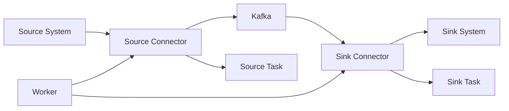

# Kafka Connect原理与代码实例讲解

## 1.背景介绍

### 1.1 Kafka的发展历程
Apache Kafka最初由LinkedIn公司开发,用作LinkedIn的活动流和运营数据处理管道的基础。Kafka于2011年初开源,并于2012年10月从Apache孵化器毕业。如今它已被全世界成千上万的企业作为多种类型的数据管道和消息系统使用。

### 1.2 Kafka Connect的诞生
随着Kafka的广泛应用,人们发现需要一种工具来高效地在Kafka和其他外部系统之间移动大量数据。为了满足这一需求,Kafka Connect应运而生。它是一个可扩展的工具,旨在可靠地在Apache Kafka和其他系统之间传输数据。

### 1.3 Kafka Connect的重要性
Kafka Connect为大规模数据集成提供了一个简单而可靠的解决方案。通过Kafka Connect,我们可以轻松地将大量数据导入和导出Kafka,而无需编写自定义集成代码。这大大简化了构建可扩展的流数据管道的过程。

## 2.核心概念与联系

### 2.1 Source Connector 
Source Connector负责从其他系统导入数据到Kafka中。它从源系统中持续抓取数据,并将其转换为Kafka Connect内部格式,然后发送到Kafka。常见的Source系统包括关系型数据库、NoSQL数据库、文件系统等。

### 2.2 Sink Connector
与Source Connector相反,Sink Connector负责将Kafka中的数据导出到其他系统。它从Kafka中持续读取数据,将其转换为目标系统所需的格式,然后写入目标系统。常见的Sink系统包括关系型数据库、NoSQL数据库、文件系统、搜索引擎等。

### 2.3 Task 
每个Connector都可以分为多个Task并行执行,以提高数据传输的吞吐量。Task是Connector的最小工作单元,它们共享Connector的配置,并独立执行数据复制工作。

### 2.4 Worker
Kafka Connect通过Worker进程来执行Connector和Task。每个Worker进程可以运行多个Connector,每个Connector又可以有多个Task。Worker进程负责管理Connector和Task的生命周期,并提供故障转移和负载均衡等功能。

### 2.5 核心概念关系图


## 3.核心算法原理具体操作步骤

### 3.1 Kafka Connect工作原理
1. Connector通过Worker进程启动,加载配置信息。 
2. Connector根据配置创建一个或多个Task。
3. 对于Source Connector,每个Task定期从源系统抓取数据,将其转换为Kafka Connect数据格式,然后发送到Kafka。
4. 对于Sink Connector,每个Task定期从Kafka中拉取数据,将其转换为目标系统所需的格式,然后写入目标系统。
5. Connector通过配置的方式与具体的源/目标系统交互,执行数据的读写操作。
6. Worker进程负责管理Connector和Task的生命周期,提供故障转移和负载均衡等功能。

### 3.2 数据转换与映射
Kafka Connect提供了灵活的数据转换与映射机制,可以方便地在不同系统之间转换数据格式。主要有以下几种方式:
1. 内置转换器:Kafka Connect内置了一些常用的数据转换器,如JSON、Avro等,可以直接使用。
2. 自定义转换器:用户可以通过实现Transformer接口来自定义数据转换逻辑。
3. Single Message Transforms (SMTs):Kafka Connect提供了一组可插拔的转换器,可以对单个消息进行转换。
4. 连接器配置:有些连接器提供了配置选项,可以在数据导入/导出时进行字段映射、重命名等操作。

### 3.3 偏移量管理
Kafka Connect需要记录每个Connector导入/导出数据的位置,即偏移量,以便在重启或故障转移时能够从上次中断的地方恢复。不同的连接器有不同的偏移量管理方式,常见的有:
1. Kafka存储:将偏移量存储在一个特殊的Kafka主题中。
2. 文件存储:将偏移量存储在Worker节点的文件系统中。
3. 自定义存储:连接器可以实现OffsetBackingStore接口来自定义偏移量存储方式。

### 3.4 分布式模式
Kafka Connect支持分布式模式,可以将多个Worker节点组成一个集群,共同完成数据的导入和导出工作。在分布式模式下,Kafka Connect提供了以下功能:
1. 动态扩容/缩容:可以随时增加或减少Worker节点,Kafka Connect会自动重新分配Connector和Task。
2. 负载均衡:Kafka Connect会根据Worker节点的负载情况动态调整Connector和Task的分配,以实现负载均衡。
3. 故障转移:当某个Worker节点故障时,Kafka Connect会自动将其上的Connector和Task转移到其他可用的Worker节点上,确保数据传输不会中断。

## 4.数学模型和公式详细讲解举例说明

### 4.1 数据吞吐量估算
假设我们有一个Source Connector,需要从源系统导入数据到Kafka。我们可以用以下公式估算数据吞吐量:

$Throughput = \frac{MessageSize * MessageCount}{Time}$

其中:
- $Throughput$: 数据吞吐量,即单位时间内导入的数据量。
- $MessageSize$: 每条消息的平均大小,以字节为单位。
- $MessageCount$: 单位时间内导入的消息数量。
- $Time$: 时间周期,通常以秒为单位。

例如,假设我们的Source Connector平均每条消息大小为1KB,每秒导入1000条消息,则数据吞吐量为:

$$Throughput = \frac{1KB * 1000}{1s} = 1MB/s$$

### 4.2 Consumer Lag估算
在Kafka Connect中,我们需要关注Sink Connector的Consumer Lag,即Sink Connector消费Kafka数据的延迟。我们可以用以下公式估算Consumer Lag:

$ConsumerLag = ProducerOffset - ConsumerOffset$

其中:
- $ConsumerLag$: Consumer Lag,即消费者落后生产者的消息数量。
- $ProducerOffset$: 生产者的当前偏移量,即已发送到Kafka的消息总数。
- $ConsumerOffset$: 消费者的当前偏移量,即已从Kafka消费的消息总数。

例如,假设当前生产者偏移量为1000,消费者偏移量为800,则Consumer Lag为:

$$ConsumerLag = 1000 - 800 = 200$$

这表示当前消费者落后生产者200条消息。

### 4.3 任务并行度估算
在Kafka Connect中,我们可以通过增加Task数量来提高Connector的并行度,从而提高数据传输的吞吐量。我们可以用以下公式估算任务并行度:

$Parallelism = \frac{TotalTasks}{Workers}$

其中:
- $Parallelism$: 任务并行度,即每个Worker平均分配的Task数量。
- $TotalTasks$: Connector的总Task数量。
- $Workers$: Worker节点的数量。

例如,假设我们有一个Connector,配置了10个Task,并且有2个Worker节点,则任务并行度为:

$$Parallelism = \frac{10}{2} = 5$$

这表示每个Worker平均分配了5个Task,可以并行执行数据传输任务。

## 5.项目实践:代码实例和详细解释说明

下面我们通过一个实际的代码示例,演示如何使用Kafka Connect进行数据集成。在这个示例中,我们将使用FileStreamSource Connector从文件系统读取数据,然后使用FileStreamSink Connector将数据写回文件系统。

### 5.1 启动Kafka Connect
首先,我们需要启动Kafka Connect。可以使用以下命令启动一个单节点的Kafka Connect:
```bash
bin/connect-standalone.sh config/connect-standalone.properties 
```
这个命令会启动一个Kafka Connect进程,并使用`connect-standalone.properties`配置文件进行配置。

### 5.2 配置FileStreamSource Connector
接下来,我们需要配置FileStreamSource Connector,从文件系统读取数据。创建一个名为`file-stream-source.properties`的配置文件,内容如下:
```properties
name=file-stream-source
connector.class=org.apache.kafka.connect.file.FileStreamSourceConnector
tasks.max=1
file=/path/to/input/file.txt
topic=connect-test
```
这个配置文件指定了以下内容:
- `name`:Connector的名称。
- `connector.class`:使用的Connector类。
- `tasks.max`:最大Task数量。
- `file`:要读取的文件路径。
- `topic`:导入数据的目标Kafka主题。

### 5.3 配置FileStreamSink Connector 
类似地,我们创建一个名为`file-stream-sink.properties`的配置文件,配置FileStreamSink Connector将数据写回文件系统:
```properties
name=file-stream-sink
connector.class=org.apache.kafka.connect.file.FileStreamSinkConnector
tasks.max=1
file=/path/to/output/file.txt
topics=connect-test
```
这个配置文件指定了以下内容:
- `name`:Connector的名称。
- `connector.class`:使用的Connector类。
- `tasks.max`:最大Task数量。
- `file`:输出数据的文件路径。
- `topics`:要消费的Kafka主题。

### 5.4 启动Connector
最后,我们可以使用Kafka Connect REST API来启动这两个Connector:
```bash
# 启动Source Connector
curl -X POST -H "Content-Type: application/json" --data '{"name": "file-stream-source", "config": {"connector.class":"org.apache.kafka.connect.file.FileStreamSourceConnector", "tasks.max":"1", "file":"/path/to/input/file.txt", "topic":"connect-test"}}' http://localhost:8083/connectors

# 启动Sink Connector  
curl -X POST -H "Content-Type: application/json" --data '{"name": "file-stream-sink", "config": {"connector.class":"org.apache.kafka.connect.file.FileStreamSinkConnector", "tasks.max":"1", "file":"/path/to/output/file.txt", "topics":"connect-test"}}' http://localhost:8083/connectors
```
这两个API请求会分别启动FileStreamSource Connector和FileStreamSink Connector。启动成功后,Source Connector会开始从指定的文件读取数据并导入到Kafka,Sink Connector会开始从Kafka消费数据并写入到指定的文件。

通过这个简单的示例,我们演示了如何使用Kafka Connect进行数据集成。Kafka Connect提供了丰富的Connector生态,可以连接各种不同的数据源和目标系统。在实际项目中,我们可以根据具体的需求选择合适的Connector,并进行相应的配置,即可实现高效、可靠的数据传输。

## 6.实际应用场景

Kafka Connect在实际项目中有非常广泛的应用,下面是几个典型的应用场景:

### 6.1 数据库同步
在许多企业中,数据存储在不同的数据库系统中,如MySQL、Oracle、PostgreSQL等。使用Kafka Connect,我们可以轻松地将这些异构数据库中的数据同步到Kafka中,然后再从Kafka同步到其他数据库或数据处理系统中。这样可以实现数据的集中管理和实时处理。

### 6.2 日志收集
在分布式系统中,通常会产生大量的日志数据,如应用程序日志、访问日志、错误日志等。使用Kafka Connect,我们可以将这些日志数据从各个服务器上收集到Kafka中,然后进行集中的存储、处理和分析。这样可以方便地进行问题排查、性能优化和用户行为分析等。

### 6.3 数据仓库集成
Kafka Connect可以与各种数据仓库系统进行集成,如Hadoop HDFS、Amazon S3、Google Cloud Storage等。通过Kafka Connect,我们可以将数据从源系统导入到Kafka中,然后再从Kafka导出到数据仓库中,实现数据的ETL(Extract、Transform、Load)过程。这样可以利用Kafka的高吞吐、低延迟特性,实现实时或准实时的数据仓库集成。

### 6.4 事件驱动架构
在事件驱动架构中,系统中的各个服务通过事件进行通信和协作。Kafka Connect可以作为事件源,将各种外部系统的数据以事件的形式导入到Kafka中,然后其他服务可以订阅这些事件并进行相应的处理。同时,Kafka Connect也可以作为事件目标,将Kafka中的事件数据导出到其他系统中,实现事件的传播和处理