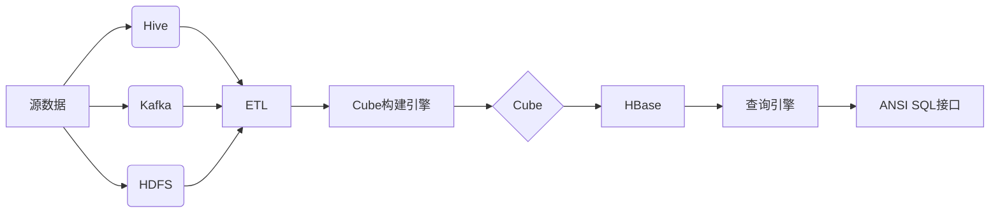

# Kylin原理与代码实例讲解

## 1.背景介绍
### 1.1 大数据分析挑战
在大数据时代,企业面临着海量数据的分析挑战。传统的数据仓库和商业智能工具难以应对PB级别的数据规模,查询性能和灵活性都受到限制。
### 1.2 Kylin的诞生
为了解决大数据多维分析(OLAP)的难题,eBay开源了Kylin项目。Kylin旨在提供一个标准的SQL接口,支持亚秒级的大数据查询,同时具备优秀的可扩展性。
### 1.3 Kylin的定位
Kylin是一个开源的分布式分析引擎,专为大数据多维分析而设计。它构建在Hadoop生态之上,利用HBase存储预计算的多维cuboid,从而实现毫秒级的查询响应。

## 2.核心概念与联系
### 2.1 数据立方体(Cube)
数据立方体是Kylin的核心概念之一。一个Cube定义了一组维度(Dimensions)和度量(Measures),类似于多维数据集。Kylin会预先计算Cube的所有子集,生成cuboid,极大地加速查询。
### 2.2 维度(Dimension)
维度是用于描述事实的属性,例如时间、地点、产品类别等。Kylin支持普通维度、层级维度等多种类型,可以灵活地对数据进行切片和切块。
### 2.3 度量(Measure)
度量是对事实的定量描述,通常是数值型的汇总指标,例如销售额、访问次数等。Kylin支持SUM、COUNT、MAX等常见的聚合函数。
### 2.4 HBase存储
Kylin利用HBase作为存储引擎,将预计算的cuboid数据持久化。HBase的列族式存储模型和K-V结构,非常适合多维数据的组织和检索。
### 2.5 预计算引擎
预计算引擎是Kylin的核心组件之一。它负责将原始数据进行cuboid构建和物化,生成一系列预聚合的结果。这个过程通过MapReduce实现,可以充分利用Hadoop的并行计算能力。

## 3.核心算法原理具体操作步骤
### 3.1 Cuboid构建算法
1) 确定基本cuboid。基本cuboid包含Cube的所有维度,是粒度最细的cuboid。 
2) 生成cuboid笛卡尔积。计算所有维度的组合,生成cuboid的搜索空间。
3) 应用剪枝策略。根据查询模式和聚合组,去除不必要的cuboid。
4) 物化cuboid。对保留的cuboid,计算度量值并持久化存储。
### 3.2 查询重写与路由
1) 解析查询AST。将SQL解析为抽象语法树,提取查询的维度、度量、过滤条件等。
2) 匹配最优cuboid。在cuboid搜索空间中,选择与查询匹配且粒度最粗的cuboid。
3) 重写查询。根据选定的cuboid,重写原始SQL,生成等价的HBase查询。
4) 执行查询。将重写后的查询路由到HBase进行执行,并合并结果集。

## 4.数学模型和公式详细讲解举例说明
### 4.1 Cuboid笛卡尔积生成
假设有一个Cube包含维度 $D={d_1,d_2,...,d_n}$,每个维度 $d_i$ 有基数 $C_i$。那么该Cube的cuboid搜索空间的大小为:

$$ \prod_{i=1}^{n} (C_i+1) $$

例如,有三个维度 $\{A,B,C\}$,基数分别为2、3、4。则搜索空间大小为:$(2+1)\times(3+1)\times(4+1)=60$。

### 4.2 剪枝策略
Kylin采用多种剪枝策略来减少cuboid的数量,包括:
1) 基于查询频率的剪枝。对于不频繁查询的维度组合,可以不物化其对应的cuboid。设查询频率阈值为 $\sigma$,维度组合 $S$ 的查询频率 $F_S$,则当 $F_S<\sigma$ 时,剪除 $S$ 的cuboid。

2) 基于聚合组的剪枝。对于具有相同聚合组的维度,只需选取基数最小的维度组合。设聚合组为 $G$,维度组合 $S_1$ 和 $S_2$,若 $G_{S_1}=G_{S_2}$,且 $\prod_{d_i \in S_1}C_i < \prod_{d_j \in S_2}C_j$,则剪除 $S_2$ 的cuboid。

## 5.项目实践：代码实例和详细解释说明
下面是一个使用Kylin Java API的简单示例,展示如何创建Cube并执行查询:

```java
// 创建Kylin配置
KylinConfig config = KylinConfig.getInstanceFromEnv();

// 创建Cube描述
CubeDesc cubeDesc = new CubeDesc();
cubeDesc.setName("my_cube");
cubeDesc.setDimensions(Lists.newArrayList("dim1", "dim2"));
cubeDesc.setMeasures(Lists.newArrayList("msr1", "msr2"));
cubeDesc.setModel(new DataModelDesc());

// 初始化Cube实例
CubeInstance cubeInstance = CubeManager.getInstance(config).createCube(cubeDesc);

// 提交Cube构建Job
CubeInstance cube = CubeManager.getInstance(config).getCube("my_cube");
JobInstance job = CubingJobBuilder.newBuilder(cube).setSubmitter("admin").build();
JobManager.getInstance(config).addJob(job);

// 执行查询
SQLRequest sqlRequest = new SQLRequest();
sqlRequest.setSql("SELECT dim1, SUM(msr1) FROM my_cube WHERE dim2 = 'abc' GROUP BY dim1");
sqlRequest.setProject("my_project");
IDatabaseConnection conn = new DatabaseConnection(config);
IPushDownRunner runner = new PushDownRunnerImpl(config, conn);
ITupleIterator iterator = runner.search(sqlRequest);
```

以上代码展示了使用Kylin API的基本流程:
1. 创建`KylinConfig`实例,加载Kylin的配置信息。
2. 定义`CubeDesc`,指定Cube的名称、维度、度量等元数据。
3. 通过`CubeManager`创建`CubeInstance`,并提交Cube构建Job。
4. 构造`SQLRequest`,设置要执行的SQL查询。
5. 创建`DatabaseConnection`和`PushDownRunner`,下推查询并获取结果`TupleIterator`。

## 6.实际应用场景
Kylin广泛应用于各种大数据分析场景,例如:
### 6.1 广告分析
使用Kylin可以对广告的多维数据进行实时分析,如统计不同广告位、投放时段、用户特征的点击率和转化率,优化广告策略。
### 6.2 电商BI
电商平台使用Kylin分析TB级别的交易数据,快速响应销售额、订单量等多维指标的查询,支撑实时的数据分析和决策。
### 6.3 日志分析
互联网公司使用Kylin对服务器日志进行多维分析,如统计不同页面、操作、设备的访问量和错误率,及时发现和定位问题。

## 7.工具和资源推荐
### 7.1 Kylin官方网站
Kylin的官方网站 http://kylin.apache.org/ 提供了丰富的文档、教程和案例,是学习和使用Kylin的权威资源。
### 7.2 Kylin Github
Kylin的源代码托管在Github: https://github.com/apache/kylin 。你可以了解Kylin的内部实现,参与社区贡献。
### 7.3 Kylin Mailing List
Kylin的邮件列表 dev@kylin.apache.org 是讨论Kylin技术问题、分享经验的平台。

## 8.总结：未来发展趋势与挑战
Kylin作为领先的大数据OLAP引擎,已在众多企业得到应用。未来Kylin还将在以下方面持续演进:
### 8.1 更智能的Cube构建
通过AI和机器学习技术,自动优化Cube设计,提高预计算的效率和存储利用率。
### 8.2 更友好的SQL支持
进一步完善SQL的语义,提供更标准、更灵活的ANSI SQL支持,降低用户使用门槛。
### 8.3 更快的查询引擎
优化查询执行引擎,在低延迟、高并发场景下提供更出色的查询性能。
### 8.4 云原生架构
围绕云原生和Kubernetes设计,提供更弹性、更可靠的部署和运维能力。

同时,Kylin也面临一些挑战:
1) 高基数维度的处理。当维度基数过高时,预计算的cuboid数量剧增,需要更高效的剪枝和索引机制。 
2) 近实时数据同步。Cube构建通常是T+1的批处理,难以应对实时数据更新。需要引入增量Cube构建等机制。
3) 与云数据湖的集成。如何与云上的对象存储、Hive等组件更好地协同,打通数据湖分析链路。

## 9.附录：常见问题与解答
### Q1: Kylin支持哪些数据源?
Kylin支持Hive、Kafka、HDFS等多种数据源。可以通过配置SourceConnector将源数据接入Kylin。
### Q2: Kylin的数据更新策略是怎样的?
Kylin采用增量Cube构建的方式,将新增的数据构建为单独的Segment,与历史Segment合并生成更新后的Cube。
### Q3: Kylin的查询性能如何?
Kylin通过预计算和索引,将多维查询的响应时间控制在亚秒级。但具体性能取决于Cube设计、查询复杂度等因素。
### Q4: Kylin如何与Spark集成?
Kylin提供了Spark Cubing插件,可以将Cube构建Job运行在Spark引擎之上,提高构建性能。同时Kylin也支持将查询下推到Spark进行执行。



作者：禅与计算机程序设计艺术 / Zen and the Art of Computer Programming