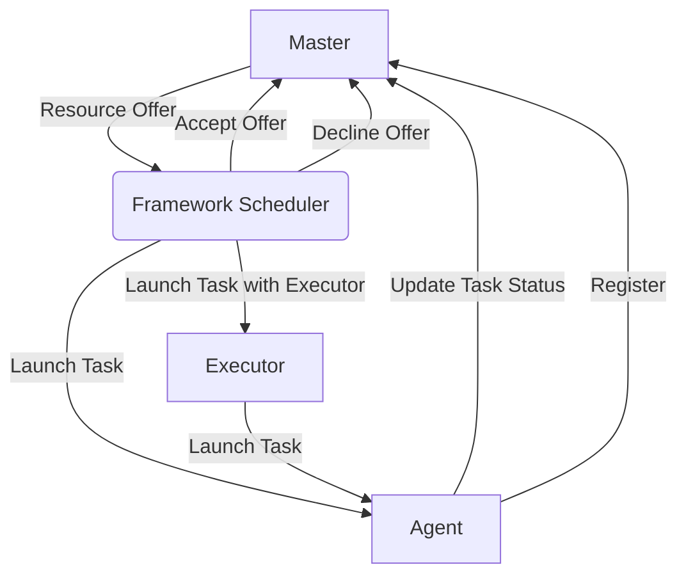

# Mesos原理与代码实例讲解

## 1.背景介绍

### 1.1 Mesos的诞生背景
Apache Mesos是一个开源的集群管理器,它最初由加州大学伯克利分校的AMPLab开发,旨在为应用程序提供高效的资源隔离和共享。随着数据中心规模的不断扩大,如何有效管理和利用集群资源成为了一个巨大的挑战。Mesos应运而生,它为运行在集群上的各种应用程序(如Hadoop、Spark、Kafka等)提供了一个通用的资源管理平台。

### 1.2 Mesos的定位与价值
Mesos的主要目标是最大化资源利用率,降低运维成本。它将集群中的CPU、内存、存储等资源进行抽象和调度,使得多个应用程序可以在同一个集群上高效运行。Mesos采用了两层调度模型,由Mesos负责全局资源管理,而各个应用程序(称为Framework)则负责对分配到的资源进行二次调度,从而实现了资源共享与隔离。Mesos的这种设计使得它非常灵活和可扩展,能够支持多种不同类型的应用。

### 1.3 Mesos的应用现状
目前,Mesos已经被Twitter、eBay、Uber等众多知名互联网公司广泛应用于生产环境。基于Mesos构建的DCOS(数据中心操作系统)更是将Mesos推向了一个新的高度。可以说,Mesos正在成为新一代数据中心的核心操作系统。同时,Mesos社区也非常活跃,不断有新的应用框架涌现,如Marathon(长服务)、Chronos(定时任务)、Aurora(Mesos原生调度器)等。

## 2.核心概念与联系

### 2.1 Master和Agent
Mesos采用了Master-Slave架构,由一个Master进程和多个Agent(Slave)进程组成。
- Master负责管理整个集群,包括资源分配、任务调度、状态监控等。
- Agent运行在集群的各个节点上,负责汇报节点的资源情况,并接收Master分配的任务。

### 2.2 Framework、Executor和Task
- Framework表示运行在Mesos上的一个应用程序,如Spark、Hadoop等。每个Framework包含两个组件:调度器(Scheduler)和执行器(Executor)。
- 调度器向Mesos注册,并等待Master提供资源。获得资源后,调度器可以在这些资源上下发任务。
- 执行器负责在Agent上启动并运行Framework的任务(Task)。
- Task代表一个最小的工作单元,每个任务会被分配到一个Executor中执行。

### 2.3 Offer和Allocation
- Offer是指Master向Framework提供的一组资源,包括可用的CPU、内存等。Framework可以选择接受或拒绝Offer。
- Allocation代表Framework接受Offer后,在这些资源上进行的任务分配结果。

下图展示了Mesos的核心概念之间的关系:



## 3.核心算法原理具体操作步骤

### 3.1 资源分配算法
Mesos采用了一种基于资源Offer的分布式调度算法,称为DRF(Dominant Resource Fairness)。具体步骤如下:

1. Agent将自己的可用资源量报告给Master。 
2. Master基于DRF算法和Framework的优先级,生成一系列资源Offer,发送给Framework的调度器。
3. 调度器根据自身需求决定接受还是拒绝Offer。若接受,则将任务分配结果(Allocation)返回给Master。
4. Master根据Allocation,在相应的Agent上启动任务。
5. Agent为任务分配资源,并启动Executor执行任务。
6. Executor运行任务,并向Agent汇报任务状态。Agent再将状态同步给Master。
7. 任务执行完成后,Agent回收资源,重新可用。

### 3.2 任务调度机制
Mesos默认采用轮询调度策略,即在Framework之间轮流分配资源。但Mesos也支持基于角色(Role)的静态资源预留和配额管理,以保证重要Framework的资源使用。此外,Mesos还引入了权重(Weight)的概念,可以对不同Framework的资源分配比例进行动态调整。

### 3.3 容错与高可用
为了保证系统的高可用性,Mesos采取了多种容错机制:

- Master采用热备份(Hot Standby)模式,通过ZooKeeper进行Leader选举。
- Framework的调度器和执行器都可以进行检查点(Checkpoint),从而在失败时能够恢复状态。
- Agent会将任务信息写入本地的恢复日志中,当Agent失败重启后,可以从日志中恢复任务状态。

## 4.数学模型和公式详细讲解举例说明

### 4.1 DRF算法模型
DRF是一种最大最小公平(max-min fairness)算法,旨在保证每个Framework获得与其需求成正比的资源份额。假设系统中有$n$个Framework,每个Framework $i$ 对资源类型 $j$ 的需求为$D_{i,j}$,那么Framework $i$ 的主导资源(Dominant Resource)定义为:

$$
R_i = \max_j \frac{D_{i,j}}{T_j}
$$

其中,$T_j$表示资源类型$j$的总量。DRF算法的目标是最大化所有Framework主导资源的最小值,即:

$$
\max \min_i R_i
$$

### 4.2 示例说明
假设系统中有两个Framework,对CPU和内存的需求分别为:

Framework 1: (1 CPU, 4 GB)
Framework 2: (3 CPU, 1 GB)

系统总资源为(10 CPU, 10 GB)。则Framework 1的主导资源为内存:
$$
R_1 = \max(\frac{1}{10}, \frac{4}{10}) = 0.4
$$

Framework 2的主导资源为CPU:
$$
R_2 = \max(\frac{3}{10}, \frac{1}{10}) = 0.3
$$

根据DRF,应分配资源如下:

Framework 1: (2.5 CPU, 10 GB)
Framework 2: (7.5 CPU, 2.5 GB)

可以看出,DRF保证了两个Framework获得与其主导资源需求成正比的资源份额。

## 5.项目实践：代码实例和详细解释说明

下面我们通过一个简单的示例来演示如何使用Mesos的Python API编写一个自定义Framework。

### 5.1 环境准备
首先需要安装Mesos的Python库:
```shell
pip install mesos.native
```

### 5.2 编写Scheduler
创建一个Python文件scheduler.py,编写自定义的Scheduler:

```python
import mesos.interface
from mesos.interface import mesos_pb2
import mesos.native

class MyScheduler(mesos.interface.Scheduler):
    def __init__(self):
        self.taskData = {}
        
    def resourceOffers(self, driver, offers):
        for offer in offers:
            tasks = []
            offerCpus = 0
            offerMem = 0
            for resource in offer.resources:
                if resource.name == "cpus":
                    offerCpus += resource.scalar.value
                elif resource.name == "mem":
                    offerMem += resource.scalar.value
            
            if offerCpus < 1 or offerMem < 128:
                continue

            tid = self.taskData.get(offer.id.value, 0) 
            self.taskData[offer.id.value] = tid + 1

            task = mesos_pb2.TaskInfo()
            task.task_id.value = str(tid)
            task.slave_id.value = offer.slave_id.value
            task.name = "task {}".format(tid)

            cpus = task.resources.add()
            cpus.name = "cpus"
            cpus.type = mesos_pb2.Value.SCALAR
            cpus.scalar.value = 1

            mem = task.resources.add()
            mem.name = "mem"
            mem.type = mesos_pb2.Value.SCALAR
            mem.scalar.value = 128

            tasks.append(task)

            driver.launchTasks(offer.id, tasks)

    def statusUpdate(self, driver, update):
        logging.debug('Status update TID %s %s',
                      update.task_id.value,
                      mesos_pb2.TaskState.Name(update.state))
```

这里我们定义了一个简单的Scheduler,其中:
- resourceOffers方法在收到Offer时被调用,用于决策如何分配资源。这里我们启动了一些占用1个CPU和128MB内存的任务。
- statusUpdate方法用于处理任务的状态更新。

### 5.3 编写Executor
创建executor.py文件,定义自定义Executor:

```python
import mesos.interface
from mesos.interface import mesos_pb2
import mesos.native
import time

class MyExecutor(mesos.interface.Executor):
    def launchTask(self, driver, task):
        update = mesos_pb2.TaskStatus()
        update.task_id.value = task.task_id.value
        update.state = mesos_pb2.TASK_RUNNING
        driver.sendStatusUpdate(update)

        time.sleep(30)
        
        update = mesos_pb2.TaskStatus()
        update.task_id.value = task.task_id.value
        update.state = mesos_pb2.TASK_FINISHED
        driver.sendStatusUpdate(update)
```

这个Executor启动后会睡眠30秒,然后结束任务。在任务的开始和结束时,会向Mesos汇报任务状态。

### 5.4 启动Framework
最后,我们编写framework.py,启动这个自定义Framework:

```python
import mesos.native
from scheduler import MyScheduler

framework = mesos_pb2.FrameworkInfo()
framework.user = "" 
framework.name = "MyFramework"

driver = mesos.native.MesosSchedulerDriver(
    MyScheduler(),
    framework,
    "zk://localhost:2181/mesos"  # assumes running on the master
)

driver.run()
```

这里我们创建了一个FrameworkInfo,指定了Framework的名称,并将其传递给MesosSchedulerDriver。然后调用driver.run()启动Framework。

假设Mesos Master和ZooKeeper都运行在本机,则可以直接运行这个Framework:
```shell
python framework.py
```

这样,我们就成功创建并运行了一个基于Mesos的自定义Framework。Mesos会将集群资源Offer给这个Framework,Framework则会根据resourceOffers中的决策逻辑来分配资源和启动任务。

## 6.实际应用场景

Mesos可以应用于多种场景,下面列举几个典型的例子:

### 6.1 大数据处理
Mesos可以用于管理和调度Hadoop、Spark等大数据处理框架。通过Mesos,可以实现多个大数据应用程序在同一个集群上动态共享资源,提高集群利用率。同时,Mesos还能够支持大数据作业与其他类型应用(如长服务)混合部署。

### 6.2 微服务架构
Mesos非常适合作为微服务架构的基础设施层。通过Mesos,可以方便地管理大量的微服务实例,动态调整服务的资源占用。Mesos的两层调度机制也使得不同的微服务可以采用不同的调度策略,满足各自的需求。

### 6.3 持续集成与部署
Mesos可以用于支撑持续集成和部署流程。利用Mesos,可以动态创建Jenkins Slave,执行构建和测试任务。结合Docker等容器技术,Mesos还可以实现应用程序的自动化部署和弹性扩缩容。

### 6.4 科学计算
Mesos在科学计算领域也有广泛应用。例如,Mesos可以用于管理和调度科学工作流任务,提高计算任务的并发度和资源利用率。通过Mesos,科研人员可以更高效地共享和使用高性能计算集群。

## 7.工具和资源推荐

### 7.1 Mesos官方文档
Mesos官网提供了详尽的文档,包括入门教程、用户手册、开发指南等。通过学习官方文档,可以全面深入地了解Mesos的方方面面。

### 7.2 Marathon
Marathon是一个基于Mesos的PaaS平台,用于管理和调度长期运行的服务。使用Marathon,可以轻松实现应用程序的部署、扩缩容、故障恢复等。Marathon提供了丰富的REST API和UI界面,是Mesos生态中不可或缺的一部分。

### 7.3 Chronos
Chronos是Mesos上的一个分布式定时任务调度框架,类似于crontab。使用Chronos,可以进行复杂的定时任务调度,如每天定时执行ETL作业等。Chronos与Mesos深度集成,支持动态资源分配和弹性扩展。

### 7.4 Mesos DNS
Mesos DNS是一个用于Mesos集群的