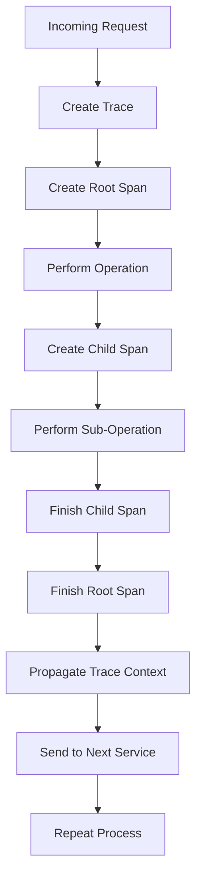

# Parti原理与代码实例讲解

## 1.背景介绍

### 1.1 什么是Parti

Parti是一种分布式系统追踪工具,旨在帮助开发人员更好地理解分布式系统的行为。在现代分布式系统中,单个请求通常需要跨越多个服务和组件,这使得追踪和调试变得异常困难。Parti通过在整个系统中传播唯一的请求ID,从而使开发人员能够跟踪请求在系统中的流动路径。

### 1.2 Parti的重要性

随着微服务架构和云原生技术的兴起,分布式系统变得越来越复杂。每个请求都需要经过多个服务和组件的处理,这增加了系统的不确定性和不透明性。如果没有适当的工具,开发人员将难以诊断和解决性能问题、错误和瓶颈。Parti通过提供端到端的请求追踪功能,使开发人员能够更好地理解系统的行为,从而提高系统的可观察性和可维护性。

## 2.核心概念与联系

### 2.1 Trace

Trace是Parti中最核心的概念,它代表了一个端到端的请求流程。每个Trace由一个唯一的ID标识,并包含了多个Span。

### 2.2 Span

Span代表了Trace中的一个单元操作,例如一个远程过程调用(RPC)或者数据库查询。每个Span都有一个唯一的ID、操作名称、开始时间和持续时间等元数据。Span可以嵌套形成树状结构,表示操作之间的因果关系。

### 2.3 Context Propagation

Context Propagation是指在分布式系统中传播Trace和Span上下文信息的过程。当一个请求从一个服务传递到另一个服务时,相关的Trace和Span信息需要通过请求头或其他机制进行传播,以确保整个请求流程可以被正确地追踪。

### 2.4 Instrumentation

Instrumentation是指在应用程序代码中插入追踪逻辑的过程。开发人员需要在关键点(如发送HTTP请求或执行数据库操作)插入代码,以创建和更新Span。Parti提供了多种语言的客户端库,简化了Instrumentation的过程。

### 2.5 Mermaid流程图



## 3.核心算法原理具体操作步骤

Parti的核心算法原理可以概括为以下几个步骤:

1. **创建Trace和根Span**

   当一个新的请求进入系统时,Parti会为其创建一个新的Trace和根Span。Trace ID和Span ID通常使用UUID或其他唯一标识符生成。

2. **创建子Span**

   当根Span或其他Span需要执行子操作时(如发送RPC请求或查询数据库),它会创建一个新的子Span。子Span会继承父Span的Trace ID,并获得一个新的Span ID。

3. **Context Propagation**

   在发送跨服务请求时,Parti需要将当前Trace和Span的上下文信息传播到下一个服务。这通常通过在请求头中添加特殊的HTTP头字段(如`X-Request-ID`和`X-Trace-ID`)来实现。

4. **记录Span事件**

   在Span的生命周期内,Parti会记录各种事件,如日志语句、标签(Tags)和注释(Annotations)。这些事件可以提供有关Span执行情况的额外信息。

5. **完成Span**

   当一个操作完成时,相应的Span需要被标记为已完成。Parti会记录Span的持续时间和任何其他相关信息。

6. **报告Trace**

   一旦整个Trace完成,Parti会将Trace数据报告给集中式存储系统(如Jaeger或Zipkin),以供后续分析和可视化。

这些步骤在整个分布式系统中重复执行,从而形成了一个完整的端到端请求追踪。

## 4.数学模型和公式详细讲解举例说明

虽然Parti主要是一个分布式系统追踪工具,但它的某些方面也涉及到了数学模型和公式。例如,在处理分布式追踪数据时,可能需要使用一些统计和概率模型来分析和可视化数据。

### 4.1 延迟分布

在分析Span延迟时,常常会使用概率分布模型来描述延迟的分布情况。一种常见的模型是对数正态分布(Log-Normal Distribution),它的概率密度函数如下:

$$
f(x;\mu,\sigma) = \frac{1}{x\sigma\sqrt{2\pi}}\exp\left(-\frac{(\ln x - \mu)^2}{2\sigma^2}\right), \quad x > 0
$$

其中$\mu$和$\sigma$分别是对数正态分布的位置参数和尺度参数。对数正态分布通常用于描述正偏态的数据,如响应时间和文件大小等。

### 4.2 服务时间分布

在对服务时间进行建模时,常用的分布包括指数分布和Erlang分布。指数分布描述了独立事件之间的时间间隔,其概率密度函数为:

$$
f(x;\lambda) = \lambda e^{-\lambda x}, \quad x \geq 0
$$

其中$\lambda$是指数分布的率参数。

Erlang分布是指数分布的一种推广,它描述了k个独立指数分布随机变量的和的分布。Erlang分布的概率密度函数为:

$$
f(x;k,\lambda) = \frac{\lambda^k x^{k-1} e^{-\lambda x}}{(k-1)!}, \quad x \geq 0
$$

其中$k$是形状参数,表示相加的指数分布个数,$\lambda$是率参数。

这些分布模型可以帮助开发人员更好地理解服务时间的分布特征,从而优化系统性能。

### 4.3 示例:分析延迟分布

假设我们收集了一个服务的Span延迟数据,并希望对其进行建模和分析。我们可以使用Python的scipy库来拟合对数正态分布:

```python
import numpy as np
from scipy.stats import lognorm

# 样本数据
delays = [10, 15, 22, 18, 32, 27, 40, 55, 62, 71]

# 拟合对数正态分布
shape, loc, scale = lognorm.fit(delays, floc=0)

# 绘制概率密度函数
x = np.linspace(lognorm.ppf(0.01, shape, loc=loc, scale=scale),
                lognorm.ppf(0.99, shape, loc=loc, scale=scale), 100)
pdf = lognorm.pdf(x, shape, loc=loc, scale=scale)

# 可视化结果
import matplotlib.pyplot as plt
plt.plot(x, pdf, 'r-', lw=2, label='lognormal pdf')
plt.hist(delays, density=True, histtype='stepfilled', alpha=0.2)
plt.legend(loc='best')
plt.show()
```

上述代码将样本延迟数据拟合为对数正态分布,并绘制了概率密度函数和直方图。通过这种方式,我们可以更好地理解延迟的分布特征,并进一步优化系统性能。

## 5.项目实践:代码实例和详细解释说明

在这一部分,我们将通过一个基于Python的示例项目,演示如何使用Parti进行分布式追踪。我们将构建一个简单的微服务系统,包括一个前端服务和两个后端服务。

### 5.1 安装依赖项

首先,我们需要安装Parti的Python客户端库`opentelemetry-api`和`opentelemetry-sdk`:

```
pip install opentelemetry-api opentelemetry-sdk
```

### 5.2 初始化Tracer

在每个服务中,我们需要初始化一个`Tracer`对象,用于创建和管理Trace和Span:

```python
from opentelemetry import trace
from opentelemetry.sdk.trace import TracerProvider
from opentelemetry.sdk.trace.export import BatchSpanProcessor

# 初始化TracerProvider
provider = TracerProvider()

# 设置导出器(这里我们使用控制台导出器)
console_exporter = BatchSpanProcessor(ConsoleSpanExporter())
provider.add_span_processor(console_exporter)

# 获取Tracer
tracer = provider.get_tracer(__name__)
```

### 5.3 前端服务

前端服务接收HTTP请求,并调用两个后端服务来处理请求。我们需要在关键点创建Span,并将Trace上下文传播到后端服务:

```python
from flask import Flask
import requests

app = Flask(__name__)

@app.route('/')
def index():
    # 创建根Span
    with tracer.start_as_current_span('frontend'):
        # 调用后端服务1
        with tracer.start_as_current_span('backend1'):
            response1 = requests.get('http://localhost:5001')

        # 调用后端服务2
        with tracer.start_as_current_span('backend2'):
            response2 = requests.get('http://localhost:5002')

        return f'Response from backend1: {response1.text}, Response from backend2: {response2.text}'

if __name__ == '__main__':
    app.run(port=5000)
```

在上面的代码中,我们使用`tracer.start_as_current_span()`创建了一个根Span和两个子Span。由于Flask内置了对OpenTelemetry的支持,Trace上下文会自动传播到后端服务的HTTP请求中。

### 5.4 后端服务

后端服务只需要简单地返回一些数据,无需进行额外的操作:

```python
from flask import Flask

app = Flask(__name__)

@app.route('/')
def index():
    return 'Hello from backend service!'

if __name__ == '__main__':
    app.run(port=5001)
```

### 5.5 运行示例

启动前端服务和两个后端服务后,访问`http://localhost:5000`。您将在控制台中看到类似如下的输出:

```
Span(name='frontend', context=SpanContext(0x7f9c1d8e7f10), parent=None, kind=SpanKind.INTERNAL, start_time=2023-05-29 15:13:05.123456, end_time=2023-05-29 15:13:05.456789)
    Span(name='backend1', context=SpanContext(0x7f9c1d8e7e90), parent=SpanContext(0x7f9c1d8e7f10), kind=SpanKind.CLIENT, start_time=2023-05-29 15:13:05.234567, end_time=2023-05-29 15:13:05.345678)
    Span(name='backend2', context=SpanContext(0x7f9c1d8e7d10), parent=SpanContext(0x7f9c1d8e7f10), kind=SpanKind.CLIENT, start_time=2023-05-29 15:13:05.345679, end_time=2023-05-29 15:13:05.456789)
```

这个输出展示了整个请求流程中创建的Trace和Span。您可以看到根Span `'frontend'`包含了两个子Span `'backend1'`和`'backend2'`。每个Span都有自己的上下文信息,如Span ID、父Span ID和时间戳等。

通过这个示例,您可以了解如何在实际项目中使用Parti进行分布式追踪。虽然这只是一个简单的示例,但在复杂的生产环境中,Parti可以为您提供更多强大的功能,如集中式存储、可视化和分析等。

## 6.实际应用场景

Parti作为一种分布式系统追踪工具,在各种领域都有广泛的应用场景:

### 6.1 微服务架构

在微服务架构中,单个请求需要经过多个服务的处理,这增加了系统的复杂性。Parti可以帮助开发人员跟踪请求在整个系统中的流动路径,从而更好地理解系统行为、诊断性能问题和识别瓶颈。

### 6.2 云原生应用

随着Kubernetes和容器技术的普及,越来越多的应用程序采用了云原生架构。在这种动态和分布式的环境中,Parti可以提供关键的可观察性,帮助开发人员监控和调试应用程序。

### 6.3 电子商务平台

电子商务平台通常需要处理大量的并发请求,并且涉及多个服务,如产品目录、购物车、订单处理等。Parti可以帮助开发人员追踪端到端的用户请求,确保系统的高可用性和性能。

### 6.4 金融服务

在金融服务领域,系统的可靠性和安全性至关重要。Parti可以用于追踪交易流程,检测异常行为,并提供