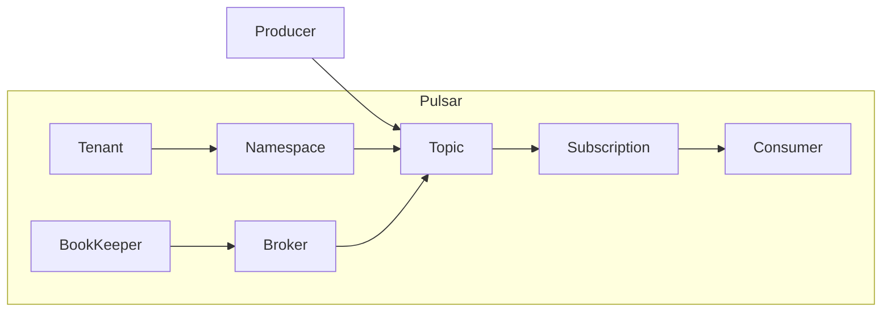

# Pulsar原理与代码实例讲解

## 1.背景介绍

### 1.1 什么是Pulsar
Pulsar是Apache软件基金会的一个开源项目,是一个多租户、高性能的服务化消息中间件。它提供了一个统一的消息模型和API,支持多种消息传递语义,如队列、发布/订阅、流式处理等。

### 1.2 Pulsar的特点
- 高吞吐、低延迟:Pulsar采用分层架构设计,将存储和服务解耦,可以实现高吞吐和低延迟。
- 云原生:Pulsar采用无状态的计算与有状态的存储分离的架构,非常适合云环境部署。
- 灵活的消息语义:支持多种消息模型,如队列、发布/订阅、流式处理等。
- 多租户:通过租户隔离和资源配额,实现安全的多租户。
- 跨地域复制:支持跨地域的Geo复制,实现全球化部署。

### 1.3 Pulsar的应用场景
Pulsar广泛应用于消息队列、流式处理、事件驱动等多种场景,如:
- 解耦复杂系统
- 异步通信
- 流式数据处理
- 事件驱动架构
- 分布式事务

## 2.核心概念与联系

### 2.1 Producer
Producer是消息的生产者,负责将消息发送到特定的Topic。

### 2.2 Consumer
Consumer是消息的消费者,负责从Topic或者Subscription接收消息。

### 2.3 Topic 
Topic是发布消息的逻辑通道,Producer将消息发布到Topic,Consumer从Topic订阅消息。

### 2.4 Subscription
Subscription是消费者关联到Topic的一个命名空间,同一个Topic可以有多个Subscription。

### 2.5 Namespace
Namespace是租户的逻辑隔离单位,不同的租户使用不同的Namespace。

### 2.6 Tenant
Tenant是使用Pulsar系统的实体,不同的Tenant之间在物理上是隔离的。

### 2.7 Broker
Broker是无状态的服务节点,负责Topic的服务。

### 2.8 BookKeeper
BookKeeper是Pulsar的持久化存储,负责消息的存储。

它们之间的关系如下:



## 3.核心算法原理具体操作步骤

### 3.1 消息发送
1. Producer连接到Broker
2. Producer选择一个Topic发送消息
3. Broker确定消息的存储位置
4. Broker将消息持久化到BookKeeper
5. Broker返回确认给Producer

### 3.2 消息消费
1. Consumer连接到Broker
2. Consumer选择订阅的Topic和Subscription
3. Broker根据Subscription状态推送消息给Consumer
4. Consumer处理消息
5. Consumer返回ack给Broker
6. Broker更新Subscription状态

### 3.3 消息存储
1. Broker将消息append到BookKeeper的ledger
2. 当ledger达到一定大小后,Broker关闭ledger
3. Broker创建新的ledger继续写入
4. 每个ledger生命周期结束后,BookKeeper会将其压缩

## 4.数学模型和公式详细讲解举例说明

### 4.1 生产者发送消息模型
假设有$n$个生产者并发发送消息,每个生产者的发送速率为$v_i(i=1,2,...,n)$,那么总的消息到达速率为:

$$V_{arrive}=\sum_{i=1}^n v_i$$

假设Broker的处理消息能力为$V_{process}$,那么要保证系统稳定,需要满足:

$$V_{arrive} \leq V_{process}$$

### 4.2 消费者消费消息模型
假设有$m$个消费者并发消费消息,每个消费者的消费速率为$v_j(j=1,2,...,m)$,那么总的消费速率为:

$$V_{consume}=\sum_{j=1}^m v_j$$

要保证消息不会在系统中无限积压,需要满足:

$$V_{arrive} \leq V_{consume}$$

### 4.3 消息存储模型
假设每条消息的平均大小为$s$,Broker的磁盘写入速度为$v_d$,那么Broker的消息写入速率为:

$$V_{store}=\frac{v_d}{s}$$

要保证消息能被持久化,需要满足:

$$V_{arrive} \leq V_{store}$$

## 5.项目实践：代码实例和详细解释说明

### 5.1 环境准备
首先需要安装并启动Pulsar,可以使用docker方式快速部署:

```bash
docker run -it \
  -p 6650:6650 \
  -p 8080:8080 \
  --mount source=pulsardata,target=/pulsar/data \
  --mount source=pulsarconf,target=/pulsar/conf \
  apachepulsar/pulsar:2.5.1 \
  bin/pulsar standalone
```

### 5.2 生产者示例
使用Java客户端发送消息:

```java
PulsarClient client = PulsarClient.builder()
        .serviceUrl("pulsar://localhost:6650")
        .build();
Producer<byte[]> producer = client.newProducer()
        .topic("my-topic")
        .create();
for (int i = 0; i < 10; i++) {
    producer.send(("Hello Pulsar " + i).getBytes());
}
producer.close();
client.close();
```

这里创建了一个Producer,并发送10条消息到名为"my-topic"的Topic。

### 5.3 消费者示例
使用Java客户端消费消息:

```java
PulsarClient client = PulsarClient.builder()
        .serviceUrl("pulsar://localhost:6650")
        .build();
Consumer consumer = client.newConsumer()
        .topic("my-topic")  
        .subscriptionName("my-subscription")
        .subscribe();
while (true) {
    Message msg = consumer.receive();
    System.out.printf("Message received: %s", new String(msg.getData()));
    consumer.acknowledge(msg);
}
consumer.close();
client.close();
```

这里创建了一个Consumer,订阅了"my-topic"的消息,并持续消费和确认。

## 6.实际应用场景

### 6.1 消息队列
Pulsar可以作为一个高性能、高可靠的分布式消息队列,应用于系统解耦、异步通信等场景。如电商系统中,订单系统生成的订单消息,可以发送到Pulsar的订单处理Topic中,再由库存系统、物流系统等消费处理。

### 6.2 流式处理
Pulsar可以与流式处理引擎(如Apache Flink、Spark Streaming等)集成,实现端到端的实时流处理。如在物联网场景中,设备产生的实时数据流可以发送到Pulsar,再由流处理引擎实时分析,完成实时监控、异常报警等。

### 6.3 事件驱动架构
Pulsar可以作为事件驱动架构的消息总线,实现基于事件的异步通信。如在微服务架构中,服务之间可以通过Pulsar传递事件消息,实现服务解耦和分布式事务等。

## 7.工具和资源推荐
- [Pulsar官网](https://pulsar.apache.org/)
- [Pulsar Github](https://github.com/apache/pulsar)
- [Pulsar Java Client](https://pulsar.apache.org/docs/en/client-libraries-java/)
- [Pulsar Python Client](https://pulsar.apache.org/docs/en/client-libraries-python/)
- [Pulsar Go Client](https://pulsar.apache.org/docs/en/client-libraries-go/)
- [Pulsar Adapters](https://pulsar.apache.org/docs/en/adaptors-kafka/)
- [Pulsar Flink Connector](https://pulsar.apache.org/docs/en/adaptors-flink/)
- [Pulsar Spark Connector](https://pulsar.apache.org/docs/en/adaptors-spark/)

## 8.总结：未来发展趋势与挑战

### 8.1 云原生化
随着云计算的发展,云原生已成为大势所趋。Pulsar的架构天然适合云环境,未来将进一步拥抱云原生,提供更灵活的部署和管理能力。

### 8.2 Serverless化
Serverless是云计算的一个重要趋势,让用户更专注于业务逻辑。Pulsar可以为Serverless提供事件源,触发函数执行,未来将进一步与各Serverless平台集成。

### 8.3 多云协同
多云和混合云是用户面临的现实需求。Pulsar提供了跨地域复制的能力,可以支持多云协同。未来将进一步增强这一能力,提供全球化部署的解决方案。

### 8.4 挑战
- 生态建设:Pulsar生态还有待进一步建设,需要吸引更多开发者加入。
- 学习曲线:Pulsar概念较多,学习曲线较陡,需要提供更好的文档和学习资料。
- 大规模运维:Pulsar大规模集群的运维还有挑战,需要提供更智能的运维工具。

## 9.附录：常见问题与解答

### 9.1 Pulsar与Kafka的区别？
Pulsar与Kafka都是优秀的消息中间件,在很多方面类似。但Pulsar在以下方面有优势:
- 原生支持多租户
- 采用无状态计算与状态存储分离的架构,更适合云环境
- 支持更灵活的消息消费语义

### 9.2 Pulsar如何保证消息不丢失？
Pulsar有多个层面保证消息不丢失:
- Broker接收到消息后会先持久化,再返回确认。
- Bookkeeper采用Quorum机制,写多读少,保证数据高可靠。  
- 消费者消费后返回ack,Broker再删除消息。

### 9.3 Pulsar的性能如何？
Pulsar具有非常高的性能,在官方Benchmark中,单个Broker可以达到:
- 生产者吞吐量: 1.8M msgs/s
- 消费者吞吐量: 1.6M msgs/s
- 端到端延迟: 5ms
- 存储写入速度: 72MB/s

### 9.4 Pulsar如何实现水平扩展？
Pulsar可以通过增加Broker和Bookkeeper实例数量实现水平扩展,步骤如下:
1. 添加Bookkeeper Bookie节点,提高存储容量。
2. 添加Broker节点,提高服务能力。
3. 迁移Topic到新的Broker节点。
4. 扩展完成,Pulsar性能得到提升。

作者：禅与计算机程序设计艺术 / Zen and the Art of Computer Programming