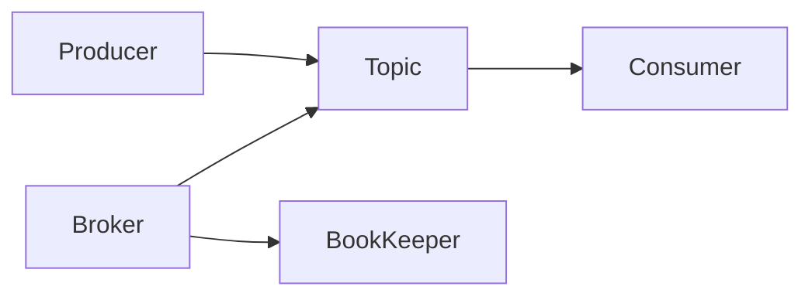

# Pulsar原理与代码实例讲解

## 1.背景介绍

### 1.1 消息队列系统的重要性

在现代分布式系统中,消息队列(Message Queue)扮演着至关重要的角色。它是连接分布式系统各个组件的纽带,能够实现系统解耦、异步通信、流量削峰等关键功能。消息队列使得分布式系统能够更加灵活、高效和可靠地运行。

### 1.2 主流消息队列系统及其局限性

目前主流的消息队列系统有Kafka、RabbitMQ、RocketMQ等。这些系统各有特点,但在某些场景下也存在一些局限性:

- 可扩展性:部分消息队列在集群规模较大时,扩展性受限。
- 多租户:对于多租户场景的支持不够完善。 
- 存储:消息的持久化存储能力有待加强。

### 1.3 Pulsar的诞生

Apache Pulsar由Yahoo开源,旨在解决上述消息队列系统的局限性,成为下一代云原生的分布式消息流平台。它集性能、扩展性、灵活性于一身,满足现代应用的苛刻需求。

## 2.核心概念与联系

### 2.1 Producer、Consumer与Topic

在Pulsar中,消息的生产者(Producer)将消息发布到指定的主题(Topic),消费者(Consumer)通过订阅Topic来消费消息。Topic是发布和订阅的基本单位。

### 2.2 Broker与BookKeeper

Pulsar的两大核心组件是Broker和BookKeeper:

- Broker:负责接收和分发消息,是Pulsar的消息服务层。
- BookKeeper:负责消息的持久化存储,是Pulsar的存储层。

它们分工明确,协同工作,保证了消息的可靠传输与存储。

### 2.3 概念之间的关系

下面是Pulsar核心概念之间的关系图:



## 3.核心算法原理具体操作步骤

### 3.1 消息发布与消费流程

1. Producer连接到Broker,发布消息到指定Topic。
2. Broker接收到消息后,将其存储到BookKeeper中。
3. Broker根据订阅关系,将消息推送给订阅该Topic的Consumer。
4. Consumer收到消息,进行消费处理。

### 3.2 消息存储与读取

1. Broker接收到消息后,先将消息append到BookKeeper的journal中。
2. 消息被刷新到BookKeeper的ledger中持久化存储。
3. Consumer请求消费消息时,Broker从BookKeeper中读取消息并返回。
4. 已消费的消息会定期从BookKeeper中删除。

## 4.数学模型和公式详细讲解举例说明

### 4.1 生产者发送消息的吞吐量估算

假设单个Producer发送消息的速率为 $v$ 条/秒,消息的平均大小为 $s$ MB,Broker的网络带宽为 $b$ MB/s,则理论最大吞吐量 $T$为:

$$
T = min(v, \frac{b}{s})
$$

例如,若 $v=1000$ 条/秒, $s=0.1$ MB, $b=100$ MB/s,则最大吞吐量约为1000条/秒。

### 4.2 消费者消费消息的延迟估算

假设Broker每次推送给Consumer的消息数为 $n$ 条,单条消息的平均处理时间为 $t$ 秒,则消费一批消息的延迟 $L$ 为:

$$
L = n * t
$$

若 $n=10, t=0.01$ 秒,则 $L=0.1$ 秒,即100毫秒。

Pulsar会动态调整 $n$ 的大小来权衡吞吐量和延迟。

## 5.项目实践:代码实例和详细解释说明

下面是使用Pulsar Java客户端发送和消费消息的示例代码:

```java
// 创建Producer
PulsarClient client = PulsarClient.builder()
        .serviceUrl("pulsar://localhost:6650")
        .build();
Producer<byte[]> producer = client.newProducer()
        .topic("my-topic")
        .create();

// 发送消息
for (int i = 0; i < 10; i++) {
    producer.send(("Hello Pulsar - " + i).getBytes());
}

// 创建Consumer
Consumer<byte[]> consumer = client.newConsumer()
        .topic("my-topic")
        .subscriptionName("my-subscription")
        .subscribe();

// 消费消息
while (true) {
    Message<byte[]> msg = consumer.receive();
    System.out.println("Received: " + new String(msg.getData()));
    consumer.acknowledge(msg);
}
```

说明:

1. 首先创建一个到Pulsar集群的PulsarClient连接。
2. 接着创建一个Producer,指定要发送消息的Topic。
3. 调用producer.send()方法发送消息。
4. 类似地,创建一个Consumer,指定要消费的Topic和订阅名称。
5. 调用consumer.receive()接收消息,并通过acknowledge()方法确认消息。

可以看到,Pulsar提供了非常简洁的API,使得消息的发布和消费变得非常方便。

## 6.实际应用场景

Pulsar广泛应用于各类实时流处理场景,例如:

- 日志收集与分析:将分布式系统的日志统一收集,再进行实时处理与分析。
- 事件驱动架构:通过消息传递触发下游的事件处理。
- 数据管道:构建实时数据处理管道,实现端到端的数据传输。
- 消息通信:作为微服务之间异步通信的中间件。

## 7.工具和资源推荐

- [Pulsar官方网站](https://pulsar.apache.org/):可以找到Pulsar的各种文档、博客和新闻。
- [Pulsar Github仓库](https://github.com/apache/pulsar):Pulsar的源码仓库,可以学习源码和贡献代码。
- [Pulsar Summit](https://pulsar-summit.org/):Pulsar的技术大会,分享最佳实践和未来规划。
- [StreamNative](https://streamnative.io/):Pulsar的主要开发公司,提供商业支持和云服务。

## 8.总结:未来发展趋势与挑战

展望未来,Pulsar有望成为统一的下一代消息流平台,在云原生时代大放异彩。但同时也面临一些挑战:

- 生态建设:进一步丰富周边生态,提供更多开箱即用的工具。
- 学习曲线:加强文档和培训,帮助用户快速掌握和使用Pulsar。
- 多语言支持:除Java外,加强对其他语言SDK的支持。
- 云服务:提供更完善、更易用的托管式Pulsar云服务。

## 9.附录:常见问题与解答

### 9.1 Pulsar与Kafka的区别?

- Pulsar原生支持多租户和geo-replication。
- Pulsar基于BookKeeper实现存储,更加灵活。
- Pulsar支持更多的消息语义,如Exclusive、Failover等。

### 9.2 Pulsar是否支持ACID事务?

Pulsar支持基于Streaming事务的端到端exactly-once语义,保证消息处理的一致性。

### 9.3 Pulsar的性能如何?

Pulsar具有极佳的性能表现,在吞吐量、延迟、扩展性等方面优于Kafka等消息队列。并且提供了更灵活的API和更强大的功能。

作者：禅与计算机程序设计艺术 / Zen and the Art of Computer Programming