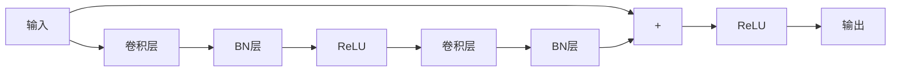

# ResNet原理与代码实例讲解

## 1. 背景介绍

### 1.1 深度神经网络的挑战

在深度学习领域,神经网络模型的深度是一个重要因素。一般来说,网络层数越深,其表达能力越强,对于复杂的任务如图像识别、语音识别等,通常需要使用更深的网络结构。然而,当神经网络层数超过一定深度时,会出现"梯度消失"或"梯度爆炸"的问题,导致权重无法正确更新,模型性能出现饱和或下降。

### 1.2 残差网络(ResNet)的提出

为了解决深度神经网络训练中的梯度消失/爆炸问题,2015年,微软研究院的何恺明等人在论文《Deep Residual Learning for Image Recognition》中提出了残差网络(Residual Network,简称ResNet)结构。ResNet通过构建"残差块"(Residual Block),引入了残差学习的概念,使网络可以更容易地学习残差映射,从而有效缓解了梯度消失/爆炸问题,实现了更深层次的网络训练。

## 2. 核心概念与联系

### 2.1 残差学习

残差学习是ResNet的核心思想。传统的神经网络试图直接学习映射关系 $H(x)$,而残差学习则是让网络去拟合残差映射 $F(x) = H(x) - x$。由于残差映射比原映射更容易拟合,因此可以加快训练速度,提高模型精度。

### 2.2 残差块(Residual Block)

残差块是ResNet网络的基本组成单元,其结构如下图所示:



残差块由两条路径组成:上面的路径是传统的卷积操作,下面的路径是一条"捷径",直接将输入传递到输出。最后将两条路径的输出相加,得到残差块的最终输出。这种设计可以让网络更容易学习残差映射,从而缓解梯度消失/爆炸问题。

### 2.3 ResNet网络结构

ResNet将多个残差块堆叠在一起,构成整个网络结构。不同深度的ResNet网络包含不同数量的残差块,例如ResNet-18、ResNet-34、ResNet-50等。

## 3. 核心算法原理具体操作步骤

ResNet的核心算法原理可以概括为以下几个步骤:

1. **构建残差块**:首先构建残差块的基本结构,包括两条路径。第一条路径由两个卷积层组成,中间加入BN层和ReLU激活函数。第二条路径是一条"捷径",直接将输入传递到输出。

2. **残差学习**:在残差块中,网络不再直接学习映射关系 $H(x)$,而是学习残差映射 $F(x) = H(x) - x$。由于残差映射比原映射更容易拟合,因此可以加快训练速度,提高模型精度。

3. **残差块堆叠**:将多个残差块堆叠在一起,构成整个ResNet网络结构。不同深度的ResNet网络包含不同数量的残差块。

4. **下采样**:在某些残差块之间,需要进行下采样操作,减小特征图的空间尺寸。这通常通过使用步长为2的卷积层来实现。

5. **全连接层与分类**:在ResNet的最后,添加一个全连接层,将特征图映射到所需的输出维度,并进行分类或回归任务。

通过上述步骤,ResNet可以有效地训练更深层次的网络,提高模型的表达能力,同时避免梯度消失/爆炸问题。

## 4. 数学模型和公式详细讲解举例说明

### 4.1 残差学习公式

在ResNet中,网络不再直接学习映射关系 $H(x)$,而是学习残差映射 $F(x) = H(x) - x$。具体来说,给定输入 $x$,我们希望网络能够学习到一个残差映射 $F(x)$,使得:

$$F(x) = H(x) - x$$

其中, $H(x)$ 是我们希望网络学习的理想映射。在残差块中,我们将输入 $x$ 直接传递到输出,然后将残差映射 $F(x)$ 的结果加到输入上,得到最终的输出:

$$y = F(x) + x$$

由于残差映射 $F(x)$ 比原映射 $H(x)$ 更容易拟合,因此可以加快训练速度,提高模型精度。

### 4.2 残差块公式

在残差块中,我们将输入 $x$ 分成两条路径:

1. 第一条路径是传统的卷积操作,包括两个卷积层、BN层和ReLU激活函数,可以表示为:

$$F(x) = \text{ReLU}(\text{BN}(\text{Conv}(\text{ReLU}(\text{BN}(\text{Conv}(x))))))$$

2. 第二条路径是一条"捷径",直接将输入 $x$ 传递到输出。

最后,我们将两条路径的输出相加,得到残差块的最终输出:

$$y = F(x) + x$$

通过这种设计,网络可以更容易地学习残差映射 $F(x)$,从而缓解梯度消失/爆炸问题。

## 5. 项目实践: 代码实例和详细解释说明

在本节,我们将使用PyTorch框架实现一个ResNet-18模型,并在CIFAR-10数据集上进行训练和测试。

### 5.1 导入所需库

```python
import torch
import torch.nn as nn
import torch.optim as optim
import torchvision
import torchvision.transforms as transforms
```

### 5.2 定义残差块

```python
class ResidualBlock(nn.Module):
    def __init__(self, in_channels, out_channels, stride=1, downsample=None):
        super(ResidualBlock, self).__init__()
        self.conv1 = nn.Conv2d(in_channels, out_channels, kernel_size=3, stride=stride, padding=1, bias=False)
        self.bn1 = nn.BatchNorm2d(out_channels)
        self.conv2 = nn.Conv2d(out_channels, out_channels, kernel_size=3, stride=1, padding=1, bias=False)
        self.bn2 = nn.BatchNorm2d(out_channels)
        self.relu = nn.ReLU(inplace=True)
        self.downsample = downsample

    def forward(self, x):
        residual = x
        out = self.conv1(x)
        out = self.bn1(out)
        out = self.relu(out)
        out = self.conv2(out)
        out = self.bn2(out)
        if self.downsample is not None:
            residual = self.downsample(x)
        out += residual
        out = self.relu(out)
        return out
```

在这个代码中,我们定义了一个`ResidualBlock`类,它继承自`nn.Module`。`__init__`方法中定义了残差块的各个层,包括两个卷积层、两个批归一化层和ReLU激活函数。`forward`方法实现了残差块的前向传播过程,包括两条路径的计算和相加操作。

### 5.3 定义ResNet-18模型

```python
class ResNet(nn.Module):
    def __init__(self, block, layers, num_classes=10):
        super(ResNet, self).__init__()
        self.in_channels = 64
        self.conv = nn.Conv2d(3, 64, kernel_size=3, stride=1, padding=1, bias=False)
        self.bn = nn.BatchNorm2d(64)
        self.relu = nn.ReLU(inplace=True)
        self.layer1 = self._make_layer(block, 64, layers[0])
        self.layer2 = self._make_layer(block, 128, layers[1], stride=2)
        self.layer3 = self._make_layer(block, 256, layers[2], stride=2)
        self.layer4 = self._make_layer(block, 512, layers[3], stride=2)
        self.avg_pool = nn.AvgPool2d(4)
        self.fc = nn.Linear(512, num_classes)

    def _make_layer(self, block, out_channels, blocks, stride=1):
        downsample = None
        if stride != 1 or self.in_channels != out_channels:
            downsample = nn.Sequential(
                nn.Conv2d(self.in_channels, out_channels, kernel_size=1, stride=stride, bias=False),
                nn.BatchNorm2d(out_channels),
            )
        layers = []
        layers.append(block(self.in_channels, out_channels, stride, downsample))
        self.in_channels = out_channels
        for i in range(1, blocks):
            layers.append(block(out_channels, out_channels))
        return nn.Sequential(*layers)

    def forward(self, x):
        out = self.conv(x)
        out = self.bn(out)
        out = self.relu(out)
        out = self.layer1(out)
        out = self.layer2(out)
        out = self.layer3(out)
        out = self.layer4(out)
        out = self.avg_pool(out)
        out = out.view(out.size(0), -1)
        out = self.fc(out)
        return out
```

在这个代码中,我们定义了一个`ResNet`类,它继承自`nn.Module`。`__init__`方法中定义了ResNet的各个层,包括卷积层、批归一化层、ReLU激活函数、残差块和全连接层。`_make_layer`方法用于构建一组残差块,并根据需要添加下采样层。`forward`方法实现了ResNet的前向传播过程,包括卷积层、残差块、平均池化层和全连接层。

### 5.4 数据预处理和模型训练

```python
# 数据预处理
transform_train = transforms.Compose([
    transforms.RandomCrop(32, padding=4),
    transforms.RandomHorizontalFlip(),
    transforms.ToTensor(),
    transforms.Normalize((0.4914, 0.4822, 0.4465), (0.2023, 0.1994, 0.2010)),
])

transform_test = transforms.Compose([
    transforms.ToTensor(),
    transforms.Normalize((0.4914, 0.4822, 0.4465), (0.2023, 0.1994, 0.2010)),
])

trainset = torchvision.datasets.CIFAR10(root='./data', train=True, download=True, transform=transform_train)
trainloader = torch.utils.data.DataLoader(trainset, batch_size=128, shuffle=True, num_workers=2)

testset = torchvision.datasets.CIFAR10(root='./data', train=False, download=True, transform=transform_test)
testloader = torch.utils.data.DataLoader(testset, batch_size=100, shuffle=False, num_workers=2)

# 定义模型和优化器
net = ResNet(ResidualBlock, [2, 2, 2, 2])
criterion = nn.CrossEntropyLoss()
optimizer = optim.SGD(net.parameters(), lr=0.1, momentum=0.9, weight_decay=5e-4)

# 训练模型
for epoch in range(100):
    running_loss = 0.0
    for i, data in enumerate(trainloader, 0):
        inputs, labels = data
        optimizer.zero_grad()
        outputs = net(inputs)
        loss = criterion(outputs, labels)
        loss.backward()
        optimizer.step()
        running_loss += loss.item()
        if i % 100 == 99:
            print('[%d, %5d] loss: %.3f' % (epoch + 1, i + 1, running_loss / 100))
            running_loss = 0.0

# 测试模型
correct = 0
total = 0
with torch.no_grad():
    for data in testloader:
        images, labels = data
        outputs = net(images)
        _, predicted = torch.max(outputs.data, 1)
        total += labels.size(0)
        correct += (predicted == labels).sum().item()

print('Accuracy of the network on the 10000 test images: %d %%' % (100 * correct / total))
```

在这个代码中,我们首先定义了数据预处理的转换操作,包括随机裁剪、随机水平翻转、转换为张量和归一化。然后,我们从CIFAR-10数据集加载训练集和测试集。

接下来,我们定义了ResNet-18模型、损失函数和优化器。在训练过程中,我们遍历训练集,计算损失,反向传播并更新模型参数。每100个batch,我们打印当前的训练损失。

最后,我们在测试集上评估模型的准确率。

通过运行这个代码示例,你可以在CIFAR-10数据集上训练和测试一个ResNet-18模型,并观察其性能表现。

## 6. 实际应用场景

ResNet由于其出色的性能和良好的泛化能力,在计算机视觉领域有着广泛的应用,包括但不限于以下场景:

1. **图像分类**: ResNet在ImageNet等大型图像分类数据集上表现出色,被广泛应用于图像分类任务。

2.