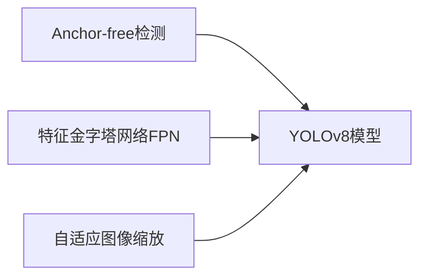

# YOLOv8与Python：构建灵活易用的目标检测系统

## 1.背景介绍
近年来，计算机视觉领域取得了长足的进步，目标检测作为其中一个重要的研究方向，在无人驾驶、智能监控、医学影像分析等诸多领域有着广泛的应用前景。YOLO(You Only Look Once)系列算法以其出色的速度和精度在目标检测领域一直占据着重要地位。YOLOv8作为该系列的最新版本，在继承前几代优势的基础上，进一步提升了模型的性能和易用性。本文将深入探讨YOLOv8算法的原理，并结合Python实现，帮助读者快速构建灵活高效的目标检测系统。

### 1.1 目标检测的发展历程
#### 1.1.1 传统目标检测方法
#### 1.1.2 基于深度学习的目标检测
#### 1.1.3 YOLO系列算法的演进

### 1.2 YOLOv8的优势与特点  
#### 1.2.1 速度与精度的平衡
#### 1.2.2 灵活的模型结构
#### 1.2.3 丰富的预训练模型

## 2.核心概念与联系
### 2.1 Anchor-free检测
#### 2.1.1 传统Anchor-based方法的局限性
#### 2.1.2 Anchor-free的优势
#### 2.1.3 YOLOv8中的Anchor-free实现

### 2.2 特征金字塔网络(FPN)
#### 2.2.1 FPN的基本原理
#### 2.2.2 FPN在目标检测中的应用
#### 2.2.3 YOLOv8中的FPN结构

### 2.3 自适应图像缩放(Adaptive Image Scaling)
#### 2.3.1 图像缩放对目标检测的影响
#### 2.3.2 自适应图像缩放的优势
#### 2.3.3 YOLOv8中的自适应图像缩放实现

### 2.4 核心概念之间的联系


## 3.核心算法原理具体操作步骤
### 3.1 Backbone网络
#### 3.1.1 CSPDarknet结构
#### 3.1.2 Backbone网络的特点与优化

### 3.2 Neck网络  
#### 3.2.1 PANet结构
#### 3.2.2 Neck网络的特点与优化

### 3.3 Decoupled Head
#### 3.3.1 分类与回归任务的解耦
#### 3.3.2 Decoupled Head的优势

### 3.4 损失函数设计
#### 3.4.1 分类损失
#### 3.4.2 回归损失
#### 3.4.3 目标性损失

## 4.数学模型和公式详细讲解举例说明
### 4.1 Focal Loss
Focal Loss是一种用于解决类别不平衡问题的损失函数，其数学表达式为：

$FL(p_t) = -\alpha_t(1-p_t)^\gamma \log(p_t)$

其中，$p_t$表示模型对真实类别的预测概率，$\alpha_t$和$\gamma$为超参数，用于调节难易样本的权重。

举例说明：假设我们有一个二分类问题，正样本占比很小，此时使用传统的交叉熵损失函数会导致模型更关注负样本，而忽略了正样本。引入Focal Loss后，可以通过调节$\alpha_t$和$\gamma$，使得模型更加关注那些难以正确分类的样本，从而提高模型的性能。

### 4.2 IoU Loss
IoU Loss是一种基于交并比(Intersection over Union)设计的回归损失函数，其数学表达式为：

$$IoU Loss = 1 - \frac{|B \cap B_{gt}|}{|B \cup B_{gt}|}$$

其中，$B$表示预测的边界框，$B_{gt}$表示真实的边界框。

举例说明：传统的L1或L2回归损失函数只考虑了边界框坐标的差异，而忽略了边界框的形状和大小。IoU Loss通过计算预测框和真实框的交并比，可以更好地反映检测结果的质量，使得模型生成的边界框更加准确。

## 5.项目实践：代码实例和详细解释说明
### 5.1 安装与环境配置
```python
# 安装YOLOv8
!pip install ultralytics

# 导入必要的库
from ultralytics import YOLO
import cv2
import numpy as np
```

### 5.2 数据准备与预处理
```python
# 定义数据集路径
train_path = "data/train/"
val_path = "data/val/"

# 数据预处理
def preprocess_data(img_path):
    img = cv2.imread(img_path)
    img = cv2.resize(img, (640, 640))
    img = img / 255.0
    return img
```

### 5.3 模型训练
```python
# 加载预训练模型
model = YOLO("yolov8n.pt") 

# 定义模型配置
model.train(data="coco128.yaml", epochs=100, imgsz=640, batch=16)
```

### 5.4 模型测试与评估
```python
# 模型测试
results = model.val()

# 模型评估
metrics = model.val(data="coco128.yaml", half=True, imgsz=640, plots=True)
```

### 5.5 模型推理与可视化
```python
# 模型推理
img = preprocess_data("test.jpg")
results = model(img)

# 结果可视化
res_plotted = results[0].plot()
cv2.imshow("result", res_plotted)
```

## 6.实际应用场景
### 6.1 无人驾驶中的目标检测
#### 6.1.1 行人与车辆检测
#### 6.1.2 交通标志识别

### 6.2 智能监控系统
#### 6.2.1 异常行为检测
#### 6.2.2 人流量统计

### 6.3 医学影像分析
#### 6.3.1 肿瘤检测
#### 6.3.2 器官分割

## 7.工具和资源推荐
### 7.1 开源数据集
- COCO数据集
- Pascal VOC数据集
- OpenImages数据集

### 7.2 标注工具
- LabelImg
- CVAT
- LabelMe

### 7.3 开发框架与库
- Ultralytics YOLOv8
- MMDetection
- Detectron2

## 8.总结：未来发展趋势与挑战
### 8.1 模型轻量化
### 8.2 自监督学习
### 8.3 多模态目标检测
### 8.4 域自适应目标检测

## 9.附录：常见问题与解答
### 9.1 YOLOv8与之前版本的区别？
### 9.2 如何选择合适的YOLOv8模型？
### 9.3 目标检测模型的评估指标有哪些？
### 9.4 数据增强对目标检测的影响？

作者：禅与计算机程序设计艺术 / Zen and the Art of Computer Programming