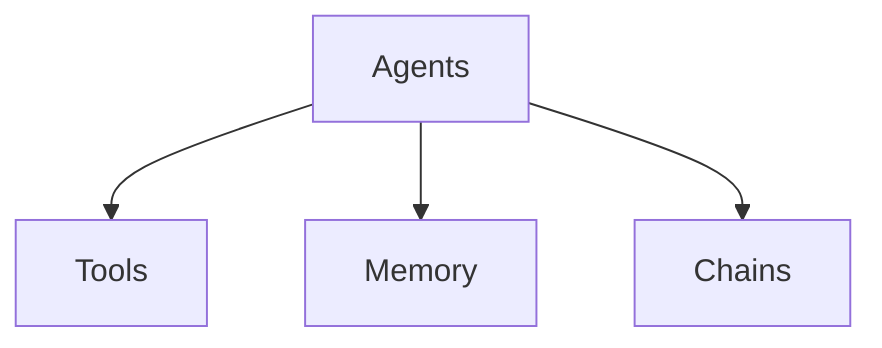
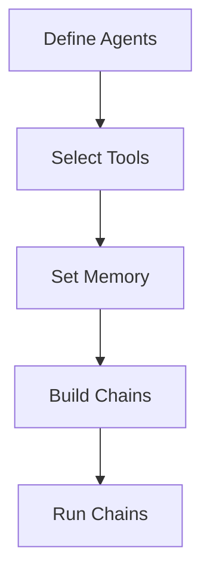

# 【LangChain编程：从入门到实践】快速开始

## 1.背景介绍

### 1.1 人工智能的崛起

在过去的几十年里,人工智能(AI)已经从一个遥不可及的概念,发展成为一个无处不在的现实。从语音助手到自动驾驶汽车,AI正在改变我们生活和工作的方式。随着计算能力的不断提高和算法的不断优化,AI系统正在变得越来越强大和智能。

### 1.2 大语言模型的兴起

近年来,大型语言模型(Large Language Models,LLMs)的出现引起了广泛关注。这些模型通过在海量文本数据上进行训练,掌握了丰富的自然语言理解和生成能力。GPT-3、BERT等模型展现出令人惊叹的语言处理能力,为人工智能的发展开辟了新的道路。

### 1.3 LangChain:连接人与AI

然而,尽管大语言模型具有强大的能力,但将它们应用于实际场景并非易事。LangChain应运而生,旨在简化人工智能应用程序的构建过程。作为一个开源的Python库,LangChain提供了一种模块化的方式来构建AI应用程序,使开发人员能够更轻松地利用大语言模型及其他AI技术。

## 2.核心概念与联系

### 2.1 LangChain的核心概念

LangChain的核心概念包括:

- **Agents**: 代理是LangChain中的核心抽象,它们封装了特定任务的逻辑,如问答、文本生成等。
- **Tools**: 工具是代理可以使用的外部资源,如搜索引擎、数据库等。
- **Memory**: 内存用于存储代理在执行过程中的中间状态和结果。
- **Chains**: 链是一种组合多个代理和工具的方式,用于构建更复杂的应用程序。



### 2.2 LangChain与其他AI技术的联系

LangChain不仅支持大语言模型,还可以与其他AI技术无缝集成,如:

- **OpenAI API**: 可以使用OpenAI提供的语言模型服务。
- **Hugging Face Transformers**: 支持使用各种预训练的Transformer模型。
- **Anthropic API**: 可以使用Anthropic提供的语言模型服务。
- **FAISS**: 支持使用Facebook AI Similarity Search (FAISS)进行向量相似性搜索。

通过将这些技术与LangChain的模块化设计相结合,开发人员可以构建出功能强大且灵活的AI应用程序。

## 3.核心算法原理具体操作步骤

### 3.1 LangChain的工作流程

LangChain的工作流程可以概括为以下几个步骤:

1. **定义Agents**: 根据应用程序的需求,定义一个或多个Agents。
2. **选择Tools**: 选择Agents所需的外部Tools,如搜索引擎、数据库等。
3. **设置Memory**: 为Agents设置合适的Memory存储中间状态和结果。
4. **构建Chains**: 将Agents、Tools和Memory组合成Chains,形成完整的应用程序逻辑。
5. **运行Chains**: 运行构建好的Chains,获取最终结果。



### 3.2 代码示例

下面是一个简单的示例,展示了如何使用LangChain构建一个基本的问答系统:

```python
from langchain import OpenAI, ConversationChain

# 定义 Agent
llm = OpenAI(temperature=0)
conversation = ConversationChain(llm=llm)

# 运行 Chain
response = conversation.run("What is the capital of France?")
print(response)
```

在这个示例中,我们首先定义了一个基于OpenAI语言模型的Agent。然后,我们创建了一个`ConversationChain`,它将Agent与一个简单的问答逻辑相结合。最后,我们运行这个Chain,询问"法国的首都是什么?"。

## 4.数学模型和公式详细讲解举例说明

在LangChain中,数学模型和公式主要用于语言模型的训练和优化。虽然LangChain本身不直接涉及这些模型和公式,但了解它们的原理对于更好地理解和使用LangChain是有帮助的。

### 4.1 transformer模型

transformer模型是当前主流的语言模型架构,它基于自注意力(Self-Attention)机制,能够有效地捕捉输入序列中的长距离依赖关系。transformer模型的核心公式之一是缩放点积注意力(Scaled Dot-Product Attention),定义如下:

$$\text{Attention}(Q, K, V) = \text{softmax}\left(\frac{QK^T}{\sqrt{d_k}}\right)V$$

其中,$Q$表示查询(Query),$K$表示键(Key),$V$表示值(Value),$d_k$是缩放因子,用于防止点积的值过大导致梯度消失。

### 4.2 语言模型预训练

大型语言模型通常采用自监督的方式进行预训练,以捕获大量文本数据中的语言规律。一种常见的预训练目标是掩码语言模型(Masked Language Modeling),其思想是在输入序列中随机掩码一些词,然后让模型预测被掩码的词。这个过程可以用以下公式表示:

$$\mathcal{L}_{\text{MLM}} = -\mathbb{E}_{x \sim X} \left[\sum_{i \in \text{mask}} \log P(x_i | x_{\backslash i})\right]$$

其中,$X$是语料库中的序列,$x_i$是被掩码的词,$x_{\backslash i}$表示除$x_i$之外的其他词。目标是最大化被掩码词的条件概率。

### 4.3 示例:文本生成

文本生成是语言模型的一个重要应用。给定一个起始序列$x_0$,我们希望生成一个概率最大的续接序列$y$。这个过程可以用下式表示:

$$y^* = \arg\max_y P(y | x_0)$$

在实践中,我们通常采用贪婪搜索或束搜索等方法来近似求解上述优化问题。

## 5.项目实践:代码实例和详细解释说明

在这一部分,我们将通过一个实际项目来展示如何使用LangChain构建一个AI应用程序。我们将构建一个基于LangChain的智能助手,它能够回答各种问题,并利用外部资源(如维基百科)来补充知识。

### 5.1 项目设置

首先,我们需要安装LangChain及其依赖项:

```bash
pip install langchain openai wikipedia
```

### 5.2 定义Agent

我们将使用OpenAI的GPT-3模型作为我们的Agent:

```python
from langchain import OpenAI

llm = OpenAI(model_name="text-davinci-003", temperature=0.7)
```

### 5.3 选择Tools

我们将使用Wikipedia作为外部资源:

```python
from langchain.utilities import WikipediaAPIWrapper

wikipedia = WikipediaAPIWrapper()
```

### 5.4 设置Memory

我们将使用ConversationBufferMemory来存储对话历史:

```python
from langchain.memory import ConversationBufferMemory

memory = ConversationBufferMemory()
```

### 5.5 构建Chains

我们将使用ConversationChain来组合Agent、Tools和Memory:

```python
from langchain.chains import ConversationChain

conversation = ConversationChain(
    llm=llm, 
    memory=memory,
    verbose=True
)
```

### 5.6 运行Chains

现在,我们可以与我们的智能助手进行对话了:

```python
print(conversation.run("Hi, I'm Claude. How can I assist you today?"))
print(conversation.run("What is the capital of France?"))
print(conversation.run("Can you tell me more about Paris?"))
```

在这个过程中,LangChain会自动利用Wikipedia来补充知识,并将对话历史存储在Memory中,以保持上下文一致性。

通过这个示例,您可以看到如何使用LangChain的模块化设计来构建一个功能强大的AI应用程序。您可以根据需要添加更多的Agents、Tools和Memory,以满足不同的需求。

## 6.实际应用场景

LangChain的应用场景非常广泛,包括但不限于:

### 6.1 智能助手

如我们在上一部分所示,LangChain可以用于构建智能助手,为用户提供问答、任务辅助等服务。这种应用可以广泛应用于客户服务、个人助理等领域。

### 6.2 自动化流程

LangChain可以用于自动化各种流程,如数据处理、报告生成等。通过将多个Agents和Tools组合在一起,可以构建出复杂的自动化流程。

### 6.3 知识管理

LangChain可以用于知识管理,如知识库构建、文本摘要等。它可以帮助企业更好地组织和利用内部知识资源。

### 6.4 内容生成

LangChain可以用于自动生成各种内容,如新闻报道、营销文案等。这对于需要大量内容生产的行业(如媒体、广告等)非常有用。

### 6.5 科研辅助

在科研领域,LangChain可以用于文献检索、实验设计等任务,帮助研究人员提高工作效率。

总的来说,LangChain为构建各种AI应用程序提供了强大的工具和框架,它的应用前景广阔。

## 7.工具和资源推荐

如果您想进一步学习和使用LangChain,以下是一些推荐的工具和资源:

### 7.1 LangChain官方文档

LangChain的官方文档(https://python.langchain.com/en/latest/index.html)是学习这个库的绝佳起点。它包含了详细的API参考、教程和示例代码。

### 7.2 LangChain示例库

LangChain维护了一个示例库(https://github.com/hwchase17/langchain-examples),展示了如何使用LangChain解决各种实际问题。这些示例代码可以帮助您快速上手。

### 7.3 LangChain社区

LangChain拥有一个活跃的社区,包括Discord服务器、GitHub讨论区等。您可以在这里与其他用户交流、提出问题并获得帮助。

### 7.4 OpenAI Playground

OpenAI Playground(https://platform.openai.com/playground)是一个在线工具,允许您与OpenAI的语言模型进行交互。这对于测试和调试LangChain应用程序非常有用。

### 7.5 Hugging Face Transformers

Hugging Face Transformers(https://huggingface.co/transformers/)是一个流行的自然语言处理库,提供了各种预训练的语言模型。LangChain可以与它无缝集成。

### 7.6 FAISS

FAISS(https://github.com/facebookresearch/faiss)是Facebook AI提供的一个高效的相似性搜索库。它可以与LangChain一起使用,为您的应用程序提供向量相似性搜索功能。

通过利用这些工具和资源,您可以更好地掌握LangChain,并构建出更加强大的AI应用程序。

## 8.总结:未来发展趋势与挑战

LangChain为构建AI应用程序提供了一个强大而灵活的框架。然而,随着人工智能技术的不断发展,LangChain也面临着一些挑战和机遇。

### 8.1 大模型的持续进化

随着计算能力的提高和算法的优化,语言模型将变得更加强大。LangChain需要与时俱进,支持新的模型和技术,以充分利用它们的能力。

### 8.2 可解释性和可控性

当前的语言模型存在"黑箱"问题,它们的决策过程缺乏透明度和可解释性。未来,LangChain需要提供更好的可解释性和可控性机制,以确保AI应用程序的安全性和可靠性。

### 8.3 隐私和安全

随着AI应用程序的普及,隐私和安全问题将变得越来越重要。LangChain需要采取措施保护用户数据的隐私,并防止恶意攻击和滥用。

### 8.4 多模态AI

未来的AI系统将不仅处理文本,还需要处理图像、视频等多种模态数据。LangChain需要扩展其功能,支持多模态AI技术,以满足不断增长的需求。

### 8.5 低代码/无代码开发

为了让更多人能够受益于AI技术,LangChain需要提供更友好的低代码