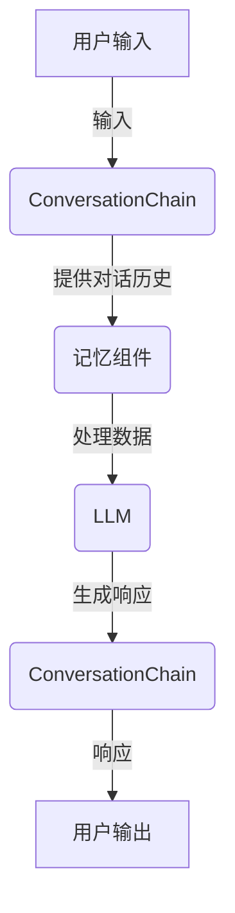

# 【LangChain编程：从入门到实践】记忆组件类型

## 1.背景介绍

### 1.1 什么是LangChain?

LangChain是一个用于构建应用程序的框架,旨在与大型语言模型(LLM)进行交互。它有助于简化LLM的使用,并提供了一种标准化的方式来创建复杂的应用程序。LangChain提供了一系列模块化组件,可用于构建各种应用程序,如问答系统、总结工具、数据增强管道等。

### 1.2 记忆组件的重要性

在与LLM交互时,记忆组件扮演着关键角色。由于LLM本身是无状态的,它们无法跟踪对话历史或上下文信息。记忆组件使LLM能够访问先前的对话和相关信息,从而提高响应的连贯性和相关性。这对于构建智能对话系统、任务管理工具和其他需要上下文理解的应用程序至关重要。

## 2.核心概念与联系

### 2.1 记忆概念

记忆是指存储和检索相关信息的能力。在LangChain中,记忆组件负责管理与LLM交互所需的上下文数据。这些数据可能包括对话历史、外部知识库或任何其他相关信息。

### 2.2 记忆类型

LangChain提供了多种记忆类型,每种类型都有自己的优点和使用场景。以下是一些常见的记忆类型:

1. **ConversationBufferMemory**: 存储对话历史的简单内存缓冲区。
2. **ConversationEntityMemory**: 跟踪对话中提及的实体(如人名、地点等)。
3. **ConversationSummaryMemory**: 生成对话摘要,并将其提供给LLM作为上下文。
4. **ConversationBufferWindowMemory**: 仅存储最近的对话历史。
5. **VectorStoreInfo**: 使用向量存储(如FAISS或Chroma)来存储和检索相关信息。
6. **CombinedMemory**: 组合多种记忆类型以获得更全面的上下文理解。

### 2.3 记忆与LLM的交互

记忆组件与LLM紧密协作,为其提供相关的上下文信息。在与LLM交互之前,记忆组件会收集和处理所需的数据。然后,LLM可以利用这些数据生成更加相关和连贯的响应。

## 3.核心算法原理具体操作步骤

### 3.1 记忆组件的工作流程

记忆组件在LangChain应用程序中的工作流程通常如下:

1. **初始化**: 根据应用程序的需求,选择并初始化适当的记忆类型。
2. **数据收集**: 从对话、外部知识库或其他来源收集相关数据。
3. **数据处理**: 根据记忆类型的不同,对收集的数据进行适当的处理和格式化。
4. **与LLM交互**: 将处理后的数据提供给LLM,以获取更加相关和连贯的响应。
5. **更新记忆**: 根据新的对话或信息,更新记忆组件中的数据。

### 3.2 记忆组件的使用示例

以下是一个使用`ConversationBufferMemory`的简单示例:

```python
from langchain import OpenAI, ConversationBufferMemory
from langchain.chains import ConversationChain

# 初始化记忆组件
memory = ConversationBufferMemory()

# 创建对话链
llm = OpenAI(temperature=0)
conversation = ConversationChain(llm=llm, memory=memory)

# 与LLM交互
response = conversation.predict(input="你好,我是谁?")
print(response)

response = conversation.predict(input="我叫什么名字?")
print(response)
```

在这个示例中,`ConversationBufferMemory`用于存储对话历史。每次与LLM交互时,对话历史都会被提供给LLM,以生成更加连贯的响应。

## 4.数学模型和公式详细讲解举例说明

虽然记忆组件主要涉及数据存储和检索,但一些记忆类型(如`VectorStoreInfo`)可能会使用向量相似性模型来检索相关信息。这些模型通常基于余弦相似性或其他距离度量。

例如,在使用`VectorStoreInfo`时,可以使用以下公式计算查询向量与存储向量之间的余弦相似性:

$$\text{similarity}(q, d) = \frac{q \cdot d}{\|q\| \|d\|}$$

其中,`q`是查询向量,`d`是存储向量,`||`表示向量的L2范数。

余弦相似性的值范围为`[-1, 1]`,其中`1`表示两个向量完全相同,`-1`表示两个向量完全相反。通过设置相似性阈值,可以控制检索的相关性。

## 5.项目实践:代码实例和详细解释说明

让我们通过一个简单的示例来了解如何在LangChain中使用记忆组件。我们将构建一个简单的问答系统,它可以记住先前的对话历史,并根据上下文提供更加相关的响应。

### 5.1 导入所需的模块

```python
from langchain import OpenAI, ConversationBufferMemory
from langchain.chains import ConversationChain
```

我们导入了`OpenAI`LLM和`ConversationBufferMemory`记忆组件,以及`ConversationChain`用于管理对话流程。

### 5.2 初始化记忆组件和LLM

```python
# 初始化记忆组件
memory = ConversationBufferMemory()

# 初始化LLM
llm = OpenAI(temperature=0)
```

我们使用`ConversationBufferMemory`作为记忆组件,并初始化`OpenAI`LLM。

### 5.3 创建对话链并与LLM交互

```python
# 创建对话链
conversation = ConversationChain(llm=llm, memory=memory)

# 与LLM交互
response = conversation.predict(input="你好,我是谁?")
print(response)

response = conversation.predict(input="我叫什么名字?")
print(response)
```

我们创建了一个`ConversationChain`,并将记忆组件和LLM传递给它。然后,我们可以使用`predict`方法与LLM进行交互。在每次交互之前,记忆组件会将对话历史提供给LLM,以生成更加相关的响应。

### 5.4 示例输出

```
你好,很抱歉,我不知道你是谁。作为一个AI助手,我没有关于你身份的具体信息。但是我会根据我们的对话来尽力回答你的问题。

根据我们之前的对话,你似乎没有告诉我你的名字。我无法确定你的名字是什么。但是如果你告诉我的话,我会记住的。
```

在这个示例中,LLM首先表示它不知道用户的身份。但是在第二次交互时,由于记忆组件提供了先前的对话历史,LLM能够理解用户之前没有提供过名字的信息,并给出了更加相关的响应。

### 5.5 Mermaid流程图

以下是使用记忆组件与LLM交互的流程图:



在这个流程图中,用户的输入首先被传递给`ConversationChain`。`ConversationChain`将对话历史提供给记忆组件,记忆组件处理数据并将其传递给LLM。LLM生成响应,并通过`ConversationChain`返回给用户。

## 6.实际应用场景

记忆组件在许多实际应用场景中扮演着重要角色,例如:

1. **智能对话系统**: 在聊天机器人、虚拟助手等对话系统中,记忆组件可以跟踪对话历史,提供更加连贯和相关的响应。
2. **任务管理工具**: 在待办事项管理、项目跟踪等应用程序中,记忆组件可以记住已完成的任务、未完成的任务以及相关细节。
3. **知识库搜索**: 在搜索知识库或文档时,记忆组件可以存储和检索相关信息,提高搜索结果的相关性。
4. **个性化推荐系统**: 记忆组件可以跟踪用户的偏好和历史,为他们提供个性化的推荐。
5. **数据增强管道**: 在数据增强管道中,记忆组件可以存储和提供相关的上下文信息,以生成更加丰富和连贯的数据。

## 7.工具和资源推荐

如果你想进一步探索LangChain和记忆组件,以下是一些有用的工具和资源:

1. **LangChain文档**: LangChain的官方文档提供了详细的API参考和示例,是学习和使用LangChain的绝佳资源。
2. **LangChain示例库**: LangChain提供了一个示例库,其中包含了各种应用程序的示例代码,可以帮助你快速入门。
3. **Hugging Face Spaces**: Hugging Face Spaces是一个在线平台,可以在其中部署和共享LangChain应用程序。
4. **LangChain社区**: LangChain拥有一个活跃的社区,你可以在论坛、Discord或GitHub上与其他开发者交流、提问和分享经验。
5. **LangChain课程和教程**:网上有许多LangChain课程和教程,可以帮助你掌握LangChain的基础知识和高级技术。

## 8.总结:未来发展趋势与挑战

记忆组件是LangChain的核心组成部分,它们为LLM提供了上下文信息,从而提高了响应的相关性和连贯性。随着LLM技术的不断发展,记忆组件也将继续演进,以满足不断增长的需求。

未来,我们可能会看到以下发展趋势和挑战:

1. **更智能的记忆管理**: 记忆组件将变得更加智能,能够自动识别和存储相关信息,而不需要手动干预。
2. **多模态记忆**: 除了文本数据,记忆组件可能会支持多种模态数据,如图像、视频和音频,以提供更加丰富的上下文信息。
3. **长期记忆**: 目前的记忆组件主要关注短期对话历史,但未来可能会支持长期记忆,以跟踪更长时间范围内的信息。
4. **隐私和安全性**: 随着记忆组件存储越来越多的个人和敏感信息,确保隐私和安全性将变得更加重要。
5. **可解释性和透明度**: 记忆组件的决策过程需要更加透明和可解释,以建立用户的信任。
6. **大规模部署**: 随着LangChain应用程序的扩展,记忆组件需要能够在大规模环境中高效运行。

总的来说,记忆组件将继续发挥关键作用,推动LangChain应用程序的发展和创新。通过持续的研究和开发,我们可以期待记忆组件变得更加智能、多功能和可靠。

## 9.附录:常见问题与解答

### 9.1 什么时候应该使用记忆组件?

每当你构建需要上下文理解的LangChain应用程序时,记忆组件都是必需的。例如,在对话系统、任务管理工具和知识库搜索中,记忆组件可以提供关键的上下文信息,从而提高响应的相关性和连贯性。

### 9.2 不同记忆类型有什么区别?

不同的记忆类型针对不同的使用场景进行了优化。例如,`ConversationBufferMemory`适用于简单的对话历史跟踪,而`VectorStoreInfo`则更适合于基于相似性的信息检索。选择合适的记忆类型对于优化应用程序的性能和效率至关重要。

### 9.3 如何选择合适的记忆类型?

选择合适的记忆类型取决于你的应用程序需求。你需要考虑所需的上下文信息类型、存储和检索效率的重要性,以及可用的计算资源。通常,从简单的记忆类型开始,然后根据需要逐步过渡到更复杂的类型是一个好的做法。

### 9.4 记忆组件如何与其他LangChain组件协作?

记忆组件是LangChain生态系统中的一个关键组件,它与其他组件(如代理、工具和