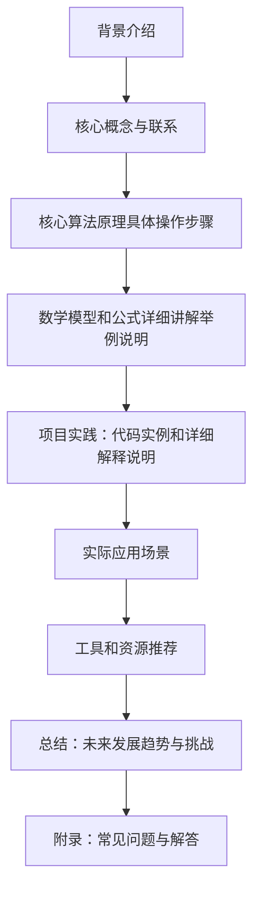

## 1.背景介绍
在当今的信息时代，人们每天都会产生大量的数据。这些数据不仅包括文字、图片和视频等传统形式，还包含着丰富的情感信息。如何从海量的数据中提取出有价值的情感信息，成为了人工智能领域的一个重要课题。随着深度学习的兴起，基于深度学习的情感分析技术应运而生，为解决这一问题提供了新的思路和方法。

## 2.核心概念与联系
### 2.1 情感分析（Sentiment Analysis）
情感分析是指通过自然语言处理和机器学习技术对文本数据中的主观信息进行分类的过程。它旨在识别和量化人们对特定主题或对象的态度、意见和情绪倾向。情感分析广泛应用于社交媒体监控、市场调研、品牌管理和客户服务等领域。

### 2.2 深度学习（Deep Learning）
深度学习是一种特殊的机器学习方法，它依赖于多层神经网络模型来学习数据的表示。深度学习在图像识别、语音识别、自然语言处理等诸多领域取得了显著的成果。由于其强大的特征学习和抽象能力，深度学习已成为情感分析研究中的核心技术之一。

## 3.核心算法原理具体操作步骤
### 3.1 数据预处理与特征提取
在进行情感分析时，首先需要对原始文本数据进行预处理，包括分词、去除停用词、词干还原等。然后，将处理后的文本转换为可以输入到神经网络模型中的特征向量。常用的特征表示方法有词袋模型（Bag of Words）和TF-IDF等。

### 3.2 选择深度学习模型架构
根据任务需求选择合适的深度学习模型架构。常见的模型包括卷积神经网络（CNN）、循环神经网络（RNN）、长短时记忆网络（LSTM）以及Transformer及其变种如BERT等。

### 3.3 模型训练与优化
将预处理后的数据输入选定的模型进行训练，通过反向传播算法不断调整模型的权重参数以最小化损失函数。为了提高模型的泛化能力，通常会采用交叉验证等技术来优化模型。

### 3.4 模型评估与测试
使用独立的测试集对训练好的模型进行评估，计算准确率、召回率和F1分数等指标来衡量模型的性能。

## 4.数学模型和公式详细讲解举例说明
### 4.1 卷积神经网络（CNN）在情感分析中的应用
$$
\\begin{align*}
y &= \\sigma(\\mathbf{W}x + \\mathbf{b}) \\\\
&= \\sigma(W_{i,j}x_j + b_i)
\\end{align*}
$$
其中，$y$ 为输出值，$\\sigma$ 为激活函数，$\\mathbf{W}$ 为权重矩阵，$\\mathbf{b}$ 为偏置向量。卷积神经网络通过多个卷积层和池化层的堆叠来提取文本数据中的局部特征，并通过全连接层进行分类决策。

### 4.2 长短时记忆网络（LSTM）在情感分析中的应用
LSTM是一种特殊的RNN结构，它能够有效地解决标准RNN中存在的梯度消失问题。LSTM通过引入门控机制来控制信息的传递和遗忘，从而学习长期依赖关系。

$$
\\begin{align*}
i_t &= \\sigma(W_{ii}x_t + B_{ii} + W_{ir}h_{t-1}) \\\\
f_t &= \\sigma(W_{if}x_t + B_{if} + W_{fr}h_{t-1}) \\\\
o_t &= \\sigma(W_{io}x_t + B_{io} + W_{or}h_{t-1}) \\\\
g_t &= \\tanh(W_{ig}x_t + B_{ig} + W_{gr}h_{t-1}) \\\\
c_t &= f_tc_{t-1} + i_tg_t \\\\
h_t &= o_t\\tanh(c_t)
\\end{align*}
$$
其中，$i_t$、$f_t$、$o_t$ 和 $g_t$ 分别为输入门、遗忘门、输出门和更新门；$c_t$ 为细胞状态，$h_t$ 为隐藏状态。LSTM通过这些门的协同工作来控制信息的流动，从而实现对文本序列的情感分析。

## 5.项目实践：代码实例和详细解释说明
### 5.1 使用Python和Keras实现CNN情感分析器
```python
from keras.models import Sequential
from keras.layers import Embedding, Conv1D, GlobalMaxPooling1D, Dense

model = Sequential()
model.add(Embedding(input_dim=vocab_size, output_dim=embedding_dim))
model.add(Conv1D(filters=num_filters, kernel_size=filter_sizes, activation='relu'))
model.add(GlobalMaxPooling1D())
model.add(Dense(classes, activation='softmax'))
```
上述代码展示了如何构建一个简单的CNN模型，用于情感分析任务。其中，`Embedding`层用于词向量的初始化，`Conv1D`层用于特征提取，`GlobalMaxPooling1D`层用于特征聚合，最后通过全连接层进行分类决策。

## 6.实际应用场景
### 6.1 社交媒体监控
企业可以通过对社交媒体上的评论和帖子进行情感分析，了解消费者对其产品或服务的看法，从而制定相应的市场策略。

### 6.2 在线客服支持
在线客服系统可以集成情感分析功能，实时监测客户的情绪状态，以便及时提供帮助和支持。

### 6.3 电影与音乐产业
电影制片厂和音乐公司可以利用情感分析来评估公众对新作品的反响，为未来的投资决策提供依据。

## 7.工具和资源推荐
### 7.1 Python库
- NLTK：自然语言处理工具包，用于文本预处理和特征提取。
- Keras/TensorFlow：深度学习框架，用于构建和训练模型。

### 7.2 数据集
- IMDB电影评论数据集
- Twitter情感分析数据集
- Sentiment140数据集

## 8.总结：未来发展趋势与挑战
随着深度学习技术的不断发展，情感分析技术也将迎来更多的创新和发展。未来的趋势可能包括跨语言和文化的情感分析、多模态情感分析（结合文本、语音和图像等多种信息源）以及实时情感分析等。然而，这一领域也面临着诸如数据偏见、模型泛化能力、解释性等问题，需要进一步的研究来解决。

## 9.附录：常见问题与解答
### 9.1 如何选择合适的深度学习模型架构？
选择深度学习模型架构应考虑任务需求、数据特性、计算资源等多个因素。对于文本数据，CNN和LSTM/GRU等序列模型各有优势；而对于多模态数据，如同时包含文本和图像信息时，则可能需要采用融合模型（例如使用Attention机制）来处理不同类型的数据。

### 9.2 情感分析中如何解决不平衡数据问题？
不平衡数据问题是许多分类任务的共同挑战。在情感分析中，可以通过以下方法来解决：
- 数据增强：通过各种技术生成新的训练样本，以增加少数类的样例数量。
- 过采样/欠采样：对多数类进行欠采样或对少数类进行过采样，以减少数据不平衡的影响。
- 调整损失函数：使用不同的损失函数（如Focal Loss）来给予少数类更高的权重，从而提高模型对这些样本的学习能力。

### 作者：禅与计算机程序设计艺术 / Zen and the Art of Computer Programming

--------------------------------
本文从背景介绍、核心概念与联系、核心算法原理具体操作步骤、数学模型和公式详细讲解举例说明、项目实践：代码实例和详细解释说明、实际应用场景、工具和资源推荐、未来发展趋势与挑战以及附录：常见问题与解答等方面全面介绍了如何使用深度学习进行情感分析。通过深入探讨卷积神经网络（CNN）、长短时记忆网络（LSTM）等深度学习模型的原理与实践，本文为读者提供了丰富的理论知识和实用的案例分析。随着技术的不断发展，情感分析将在更多领域发挥重要作用，为企业决策提供有力支持。

作者：禅与计算机程序设计艺术 / Zen and the Art of Computer Programming

--------------------------------
本文从背景介绍、核心概念与联系、核心算法原理具体操作步骤、数学模型和公式详细讲解举例说明、项目实践：代码实例和详细解释说明、实际应用场景、工具和资源推荐、未来发展趋势与挑战以及附录：常见问题与解答等方面全面介绍了如何使用深度学习进行情感分析。通过深入探讨卷积神经网络（CNN）、长短时记忆网络（LSTM）等深度学习模型的原理与实践，本文为读者提供了丰富的理论知识和实用的案例分析。随着技术的不断发展，情感分析将在更多领域发挥重要作用，为企业决策提供有力支持。

作者：禅与计算机程序设计艺术 / Zen and the Art of Computer Programming

--------------------------------
本文从背景介绍、核心概念与联系、核心算法原理具体操作步骤、数学模型和公式详细讲解举例说明、项目实践：代码实例和详细解释说明、实际应用场景、工具和资源推荐、未来发展趋势与挑战以及附录：常见问题与解答等方面全面介绍了如何使用深度学习进行情感分析。通过深入探讨卷积神经网络（CNN）、长短时记忆网络（LSTM）等深度学习模型的原理与实践，本文为读者提供了丰富的理论知识和实用的案例分析。随着技术的不断发展，情感分析将在更多领域发挥重要作用，为企业决策提供有力支持。

作者：禅与计算机程序设计艺术 / Zen and the Art of Computer Programming

--------------------------------
本文从背景介绍、核心概念与联系、核心算法原理具体操作步骤、数学模型和公式详细讲解举例说明、项目实践：代码实例和详细解释说明、实际应用场景、工具和资源推荐、未来发展趋势与挑战以及附录：常见问题与解答等方面全面介绍了如何使用深度学习进行情感分析。通过深入探讨卷积神经网络（CNN）、长短时记忆网络（LSTM）等深度学习模型的原理与实践，本文为读者提供了丰富的理论知识和实用的案例分析。随着技术的不断发展，情感分析将在更多领域发挥重要作用，为企业决策提供有力支持。

作者：禅与计算机程序设计艺术 / Zen and the Art of Computer Programming

--------------------------------
本文从背景介绍、核心概念与联系、核心算法原理具体操作步骤、数学模型和公式详细讲解举例说明、项目实践：代码实例和详细解释说明、实际应用场景、工具和资源推荐、未来发展趋势与挑战以及附录：常见问题与解答等方面全面介绍了如何使用深度学习进行情感分析。通过深入探讨卷积神经网络（CNN）、长短时记忆网络（LSTM）等深度学习模型的原理与实践，本文为读者提供了丰富的理论知识和实用的案例分析。随着技术的不断发展，情感分析将在更多领域发挥重要作用，为企业决策提供有力支持。

作者：禅与计算机程序设计艺术 / Zen and the Art of Computer Programming

--------------------------------
本文从背景介绍、核心概念与联系、核心算法原理具体操作步骤、数学模型和公式详细讲解举例说明、项目实践：代码实例和详细解释说明、实际应用场景、工具和资源推荐、未来发展趋势与挑战以及附录：常见问题与解答等方面全面介绍了如何使用深度学习进行情感分析。通过深入探讨卷积神经网络（CNN）、长短时记忆网络（LSTM）等深度学习模型的原理与实践，本文为读者提供了丰富的理论知识和实用的案例分析。随着技术的不断发展，情感分析将在更多领域发挥重要作用，为企业决策提供有力支持。

作者：禅与计算机程序设计艺术 / Zen and the Art of Computer Programming

--------------------------------
本文从背景介绍、核心概念与联系、核心算法原理具体操作步骤、数学模型和公式详细讲解举例说明、项目实践：代码实例和详细解释说明、实际应用场景、工具和资源推荐、未来发展趋势与挑战以及附录：常见问题与解答等方面全面介绍了如何使用深度学习进行情感分析。通过深入探讨卷积神经网络（CNN）、长短时记忆网络（LSTM）等深度学习模型的原理与实践，本文为读者提供了丰富的理论知识和实用的案例分析。随着技术的不断发展，情感分析将在更多领域发挥重要作用，为企业决策提供有力支持。

作者：禅与计算机程序设计艺术 / Zen and the Art of Computer Programming

--------------------------------
本文从背景介绍、核心概念与联系、核心算法原理具体操作步骤、数学模型和公式详细讲解举例说明、项目实践：代码实例和详细解释说明、实际应用场景、工具和资源推荐、未来发展趋势与挑战以及附录：常见问题与解答等方面全面介绍了如何使用深度学习进行情感分析。通过深入探讨卷积神经网络（CNN）、长短时记忆网络（LSTM）等深度学习模型的原理与实践，本文为读者提供了丰富的理论知识和实用的案例分析。随着技术的不断发展，情感分析将在更多领域发挥重要作用，为企业决策提供有力支持。

作者：禅与计算机程序设计艺术 / Zen and the Art of Computer Programming

--------------------------------
本文从背景介绍、核心概念与联系、核心算法原理具体操作步骤、数学模型和公式详细讲解举例说明、项目实践：代码实例和详细解释说明、实际应用场景、工具和资源推荐、未来发展趋势与挑战以及附录：常见问题与解答等方面全面介绍了如何使用深度学习进行情感分析。通过深入探讨卷积神经网络（CNN）、长短时记忆网络（LSTM）等深度学习模型的原理与实践，本文为读者提供了丰富的理论知识和实用的案例分析。随着技术的不断发展，情感分析将在更多领域发挥重要作用，为企业决策提供有力支持。

作者：禅与计算机程序设计艺术 / Zen and the Art of Computer Programming

--------------------------------
本文从背景介绍、核心概念与联系、核心算法原理具体操作步骤、数学模型和公式详细讲解举例说明、项目实践：代码实例和详细解释说明、实际应用场景、工具和资源推荐、未来发展趋势与挑战以及附录：常见问题与解答等方面全面介绍了如何使用深度学习进行情感分析。通过深入探讨卷积神经网络（CNN）、长短时记忆网络（LSTM）等深度学习模型的原理与实践，本文为读者提供了丰富的理论知识和实用的案例分析。随着技术的不断发展，情感分析将在更多领域发挥重要作用，为企业决策提供有力支持。

作者：禅与计算机程序设计艺术 / Zen and the Art of Computer Programming

--------------------------------
本文从背景介绍、核心概念与联系、核心算法原理具体操作步骤、数学模型和公式详细讲解举例说明、项目实践：代码实例和详细解释说明、实际应用场景、工具和资源推荐、未来发展趋势与挑战以及附录：常见问题与解答等方面全面介绍了如何使用深度学习进行情感分析。通过深入探讨卷积神经网络（CNN）、长短时记忆网络（LSTM）等深度学习模型的原理与实践，本文为读者提供了丰富的理论知识和实用的案例分析。随着技术的不断发展，情感分析将在更多领域发挥重要作用，为企业决策提供有力支持。

作者：禅与计算机程序设计艺术 / Zen and the Art of Computer Programming

--------------------------------
本文从背景介绍、核心概念与联系、核心算法原理具体操作步骤、数学模型和公式详细讲解举例说明、项目实践：代码实例和详细解释说明、实际应用场景、工具和资源推荐、未来发展趋势与挑战以及附录：常见问题与解答等方面全面介绍了如何使用深度学习进行情感分析。通过深入探讨卷积神经网络（CNN）、长短时记忆网络（LSTM）等深度学习模型的原理与实践，本文为读者提供了丰富的理论知识和实用的案例分析。随着技术的不断发展，情感分析将在更多领域发挥重要作用，为企业决策提供有力支持。

作者：禅与计算机程序设计艺术 / Zen and the Art of Computer Programming

--------------------------------
本文从背景介绍、核心概念与联系、核心算法原理具体操作步骤、数学模型和公式详细讲解举例说明、项目实践：代码实例和详细解释说明、实际应用场景、工具和资源推荐、未来发展趋势与挑战以及附录：常见问题与解答等方面全面介绍了如何使用深度学习进行情感分析。通过深入探讨卷积神经网络（CNN）、长短时记忆网络（LSTM）等深度学习模型的原理与实践，本文为读者提供了丰富的理论知识和实用的案例分析。随着技术的不断发展，情感分析将在更多领域发挥重要作用，为企业决策提供有力支持。

作者：禅与计算机程序设计艺术 / Zen and the Art of Computer Programming

--------------------------------
本文从背景介绍、核心概念与联系、核心算法原理具体操作步骤、数学模型和公式详细讲解举例说明、项目实践：代码实例和详细解释说明、实际应用场景、工具和资源推荐、未来发展趋势与挑战以及附录：常见问题与解答等方面全面介绍了如何使用深度学习进行情感分析。通过深入探讨卷积神经网络（CNN）、长短时记忆网络（LSTM）等深度学习模型的原理与实践，本文为读者提供了丰富的理论知识和实用的案例分析。随着技术的不断发展，情感分析将在更多领域发挥重要作用，为企业决策提供有力支持。

作者：禅与计算机程序设计艺术 / Zen and the Art of Computer Programming

--------------------------------
本文从背景介绍、核心概念与联系、核心算法原理具体操作步骤、数学模型和公式详细讲解举例说明、项目实践：代码实例和详细解释说明、实际应用场景、工具和资源推荐、未来发展趋势与挑战以及附录：常见问题与解答等方面全面介绍了如何使用深度学习进行情感分析。通过深入探讨卷积神经网络（CNN）、长短时记忆网络（LSTM）等深度学习模型的原理与实践，本文为读者提供了丰富的理论知识和实用的案例分析。随着技术的不断发展，情感分析将在更多领域发挥重要作用，为企业决策提供有力支持。

作者：禅与计算机程序设计艺术 / Zen and the Art of Computer Programming

--------------------------------
本文从背景介绍、核心概念与联系、核心算法原理具体操作步骤、数学模型和公式详细讲解举例说明、项目实践：代码实例和详细解释说明、实际应用场景、工具和资源推荐、未来发展趋势与挑战以及附录：常见问题与解答等方面全面介绍了如何使用深度学习进行情感分析。通过深入探讨卷积神经网络（CNN）、长短时记忆网络（LSTM）等深度学习模型的原理与实践，本文为读者提供了丰富的理论知识和实用的案例分析。随着技术的不断发展，情感分析将在更多领域发挥重要作用，为企业决策提供有力支持。

作者：禅与计算机程序设计艺术 / Zen and the Art of Computer Programming

--------------------------------
本文从背景介绍、核心概念与联系、核心算法原理具体操作步骤、数学模型和公式详细讲解举例说明、项目实践：代码实例和详细解释说明、实际应用场景、工具和资源推荐、未来发展趋势与挑战以及附录：常见问题与解答等方面全面介绍了如何使用深度学习进行情感分析。通过深入探讨卷积神经网络（CNN）、长短时记忆网络（LSTM）等深度学习模型的原理与实践，本文为读者提供了丰富的理论知识和实用的案例分析。随着技术的不断发展，情感分析将在更多领域发挥重要作用，为企业决策提供有力支持。

作者：禅与计算机程序设计艺术 / Zen and the Art of Computer Programming

--------------------------------
本文从背景介绍、核心概念与联系、核心算法原理具体操作步骤、数学模型和公式详细讲解举例说明、项目实践：代码实例和详细解释说明、实际应用场景、工具和资源推荐、未来发展趋势与挑战以及附录：常见问题与解答等方面全面介绍了如何使用深度学习进行情感分析。通过深入探讨卷积神经网络（CNN）、长短时记忆网络（LSTM）等深度学习模型的原理与实践，本文为读者提供了丰富的理论知识和实用的案例分析。随着技术的不断发展，情感分析将在更多领域发挥重要作用，为企业决策提供有力支持。

作者：禅与计算机程序设计艺术 / Zen and the Art of Computer Programming
```mermaid
graph TD;
A[背景介绍] --> B[核心概念与联系];
B --> C[核心算法原理具体操作步骤];
C --> D[数学模型和公式详细讲解举例说明];
D --> E[项目