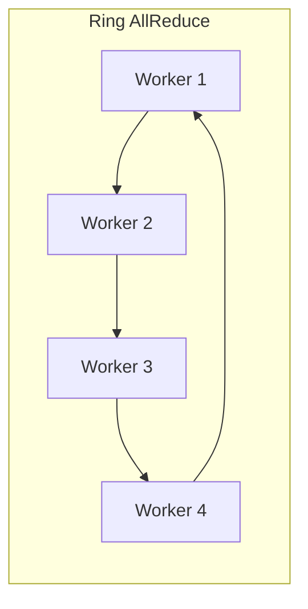

# 使用Kubernetes管理神经网络训练集群

## 1.背景介绍

### 1.1 深度学习和神经网络的兴起

随着大数据和计算能力的不断提升,深度学习和神经网络技术在过去十年中取得了长足的进步,在计算机视觉、自然语言处理、语音识别等领域展现出了令人惊叹的能力。神经网络模型通过对大量数据进行训练,能够自动学习数据中蕴含的特征模式,从而对新数据进行准确的分类和预测。

### 1.2 训练神经网络模型的挑战

尽管神经网络模型表现出色,但训练这些模型却面临着巨大的计算挑战。以计算机视觉领域的卷积神经网络(CNN)为例,训练一个高精度的图像分类模型往往需要数百GB的训练数据,数百万次的迭代计算,以及大量的GPU资源进行加速。此外,不同的神经网络架构、超参数和数据增强策略需要进行大量的实验对比,以获得最优模型。

### 1.3 分布式训练的必要性

为了缩短训练时间并加速模型开发的迭代,分布式训练是一个行之有效的解决方案。通过在多台机器上并行计算,可以显著提高训练吞吐量。然而,手动配置和管理分布式训练集群是一项艰巨的任务,需要处理诸如资源调度、容错、监控等复杂的系统问题。

## 2.核心概念与联系 

### 2.1 Kubernetes简介

Kubernetes是一个开源的容器编排平台,由Google公司于2014年开源,用于自动部署、扩展和管理容器化应用。它提供了一种声明式的方式来描述所需的集群状态,并持续工作以确保集群的实际状态与期望状态相匹配。

### 2.2 Kubernetes对分布式训练的支持

Kubernetes天生支持分布式计算,可以轻松管理跨多个节点运行的任务。它提供了多种资源对象,如Pod、Deployment、Job和PersistentVolume等,用于描述和编排分布式应用。此外,Kubernetes还具有自动伸缩、滚动升级、服务发现等强大功能,使其成为管理分布式训练任务的理想选择。

### 2.3 Kubernetes与深度学习框架的集成

主流的深度学习框架如TensorFlow、PyTorch和MXNet等,都提供了与Kubernetes的无缝集成支持。这些框架通过Kubernetes原生的API或Operator等扩展机制,实现了在Kubernetes上运行分布式训练任务的能力。用户可以使用声明式的YAML文件来描述训练任务,而无需关注底层的集群细节。

## 3.核心算法原理具体操作步骤

### 3.1 数据并行和模型并行

在分布式训练中,通常采用两种并行策略:数据并行和模型并行。

**数据并行**是指将训练数据划分为多个子集,每个Worker负责处理一个子集。所有Worker在各自的数据子集上计算梯度,然后将梯度汇总到Parameter Server进行模型参数更新。这种方式适用于数据量大、模型参数相对较少的情况。

**模型并行**则是将神经网络模型划分为多个部分,每个Worker负责计算其中一部分。这种方式通常用于处理参数量极大的模型,如大型Transformer模型等。不同的Worker需要在训练过程中频繁交换中间计算结果。

### 3.2 同步与异步训练

在多Worker的分布式训练中,还需要决定采用同步还是异步的方式进行梯度更新。

**同步训练**要求所有Worker在每一次迭代中都完成本地梯度计算后,才能将梯度发送给Parameter Server进行模型参数更新。这种方式能够确保参数的一致性,但需要等待最慢的Worker,效率较低。

**异步训练**则允许Worker一有梯度就立即发送,Parameter Server在收到梯度后立即更新模型参数。这种方式训练速度更快,但参数一致性较差,可能会影响模型收敛。

实际应用中,通常采用一种折中的方式,即在一定程度上允许异步更新,但同时也要求Worker之间的延迟不能过大,以确保模型收敛。

### 3.3 Ring AllReduce算法

在数据并行的分布式训练中,所有Worker计算出的梯度需要汇总到Parameter Server进行模型参数更新。传统的做法是使用树状结构进行梯度汇总,但这种方式在Worker数量较多时会产生通信瓶颈。

Ring AllReduce算法采用了环状拓扑结构,每个Worker只需要与两个相邻Worker进行通信。具体来说,每个Worker先将本地梯度发送给下一个Worker,同时也接收上一个Worker发来的梯度,并与本地梯度进行累加。经过若干轮次的传递和累加,所有Worker最终都能获得全局的梯度和。该算法可以充分利用带宽,大大提高了通信效率。



## 4.数学模型和公式详细讲解举例说明

在神经网络的训练过程中,通常采用一种叫做**随机梯度下降(Stochastic Gradient Descent, SGD)**的优化算法来更新模型参数。假设我们的神经网络模型有一个参数向量 $\theta$,目标是最小化损失函数 $J(\theta)$。在每一次迭代中,SGD根据训练数据计算梯度 $\nabla_\theta J(\theta)$,然后沿着该梯度的反方向更新参数:

$$\theta = \theta - \eta \nabla_\theta J(\theta)$$

其中 $\eta$ 是学习率,控制每次更新的步长。

在分布式训练中,我们将训练数据划分为 $n$ 个子集,每个Worker分别计算子集上的梯度 $\nabla_\theta J_i(\theta)$。为了获得全局梯度,需要对所有子梯度进行求和:

$$\nabla_\theta J(\theta) = \sum_{i=1}^n \nabla_\theta J_i(\theta)$$

在同步训练中,Parameter Server需要等待所有Worker计算完成后,再进行全局梯度的计算和参数更新。而在异步训练中,Parameter Server在收到任意一个Worker的梯度时,就立即进行参数更新。

为了加速训练过程,我们还可以引入动量(Momentum)和自适应学习率(Adaptive Learning Rate)等优化策略。以Momentum为例,公式如下:

$$
v_t = \gamma v_{t-1} + \eta \nabla_\theta J(\theta) \\
\theta = \theta - v_t
$$

其中 $v_t$ 是当前时刻的动量向量, $\gamma$ 是动量系数,控制先前动量的衰减程度。动量策略可以帮助SGD更快地逃离局部最优,加速收敛。

## 5.项目实践:代码实例和详细解释说明

在本节中,我们将通过一个基于TensorFlow和Kubernetes的实例,演示如何在Kubernetes集群上运行分布式神经网络训练任务。

### 5.1 准备Kubernetes集群

首先,我们需要一个运行中的Kubernetes集群。您可以在本地使用Minikube或在云上创建一个托管的Kubernetes集群。本例假设您已有一个可用的集群。

### 5.2 定义TensorFlow分布式训练任务

我们使用Kubernetes的`tf.distribution.StrategyMirroredStrategy`来实现数据并行的分布式训练。该策略会在集群中的所有Worker上复制计算,并在GPU上并行执行。

下面是一个简化的示例代码:

```python
import tensorflow as tf

# 创建分布式策略
strategy = tf.distribute.experimental.MultiWorkerMirroredStrategy()

# 定义模型和数据
datasets, info = ...
with strategy.scope():
    model = create_model()

# 分布式训练
num_epochs = 10
for epoch in range(num_epochs):
    for data in datasets:
        per_replica_losses = strategy.run(model.train_step, args=(data,))
```

在这个示例中,我们首先创建了一个`MultiWorkerMirroredStrategy`实例,该实例会自动发现集群中的所有Worker。接下来,我们在`strategy.scope()`中定义模型,这会让TensorFlow自动复制变量到所有Worker上。

在训练循环中,`strategy.run()`会在所有Worker上并行执行`model.train_step()`函数,计算每个Worker上的损失。TensorFlow会自动汇总这些损失,并执行一次参数更新。

### 5.3 在Kubernetes上运行分布式任务

接下来,我们需要将上述代码打包为一个Docker镜像,并使用Kubernetes的资源对象来描述和运行分布式训练任务。

首先,创建一个`tfjob.yaml`文件,定义一个`TFJob`资源:

```yaml
apiVersion: kubeflow.org/v1
kind: TFJob
metadata:
  name: mnist
spec:
  tfReplicaSpecs:
    Worker:
      replicas: 2
      restartPolicy: OnFailure
      template:
        spec:
          containers:
          - image: my-mnist
            name: mnist
```

这个YAML文件指定了我们需要2个Worker副本,并使用了我们之前构建的`my-mnist`镜像。

接下来,我们可以使用`kubectl`命令来创建和管理`TFJob`资源:

```bash
# 创建TFJob
kubectl create -f tfjob.yaml

# 查看TFJob状态
kubectl get tfjobs mnist -o yaml

# 查看Worker日志
kubectl logs -f ${WORKER_POD}
```

Kubernetes会自动为我们启动2个Worker副本,并在其中运行分布式训练代码。我们还可以通过`kubectl`命令查看任务状态和日志。

## 6.实际应用场景

使用Kubernetes管理分布式神经网络训练在实际应用中有着广泛的应用场景,例如:

1. **大型AI模型训练**: 对于参数量极大的模型(如GPT-3、PanGu等),通常需要采用模型并行的方式进行训练。Kubernetes可以轻松管理这些任务,并提供弹性伸缩能力。

2. **计算机视觉任务**: 在自动驾驶、医疗影像分析等领域,训练高精度的目标检测、图像分割等模型需要大量的计算资源。使用Kubernetes可以高效利用GPU集群进行分布式训练。

3. **自然语言处理任务**: 诸如机器翻译、文本生成、情感分析等NLP任务,都需要对大规模语料库进行训练。Kubernetes可以帮助管理这些计算密集型任务。

4. **科研和教学**: 在学术界,研究人员和学生经常需要训练各种神经网络模型。Kubernetes为他们提供了一种简单、可重复的方式来运行实验。

5. **AI即服务(AIaaS)**: 一些公司将训练好的AI模型作为云服务提供给客户。Kubernetes可以帮助他们高效管理模型训练和服务部署。

总的来说,Kubernetes为管理分布式AI训练任务提供了一种统一、可扩展的解决方案,使得研究人员和工程师能够专注于模型和算法本身,而不必过多关注底层基础设施的细节。

## 7.工具和资源推荐

在使用Kubernetes管理神经网络训练任务时,以下工具和资源可以为您提供帮助:

1. **Kubeflow**: Kubeflow是一个基于Kubernetes的机器学习平台,提供了端到端的工作流支持,包括数据处理、训练、模型服务等。它为分布式训练提供了内置的运算符(Operator)和SDK。

2. **Kubernetes GPU支持**: Kubernetes原生支持GPU资源的调度和管理,可以方便地在GPU集群上运行训练任务。您可以使用`nvidia/k8s-device-plugin`来启用GPU支持。

3. **TensorFlow分布式策略**: TensorFlow提供了多种分布式策略,如`MultiWorkerMirroredStrategy`、`ParameterServerStrategy`等,可以轻松实现数据并行和模型并行训练。

4. **PyTorch Lightning**: PyTorch Lightning是一个轻量级的PyTorch封装库,它提供了简单的接口来实现分布式训练,并与Kubernetes无缝集成。

5. **Dask**: Dask是一个用于分布式计算的Python库,可以与Kubernetes集成,用于处理大规模数据预处理和特征工程任务。

6. **Kubernetes Operator**: 许多深度学习框架都提供了自定义的Kubernetes Operator,如TFJob、PyTorchJob等,用于在Kubernetes上运行分布式训练任务。

7. **Kubernetes文档**: Kubernetes官方文档(https://kubernetes.