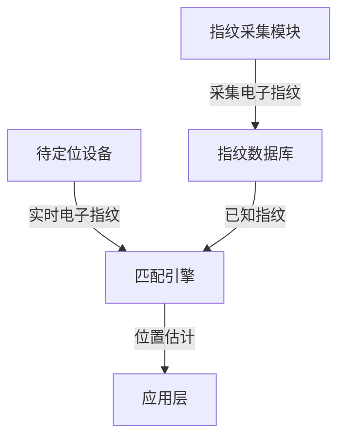

以下是关于"基于电子指纹的追踪定位系统"的技术博客文章正文内容：

# 基于电子指纹的追踪定位系统

## 1. 背景介绍

### 1.1 定位技术的重要性

在当今互联网时代,定位技术已经渗透到我们生活的方方面面。无论是导航应用程序、物流跟踪系统,还是社交媒体签到功能,都离不开精确的定位技术支持。随着物联网、智能城市等概念的兴起,对高精度定位技术的需求也越来越迫切。

### 1.2 现有定位技术的局限性

目前,常见的定位技术包括GPS、基站定位、WiFi定位等。然而,这些技术在特定场景下存在一些局限性,例如:

- GPS在室内环境中表现不佳
- 基站定位精度较低,误差可达几百米
- WiFi定位需要预先部署大量接入点,成本高

因此,我们需要一种新的定位技术来弥补现有技术的不足。

### 1.3 电子指纹定位技术概述

电子指纹(Electronic Fingerprinting)定位技术是一种新兴的无源定位方法。它利用环境中已有的无线电信号(如蓝牙、WiFi等)的特征作为"电子指纹",通过构建指纹数据库和匹配算法,实现高精度定位。该技术具有以下优势:

- 无需额外的硬件支持,可复用现有的无线基础设施
- 适用于室内外多种环境,精度高
- 部署和维护成本低

因此,电子指纹定位技术有望成为未来主流的定位解决方案之一。

## 2. 核心概念与联系

### 2.1 电子指纹的概念

电子指纹是指无线电信号在特定环境下的一组特征参数,如信号强度、到达时延、相位等。由于多路传播、遮挡物等因素的影响,这些参数在不同位置会表现出明显的差异,从而形成了"指纹"特征。

### 2.2 指纹数据库

指纹数据库是电子指纹定位系统的核心部分。它包含了某个区域内大量已知位置的电子指纹数据,通常采用离线采集或在线更新的方式构建。

### 2.3 指纹匹配算法

指纹匹配算法用于将待定位设备的实时电子指纹与数据库中的指纹进行匹配,从而估算出设备的位置。常用的匹配算法包括K最近邻(KNN)、概率模型、机器学习等。

### 2.4 系统架构

一个典型的电子指纹定位系统通常包括以下几个主要模块:

1. 指纹采集模块:负责采集各种无线电信号的参数,构建电子指纹。
2. 指纹数据库:存储已知位置的电子指纹数据。
3. 匹配引擎:执行指纹匹配算法,估算目标设备的位置。
4. 应用层:为上层应用提供定位服务接口。



## 3. 核心算法原理具体操作步骤

### 3.1 指纹采集算法

指纹采集是整个定位系统的基础。常用的采集算法包括:

1. **信号空间采样**:在目标区域内,按照一定的空间间隔采集无线电信号的参数,构建初始指纹数据库。
2. **自适应采样**:根据无线电信号的变化情况,动态调整采样密度,提高数据库质量。
3. **众包采样**:利用大量移动设备作为采样节点,实现低成本、大规模的指纹数据采集。

### 3.2 指纹匹配算法

指纹匹配是定位系统的核心算法,常用的匹配算法包括:

1. **K最近邻(KNN)**:计算待定位指纹与数据库中所有指纹的相似度,选取K个最相似的指纹对应的位置,并对这K个位置进行加权平均,得到目标位置的估计值。
2. **概率模型**:基于贝叶斯理论或高斯过程,建立待定位指纹与位置之间的概率模型,求解出最大后验概率对应的位置作为估计值。
3. **机器学习算法**:将指纹匹配问题转化为机器学习的分类或回归问题,利用训练数据训练模型,再将待定位指纹输入模型,获得位置估计值。

### 3.3 算法优化策略

为了提高定位精度和系统鲁棒性,还可以采用以下优化策略:

1. **指纹维度降维**:通过主成分分析(PCA)、线性判别分析(LDA)等方法,降低指纹数据的维度,减小计算复杂度。
2. **指纹聚类**:对相似的指纹进行聚类,降低数据冗余,提高匹配效率。
3. **多源数据融合**:将不同类型的无线电信号(WiFi、蓝牙、LTE等)的指纹进行融合,提高定位鲁棒性。
4. **基于地图的优化**:利用建筑物的地理信息(如楼层、障碍物等),对粗糙的位置估计值进行约束和修正。

## 4. 数学模型和公式详细讲解举例说明

### 4.1 KNN算法数学模型

KNN算法是一种基于实例的学习方法,其核心思想是:如果一个样本在特征空间中的k个最相似(即特征向量最邻近)的训练样本中的大部分属于某一个类别,则该样本也属于这个类别。

对于电子指纹定位问题,我们可以将每个指纹视为一个特征向量,将已知位置的指纹作为训练样本。待定位指纹就是一个待分类的测试样本。

设待定位指纹为 $\vec{x}$,数据库中第i个已知位置的指纹为 $\vec{x_i}$,对应的位置为 $\vec{p_i}$。我们定义指纹之间的距离(相似度)为:

$$dist(\vec{x},\vec{x_i})=\sqrt{\sum_{j=1}^{d}(x_j-x_{ij})^2}$$

其中d为指纹维度。

对于K最近邻,我们找出距离 $\vec{x}$ 最近的K个指纹 $\vec{x_{n_1}},\vec{x_{n_2}},...,\vec{x_{n_K}}$,对应的位置为 $\vec{p_{n_1}},\vec{p_{n_2}},...,\vec{p_{n_K}}$。则 $\vec{x}$ 的位置估计为:

$$\vec{p}=\frac{1}{K}\sum_{i=1}^{K}\vec{p_{n_i}}$$

也可以给不同邻居赋予不同权重,距离越近权重越大:

$$\vec{p}=\frac{\sum_{i=1}^{K}w_i\vec{p_{n_i}}}{\sum_{i=1}^{K}w_i}, \qquad w_i=\frac{1}{dist(\vec{x},\vec{x_{n_i}})}$$

### 4.2 概率模型:高斯过程回归

高斯过程回归(Gaussian Process Regression, GPR)是一种常用的概率模型,可以用于电子指纹定位问题。

假设我们有一个训练数据集 $\mathcal{D}=\{(\vec{x_i},\vec{p_i})\}_{i=1}^{N}$,其中 $\vec{x_i}$ 为第i个训练样本的指纹, $\vec{p_i}$ 为其对应的位置。我们的目标是找到一个函数 $f$,使得 $\vec{p_i}=f(\vec{x_i})+\epsilon_i$,其中 $\epsilon_i$ 为噪声项。

在GPR中,我们假设 $f$ 是一个高斯过程:

$$f(\vec{x})\sim\mathcal{GP}(m(\vec{x}),k(\vec{x},\vec{x'}))$$

其中 $m(\vec{x})$ 是均值函数,通常取0; $k(\vec{x},\vec{x'})$ 是核函数,描述了 $f(\vec{x})$ 和 $f(\vec{x'})$ 之间的相关性。

常用的核函数有:

- 线性核: $k(\vec{x},\vec{x'})=\vec{x}^T\vec{x'}$
- 多项式核: $k(\vec{x},\vec{x'})=(\vec{x}^T\vec{x'}+c)^d$
- RBF(高斯)核: $k(\vec{x},\vec{x'})=\exp(-\frac{||\vec{x}-\vec{x'}||^2}{2\sigma^2})$

对于一个新的待定位指纹 $\vec{x_*}$,我们可以计算其位置的后验分布:

$$p(\vec{p_*}|\vec{x_*},\mathcal{D})=\mathcal{N}(\mu_*,\Sigma_*)$$

其中均值 $\mu_*$ 就是我们的位置估计值,方差 $\Sigma_*$ 反映了估计的不确定性。具体计算过程请参考相关文献。

## 5. 项目实践:代码实例和详细解释说明

以下是一个使用Python和scikit-learn库实现KNN算法进行电子指纹定位的简单示例:

```python
import numpy as np
from sklearn.neighbors import NearestNeighbors

# 模拟数据
fingerprints = np.random.rand(1000, 10)  # 1000个10维的指纹
locations = np.random.rand(1000, 2)  # 对应的2维位置

# 待定位指纹
test_fp = np.random.rand(10)

# 构建KNN模型
neigh = NearestNeighbors(n_neighbors=5, algorithm='ball_tree')
neigh.fit(fingerprints)

# 找到最近邻居
distances, indices = neigh.kneighbors([test_fp])

# 计算位置估计
est_loc = np.mean(locations[indices[0]], axis=0)

print("Estimated location:", est_loc)
```

代码解释:

1. 首先我们模拟生成1000个10维的电子指纹,以及对应的2维位置作为训练数据。
2. 构建一个KNN模型,设置邻居数为5,使用ball树算法进行快速近邻搜索。
3. 对于待定位的指纹`test_fp`,调用`kneighbors`方法找到最近的5个邻居。
4. 取这5个邻居对应的位置,计算加权平均,得到位置估计值`est_loc`。

这只是一个简单的示例,实际应用中需要考虑更多的因素,如指纹维度选择、距离度量、算法优化等。

## 6. 实际应用场景

电子指纹定位技术具有广阔的应用前景,可以在以下场景中发挥重要作用:

### 6.1 室内导航

由于GPS在室内环境中表现不佳,电子指纹定位技术可以为室内导航提供精确的位置服务,如购物中心导航、机场引导、博物馆导览等。

### 6.2 资产跟踪

在工厂、仓库等场所,我们可以利用电子指纹技术对设备、货物等资产进行实时定位和跟踪,提高管理效率。

### 6.3 安全监控

通过部署电子指纹定位系统,我们可以实现对人员和重要物品的精确定位,用于安全防范、反恐等领域。

### 6.4 上下文感知

电子指纹定位可以作为上下文感知系统的重要输入,根据用户的精确位置提供个性化服务和信息,如基于位置的推荐、广告投放等。

### 6.5 机器人导航

在智能机器人、无人驾驶等领域,电子指纹定位技术可以为机器人提供高精度的位置感知能力,实现精确导航和路径规划。

## 7. 工具和资源推荐

### 7.1 开源项目

- [Fingerprint](https://github.com/schollz/fingerprint): 一个用Go语言实现的电子指纹定位库。
- [Redpin](https://github.com/RedPitaya/RedPin): 基于红色引脚开发板的电子指纹定位解决方案。
- [WiFi-Localization](https://github.com/uw-close-open-source/wifi-localization): 使用WiFi指纹进行室内定位的Python库。

### 7.2 研究论文

- Bahl P, Padmanabhan V N. RADAR: